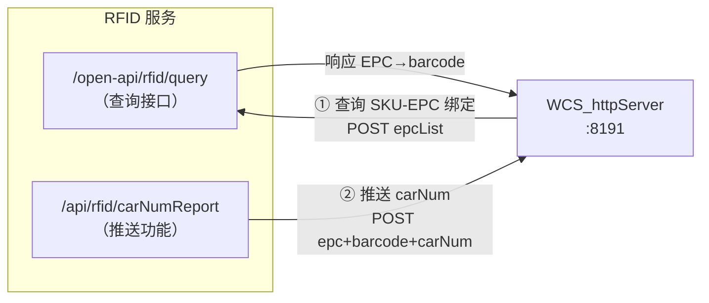
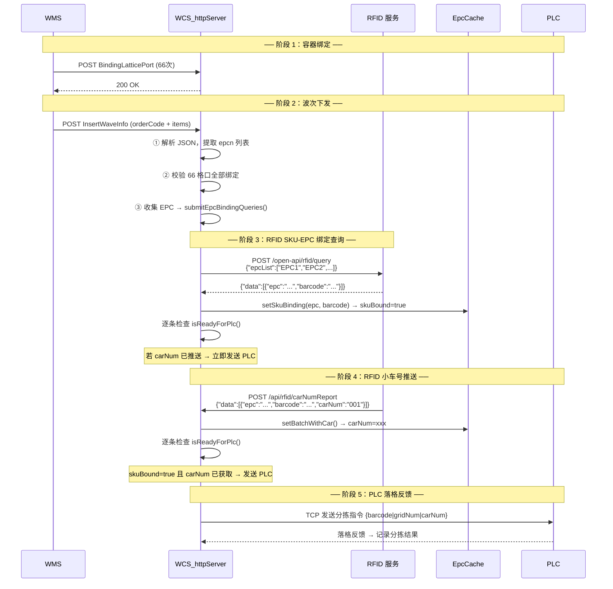

# SKU-EPC 绑定业务流设计

> 版本: V2.0 | 日期: 2026-08-10 | 状态: 已实现

---

## 一、两个 RFID 功能对比

| 对比项 | 功能 1：SKU-EPC 绑定查询 | 功能 2：小车号 carNum 推送 |
|--------|--------------------------|---------------------------|
| **方向** | **WCS → RFID**（主动查询） | **RFID → WCS**（主动推送） |
| **端点** | `{BaseURL}/open-api/rfid/query` | `/api/rfid/carNumReport` |
| **时机** | 波次下发后，发 PLC 前 | 货物进入传送带时实时推送 |
| **请求方式** | POST（WCS 发） | POST（RFID 发） |
| **用途** | 建立 EPC→barcode 映射 | 获取 barcode→carNum 映射 |
| **配置项** | `rfidUrl`（XML 中配置） | 无（WCS 自身端点） |
| **超时** | 需要（5s，`RFID_QUERY_TIMEOUT_MS`） | 不需要（被动接收） |
| **重试** | 不需要（超时即失败，不重试） | 不需要 |



---

## 二、完整数据流（5 阶段）



### 关键设计要点

- **阶段 3 和阶段 4 顺序不固定**：RFID 查询和 RFID 推送是异步独立的，谁先到达谁先处理
- **就绪条件（isReadyForPlc）**：`skuBound == true && carNum 不为空`，两者都满足才发送 PLC 指令
- **DEFAULT_CAR_NUM 兜底**：RFID 推送未到达时，即使 SKU 已绑定也不会发送 PLC（因为 carNum 为空），但 `getCarNum()` 查询时若未缓存则返回 `DEFAULT_CAR_STR("001")` 兜底

---

## 三、RFID 查询接口详情（WCS → RFID）

### 3.1 请求

```
POST {BaseURL}/open-api/rfid/query
Content-Type: application/json; charset=UTF-8
```

```json
{
    "epcList": [
        "48433141414350704D2D4E2210281234",
        "48433141414350704D2D4E2210280013"
    ]
}
```

### 3.2 响应

**成功：**
```json
{
    "data": [
        {
            "barcode": "BBBBBB001",
            "epc": "48433141414350704D2D4E2210281234"
        },
        {
            "barcode": "BBBBBB002",
            "epc": "48433141414350704D2D4E2210280013"
        }
    ]
}
```

**注意**：当前实现解析 `data` 数组（顶层数组），而非 `data.data` 嵌套。响应格式为 `{"data":[{...}]}`。

**失败：**
```json
{
    "success": false,
    "msg": "RFID 服务暂时不可用"
}
```

### 3.3 判断成功

HTTP 状态码 `200` → 成功。解析 `data` 数组中的 `epc` 和 `barcode` 字段。

---

## 四、RFID 小车号推送接口详情（RFID → WCS）

### 4.1 请求

```
POST /api/rfid/carNumReport
Content-Type: application/json
```

```json
{
    "data": [
        {
            "epc": "48433141414350704D2D4E2210281234",
            "barcode": "BBBBBB001",
            "carNum": "001"
        },
        {
            "epc": "48433141414350704D2D4E2210280013",
            "barcode": "BBBBBB002",
            "carNum": "002"
        }
    ]
}
```

### 4.2 响应

```json
{
    "code": "200",
    "message": "OK",
    "stored": 2
}
```

---

## 五、EpcCache 就绪判断机制

### 5.1 数据结构

```cpp
struct EpcCacheEntry
{
    QString barcode;
    QString carNum;           // 来自 RFID 的小车号，默认 DEFAULT_CAR_STR("001")
    bool    skuBound = false; // SKU-EPC 绑定是否完成（通过 RFID 查询获取）
    QDateTime expireTime;

    bool isExpired() const { return expireTime <= QDateTime::currentDateTime(); }
    bool isReadyForPlc() const { return skuBound && !carNum.isEmpty(); }
};
```

### 5.2 就绪判断逻辑

```
isReadyForPlc() = skuBound && !carNum.isEmpty()
```

- **skuBound**：由 `setSkuBinding()` 设置，表示 RFID 查询已返回 EPC→barcode 映射
- **carNum**：由 `setBatchWithCar()` 设置，表示 RFID 已推送小车号
- **两者都满足** → `trySendToPlcForEpc()` 发送 PLC 指令

### 5.3 核心方法

| 方法 | 调用者 | 作用 |
|------|--------|------|
| `setSkuBinding(epc, barcode)` | `onRfidBindingResult()` | 设置 barcode + skuBound=true，保留已有 carNum |
| `setBatchWithCar(epcDataMap)` | `handleRfidCarNumReport()` | 设置 carNum，保留已有 barcode 和 skuBound |
| `isReadyForPlc(epc)` | `trySendToPlcForEpc()` | 检查 skuBound && carNum 非空 |
| `getPlcData(epc)` | `trySendToPlcForEpc()` | 返回 {barcode, carNum}，供 PLC 发送使用 |
| `get(epc)` | 旧式查询 | 获取 barcode（TTL 过期返回空） |
| `getCarNum(epc)` | 旧式查询 | 获取 carNum（缓存未命中返回 DEFAULT_CAR_STR） |

### 5.4 数据竞态处理

- **RFID 查询先到**：`setSkuBinding()` 设置 skuBound=true，但 carNum 为空 → 不就绪，等待推送
- **RFID 推送先到**：`setBatchWithCar()` 设置 carNum，但 skuBound=false → 不就绪，等待查询结果
- **两者都到**：无论谁先谁后，最后到达的那个在写入后都会调用 `trySendToPlcForEpc()` 检查就绪状态

---

## 六、配置项设计

### 6.1 define.h

```c
// ═══════════════════════════════════════════════════════════════════════════
// RFID 缓存配置
// ═══════════════════════════════════════════════════════════════════════════
#define RFID_CACHE_TTL_SEC         300      // EPC 本地缓存 TTL（秒，默认5分钟）
#define RFID_QUERY_URL             "http://127.0.0.1:9100/open-api/rfid/query"  // RFID SKU-EPC 绑定查询 URL（默认值）
#define RFID_QUERY_TIMEOUT_MS      5000     // RFID 查询超时(ms)，默认5秒

// ── 小车号配置 ──
#define DEFAULT_CAR_NUM           1       // 兜底小车号（RFID未返回时使用），数字 1-999
#define EXCEPTION_CAR_NUM         0       // 异常口小车号（无匹配/无绑定时使用），数字 0=异常
```

### 6.2 ConfigManager.h（AppConfig）

```cpp
// ──── RFID 查询配置（WCS → RFID，SKU-EPC 绑定查询）────
QString rfidQueryUrl = RFID_QUERY_URL;  // RFID SKU-EPC 绑定查询 URL
```

### 6.3 XML 配置示例（config/http_server.xml）

```xml
<!-- ═══════════════════════════════════════════════════════════════ -->
<!-- 九、RFID 查询                                                    -->
<!--    波次推送后 WCS 向 RFID 服务查询 EPC→SKU 绑定关系               -->
<!--    如: http://192.168.1.200:8080/open-api/rfid/query               -->
<!--    修改后需重启服务                                                 -->
<!-- ═══════════════════════════════════════════════════════════════ -->
<rfidUrl>http://192.168.3.53:9100/open-api/rfid/query</rfidUrl>
```

**注意**：XML 元素名为 `<rfidUrl>`，但 ConfigManager 内部字段名为 `rfidQueryUrl`，加载时通过 `name == "rfidQueryUrl"` 匹配（ConfigManager.cpp 第 43 行）。

---

## 七、代码实现清单

### 7.1 HttpClient::queryRfidBinding() — 异步查询 RFID

**文件**：`HttpClient.h` / `HttpClient.cpp`

```cpp
// HttpClient.h 声明
void queryRfidBinding(const QStringList& epcList);  // 异步批量查询
void setRfidQueryUrl(const QString& url);            // 设置 RFID 查询 URL

signals:
    void rfidBindingResult(const QMap<QString, QString>& epcBarcodeMap);  // 查询结果
```

**实现要点**：
- 构建请求 JSON：`{"epcList":["EPC001","EPC002",...]}`
- 使用 `QNetworkAccessManager::post()` 异步发送
- 超时定时器 `RFID_QUERY_TIMEOUT_MS`（5秒），超时后断开 finished 信号避免双重触发
- 超时或失败 → `emit rfidBindingResult({})`（空 Map）
- 成功 → 解析 `data` 数组，提取 `epc` → `barcode` 映射 → `emit rfidBindingResult(map)`

### 7.2 HttpServer::submitEpcBindingQueries() — 波次下发后提交

**文件**：`HttpServer.h` / `HttpServer.cpp`

```cpp
void HttpServer::submitEpcBindingQueries(const QStringList& epcList)
{
    if (!m_pHttpClient) {
        HTTP_LOG_WARN("EPC绑定查询 HttpClient未设置，跳过 epcCount=%d", epcList.size());
        return;
    }
    m_pHttpClient->queryRfidBinding(epcList);
}
```

**调用时机**：波次解析完成（`ParseWorker` 完成 → 信号触发），在 `HttpServer` 构造函数中连接信号：

```cpp
// 波次解析完成后，收集 EPC 列表提交到 RFID 查询
connect(m_pWorker, &ParseWorker::waveParsed, this, [this](... QStringList epcList ...) {
    if (!epcList.isEmpty()) {
        submitEpcBindingQueries(epcList);
    }
}, Qt::QueuedConnection);
```

### 7.3 HttpServer::onRfidBindingResult() — 查询结果回调

**文件**：`HttpServer.cpp`

```cpp
void HttpServer::onRfidBindingResult(const QMap<QString, QString>& epcBarcodeMap)
{
    // 1. 空结果 → 记录告警，返回
    // 2. 逐条存入 EpcCache（m_pEpcCache->setSkuBinding(epc, barcode)）
    // 3. 逐条检查是否就绪（trySendToPlcForEpc(epc)）
    // 4. 记录日志：匹配数、就绪数
}
```

**信号连接**（在 `setHttpClient()` 中）：

```cpp
connect(m_pHttpClient, &HttpClient::rfidBindingResult, this,
    &HttpServer::onRfidBindingResult, Qt::QueuedConnection);
```

### 7.4 HttpServer::handleRfidCarNumReport() — RFID 推送处理

**文件**：`HttpServer.cpp`

```cpp
QJsonObject HttpServer::handleRfidCarNumReport(const QJsonObject& body)
{
    // 1. 解析 body["data"] 数组
    // 2. 提取 epc, barcode, carNum → 构建 batchMap
    // 3. m_pEpcCache->setBatchWithCar(batchMap) 批量写入
    // 4. 逐条检查 isReadyForPlc → trySendToPlcForEpc()
    // 5. 返回 {"code":"200", "message":"OK", "stored":N}
}
```

**路由注册**（`HttpServer::processRequest()`）：

```cpp
if (st.path == m_apiRfidCarNumReport && st.method == "POST") {
    QJsonObject result = handleRfidCarNumReport(d.object());
    sendJsonResponse(pSender, dwConnID, result);
    return;
}
```

### 7.5 HttpServer::trySendToPlcForEpc() — 就绪检查+发送 PLC

**文件**：`HttpServer.cpp`

```cpp
bool HttpServer::trySendToPlcForEpc(const QString& epc)
{
    // 1. 检查 m_pEpcCache->isReadyForPlc(epc) → 不就绪返回 false
    // 2. 获取 plcData = m_pEpcCache->getPlcData(epc) → {barcode, carNum}
    // 3. 从 GridBuffer 获取格口号 → entry.gridNum
    // 4. 检查 PLC 连接 → 未连接返回 false
    // 5. m_pPlcMgr->sendBatchCodesWithEpcCache(codeGridMap) → 发送 PLC 指令
    // 6. 返回 true
}
```

### 7.6 EpcCache 核心方法

**文件**：`EpcCache.h`（全部内联实现）

| 方法 | 说明 |
|------|------|
| `setSkuBinding(epc, barcode)` | 设置 barcode + skuBound=true，保留已有 carNum |
| `setBatchWithCar(epcDataMap)` | 批量设置 carNum，保留已有 barcode 和 skuBound |
| `isReadyForPlc(epc)` | 检查 skuBound && carNum 非空 |
| `getPlcData(epc)` | 返回 {barcode, carNum}，不就绪返回空 |
| `set(epc, barcode, carNum)` | 基础设置（TTL 从现在计时） |
| `setBatch(epcBarcodeMap)` | 批量设置（兼容旧接口，无 carNum） |
| `get(epc)` | 获取 barcode（过期返回空） |
| `getCarNum(epc)` | 获取 carNum（缓存未命中返回 DEFAULT_CAR_STR） |
| `contains(epc)` | 检查是否存在且未过期 |
| `purge()` | 清理过期条目 |
| `clear()` | 清空所有缓存 |
| `size()` | 缓存条目数 |

### 7.7 MainWindow 集成

**文件**：`MainWindow.cpp`

```cpp
// 启动时设置 RFID 查询 URL
m_pClient->setRfidQueryUrl(cfg.rfidQueryUrl);
m_pServer->setHttpClient(m_pClient);  // 连接 rfidBindingResult 信号
```

---

## 八、异常处理策略

| 场景 | 处理方式 |
|------|---------|
| RFID 查询 URL 为空 | 跳过查询，`emit rfidBindingResult({})`（空 Map），`onRfidBindingResult` 收到空结果后记录告警 |
| RFID 查询超时（5s） | 断开 finished 信号，`emit rfidBindingResult({})`，不重试 |
| RFID 查询 HTTP 非 200 | 记录告警，`emit rfidBindingResult({})` |
| RFID 响应中某 EPC 无 barcode | 该 EPC 跳过，其余正常绑定 |
| 波次无 epcn 字段 | 跳过 RFID 查询 |
| RFID 推送 data 为空 | 返回 `{"code":"500","message":"data为空"}` |
| RFID 推送中某条 epc 为空 | 跳过该条 |
| RFID 推送中的 barcode 为空 | 该条不写入 batchMap |
| SKU 已绑定但 carNum 未推送 | 不就绪，不发送 PLC（等待推送） |
| carNum 已推送但 SKU 未绑定 | 不就绪，不发送 PLC（等待查询结果） |
| 两者都未就绪 | 最终 `getCarNum()` 返回 `DEFAULT_CAR_STR("001")` 兜底（旧式查询路径） |

**核心原则：RFID 查询失败不阻塞分拣流程。SKU-EPC 绑定和 carNum 是"增强功能"而非"前置条件"，但当前就绪判断要求两者都满足才会主动发送 PLC。**

---

## 九、日志设计

### 9.1 EpcCache 专用日志

日志文件：`./log/EPC/epc.log`

日志宏（定义在 `EpcCache.h`）：

```cpp
#define EPC_INFO(fmt, ...)  hlog_format(HLOG_LEVEL_INFO,  "EPC", "\t" fmt, ##__VA_ARGS__)
#define EPC_WARN(fmt, ...)  hlog_format(HLOG_LEVEL_WARN,  "EPC", "\t" fmt, ##__VA_ARGS__)
#define EPC_ERROR(fmt, ...) hlog_format(HLOG_LEVEL_ERROR, "EPC", "\t" fmt, ##__VA_ARGS__)
```

### 9.2 关键日志点

**set 操作：**
```
[EPC] set 新增 epc=XXX barcode=YYY carNum=001 ttl=300s cacheSize=50
[EPC] set 覆盖 epc=XXX barcode=YYY carNum=002 ttl=300s cacheSize=50
```

**setSkuBinding 操作：**
```
[EPC] setSkuBinding 新增 epc=XXX barcode=YYY skuBound carNum=001 ready=1 cacheSize=50
[EPC] setSkuBinding 覆盖 epc=XXX barcode=YYY skuBound carNum= ready=0 cacheSize=50
```

**setBatchWithCar 操作：**
```
[EPC] setBatchWithCar 写入 50/50 carNum=48 ready=45 ttl=300s cacheSize=50
```

**get 未命中/过期：**
```
[EPC] get 缓存未命中 epc=XXX cacheSize=50
[EPC] get 缓存已过期 epc=XXX barcode=YYY expire=12:00:00 cacheSize=50
```

**getCarNum：**
```
[EPC] getCarNum 命中 epc=XXX carNum=001 barcode=YYY expire=12:00:00
[EPC] getCarNum 缓存未命中 epc=XXX cacheSize=50
```

**purge/clear：**
```
[EPC] purge 清理过期 5/55 cacheSize=50
[EPC] clear 清空全部缓存 beforeSize=50
```

### 9.3 HTTP 模块日志

日志文件：`./log/HTTP/http.log`

**RFID 查询：**
```
[HTTP] RFID绑定查询开始 url=xxx epcCount=50
[HTTP] RFID绑定查询完成 epcCount=50 matched=48 status=200
[HTTP] RFID绑定查询超时 url=xxx timeout=5000ms
[HTTP] RFID绑定查询失败 status=500 body=...
```

**RFID 推送：**
```
[HTTP] RFID推送已存储 total=50 new=48 carNum=48 sent=45
[HTTP] RFID小车号推送 body=xxx elapsed=5ms
```

**EPC 绑定结果：**
```
[HTTP] EPC绑定查询结果 匹配数=48
[HTTP] EPC绑定完成 匹配=48 就绪=45
[HTTP] EPC绑定查询结果为空（RFID无响应或超时）
```

**PLC 发送就绪：**
```
[HTTP] PLC发送就绪 epc=XXX barcode=YYY grid=001 carNum=001
[HTTP] trySendToPlcForEpc 格口未找到 epc=XXX barcode=YYY
[HTTP] trySendToPlcForEpc PLC未连接 epc=XXX barcode=YYY
```

---

## 十、代码改动文件清单

| 文件 | 改动内容 |
|------|---------|
| `define.h` | `RFID_QUERY_URL`、`RFID_QUERY_TIMEOUT_MS`、`RFID_CACHE_TTL_SEC`、`DEFAULT_CAR_NUM`、`EXCEPTION_CAR_NUM`、`API_RFID_CAR_NUM_REPORT` |
| `ConfigManager.h` | `AppConfig` 新增 `rfidQueryUrl` 字段，`apiRfidCarNumReport` 字段 |
| `ConfigManager.cpp` | `loadFromFile()` 和 `saveToFile()` 增加 `rfidQueryUrl` 读写 |
| `config/http_server.xml` | `<rfidUrl>` 配置项 |
| `EpcCache.h` | **新增** EpcCache 类（含 `EpcCacheEntry`、`setSkuBinding`、`setBatchWithCar`、`isReadyForPlc`、`getPlcData`、EPC 日志宏） |
| `HttpClient.h` | 新增 `queryRfidBinding()` 声明、`rfidBindingResult` 信号、`m_rfidQueryUrl` 成员、`setRfidQueryUrl()` |
| `HttpClient.cpp` | 实现 `queryRfidBinding()`（异步 POST，超时 5s）和 `onRfidBindingReplyFinished()` 回调 |
| `HttpServer.h` | 新增 `EpcCache* m_pEpcCache`、`HttpClient* m_pHttpClient`、`m_apiRfidCarNumReport`；新增方法 `handleRfidCarNumReport`、`submitEpcBindingQueries`、`onRfidBindingResult`、`trySendToPlcForEpc`、`setHttpClient` |
| `HttpServer.cpp` | 实现上述方法；构造函数中创建 EpcCache、连接 ParseWorker 信号触发 RFID 查询；`processRequest` 中注册 `/api/rfid/carNumReport` 路由 |
| `MainWindow.cpp` | 启动时调用 `m_pClient->setRfidQueryUrl(cfg.rfidQueryUrl)` 和 `m_pServer->setHttpClient(m_pClient)` |

---

## 十一、模拟测试

### 11.1 启动 RFID 模拟服务器

```bash
# 被动查询模式（兼容旧版）
python D:\WCS\WCSApp\doc\rfid_sim_server.py --port 9100

# 主动推送模式（模拟 carNum 推送）
python D:\WCS\WCSApp\doc\rfid_sim_server.py --push-url http://127.0.0.1:8191/api/rfid/carNumReport --port 9100

# 自动推送模式（每 5 秒一批）
python D:\WCS\WCSApp\doc\rfid_sim_server.py --push-url http://127.0.0.1:8191/api/rfid/carNumReport --push-interval 5 --port 9100
```

### 11.2 测试 curl 命令

```bash
# 模拟 SKU-EPC 查询（WCS → RFID）
curl -X POST http://127.0.0.1:9100/open-api/rfid/query \
  -H "Content-Type: application/json" \
  -d '{"epcList":["EPC00000001","EPC00000002","EPC00000003"]}'

# 模拟小车号推送（RFID → WCS）
curl -X POST http://127.0.0.1:8191/api/rfid/carNumReport \
  -H "Content-Type: application/json" \
  -d '{"data":[{"epc":"EPC00000001","barcode":"WV00000001","carNum":"001"},{"epc":"EPC00000002","barcode":"WV00000002","carNum":"002"}]}'

# 手动触发推送（模拟服务器 /push 端点）
curl -X POST http://127.0.0.1:9100/push \
  -H "Content-Type: application/json" \
  -d '{"epcList":["EPC00000001","EPC00000002","EPC00000003"]}'
```