# WCS_httpServer 接口说明文档

> 版本: V1.1 | 日期: 2026-08-10 | 系统: WMS退货分拣HTTP服务

---

## 1. 系统架构总览

### 1.1 组件关系图

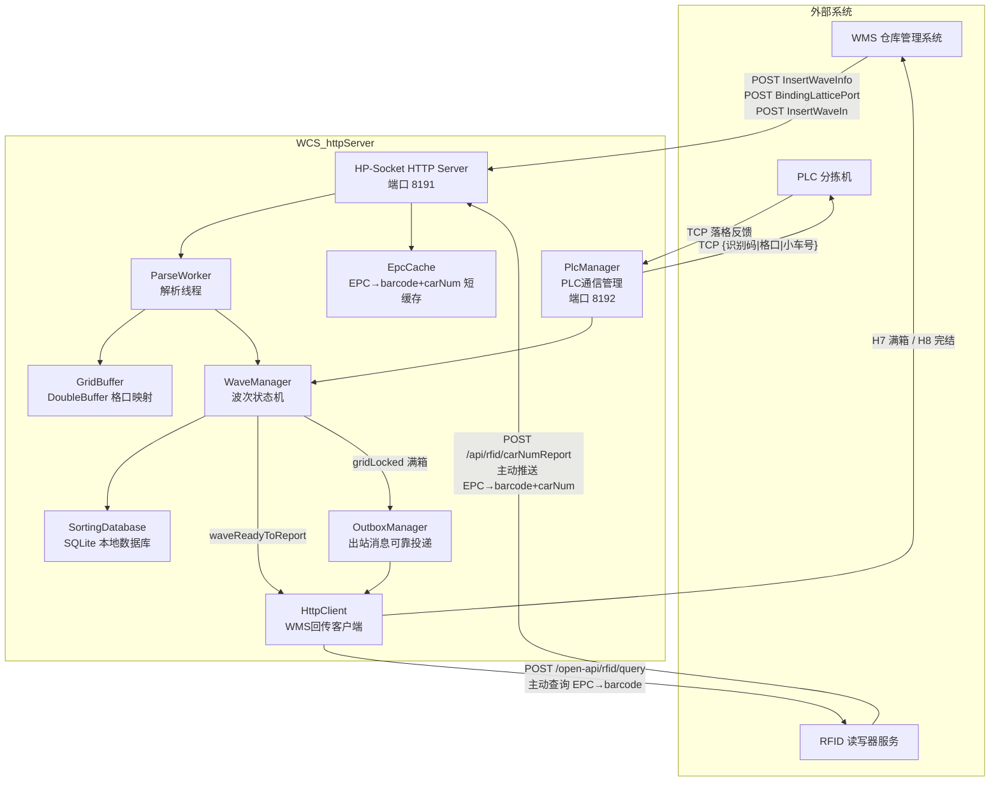

### 1.2 核心组件职责

| 组件 | 职责 |
|------|------|
| **HP-Socket** | 端口 8191，接收 WMS HTTP 请求，路由到具体 Handler |
| **ParseWorker** | 独立线程解析波次 JSON，构建 inco→grid 映射 |
| **GridBuffer** | DoubleBuffer 无锁读写，存储EPC→格口映射 |
| **WaveManager** | 波次状态机（10 状态），分拣标记，完结判定 |
| **PlcManager** | 端口 8192 TCP Server，接收 PLC 落格反馈，批量缓冲 |
| **HttpClient** | 向 WMS 回传满箱/完结报文；向 RFID 主动查询 EPC→barcode |
| **OutboxManager** | 出站消息持久化 + 定时重试，保证可靠投递 |
| **SortingDatabase** | SQLite WAL 模式，8 张表，UI 查询 + 数据持久化 |
| **EpcCache** | TTL 缓存，EPC→barcode+carNum 映射，RFID 主动推送写入 |

---

## 2. 波次状态机（核心）

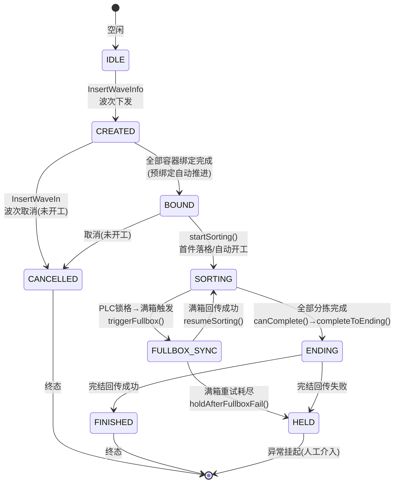

**状态枚举值**（[WaveManager.h](file:///d:/WCS/WCSApp/WCS_httpServer/WCS_httpServer/WaveManager.h#L28-L45)）：

| 枚举 | 值 | 含义 |
|------|----|------|
| WAVE_IDLE | 0 | 空闲 |
| WAVE_CREATED | 1 | 已下发 |
| WAVE_BOUND | 2 | 已绑定 |
| WAVE_SORTING | 3 | 分拣中 |
| WAVE_FULLBOX_SYNC | 4 | 满箱同步中 |
| WAVE_CANCEL_PENDING | 5 | 取消处理中 |
| WAVE_CANCELLED | 6 | 已取消 |
| WAVE_ENDING | 7 | 完结中 |
| WAVE_FINISHED | 8 | 已完成 |
| WAVE_HELD | 9 | 异常挂起 |

---

## 3. 接口 1：退货数据格口分配（InsertWaveInfo）

### 3.1 接口概述

WMS 将退货波次数据推送到 WCS，包含每个 SKU 的 EPC（商品编码，即 inco 字段）、分配的格口号、计划数量等。WCS 解析后建立 `inco→grid` 映射，持久化到数据库，并向 PLC 发送分拣指令。

| 属性 | 值 |
|------|-----|
| 路径 | `POST /api/DispatchSortingCommand/InsertWaveInfo` |
| 调用方 | WMS |
| 超时 | 2 秒 |

### 3.2 请求报文

```json
{
    "orderCode": "WV-2026-001",
    "orderQty": 200,
    "items": [
        {
            "obxCode": "OBX-001",
            "inco": "WV00000001",
            "epcn": "EPC-001",
            "gridNum": "001",
            "gridNumber": 1,
            "gridType": "普通格口",
            "volu": "A-01-01"
        }
    ]
}
```

| 字段 | 类型 | 说明 |
|------|------|------|
| orderCode | string | 波次号（唯一标识） |
| orderQty | int/string | 波次总件数 |
| items[].obxCode | string | 出库箱号 |
| items[].inco | string | EPC编码（商品编码），WMS侧称为商品编码，即EPC标签值 |
| items[].epcn | string | EPC编码（可选，用于RFID查询） |
| items[].gridNum | string | 格口号（3位零填充，如 "001"） |
| items[].gridNumber | int/string | 该格口计划数量 |
| items[].gridType | string | 格口类型（普通格口/异常口） |
| items[].volu | string | 来源库位 |

### 3.3 响应报文

**成功响应**：

```json
{
    "code": "200",
    "message": "",
    "sentTime": "2026-08-10 12:00:00.000"
}
```

**失败响应**：

```json
{
    "code": "500",
    "message": "具体错误描述"
}
```

| 字段 | 类型 | 说明 |
|------|------|------|
| code | string | 状态码，成功 "200"，失败 "500" |
| message | string | 成功为空字符串，失败为具体错误描述 |
| sentTime | string | 响应时间戳（仅成功时返回） |

### 3.4 波次明细日志（WAVE_ITEM）

接收到 InsertWaveInfo 请求后，WCS 会将请求体中的每个 `items[]` 子项单独记录到日志文件，便于问题追溯和审计。

| 属性 | 值 |
|------|-----|
| 日志模块名 | WAVE_ITEM |
| 日志路径 | `./log/WAVE_ITEM/wave_item.log` |
| 记录时机 | InsertWaveInfo 请求解析成功后，逐条写入 |
| 日志格式 | `[原始报文] http://{IP}:{端口}/api/DispatchSortingCommand/InsertWaveInfo body={单个item的JSON}` |

**日志示例**：

```
[原始报文] http://192.168.1.100:8191/api/DispatchSortingCommand/InsertWaveInfo body={"obxCode":"OBX-001","inco":"WV00000001","epcn":"EPC-001","gridNum":"001","gridNumber":1,"gridType":"普通格口","volu":"A-01-01"}
[原始报文] http://192.168.1.100:8191/api/DispatchSortingCommand/InsertWaveInfo body={"obxCode":"OBX-002","inco":"WV00000002","epcn":"EPC-002","gridNum":"002","gridNumber":1,"gridType":"普通格口","volu":"A-01-02"}
```

### 3.5 时序图 — 波次下发全流程

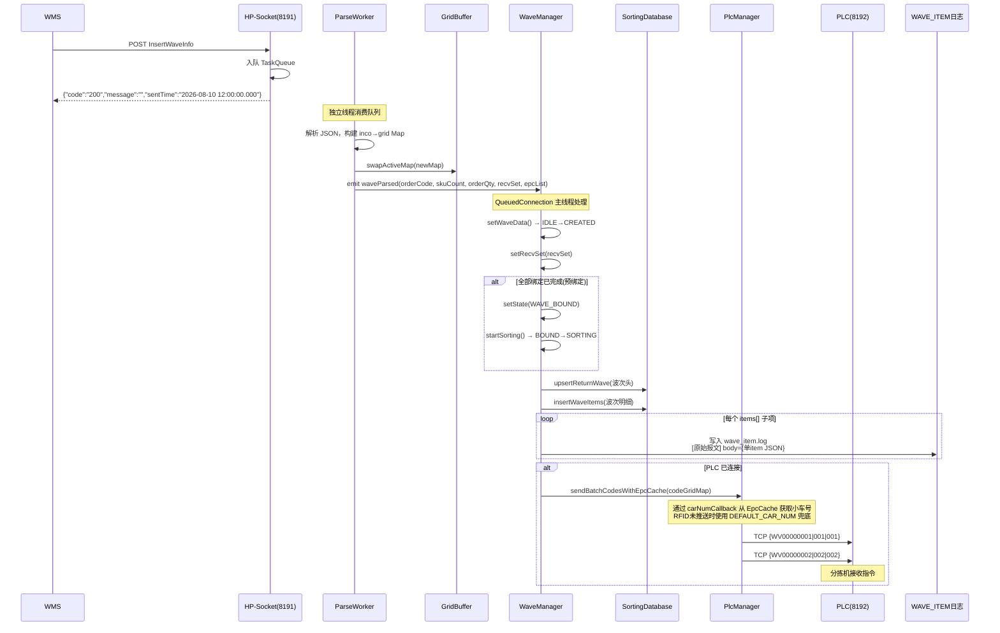

### 3.6 数据流 — 从 JSON 到数据库

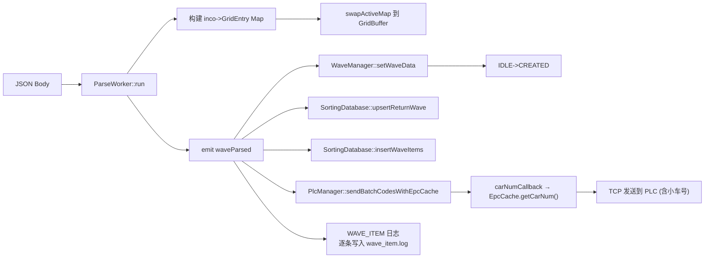

---

## 4. 接口 2：容器格口绑定关系同步（BindingLatticePort）

### 4.1 接口概述

WMS 将容器号（boxcode）与格口号（latticehole）绑定，用于后续满箱时知道哪个容器对应哪个格口。支持预绑定（波次下发前绑定）和运行中绑定（波次已下发后绑定）。

| 属性 | 值 |
|------|-----|
| 路径 | `POST /api/DispatchSortingCommand/BindingLatticePort` |
| 参数来源 | queryString 优先（`?latticehole=001&boxcode=BOX001`），其次 JSON Body |
| 调用方 | WMS |

### 4.2 请求参数

```json
{
    "latticehole": "001",
    "boxcode": "BOX-001"
}
```

| 字段 | 类型 | 说明 |
|------|------|------|
| latticehole | string | 格口号（3位零填充） |
| boxcode | string | 容器号 |

### 4.3 响应报文

**成功响应**：

```json
{
    "code": "200",
    "message": "收到信息"
}
```

**失败响应**：

```json
{
    "code": "500",
    "message": "参数缺失"
}
```

```json
{
    "code": "500",
    "message": "格口号越界"
}
```

```json
{
    "code": "500",
    "message": "波次已终态"
}
```

```json
{
    "code": "500",
    "message": "格口不在当前波次任务中"
}
```

| 字段 | 类型 | 说明 |
|------|------|------|
| code | string | 状态码，成功 "200"，失败 "500" |
| message | string | 成功为 "收到信息"，失败为具体错误原因 |

### 4.4 时序图

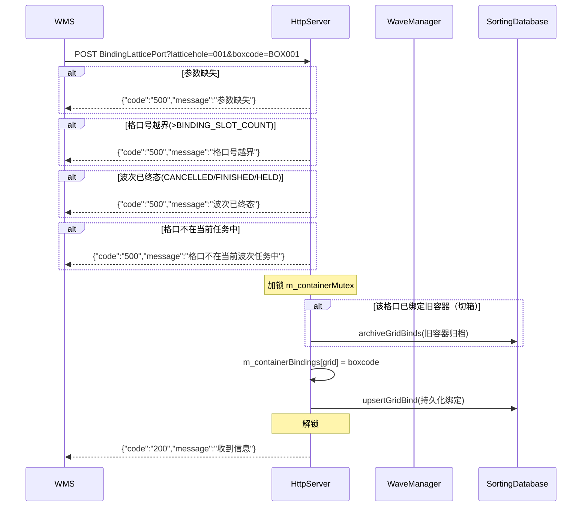

### 4.5 绑定状态判定

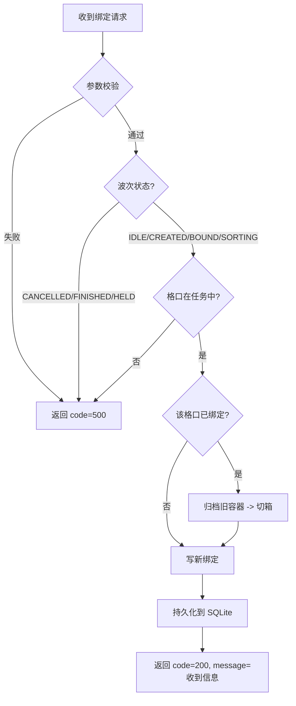

---

## 5. 接口 3：退货数据格口取消（InsertWaveIn / CancelWave）

### 5.1 接口概述

WMS 取消当前波次退货任务。**已开始分拣的波次不允许取消**（`isSortingStarted()` 判定）。取消后清理容器绑定、分拣记录，更新数据库状态。

| 属性 | 值 |
|------|-----|
| 路径 | `POST /api/DispatchSortingCommand/InsertWaveIn` |
| 调用方 | WMS |

### 5.2 请求报文

```json
{
    "orderCode": "WV-2026-001",
    "cancelReason": "业务调整"
}
```

### 5.3 响应报文

**成功响应**：

```json
{
    "code": "200",
    "message": "取消成功",
    "cancellable": true
}
```

**失败响应**：

```json
{
    "code": "500",
    "message": "缺少orderCode",
    "cancellable": false
}
```

```json
{
    "code": "500",
    "message": "波次不存在",
    "cancellable": false
}
```

```json
{
    "code": "500",
    "message": "已开始分拣，不允许取消",
    "cancellable": false
}
```

| 字段 | 类型 | 说明 |
|------|------|------|
| code | string | 状态码，成功 "200"，失败 "500" |
| message | string | 成功为 "取消成功"，失败为具体错误描述 |
| cancellable | boolean | 是否可取消，成功为 true，失败为 false |

### 5.4 时序图

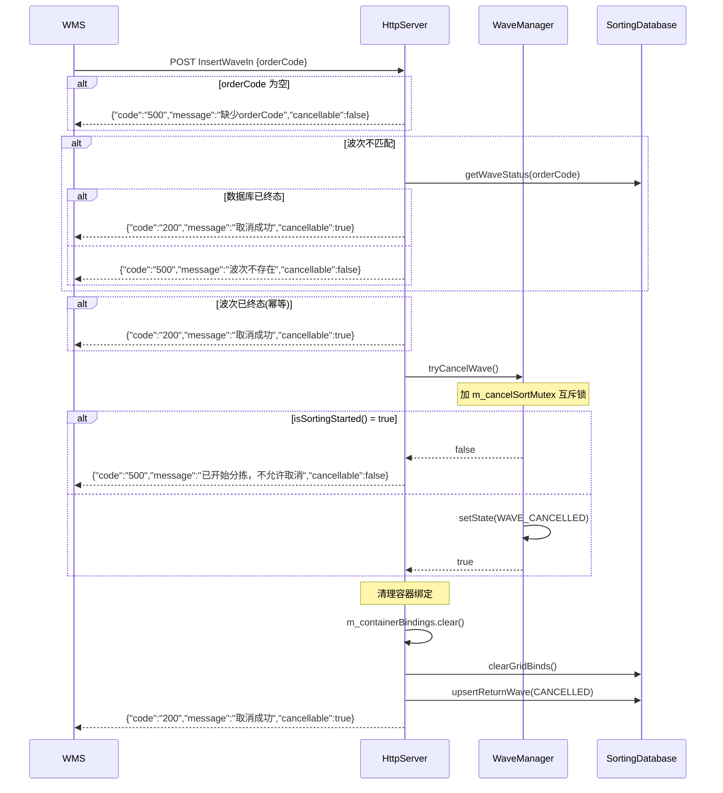

### 5.5 取消判定条件

`isSortingStarted()` 满足任一条件即视为已开始分拣，不允许取消：

1. 波次状态 ∈ {SORTING, FULLBOX_SYNC, ENDING, FINISHED, HELD}
2. 成功分拣计数 > 0（sorted > 0）
3. 已存在成功的满箱回传记录（H7）
4. 已点击"开始分拣"（`m_bSortingStarted == true`）

---

## 6. 接口 4：RFID 小车号推送（RFID 主动推送）

### 6.1 接口概述

RFID 读写器扫描到货物 EPC 后，**主动向 WCS_httpServer 推送** `EPC→barcode+carNum` 映射关系。WCS 接收后存入 EpcCache（TTL 缓存），后续波次下发 PLC 指令时通过回调查询小车号。

> 与 WCSApp 相机通信模式一致：**外部设备主动推送，WCS 被动接收 + 回调解耦**。

| 属性 | 值 |
|------|-----|
| 路径 | `POST /api/rfid/carNumReport` |
| 调用方 | RFID 读卡服务 → WCS |
| 推送时机 | RFID 扫描到货物 EPC 时实时推送 |
| 缓存 | EpcCache，TTL 可配置（RFID_CACHE_TTL_SEC） |
| 小车号兜底 | RFID 未推送时使用 `DEFAULT_CAR_NUM`（define.h 配置，默认 1） |

### 6.2 时序图

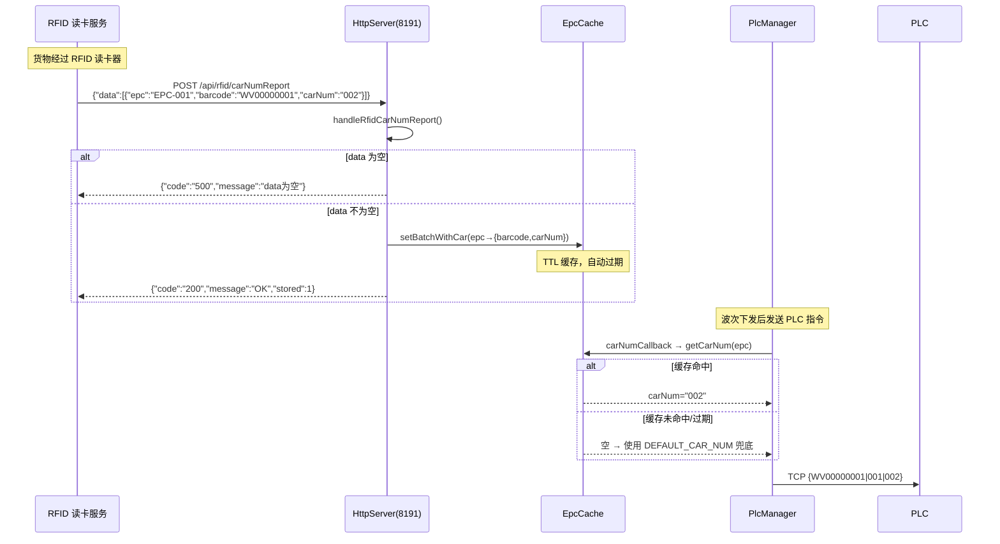

### 6.3 RFID 推送报文

**请求**（RFID → WCS）：
```json
{
    "data": [
        {"epc": "AC78A59C0C4010A22811029240003546", "barcode": "WV34S1CN2001B60L", "carNum": "002"},
        {"epc": "AC78A59C0C4010A22811029240003547", "barcode": "WV34S1CN2001B61L", "carNum": "005"}
    ]
}
```

| 字段 | 类型 | 必填 | 说明 |
|------|------|------|------|
| data[].epc | string | 是 | EPC 编码 |
| data[].barcode | string | 是 | EPC/识别码 |
| data[].carNum | string | 否 | 小车号（3位补零，如 "002"），为空时使用 `DEFAULT_CAR_NUM` 兜底 |

**响应**（WCS → RFID）：

成功响应：

```json
{
    "code": "200",
    "message": "OK",
    "stored": 2
}
```

失败响应（data为空）：

```json
{
    "code": "500",
    "message": "data为空"
}
```

| 字段 | 类型 | 说明 |
|------|------|------|
| code | string | 状态码，成功 "200"，失败 "500" |
| message | string | 成功为 "OK"，失败为 "data为空" |
| stored | int | 成功存储的条数（仅成功时返回） |

### 6.4 小车号获取策略

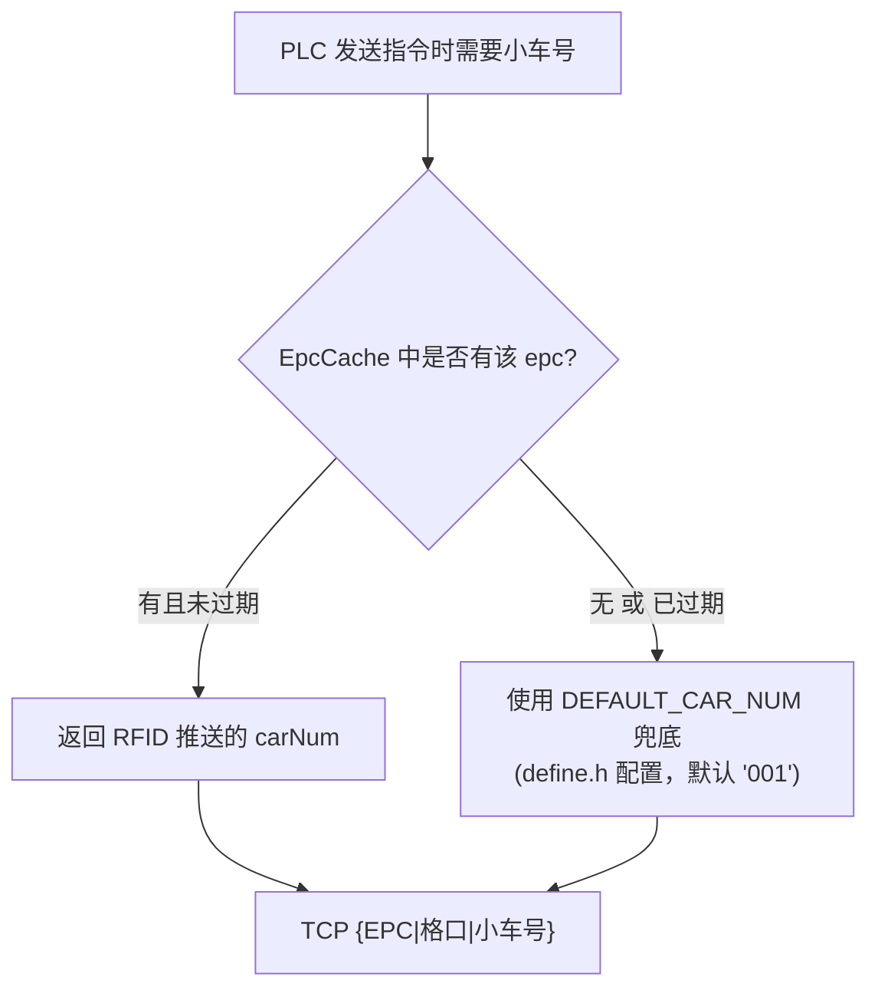

### 6.5 小车号配置宏（define.h）

| 宏 | 默认值 | 说明 |
|----|--------|------|
| `DEFAULT_CAR_NUM` | 1 | 兜底小车号（RFID 未推送时使用），格式化为 3 位补零如 "001" |
| `EXCEPTION_CAR_NUM` | 0 | 异常口小车号（无匹配/无绑定落格使用），值 "000" 表示异常 |
| `CAR_NUM_STR(n)` | — | 辅助宏，将数字转为 3 位补零字符串 |
| `DEFAULT_CAR_STR` | "001" | `CAR_NUM_STR(DEFAULT_CAR_NUM)` 的快捷宏 |

---

## 7. 接口 5：RFID SKU-EPC 绑定查询（WCS 主动查询）

### 7.1 接口概述

WCS 在波次下发后，如需补充查询 EPC 对应的商品编码（barcode）信息，可**主动向 RFID 服务发起 HTTP 查询**。RFID 返回 `epc→barcode` 映射关系，WCS 将结果存入 EpcCache。

| 属性 | 值 |
|------|-----|
| 路径 | `POST /open-api/rfid/query` |
| 调用方 | WCS → RFID |
| 配置位置 | `config/http_server.xml` 中的 `<rfidUrl>` 节点 |
| 配置示例 | `<rfidUrl>http://{RFID_IP}:9100/open-api/rfid/query</rfidUrl>` |

### 7.2 请求报文

**请求**（WCS → RFID）：

```json
{
    "epcList": ["AC78A59C0C4010A22811029240003546", "AC78A59C0C4010A22811029240003547"]
}
```

| 字段 | 类型 | 必填 | 说明 |
|------|------|------|------|
| epcList | string[] | 是 | 需要查询的 EPC 编码列表 |

**期望响应**（RFID → WCS）：

```json
{
    "data": [
        {"epc": "AC78A59C0C4010A22811029240003546", "barcode": "WV34S1CN2001B60L"},
        {"epc": "AC78A59C0C4010A22811029240003547", "barcode": "WV34S1CN2001B61L"}
    ]
}
```

| 字段 | 类型 | 说明 |
|------|------|------|
| data[].epc | string | EPC 编码 |
| data[].barcode | string | 对应的EPC/识别码 |

### 7.3 时序图

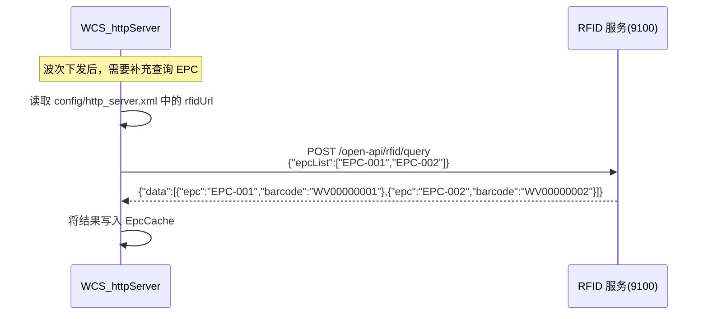

---

## 8. 接口 6：满容器后切箱数据同步（H7 满箱回传）

### 8.1 接口概述

PLC 锁格信号触发满箱回传。WCS 组装 H7 报文（`gwisSubProductClassifyOrder`），通过 OutboxManager 可靠投递到 WMS。成功后归档容器绑定，允许新容器绑定（切箱）。

| 属性 | 值 |
|------|-----|
| 触发源 | PLC 锁格信号（TCP `{grid|L}`） |
| 报文类型 | H7 `gwisSubProductClassifyOrder` |
| 投递方式 | OutboxManager 持久化 + 定时重试 |
| 重试策略 | 30 秒间隔，最多 10 次 |

### 8.2 时序图

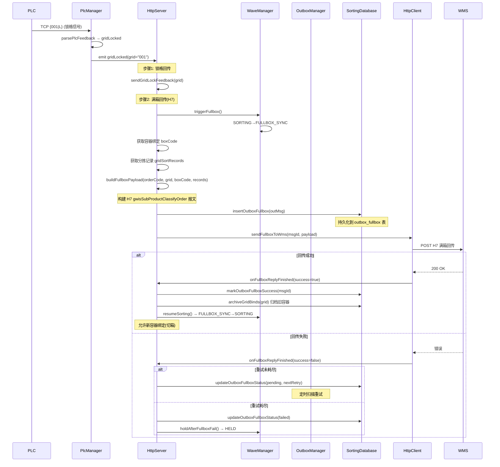

### 8.3 H7 满箱回传报文结构

```json
{
    "head": {
        "orderCode": "WV-2026-001",
        "orderType": "02",
        "warehouseCode": "A",
        "goodsOwner": "BXH_ZS",
        "fromLocation": "A-01-01",
        "createDate": "2026-08-06 15:30:00.000",
        "createUserCode": "admin",
        "createUserName": "管理员",
        "remark": "",
        "gwf1-20": ""
    },
    "method": "gwisSubProductClassifyOrder",
    "detailList": [
        {
            "lineNum": "1",
            "num": "BOX-001",
            "targetLocation": "001",
            "sku": "WV00000001",
            "qty": "1",
            "batchCode": "WV-2026-001",
            "gwf1-20": ""
        }
    ]
}
```

### 8.4 Outbox 可靠投递机制

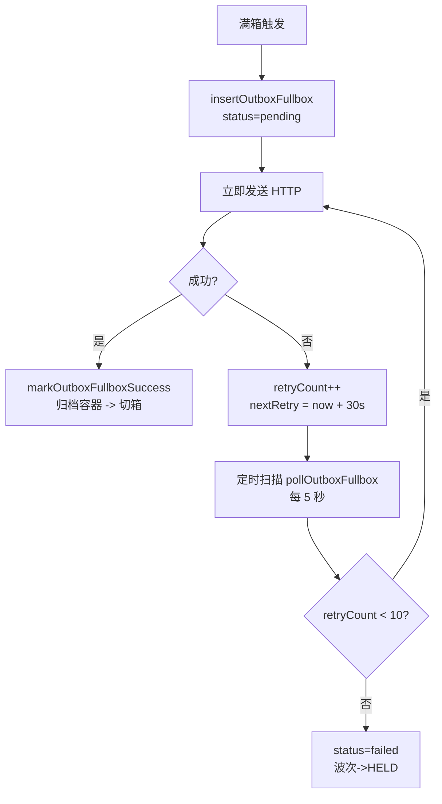

---

## 9. 接口 7：退货分配完成数据回传（H8 完结回传）

### 9.1 接口概述

当波次中所有识别码全部分拣完成（或超时），WCS 自动组装 33.md 格式完结回传报文，将全部分拣明细回传给 WMS。

| 属性 | 值 |
|------|-----|
| 触发源 | WaveManager 检测 `canComplete()` |
| 报文格式 | 33.md 格式 |
| 构建方式 | 业务线程池异步构建（异步入池） |

### 9.2 时序图

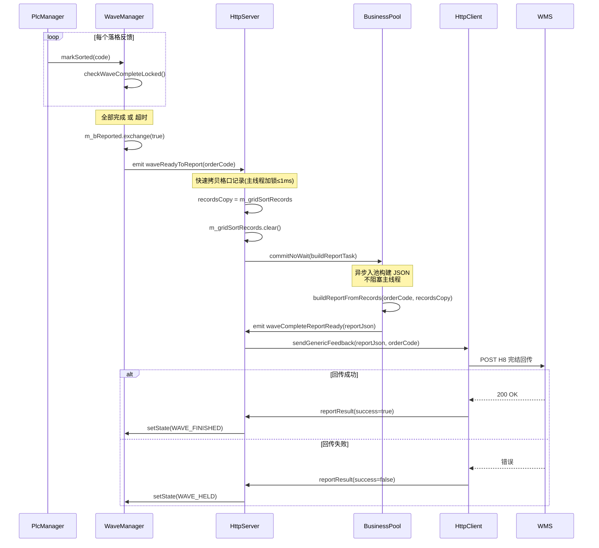

### 9.3 H8 完结回传报文结构（33.md 格式）

```json
{
    "head": {
        "orderCode": "WV-2026-001",
        "orderType": "02",
        "warehouseCode": "A",
        "goodsOwner": "BXH_ZS",
        "fromLocation": "A-01-01",
        "createDate": "2026-08-06 15:35:00.000",
        "createUserCode": "admin",
        "createUserName": "管理员",
        "remark": "",
        "detailList": [
            {
                "lineNum": "1",
                "num": "001",
                "targetLocation": "001",
                "sku": "WV00000001",
                "qty": "1",
                "batchCode": "WV-2026-001"
            }
        ]
    }
}
```

---

## 10. 异常码汇总表

以下汇总了所有接口可能返回的异常情况及其对应的 code 和 HTTP 状态码。

| 接口 | 消息 | code | HTTP |
|------|------|------|------|
| InsertWaveInfo | JSON解析失败 | 500 | 500 |
| InsertWaveInfo | 参数校验失败 | 500 | 500 |
| InsertWaveInfo | 格口绑定不完整 | 500 | 500 |
| InsertWaveInfo | 波次已开始分拣 | 500 | 500 |
| InsertWaveInfo | 服务器繁忙 | 500 | 500 |
| BindingLatticePort | 参数缺失 | 500 | 200 |
| BindingLatticePort | 格口号越界 | 500 | 200 |
| BindingLatticePort | 波次已终态 | 500 | 200 |
| BindingLatticePort | 格口不在当前波次任务中 | 500 | 200 |
| CancelWave | 缺少orderCode | 500 | 200 |
| CancelWave | 波次不存在 | 500 | 200 |
| CancelWave | 已开始分拣，不允许取消 | 500 | 200 |
| RfidCarNumReport | data为空 | 500 | 200 |

> **说明**：
> - `code` 字段统一为字符串类型，成功时为 `"200"`，失败时为 `"500"`。
> - `HTTP` 列表示 HTTP 响应的状态码。InsertWaveInfo 的异常统一返回 HTTP 500；BindingLatticePort、CancelWave、RfidCarNumReport 的异常返回 HTTP 200，通过响应体 `code` 字段区分成功/失败。

---

## 11. 完整数据流全景

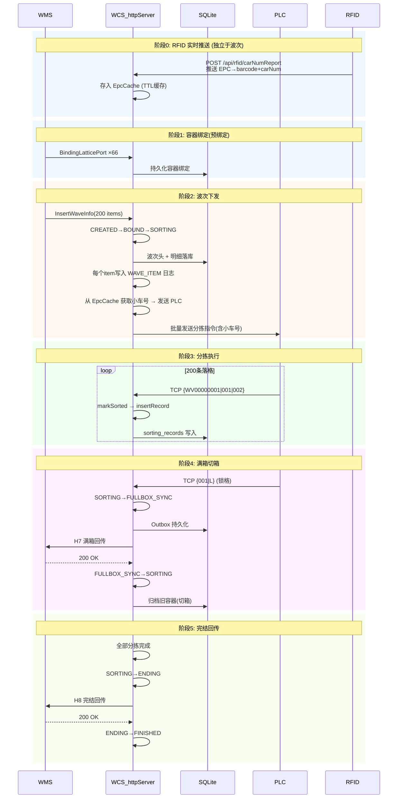

---

## 12. 数据库表关系

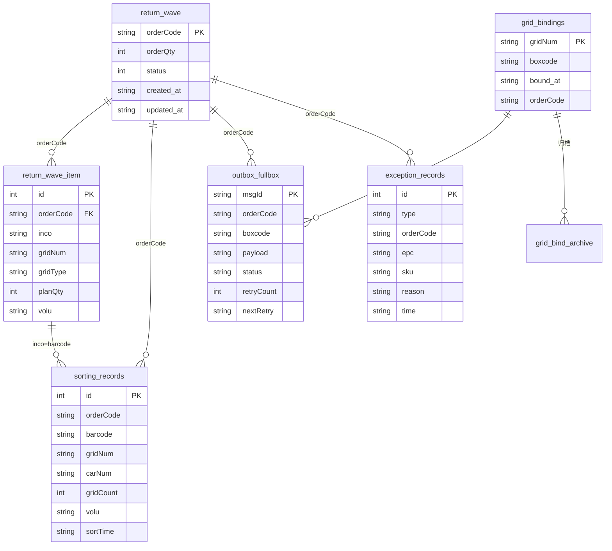

---

## 13. 日志模块说明

| 模块名称 | 路径 | 说明 |
|----------|------|------|
| 主日志 | `./log/` | 系统运行日志，包含 HTTP 请求、PLC 通信、状态变更等 |
| **WAVE_ITEM** | `./log/WAVE_ITEM/wave_item.log` | 波次明细日志，每个波次 items[] 子项单独记录一条，格式为 `[原始报文] http://IP:端口/api/... body={单个item的JSON}` |

### 13.1 WAVE_ITEM 日志格式

```
[原始报文] http://{IP}:{端口}/api/DispatchSortingCommand/InsertWaveInfo body={"obxCode":"...","inco":"...","epcn":"...","gridNum":"...","gridNumber":...,"gridType":"...","volu":"..."}
```

- 每条日志对应一个 items[] 子项
- 日志级别：INFO
- 写入时机：InsertWaveInfo 请求解析成功后，在 `insertWaveItems` 入库的同时逐条写入
- 用途：用于问题追溯、审计和对账

---

## 14. 核心代码文件索引

| 文件 | 职责 |
|------|------|
| [HttpServer.cpp](file:///d:/WCS/WCSApp/WCS_httpServer/WCS_httpServer/HttpServer.cpp) | HTTP 路由分发、波次处理、绑定、取消、满箱、完结 |
| [ParseWorker.cpp](file:///d:/WCS/WCSApp/WCS_httpServer/WCS_httpServer/ParseWorker.cpp) | 波次 JSON 解析，inco→grid 映射构建 |
| [WaveManager.cpp](file:///d:/WCS/WCSApp/WCS_httpServer/WCS_httpServer/WaveManager.cpp) | 波次状态机、分拣标记、完结判定 |
| [PlcManager.cpp](file:///d:/WCS/WCSApp/WCS_httpServer/WCS_httpServer/PlcManager.cpp) | PLC TCP 通信、落格反馈解析、锁格检测 |
| [OutboxManager.cpp](file:///d:/WCS/WCSApp/WCS_httpServer/WCS_httpServer/OutboxManager.cpp) | 出站消息持久化、定时重试、可靠投递 |
| [SortingDatabase.cpp](file:///d:/WCS/WCSApp/WCS_httpServer/WCS_httpServer/SortingDatabase.cpp) | SQLite 数据库操作、跨线程连接管理 |
| [HttpClient.cpp](file:///d:/WCS/WCSApp/WCS_httpServer/WCS_httpServer/HttpClient.cpp) | WMS 回传 HTTP 请求（满箱/完结）、RFID 主动查询 |
| [EpcCache.h](file:///d:/WCS/WCSApp/WCS_httpServer/WCS_httpServer/EpcCache.h) | EPC 短缓存，EPC→barcode+carNum 映射，TTL 过期管理 |
| [MainWindow.cpp](file:///d:/WCS/WCSApp/WCS_httpServer/WCS_httpServer/MainWindow.cpp) | UI 界面、信号连接、服务启停管理 |
| [define.h](file:///d:/WCS/WCSApp/WCS_httpServer/WCS_httpServer/define.h) | 全局配置宏定义、SQL 语句宏 |

---

## 15. 接口汇总表

| 序号 | 接口名称 | 路径 | 方法 | 调用方 | 核心功能 |
|------|---------|------|------|--------|---------|
| 1 | 退货数据格口分配 | `/api/DispatchSortingCommand/InsertWaveInfo` | POST | WMS→WCS | 波次下发，建立 inco→grid 映射，主动发送 PLC 指令，WAVE_ITEM 日志 |
| 2 | 容器格口绑定 | `/api/DispatchSortingCommand/BindingLatticePort` | POST | WMS→WCS | 容器号与格口号绑定，支持切箱归档 |
| 3 | 退货任务取消 | `/api/DispatchSortingCommand/InsertWaveIn` | POST | WMS→WCS | 取消波次（未开工），清理绑定和分拣记录 |
| 4 | RFID 小车号推送 | `/api/rfid/carNumReport` | POST | RFID→WCS | RFID 实时推送 EPC→barcode+carNum，存入 EpcCache |
| 5 | RFID SKU-EPC 查询 | `/open-api/rfid/query` | POST | WCS→RFID | WCS 主动查询 EPC 对应的商品编码信息 |
| 6 | 满箱切箱同步 | PLC 锁格触发 | 内部 | WCS→WMS | H7 满箱回传，Outbox 可靠投递，容器归档切箱 |
| 7 | 完结数据回传 | 全部分拣完成触发 | 内部 | WCS→WMS | H8 完结回传，33.md 格式，波次状态→FINISHED |