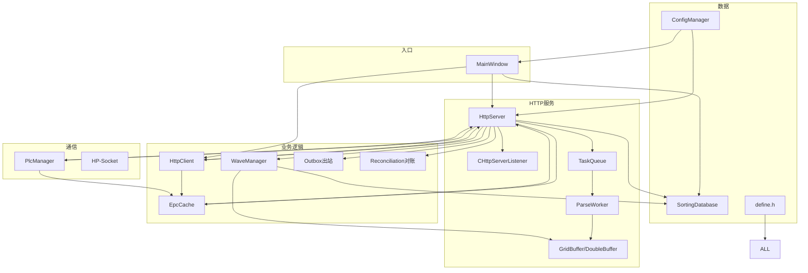

# WCS_httpServer 软件架构文档

> **版本**：V1.0
> **日期**：2026-08-10
> **项目**：安徽仓退货窄带 WCS 分拣系统

---

## 目录

1. [系统概述](#1-系统概述)
2. [整体架构](#2-整体架构)
3. [模块详解](#3-模块详解)
4. [数据流设计](#4-数据流设计)
5. [状态机设计](#5-状态机设计)
6. [线程模型](#6-线程模型)
7. [配置体系](#7-配置体系)
8. [日志体系](#8-日志体系)
9. [数据库设计](#9-数据库设计)
10. [接口设计](#10-接口设计)
11. [文件索引](#11-文件索引)

---

## 1. 系统概述

### 1.1 系统定位

WCS_httpServer 是仓库控制系统（WCS）的核心服务，负责接收 WMS 下发的退货分拣任务，协调 PLC 硬件执行分拣，并将结果回传 WMS。

### 1.2 技术栈

| 层级 | 技术 |
|------|------|
| 语言 | C++17（MSVC 2019） |
| 框架 | Qt 5.15 |
| HTTP 服务 | HP-Socket 5.8 |
| 数据库 | SQLite 3（WAL 模式） |
| PLC 通信 | Snap7（S7 协议）+ 原生 TCP |
| 配置 | XML（QXmlStreamReader/Writer） |
| 构建 | Visual Studio 2019 |

### 1.3 外部系统交互

```
                    ┌──────────────┐
                    │     WMS      │  波次下发 / 容器绑定 / 取消
                    └──────┬───────┘
                           │ HTTP (8191)
                    ┌──────▼───────┐
                    │              │
        ┌───────────│ WCS_httpServer│───────────┐
        │           │              │           │
        │           └──────────────┘           │
        │                                      │
   ┌────▼────┐                          ┌──────▼──────┐
   │  RFID   │  EPC→小车号推送           │    PLC      │
   │  服务   │◄── SKU-EPC绑定查询 ──────│   硬件      │
   └─────────┘                          └─────────────┘
                                        TCP 文本协议 (8192)
                                        S7 协议 (DB1/DB77)
```

---

## 2. 整体架构

### 2.1 分层架构图

```
┌─────────────────────────────────────────────────────────────┐
│                      UI 层 (MainWindow)                      │
│  服务控制 | 容器绑定面板 | 配置管理 | 运行日志 | 分拣记录查询    │
├─────────────────────────────────────────────────────────────┤
│                     业务层 (HttpServer)                      │
│  ┌──────────┐ ┌──────────┐ ┌──────────┐ ┌───────────────┐  │
│  │TaskQueue │ │ParseWorker│ │WaveManager│ │GridBuffer     │  │
│  │(削峰队列) │ │(解析线程) │ │(状态机)   │ │(双缓冲无锁读)  │  │
│  └──────────┘ └──────────┘ └──────────┘ └───────────────┘  │
│  ┌──────────┐ ┌──────────┐ ┌──────────┐ ┌───────────────┐  │
│  │EpcCache  │ │HttpClient│ │Outbox    │ │Reconciliation │  │
│  │(RFID缓存) │ │(回传客户端)│ │(可靠投递) │ │(对账S8)       │  │
│  └──────────┘ └──────────┘ └──────────┘ └───────────────┘  │
├─────────────────────────────────────────────────────────────┤
│                     通信层                                   │
│  ┌──────────────────┐ ┌──────────────────────────────────┐  │
│  │ HP-Socket HTTP   │ │ PlcManager (TCP文本 + S7协议)    │  │
│  │ (端口8191)       │ │ (端口8192 + S7 IP)              │  │
│  └──────────────────┘ └──────────────────────────────────┘  │
├─────────────────────────────────────────────────────────────┤
│                     数据层                                   │
│  ┌──────────────────┐ ┌──────────────────────────────────┐  │
│  │ SortingDatabase  │ │ ConfigManager (XML 配置)         │  │
│  │ (SQLite 8张表)   │ │ (http_server.xml)                │  │
│  └──────────────────┘ └──────────────────────────────────┘  │
├─────────────────────────────────────────────────────────────┤
│                     基础设施层                                │
│  ┌──────────┐ ┌──────────┐ ┌──────────┐ ┌───────────────┐  │
│  │ThreadPool│ │LogCenter │ │Lifecycle │ │define.h       │  │
│  │(线程池)   │ │(日志中心) │ │Logger    │ │(全局宏配置)    │  │
│  └──────────┘ └──────────┘ └──────────┘ └───────────────┘  │
└─────────────────────────────────────────────────────────────┘
```

### 2.2 核心组件依赖关系



---

## 3. 模块详解

### 3.1 HttpServer（HTTP 服务核心）

**文件**：`HttpServer.h` / `HttpServer.cpp`

**职责**：
- 继承 `CHttpServerListener`，处理所有 HTTP 请求
- 管理所有业务子模块的生命周期
- API 路由分发（4 个接口）

**关键成员**：

| 成员 | 类型 | 说明 |
|------|------|------|
| `m_pServer` | `CHttpServerPtr` | HP-Socket HTTP 服务句柄 |
| `m_pQueue` | `TaskQueue*` | 削峰缓冲队列 |
| `m_pBuffer` | `GridBuffer*` | 双缓冲无锁读取 Map |
| `m_pWaveMgr` | `WaveManager*` | 波次状态机 |
| `m_pPlcMgr` | `PlcManager*` | PLC 通信管理器 |
| `m_pSortingDb` | `SortingDatabase*` | 分拣记录数据库 |
| `m_pEpcCache` | `EpcCache*` | RFID EPC 缓存 |
| `m_pHttpClient` | `HttpClient*` | HTTP 回传客户端 |
| `m_pBusinessPool` | `ThreadPool*` | 业务线程池（90 线程） |
| `m_pPlcRecvPool` | `ThreadPool*` | PLC 反馈接收线程池（4 线程） |

**API 路由**：

| 路由变量 | 默认路径 | 用途 |
|----------|---------|------|
| `m_apiInsertWaveInfo` | `/api/DispatchSortingCommand/InsertWaveInfo` | 波次下发 |
| `m_apiBindingLatticePort` | `/api/DispatchSortingCommand/BindingLatticePort` | 容器绑定 |
| `m_apiInsertWaveIn` | `/api/DispatchSortingCommand/InsertWaveIn` | 波次取消 |
| `m_apiRfidCarNumReport` | `/api/rfid/carNumReport` | RFID 小车号推送 |

**响应格式**：

```json
// 成功
{"code": "200", "message": "...", "sentTime": "2026-08-10 12:00:00.000"}

// 失败
{"code": "500", "message": "错误描述"}
```

---

### 3.2 TaskQueue（削峰缓冲队列）

**文件**：`TaskQueue.h`

**设计模式**：生产者-消费者

```
HP-Socket 多线程 OnRequest
       │
       ▼ (入队)
  ┌─────────┐
  │TaskQueue│  maxPending=5
  └─────────┘
       │
       ▼ (出队，单线程)
  ParseWorker
```

**数据结构**：

```cpp
struct WaveTask {
    QString    orderCode;
    QByteArray jsonBody;
    QString    fullUrl;      // 完整请求 URL（用于波次明细日志）
    QDateTime  enqueueTime;
};
```

**水位保护**：队列满时返回 HTTP 503 `"服务器繁忙，请稍后重试"`。

---

### 3.3 ParseWorker（JSON 解析线程）

**文件**：`ParseWorker.h` / `ParseWorker.cpp`

**职责**：
- 继承 `QThread`，低优先级运行
- 从 TaskQueue 阻塞等待取任务
- 解析 WMS 下发的波次 JSON → 构建 `QMap<inco, GridEntry>` 映射
- 收集 EPC 列表（`epcn` 字段）
- 原子交换到 DoubleBuffer
- 信号：`waveParsed(orderCode, skuCount, orderQty, timestamp, recvSet, epcList)`

**处理流程**：

```
JSON Body → QJsonDocument::fromJson
    → 遍历 items[] 数组
    → 每个 item 提取 inco→gridNum 映射
    → 构建 GridEntry {gridNum, gridType, gridCount, volu, obxCode}
    → 写入 DoubleBuffer
    → 收集 EPC 列表
    → emit waveParsed
```

**波次明细日志**：每个 items[] 子项单独记录到 `./log/WAVE_ITEM/wave_item.log`。

---

### 3.4 GridBuffer / DoubleBuffer（双缓冲无锁读取）

**文件**：`DoubleBuffer.h`

**设计模式**：双缓冲 + 原子指针交换

```
写入线程                      读取线程
(ParseWorker)                (API查询 / PlcManager)
     │                            │
     ▼                            ▼
  ┌──────┐                    ┌──────┐
  │Back  │  原子交换 ────────►│Active│
  │Buffer│◄──────────────────│Buffer│
  └──────┘                    └──────┘
```

**优势**：
- 零锁竞争：写入线程独占 Back Buffer，读取线程通过原子指针访问 Active Buffer
- 零延迟：读取操作无需等待锁
- 旧 Map 延迟 5 秒清理（`PendingDelete` 队列），确保最后读取者安全

**GridEntry 数据结构**：

```cpp
struct GridEntry {
    QString gridNum;    // 格口号（如 "1" 或 "1,2,3" 多格口）
    QString gridType;   // 格口类型（如 "普通格口"）
    int     gridCount;  // 配货件数
    QString volu;       // 来源库位
    QString obxCode;    // 容器号
};
```

---

### 3.5 WaveManager（波次状态机）

**文件**：`WaveManager.h` / `WaveManager.cpp`

**状态**：10 状态有限状态机

```
IDLE → CREATED → BOUND → SORTING → FULLBOX_SYNC → ENDING → FINISHED
                              │            │
                              ▼            ▼
                        CANCEL_PENDING  CANCELLED
                              │
                              ▼
                            HELD
```

**关键方法**：

| 方法 | 说明 |
|------|------|
| `setWaveData()` | 设置波次基础数据 |
| `setRecvSet()` | 设置识别码集合 |
| `startSorting()` | 开始分拣（BOUND → SORTING） |
| `markSorted()` | 标记已分拣 |
| `markException()` | 标记异常 |
| `isWaveComplete()` | 全部EPC（商品编码）分拣完成 |
| `triggerFullbox()` | 触发满箱 |
| `completeToEnding()` | 满箱完成 → ENDING |
| `tryCancelWave()` | 尝试取消（H5 互斥锁） |

**并发安全**：
- 状态字段：`std::atomic<int>`
- 分拣状态集：`std::mutex` 保护
- 防重复回传：`std::atomic<bool> m_bReported`

---

### 3.6 PlcManager（PLC 通信管理器）

**文件**：`PlcManager.h` / `PlcManager.cpp`

**双协议设计**：

| 协议 | 用途 | 配置 |
|------|------|------|
| TCP 文本协议 | 分拣指令发送、落格反馈、锁格信号 | 端口 8192 |
| S7 协议 | DB1 写分拣指令、DB77 读锁格状态 | IP 192.168.0.1 |

**TCP 文本协议消息格式**：

| 消息 | 格式 | 示例 |
|------|------|------|
| 分拣指令 | `{识别码\|格口\|小车号}` | `{WV34S1\|001\|001}` |
| 落格反馈 | `{识别码\|格口\|小车号}` | `{WV34S1\|001\|001}` |
| 锁格 | `{格口\|L}` | `{001\|L}` |
| 解锁 | `{格口\|U}` | `{001\|U}` |

格口号和小车号均 3 位补零（`GRID_KEY_PADDING=3`）。

**批量反馈机制**：

```
PLC 反馈到达
    → 写入缓冲区
    → 100ms 定时器到期
    → 批量发射 plcFeedbackBusinessBatch 信号
    → 避免高频信号卡死 UI
```

**回调模式**：

| 回调类型 | 说明 |
|----------|------|
| `PlcLookupCallback` | 识别码 → 格口号查询 |
| `PlcCarNumCallback` | 识别码 → 小车号查询（EpcCache） |

---

### 3.7 EpcCache（RFID EPC 缓存）

**文件**：`EpcCache.h` / `EpcCache.cpp`

**缓存结构**：

```cpp
struct EpcCacheEntry {
    QString   barcode;
    QString   carNum;      // RFID 小车号，默认 DEFAULT_CAR_STR("001")
    bool      skuBound;    // SKU-EPC 绑定是否完成
    QDateTime expireTime;  // 过期时间，默认 TTL=300s
};
```

**就绪判断**：

```cpp
bool isReadyForPlc() const {
    return skuBound && !carNum.isEmpty();
}
```

**数据来源**：

| 属性 | 来源 | 触发时机 |
|------|------|----------|
| `barcode` | RFID 查询 / RFID 推送 | 波次下发后 / RFID 主动推送 |
| `skuBound` | RFID SKU-EPC 绑定查询 | 波次下发后异步查询 |
| `carNum` | RFID 主动推送 | RFID 实时推送 |

**日志**：专用日志模块 `EPC_INFO/WARN/ERROR`，写入 `./log/EPC/epc.log`。

---

### 3.8 HttpClient（HTTP 回传客户端）

**文件**：`HttpClient.h` / `HttpClient.cpp`

**异步设计**：
- `QNetworkAccessManager` 作为成员变量（避免栈变量析构崩溃）
- `QNetworkReply::finished` 信号驱动
- `QTimer` 超时保护（波次回传 2 秒，其他 5 秒）
- 防双重 erase：超时前断开 `finished` 信号

**关键方法**：

| 方法 | 说明 |
|------|------|
| `sendWaveComplete()` | 波次完结回传（H8） |
| `sendGenericFeedback()` | 锁格回传 |
| `queryRfidBinding()` | RFID SKU-EPC 绑定查询 |
| `sendFullbox()` | 满箱回传（H7） |
| `sendEnd()` | 完结回传（H8） |

**信号**：

| 信号 | 说明 |
|------|------|
| `reportResult(orderCode, success, body)` | 回传结果 |
| `rfidBindingResult(epcBarcodeMap)` | RFID 绑定查询结果 |

---

### 3.9 SortingDatabase（分拣记录数据库）

**文件**：`SortingDatabase.h` / `SortingDatabase.cpp`

**数据库**：SQLite 3，WAL 模式，路径 `./data/sorting_records.db`

**8 张核心表**：

| 表名 | 说明 | 关键字段 |
|------|------|----------|
| `sorting_records` | 分拣记录（原有） | epc, barcode, grid, car, sort_time |
| `return_wave` | 退货波次头 | order_code, order_qty, status, create_time |
| `return_wave_item` | 退货波次明细 | order_code, inco, grid_num, grid_type, plan_qty, obx_code |
| `grid_box_bind` | 格口容器绑定 | grid_num, box_code, bind_time, is_active |
| `sort_txn` | 分拣流水 | order_code, epc, grid, car, txn_time |
| `outbox_fullbox` | 满箱回传出站 | msg_id, payload, retry_count, status |
| `outbox_end` | 完结回传出站 | msg_id, payload, retry_count, status |
| `exception_record` | 异常记录 | type, order_code, epc, sku, reason |

**跨线程安全**：`ensureConnection()` 在每个调用线程中按需创建独立数据库连接，避免 Qt SQLite 线程隔离问题。

---

### 3.10 ConfigManager（配置管理）

**文件**：`ConfigManager.h` / `ConfigManager.cpp`

**单例模式**，从 `config/http_server.xml` 加载配置。

**AppConfig 结构体关键字段**：

| 字段 | XML 配置项 | 默认值 |
|------|-----------|--------|
| `wmsListenPort` | `wmsListenPort` | 8191 |
| `feedbackUrl` | `feedbackUrl` | WMS 正式回传 URL |
| `feedbackTestUrl` | `feedbackTestUrl` | WMS 测试回传 URL |
| `appkey` / `appkeyTest` | `appkey` / `appkeyTest` | 回传 AppKey |
| `useTestEnv` | `useTestEnv` | 0（正式） |
| `plcListenPort` | `plcListenPort` | 8192 |
| `plcS7Ip` | `plcS7Ip` | 192.168.0.1 |
| `rfidUrl` | `rfidUrl` | RFID 查询 URL |
| `businessPoolSize` | `businessPoolSize` | 90 |
| `plcRecvPoolSize` | `plcRecvPoolSize` | 4 |
| `waveTimeoutMin` | `waveTimeoutMin` | 0（不超时） |
| `sortingEpcDedup` | `sortingEpcDedup` | true |
| `sortingGridCapPolicy` | `sortingGridCapPolicy` | reject |

**延迟保存**：2 秒内多次调用只写一次盘。

---

### 3.11 ThreadPool（线程池）

**文件**：`ThreadPool.h`

**来源**：从 WCSApp 项目复用（`Hanchine::ThreadPool`）

**特点**：
- 线程常驻，无创建销毁开销
- 支持变参函数、lambda、成员函数
- `commit()` 返回 `std::future`（有返回值）
- `commitNoWait()` 无返回值（性能优先）
- 最大 100 线程

**业务线程池分类**：

| 线程池 | 大小 | 用途 |
|--------|------|------|
| `m_pBusinessPool` | 90 | 处理 HTTP 请求 + 回传构建 |
| `m_pPlcRecvPool` | 4 | PLC 反馈接收（落格→分拣标记→SQLite 写入） |
| `m_pPlcSendPool` | 8 | PLC 发送（S7 DBWrite 阻塞操作） |

---

### 3.12 MainWindow（UI 主窗口）

**文件**：`MainWindow.h` / `MainWindow.cpp`

**布局**：
- 服务控制区：启动/停止按钮、端口配置
- 期望绑定数量输入（默认 66）
- PLC 综合状态显示
- 容器绑定面板（66 格口 * 2 行，QTableWidget）
- 配置区：回传 URL、AppKey、波次超时等
- 运行日志：QTextEdit，缓冲 + 100ms 定时刷新
- 分拣记录查询：QLineEdit 输入 + QDateEdit 时间范围 + QTableWidget 结果

**定时刷新**：每秒查询状态更新 UI（波次状态、分拣计数、绑定状态）。

**独立查询数据库**：维护独立的 `SortingDatabase` 实例（`m_queryDb`），UI 查询功能独立于服务启停。

---

## 4. 数据流设计

### 4.1 完整数据流

```
WMS ──HTTP──► ① 容器绑定     ──► 容器绑定面板 + 数据库
WMS ──HTTP──► ② 波次下发     ──► TaskQueue → ParseWorker → DoubleBuffer
                                   │
                    ┌──────────────┤
                    ▼              ▼
              ③ SKU-EPC查询   ④ 波次明细日志
              (WCS→RFID)      (WAVE_ITEM)
                    │
                    ▼
              EpcCache.skuBound=true
                    │
RFID ──HTTP──► ⑤ 小车号推送   ──► EpcCache.carNum=xxx
                    │
                    ▼
              isReadyForPlc()=true
                    │
                    ▼
              PlcManager ──TCP──► ⑥ PLC 分拣指令
                                         │
PLC ──TCP──► ⑦ 落格反馈     ──► PLC 接收池 → 分拣标记 + 数据库
                    │
PLC ──TCP──► ⑧ 锁格信号     ──► 满箱回传构建 → Outbox → HttpClient
                    │                              │
                    ▼                              ▼
              WMS ◄── ⑨ 满箱回传(H7)  ◄───────────┘
                    │
                    ▼
              WMS ◄── ⑩ 完结回传(H8)  ◄── 波次全部分拣完成
```

### 4.2 关键数据流详解

#### 波次下发 → PLC 分拣指令

```
InsertWaveInfo 请求
    │
    ▼
JSON 解析（BOM 剥离 + trimmed）
    │
    ▼
items[] 遍历 → inco→grid 映射 → DoubleBuffer
    │
    ▼
收集 EPC 列表 → submitEpcBindingQueries()
    │
    ▼
RFID 返回 SKU-EPC 绑定 → EpcCache.skuBound=true
    │
    ▼
RFID 推送小车号 → EpcCache.carNum=xxx
    │
    ▼
isReadyForPlc() → sendBatchCodesWithEpcCache()
    │
    ▼
PLC TCP 文本协议发送: {识别码|格口|小车号}
```

#### 落格反馈 → 分拣记录

```
PLC 发送 {识别码|格口|小车号}
    │
    ▼
PlcManager 接收 → 批量缓冲（100ms）
    │
    ▼
plcFeedbackBusinessBatch 信号
    │
    ▼
PLC 接收池（4 线程）
    ├── 查 DoubleBuffer 确认识别码
    ├── 校验格口容器绑定
    ├── WaveManager::markSorted()
    ├── SortingDatabase::incrementSortedQty()
    └── 格口分拣计数 +1
```

#### 锁格 → 满箱回传

```
PLC 发送 {格口|L} 或 S7 DB77 边沿检测
    │
    ▼
获取格口分拣记录快照
    │
    ▼
buildFullboxPayload() → JSON 构建
    │
    ▼
outbox_fullbox 表写入
    │
    ▼
HttpClient::sendFullbox() → WMS
    │
    ├── 成功 → 删除 outbox 记录
    └── 失败 → 30 秒后重试（最多 10 次）
```

---

## 5. 状态机设计

### 5.1 波次状态机（WaveManager）

```
                    ┌─────────┐
                    │  IDLE   │  初始状态
                    └────┬────┘
                         │ setWaveData()
                    ┌────▼────┐
                    │ CREATED │  波次数据已设置
                    └────┬────┘
                         │ 全部绑定完成
                    ┌────▼────┐
                    │  BOUND  │  容器已绑定
                    └────┬────┘
                         │ startSorting()
                    ┌────▼────┐
              ┌─────│ SORTING │  分拣中
              │     └────┬────┘
              │          │ triggerFullbox()
              │     ┌────▼──────┐
              │     │FULLBOX_SYNC│  满箱同步中
              │     └────┬──────┘
              │          │ completeToEnding()
              │     ┌────▼────┐
              │     │ ENDING  │  完结中
              │     └────┬────┘
              │          │ 全部回传完成
              │     ┌────▼────┐
              │     │FINISHED │  已完成
              │     └─────────┘
              │
              │  tryCancelWave()
              │     ┌────▼──────────┐
              │     │CANCEL_PENDING │  取消中
              │     └────┬──────────┘
              │          │
              │     ┌────▼────┐
              │     │CANCELLED│  已取消
              │     └─────────┘
              │
              └────► ┌─────┐
                     │HELD │  暂停
                     └─────┘
```

### 5.2 状态转换条件

| 转换 | 触发条件 | 检查 |
|------|----------|------|
| IDLE → CREATED | 波次数据设置 | - |
| CREATED → BOUND | 全部 66 格口容器绑定完成 | `areAllBindingsComplete()` |
| BOUND → SORTING | 首件落格 / 预绑定自动推进 | `startSorting()` |
| SORTING → FULLBOX_SYNC | PLC 锁格信号 | `triggerFullbox(grid)` |
| FULLBOX_SYNC → ENDING | 满箱回传完成 | `completeToEnding()` |
| ENDING → FINISHED | 完结回传完成 | 全部回传成功 |
| SORTING → CANCEL_PENDING | WMS 取消请求 | `tryCancelWave()` |
| CANCEL_PENDING → CANCELLED | 取消确认 | - |
| - → HELD | 异常暂停 | - |

---

## 6. 线程模型

### 6.1 线程架构

```
┌─────────────────────────────────────────────────┐
│                   主线程 (GUI)                    │
│  MainWindow UI + QTimer 定时刷新                 │
├─────────────────────────────────────────────────┤
│             HP-Socket 工作线程 (16)               │
│  OnRequestLine / OnBody / OnMessageComplete      │
│  → TaskQueue 入队                                │
├─────────────────────────────────────────────────┤
│            ParseWorker 解析线程 (1)               │
│  TaskQueue 出队 → JSON 解析 → DoubleBuffer 交换   │
├─────────────────────────────────────────────────┤
│         业务线程池 (90, Hanchine::ThreadPool)      │
│  HTTP 请求处理 + 满箱/完结回传 JSON 构建            │
├─────────────────────────────────────────────────┤
│        PLC 接收线程池 (4, Hanchine::ThreadPool)    │
│  落格反馈 → 分拣标记 → SQLite 写入                 │
├─────────────────────────────────────────────────┤
│        PLC 发送线程池 (8, Hanchine::ThreadPool)    │
│  S7 DBWrite 阻塞操作                              │
├─────────────────────────────────────────────────┤
│         S7 心跳线程 (1, QThread)                   │
│  每 2 秒检测 S7 连接，断线自动重连                   │
├─────────────────────────────────────────────────┤
│        Outbox 定时器 (主线程 QTimer)               │
│  30 秒间隔重试失败的回传消息                        │
├─────────────────────────────────────────────────┤
│       健康检查定时器 (主线程 QTimer)                │
│  60 秒打印连接统计                                 │
└─────────────────────────────────────────────────┘
```

### 6.2 线程安全策略

| 场景 | 策略 |
|------|------|
| 容器绑定读写 | `std::mutex` + `lock_guard` |
| 波次状态 | `std::atomic<int>` |
| 分拣状态集 | `std::mutex` |
| 防重复回传 | `std::atomic<bool>` |
| DoubleBuffer 读 | 原子指针交换（无锁） |
| EpcCache 读写 | `QMutex` |
| 格口分拣记录 | `std::mutex` |
| UI 更新 | `Qt::QueuedConnection` 信号 |
| 数据库跨线程 | `ensureConnection()` 独立连接 |
| 日志写入 | 文件锁 + 缓冲批量刷新 |

---

## 7. 配置体系

### 7.1 配置层级

```
define.h 宏默认值
    │
    ▼ (被覆盖)
http_server.xml 运行时配置
    │
    ▼ (ConfigManager::load())
AppConfig 结构体
    │
    ▼ (setApiXxx / setHttpClient)
HttpServer 成员变量
```

### 7.2 XML 配置结构

```xml
<config>
    <!-- 一、WMS 监听端口 -->
    <wmsListenPort>8191</wmsListenPort>

    <!-- 二、WMS 回传接口 -->
    <feedbackUrl>http://47.93.21.77:9090/gids5/...</feedbackUrl>
    <appkey>dz_bxh_wcs_zs</appkey>
    <feedbackTestUrl>http://182.92.166.232/gids5/...</feedbackTestUrl>
    <appkeyTest>dz_bxh_wcs_cs</appkeyTest>
    <useTestEnv>1</useTestEnv>

    <!-- 三、WMS 业务参数 -->
    <warehouseCode>A</warehouseCode>
    <goodsOwner>BXH_ZS</goodsOwner>

    <!-- 四、波次管理 -->
    <waveTimeoutMin>0</waveTimeoutMin>
    <maxRetryCount>3</maxRetryCount>

    <!-- 五、网络超时 -->
    <httpTimeoutMs>3000</httpTimeoutMs>
    <waveCompleteTimeoutMs>2000</waveCompleteTimeoutMs>

    <!-- 六、PLC 通信 -->
    <plcListenPort>8192</plcListenPort>
    <plcS7Ip>192.168.0.1</plcS7Ip>

    <!-- 七、线程池 -->
    <businessPoolSize>90</businessPoolSize>
    <plcSendPoolSize>8</plcSendPoolSize>
    <plcRecvPoolSize>4</plcRecvPoolSize>

    <!-- 八、日志 -->
    <logRetainDays>30</logRetainDays>

    <!-- 九、RFID -->
    <rfidUrl>http://{RFID_IP}:9100/open-api/rfid/query</rfidUrl>

    <!-- 十、API 路由 -->
    <apiInsertWaveInfo>/api/...</apiInsertWaveInfo>
    <apiBindingLatticePort>/api/...</apiBindingLatticePort>
    <apiInsertWaveIn>/api/...</apiInsertWaveIn>

    <!-- 十一、H7 满箱 -->
    <h7FromLocationSource>volu</h7FromLocationSource>
    <h7DefaultFromLocation>A-01</h7DefaultFromLocation>

    <!-- 十二、S7 分拣增强 -->
    <sortingEpcDedup>true</sortingEpcDedup>
    <sortingGridCapPolicy>reject</sortingGridCapPolicy>
    <sortingOrderQtyValidate>strict</sortingOrderQtyValidate>
    <sortingConflictPolicy>STRICT_EXCEPTION</sortingConflictPolicy>
    <sortingAllowOverrecv>false</sortingAllowOverrecv>

    <!-- 十三、格口显示名 -->
    <gridName num="1">1号格口</gridName>
    ...
</config>
```

### 7.3 define.h 关键宏

```cpp
// ──── 网络配置 ────
#define WMS_LISTEN_PORT           8191
#define PLC_LISTEN_PORT           8192
#define HP_WORKER_THREAD_COUNT    16
#define HP_MAX_CONNECTIONS        600

// ──── 线程池 ────
#define BUSINESS_POOL_SIZE        90
#define PLC_SEND_POOL_SIZE        8
#define PLC_RECV_POOL_SIZE        4
#define TASK_QUEUE_MAX_SIZE       5

// ──── 超时 ────
#define HTTP_TIMEOUT_MS           3000
#define WAVE_COMPLETE_TIMEOUT_MS  2000
#define RFID_QUERY_TIMEOUT_MS     5000
#define HEALTH_CHECK_INTERVAL_MS  60000

// ──── RFID ────
#define RFID_CACHE_TTL_SEC        300
#define DEFAULT_CAR_NUM           1
#define EXCEPTION_CAR_NUM         0
#define CAR_NUM_STR(n)            QString("%1").arg(n, 3, 10, QChar('0'))

// ──── 格口 ────
#define GRID_KEY_PADDING          3
#define DEFAULT_EXPECTED_BIND_COUNT 66

// ──── Outbox ────
#define OUTBOX_RETRY_INTERVAL_MS  30000
#define OUTBOX_MAX_RETRY          10

// ──── 数据库 ────
#define SORTING_DB_FILE           "data/sorting_records.db"
```

---

## 8. 日志体系

### 8.1 日志模块

| 模块 | 路径 | 宏 | 用途 |
|------|------|---|------|
| WCS | `./log/WCS/wcs.log` | `WCS_LOG_*` | 业务逻辑日志 |
| PLC | `./log/PLC/plc.log` | `PLC_LOG_*` | PLC 通信日志 |
| HTTP | `./log/HTTP/http.log` | `HTTP_LOG_*` | HTTP 请求/响应日志 |
| LIFECYCLE | `./log/LIFECYCLE/lifecycle.log` | `LIFE_LOG` | EPC生命周期追踪 |
| EPC | `./log/EPC/epc.log` | `EPC_INFO/WARN/ERROR` | RFID EPC 缓存日志 |
| WAVE_ITEM | `./log/WAVE_ITEM/wave_item.log` | `WAVE_ITEM_LOG_INFO` | 波次明细日志 |

### 8.2 日志格式

```
[2026-08-10 12:47:11.744] [TID-0x000089f8] INFO  HTTP - 	[原始报文] http://... body={...}(144字节)  req#=6
```

格式：`[时间] [TID-线程ID] [级别] [模块] [函数:行号] 消息`

### 8.3 生命周期追踪

每个EPC（商品编码）从 WMS 推送到分拣完成的全链路追踪：

```
WMS 推送 → 格口查询 → PLC 发送 → PLC 反馈 → 分拣完成
```

预定义阶段宏：`LIFE_STAGE_WMS_PUSH`、`LIFE_STAGE_QUERY`、`LIFE_STAGE_PLC_SEND`、`LIFE_STAGE_PLC_FEEDBACK`、`LIFE_STAGE_SORTED`

### 8.4 UI 日志

- 缓冲 + 100ms 定时刷新，防止高频日志卡死 UI
- PLC 反馈日志：单条直接显示，多条汇总显示（Top 3 + 总数）
- 自动截断过长日志（100000 字符）

---

## 9. 数据库设计

### 9.1 ER 图

```
┌──────────────┐       ┌──────────────────┐
│ return_wave  │       │ return_wave_item │
│──────────────│       │──────────────────│
│ order_code PK│──1:N──│ order_code  FK   │
│ order_qty    │       │ inco            │
│ status       │       │ grid_num        │
│ create_time  │       │ grid_type       │
└──────────────┘       │ plan_qty        │
                       │ volu            │
                       │ obx_code        │
                       └──────────────────┘

┌──────────────┐       ┌──────────────────┐
│ sort_txn     │       │ sorting_records  │
│──────────────│       │──────────────────│
│ order_code   │       │ epc             │
│ epc          │       │ barcode         │
│ grid         │       │ grid            │
│ car          │       │ car             │
│ txn_time     │       │ sort_time       │
└──────────────┘       └──────────────────┘

┌──────────────┐       ┌──────────────────┐
│ grid_box_bind│       │ exception_record │
│──────────────│       │──────────────────│
│ grid_num     │       │ type            │
│ box_code     │       │ order_code      │
│ bind_time    │       │ epc             │
│ is_active    │       │ sku             │
└──────────────┘       │ reason          │
                       │ time            │
                       └──────────────────┘

┌──────────────┐       ┌──────────────────┐
│outbox_fullbox│       │ outbox_end       │
│──────────────│       │──────────────────│
│ msg_id    PK │       │ msg_id        PK │
│ payload      │       │ payload         │
│ retry_count  │       │ retry_count     │
│ status       │       │ status          │
└──────────────┘       └──────────────────┘
```

### 9.2 数据生命周期

```
阶段 1: WMS 推送   → return_wave + return_wave_item 写入
阶段 2: 容器绑定   → grid_box_bind 写入
阶段 3: PLC 分拣   → sort_txn 写入 + return_wave 状态更新
阶段 4: 满箱回传   → outbox_fullbox 写入 → 发送成功 → 删除
阶段 5: 完结回传   → outbox_end 写入 → 发送成功 → 删除
```

---

## 10. 接口设计

### 10.1 接口总览

| 接口 | 方法 | 路径 | 方向 |
|------|------|------|------|
| 波次下发 | POST | `/api/DispatchSortingCommand/InsertWaveInfo` | WMS → WCS |
| 容器绑定 | POST | `/api/DispatchSortingCommand/BindingLatticePort` | WMS → WCS |
| 波次取消 | POST | `/api/DispatchSortingCommand/InsertWaveIn` | WMS → WCS |
| RFID 小车号推送 | POST | `/api/rfid/carNumReport` | RFID → WCS |
| SKU-EPC 绑定查询 | POST | `/open-api/rfid/query` | WCS → RFID |
| 满箱回传(H7) | POST | WMS 回传 URL | WCS → WMS |
| 完结回传(H8) | POST | WMS 回传 URL | WCS → WMS |

### 10.2 响应格式规范

所有响应统一格式：

```json
// 成功
{"code": "200", "message": "..."}

// 失败
{"code": "500", "message": "错误描述"}
```

`code` 统一为字符串类型，`message` 统一为小写。

### 10.3 异常码汇总

| 接口 | 场景 | message |
|------|------|---------|
| InsertWaveInfo | JSON 解析失败 | `JSON解析失败: xxx (offset=N)` |
| InsertWaveInfo | 参数校验失败 | `参数校验失败` |
| InsertWaveInfo | 格口绑定不完整 | `格口绑定不完整(N/66)，请先完成全部容器绑定后再下发波次` |
| InsertWaveInfo | 波次已开始分拣 | `波次已开始分拣，不允许覆盖` |
| InsertWaveInfo | 服务器繁忙 | `服务器繁忙，请稍后重试` |
| BindingLatticePort | 参数缺失 | `参数缺失: latticehole和boxcode均为必填` |
| BindingLatticePort | 格口号越界 | `格口号越界，有效范围: 1~66` |
| BindingLatticePort | 波次已终态 | `波次已终态，不允许绑定新容器` |
| BindingLatticePort | 格口不在任务中 | `格口N不在当前波次任务中` |
| CancelWave | 缺少 orderCode | `缺少orderCode` |
| CancelWave | 波次不存在 | `波次不存在或已完结` |
| CancelWave | 已分拣 | `波次已开始分拣，不允许取消` |
| RfidCarNumReport | data 为空 | `data为空` |

---

## 11. 文件索引

### 11.1 核心源文件

| 文件 | 行数 | 说明 |
|------|------|------|
| `HttpServer.cpp` | ~2500 | HTTP 服务核心 + API 路由 + 业务逻辑 |
| `HttpServer.h` | ~237 | HTTP 服务声明 |
| `PlcManager.cpp` | ~900 | PLC TCP/S7 通信 |
| `PlcManager.h` | ~180 | PLC 管理器声明 |
| `WaveManager.cpp` | ~500 | 波次状态机 |
| `WaveManager.h` | ~150 | 波次管理器声明 |
| `HttpClient.cpp` | ~400 | HTTP 回传客户端 |
| `HttpClient.h` | ~80 | HTTP 客户端声明 |
| `ParseWorker.cpp` | ~200 | JSON 解析线程 |
| `ParseWorker.h` | ~40 | 解析线程声明 |
| `SortingDatabase.cpp` | ~800 | 数据库操作 |
| `SortingDatabase.h` | ~200 | 数据库声明 |
| `EpcCache.cpp` | ~200 | RFID EPC 缓存 |
| `EpcCache.h` | ~100 | EPC 缓存声明 |
| `ConfigManager.cpp` | ~250 | XML 配置管理 |
| `ConfigManager.h` | ~80 | 配置管理器声明 |
| `MainWindow.cpp` | ~800 | UI 主窗口 |
| `MainWindow.h` | ~120 | 主窗口声明 |
| `define.h` | ~200 | 全局宏配置 |
| `TaskQueue.h` | ~50 | 削峰队列 |
| `DoubleBuffer.h` | ~80 | 双缓冲 Map |
| `ThreadPool.h` | ~100 | 线程池 |
| `LifecycleLogger.h` | ~100 | 生命周期日志 |
| `log_center.h` | ~80 | GUI 日志中心 |

### 11.2 配置文件

| 文件 | 说明 |
|------|------|
| `config/http_server.xml` | 生产环境配置 |
| `config/http_server_test.xml` | 测试环境配置 |

### 11.3 日志目录

```
./log/
├── WCS/wcs.log
├── PLC/plc.log
├── HTTP/http.log
├── LIFECYCLE/lifecycle.log
├── EPC/epc.log
└── WAVE_ITEM/wave_item.log
```

### 11.4 数据目录

```
./data/
└── sorting_records.db
```

---

> **文档版本**：V1.0
> **生成日期**：2026-08-10
> **适用范围**：WCS_httpServer 全部模块