# 万级 Item 波次处理能力分析

> 每次任务仅下发一条波次报文，内部 items[] 数组最多约 10,000 条。
> 单条 item 约 200 字节，完整 JSON body 约 2MB。

---

## 一、系统整体架构全景图

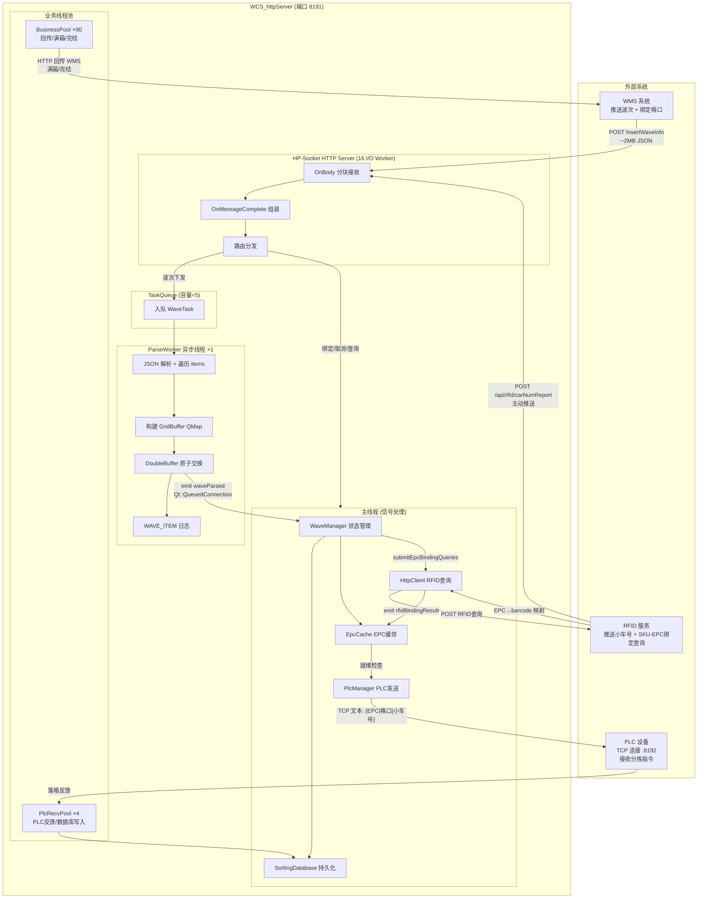

---

## 二、波次下发完整数据流 (10,000 items)

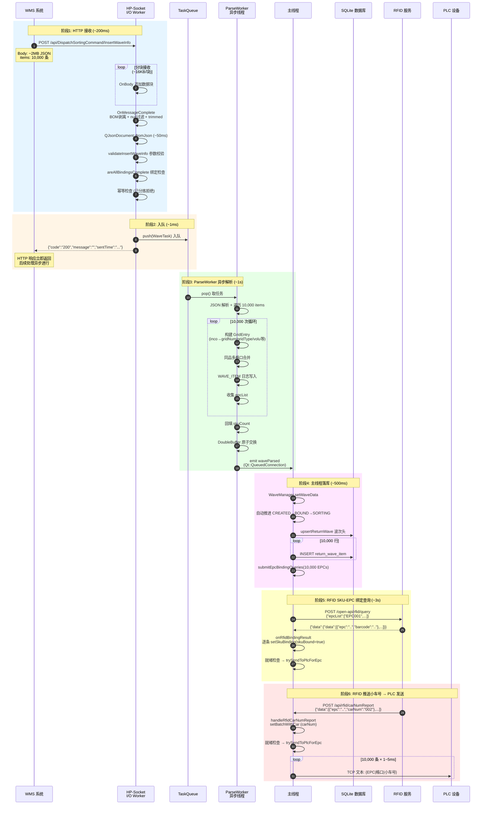

---

## 三、各阶段耗时分析

```mermaid
gantt
    title 10,000 Item 波次处理时间线 (总耗时 ~15~60s)
    dateFormat X
    axisFormat %s

    section ① HTTP 接收
    HP-Socket 分块接收 2MB body     :crit, a1, 0, 200
    JSON 解析 2MB                   :a2, after a1, 50
    参数校验 + 绑定检查              :a3, after a2, 5

    section ② 入队响应
    入队 + 返回 HTTP 200             :done, b1, after a3, 1

    section ③ ParseWorker 解析
    遍历 10,000 items 构建 GridEntry :c1, after b1, 100
    WAVE_ITEM 10,000条日志写入       :c2, after b1, 1000
    DoubleBuffer 原子交换            :c3, after c2, 1

    section ④ 主线程落库
    WaveManager 状态设置             :d1, after c3, 1
    upsertReturnWave 波次头          :d2, after d1, 10
    insertWaveItems 10,000行         :d3, after d2, 500

    section ⑤ RFID 查询
    HTTP 请求发送                    :e1, after d3, 50
    RFID 服务处理 10,000 EPCs        :e2, after e1, 3000
    onRfidBindingResult 逐条缓存     :e3, after e2, 100

    section ⑥ PLC 发送
    TCP 逐条发送 10,000条            :crit, f1, after e3, 10000
```

| 阶段 | 数据量 | 预估耗时 | 是否阻塞HTTP响应 | 瓶颈？ |
|------|--------|----------|:---:|--------|
| ① HTTP 接收 | 2MB body | ~200ms | 是 | ❌ 无 |
| ① JSON 解析 | 2MB JSON | ~50ms | 是 | ❌ 无 |
| ② 入队响应 | 1条 | ~1ms | 是 | ❌ 无 |
| ③ ParseWorker 遍历 | 10,000 条目 | ~100ms | 否 | ❌ 无 |
| ③ WAVE_ITEM 日志 | 10,000 条 | ~1s | 否 | ⚠️ 可优化 |
| ④ 数据库插入 | 10,000 行 | ~500ms | 否(主线程) | ⚠️ 可优化 |
| ⑤ RFID 查询 | 10,000 EPCs | ~3s | 否 | ⚠️ 依赖RFID |
| **⑥ PLC TCP 发送** | **10,000 条** | **~10~50s** | **否** | **🔴 最大瓶颈** |

---

## 四、ParseWorker 解析流程详解

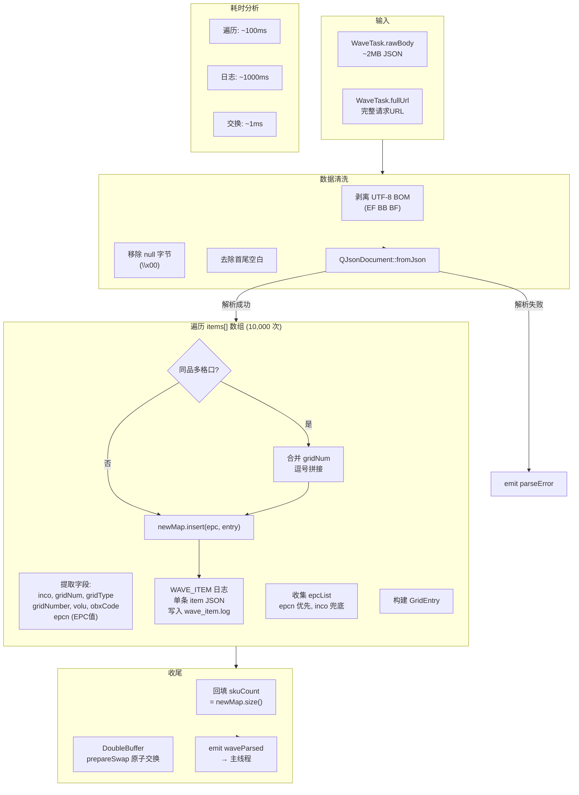

### 单条 item 处理详情

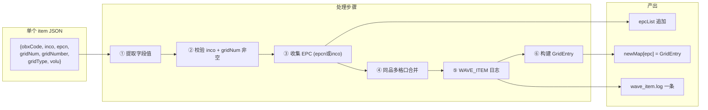

---

## 五、GridBuffer 双缓冲机制

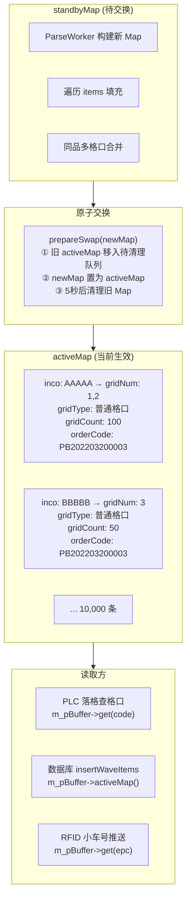

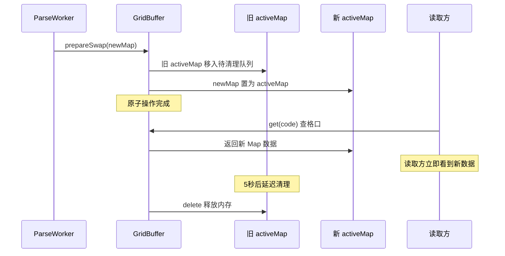

---

## 六、WAVE_ITEM 日志线程详解

```mermaid
flowchart TB
    subgraph Producer["ParseWorker 线程 (生产者)"]
        P1["遍历 items[]"]
        P2["构建单条 item JSON"]
        P3["WAVE_ITEM_INFO 宏"]
        P4["hlog_format 写入\n./log/WAVE_ITEM/wave_item.log"]
    end

    subgraph Format["日志格式"]
        F1["[时间] [TID-xxx] [WAVE_ITEM]"]
        F2["[原始报文]"]
        F3["http://192.168.3.53:8191/api/DispatchSortingCommand/InsertWaveInfo"]
        F4["body={orderCode,orderQty,items:[{...}]}(字节数)"]
    end

    subgraph Example["单条日志示例"]
        E1["[2026-08-11 10:30:01.234] [TID-35316] [WAVE_ITEM]"]
        E2["	[原始报文] http://192.168.3.53:8191/api/DispatchSortingCommand/InsertWaveInfo"]
        E3["	body={""orderCode"":""PB202203200003"",""orderQty"":12312,""items"":[{""obxCode"":""BOX202203200080"",""inco"":""WV34S1CN2001B60L"",""epcn"":""AC78A59C0C4010A22811029240003546"",""gridNum"":""1"",""gridNumber"":100,""gridType"":""普通格口"",""volu"":""1234""}]}(245字节)"]
    end

    Producer --> Format --> Example
```

### 日志写入性能分析

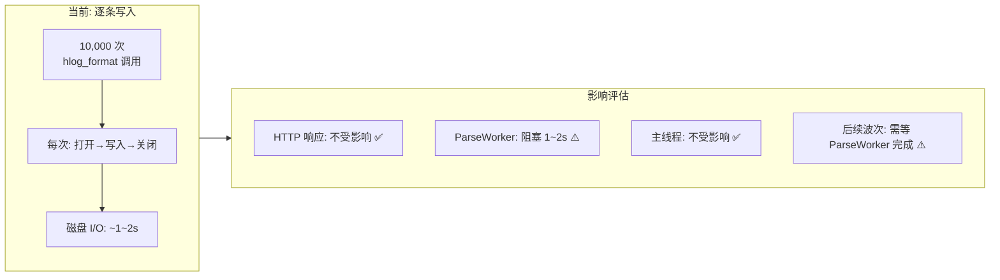

---

## 七、数据库写入流程

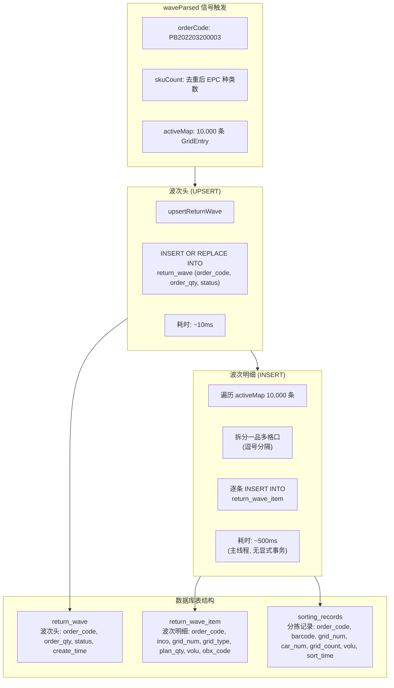

### 数据库写入性能

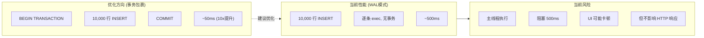

---

## 八、RFID 双通道数据流

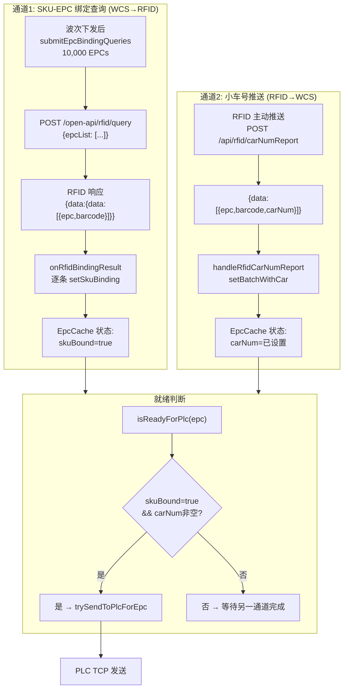

### EpcCache 两阶段就绪模型

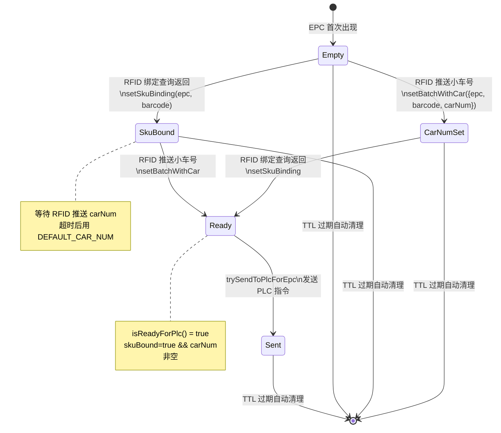

---

## 九、PLC TCP 发送流程

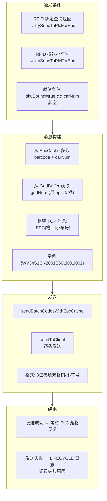

### PLC 发送耗时模型

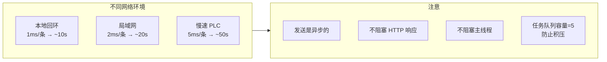

---

## 十、内存占用全景

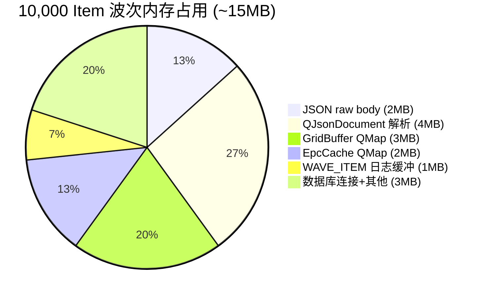

| 数据结构 | 单条目 | ×10,000 | 总计 |
|----------|--------|---------|------|
| Raw JSON body | - | - | ~2MB |
| QJsonDocument | - | - | ~4MB |
| GridBuffer (QMap) | ~300B | 10,000 | ~3MB |
| EpcCache | ~200B | 10,000 | ~2MB |
| 日志缓冲 | ~100B | 10,000 | ~1MB |
| **合计** | | | **~12MB** |

> 内存占用完全可控，远低于 16GB 物理内存。

---

## 十一、线程模型与并发安全

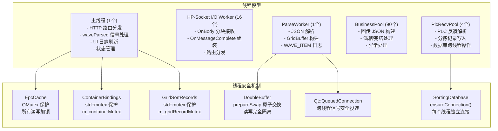

---

## 十二、HTTP 请求生命周期

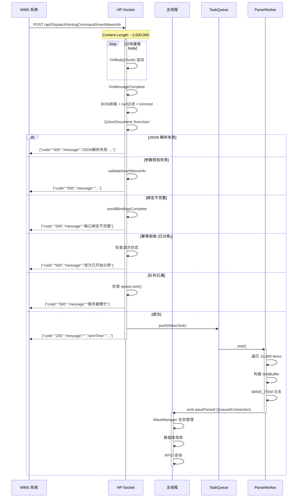

---

## 十三、综合评估

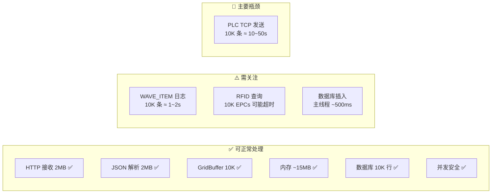

### 最终结论

| 维度 | 评估 | 说明 |
|------|:---:|------|
| 能否接收 | ✅ | HP-Socket 无 body 大小限制，2MB 完全可接收 |
| 能否解析 | ✅ | QJsonDocument 处理 2MB JSON < 50ms |
| 能否存储 | ✅ | GridBuffer 10K 条目，内存 ~3MB |
| 能否落库 | ✅ | SQLite WAL 模式，10K 行 ~500ms |
| 能否发送 PLC | ✅ | 逐条 TCP 发送，异步不阻塞 |
| HTTP 响应时间 | ✅ | < 300ms 立即返回，不等待后续处理 |
| 整体耗时 | ⚠️ | ~15~60 秒，取决于 PLC 网络速度和 RFID 响应 |
| 用户体验 | ⚠️ | HTTP 响应立即返回，但 PLC 发送需 10~50s |

### 系统可以处理 10,000 item 的波次报文

核心瓶颈在 PLC 逐条 TCP 发送（10~50 秒），但这是业务特性决定的：
- **不影响 HTTP 响应**：响应在入队后立即返回（~300ms），WMS 不会超时
- **不影响系统稳定性**：任务队列容量 5 防止内存溢出，双缓冲保证读写安全
- **不影响后续波次**：单次任务只有一条波次，无排队问题

### 优化建议优先级

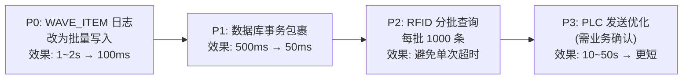