# WCS HTTP Server — 业务流程说明

> 版本：2.0 | 日期：2026-08-10 | 面向：业务评审 / 需求对照

---

## 目录

1. [系统角色与边界](#一系统角色与边界)
2. [业务流程总览](#二业务流程总览)
3. [启动前检查](#三启动前检查)
4. [波次任务下发与分拣执行](#四波次任务下发与分拣执行)
5. [落格反馈与满箱处理](#五落格反馈与满箱处理)
6. [波次完成回传](#六波次完成回传)
7. [任务取消](#七任务取消)
8. [数据落库与查询](#八数据落库与查询)
9. [RFID 双向通信](#九rfid-双向通信)
10. [PLC 分拣指令发送时机](#十plc-分拣指令发送时机)
11. [响应格式统一](#十一响应格式统一)
12. [波次明细日志](#十二波次明细日志)
13. [完整业务流程](#十三完整业务流程)
14. [待确认事项](#十四待确认事项)

---

## 一、系统角色与边界

本系统（WCS HTTP Server）作为 **WMS** 与现场设备（**RFID / PLC**）之间的中间件，完成波次接收、分拣指令下发、落格确认及结果回传。

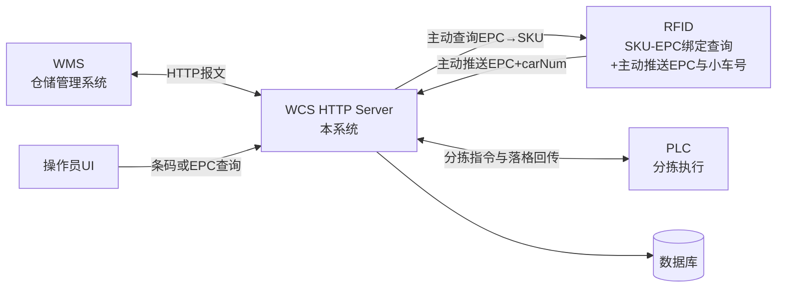

| 角色 | 职责 |
|------|------|
| **WMS** | 下发容器绑定（BindingLatticePort）；下发波次（InsertWaveInfo）；接收满箱/波次完成回传；可发起取消任务 |
| **WCS HTTP Server** | 启动检查、报文转发、状态判断、数据落库、结果回传；主动向 RFID 查询 SKU-EPC 绑定 |
| **RFID** | 接收 WCS 查询请求返回 EPC→SKU 绑定；主动推送 EPC→barcode+carNum 映射到 WCS |
| **PLC** | 执行分拣落格；回传落格结果；满箱锁格与容器切换 |
| **操作员 / UI** | 点击开始运行；按条码（或 EPC）查询物件 |
| **数据库** | 持久化分拣落格等业务数据 |

---

## 二、业务流程总览

从「人工开始运行」到「波次完成回传」的主路径如下。任务执行期间，WCS 可并行接收 WMS 的取消请求（见 [第七节](#七任务取消)）。

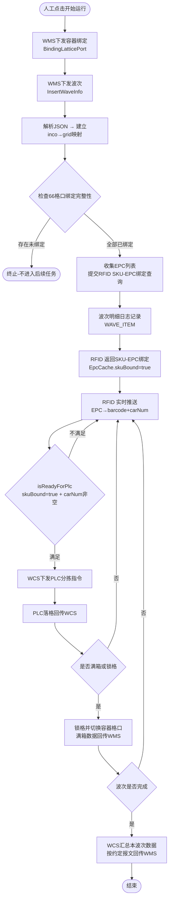

**主路径要点：**

1. WMS 先下发容器绑定（BindingLatticePort），再下发波次（InsertWaveInfo）。
2. 波次下发后，WCS 解析 JSON 建立 inco→grid 映射，检查 66 格口绑定完整性。
3. 检查通过后，收集 EPC 列表，主动向 RFID 查询 SKU-EPC 绑定（POST /open-api/rfid/query）。
4. RFID 返回绑定后 EpcCache.skuBound=true，同时 RFID 独立推送小车号到 EpcCache。
5. 当 skuBound=true 且 carNum 非空时，isReadyForPlc=true，发送 PLC 分拣指令。
6. 无 EPC 的条码直接使用 DEFAULT_CAR_NUM（001）兜底小车号。
7. 落格后由 PLC 回传；满箱则锁格、换容，并及时回传 WMS。
8. 整波次结束后，按约定格式一次性汇总回传 WMS。

---

## 三、启动前检查

人工点击「开始运行」后，WCS 首先校验 **容器–格口绑定**（共 **66** 个格口）。

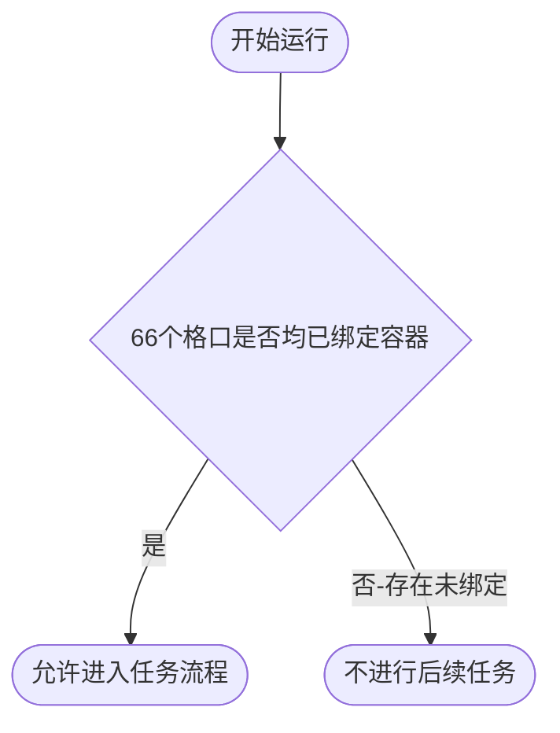

| 检查项 | 规则 | 不通过时 |
|--------|------|----------|
| 容器格口绑定 | 66 个格口均须完成绑定 | 终止，不进入后续任务 |

---

## 四、波次任务下发与分拣执行

### 4.1 波次下发流程

WMS 通过 `InsertWaveInfo` 接口下发波次，WCS 内部处理流程如下：

```
① 解析 JSON → 建立 inco→grid 映射
② 检查 66 格口绑定完整性
③ 收集 EPC 列表 → 提交 RFID SKU-EPC 绑定查询
④ 波次明细日志记录（WAVE_ITEM 模块）
```

- 步骤③ 和步骤④ 在波次处理中同步完成。
- 任何一步失败，均返回统一错误响应（见 [第十一节](#十一响应格式统一)）。

### 4.2 时序：WMS → WCS → RFID → PLC

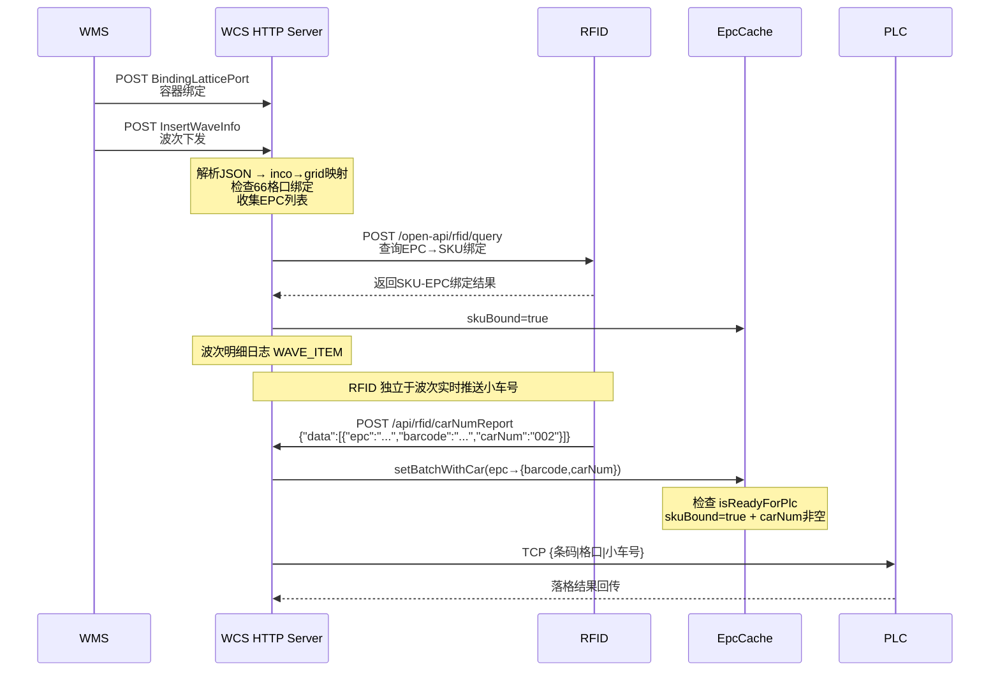

### 4.3 小车号获取策略

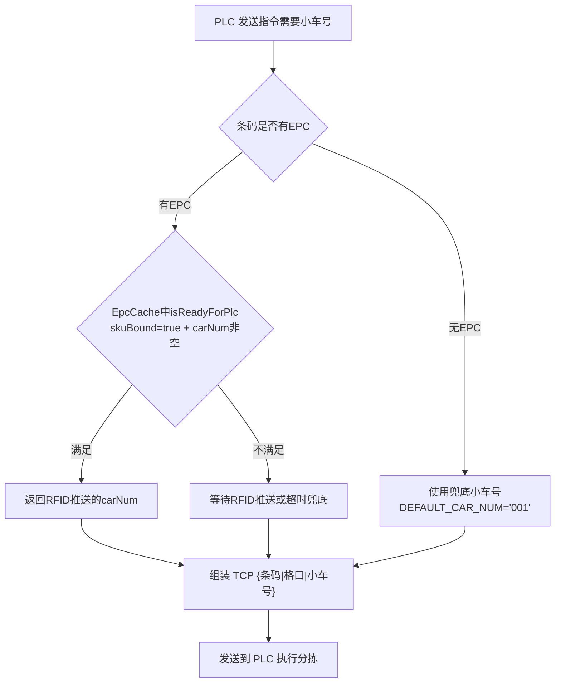

### 4.4 单件分拣数据流

| 步骤 | 说明 |
|------|------|
| ① | WMS 向 WCS 下发容器绑定（BindingLatticePort） |
| ② | WMS 向 WCS 下发波次（InsertWaveInfo），WCS 解析 JSON 建立 inco→grid 映射 |
| ③ | WCS 检查 66 格口绑定完整性，收集 EPC 列表 |
| ④ | WCS 主动向 RFID 查询 SKU-EPC 绑定（POST /open-api/rfid/query），完成后 skuBound=true |
| ⑤ | WCS 记录波次明细日志（WAVE_ITEM 模块，每个 items[] 子项单独记录） |
| ⑥ | RFID 主动推送 EPC→barcode+carNum 到 `/api/rfid/carNumReport`，WCS 存入 EpcCache |
| ⑦ | 当 skuBound=true 且 carNum 非空时，isReadyForPlc=true，发送 PLC 分拣指令 |
| ⑧ | 无 EPC 的条码，使用 `DEFAULT_CAR_NUM`（001）兜底小车号 |
| ⑨ | WCS 组装 PLC 指令（含小车号），下发 PLC 执行分拣 |
| ⑩ | PLC 按指令执行分拣落格，并将结果回传 WCS |

---

## 五、落格反馈与满箱处理

PLC 每次分拣落格后，将信息回传 WCS。满箱、人工锁格与容器切换逻辑如下。

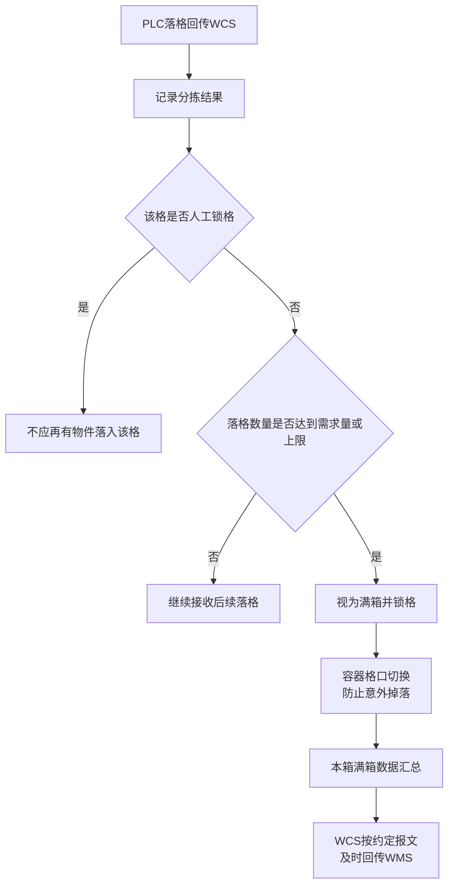

| 场景 | 行为 |
|------|------|
| **人工锁格** | 该格口不再接收掉落物件 |
| **数量达需求或上限** | 视为满箱；执行锁格 |
| **满箱后** | 切换容器–格口绑定，避免物件意外落入原格；将本箱数据按约定格式及时回传 WMS |

---

## 六、波次完成回传

单个满箱可即时回传；整波次结束后，由 WCS 再做一次汇总回传。

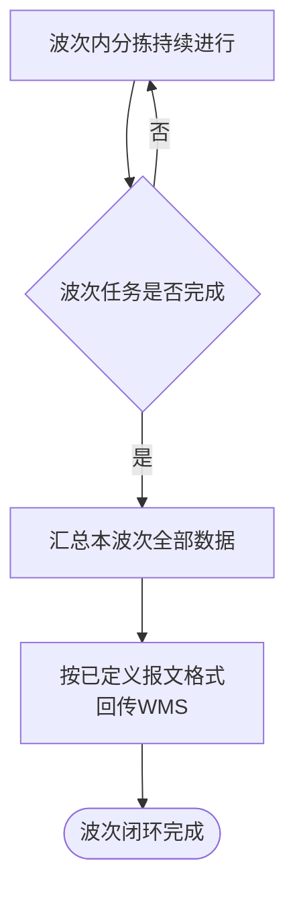

| 回传时机 | 内容 | 方向 |
|----------|------|------|
| 满箱时 | 该次满箱相关数据 | WCS → WMS（及时） |
| 波次完成时 | 本波次全部数据 | WCS → WMS（按约定报文） |

---

## 七、任务取消

任务处理期间，WCS **随时可接收** WMS 的取消请求；是否允许取消取决于是否已开始分拣。

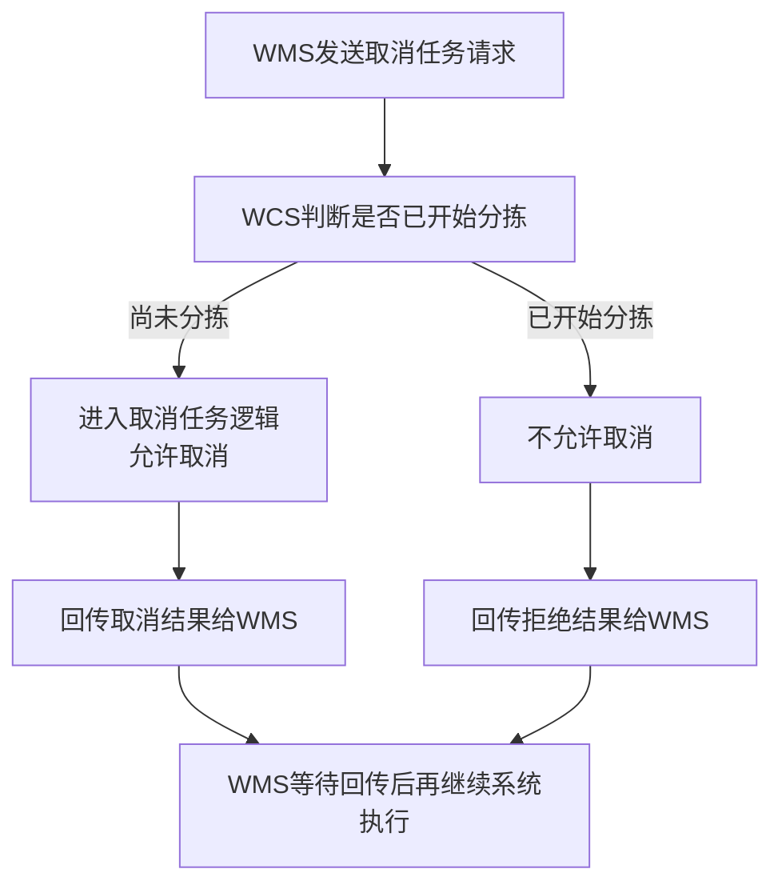

| 条件 | 结果 |
|------|------|
| 尚未开始分拣 | 允许取消，走取消逻辑 |
| 已开始分拣 | **不允许**取消 |
| WMS 侧 | 须等待 WCS 回传结果后，再进行后续系统执行 |

---

## 八、数据落库与查询

### 8.1 持久化

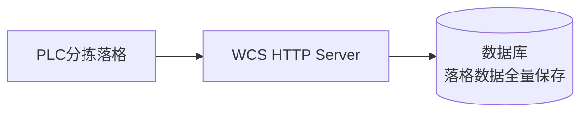

- PLC 分拣落格后的数据，**应全部写入数据库**，供追溯、对账与查询使用。

### 8.2 操作员查询

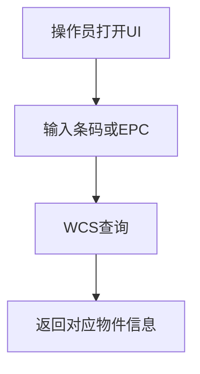

| 能力 | 说明 |
|------|------|
| 查询入口 | 用户可随时通过 UI 查询 |
| 查询键 | 条码（也可能是 EPC，客户待定） |
| 查询结果 | 对应物件信息 |

---

## 九、RFID 双向通信

WCS 与 RFID 之间存在两条独立的数据通道，互不阻塞：

### 9.1 SKU-EPC 绑定查询（WCS → RFID）

| 项目 | 说明 |
|------|------|
| **方向** | WCS → RFID |
| **接口** | POST /open-api/rfid/query |
| **触发时机** | WMS 波次下发后，WCS 收集 EPC 列表后主动发起 |
| **目的** | 查询 EPC 对应的 SKU 绑定信息 |
| **结果** | EpcCache.skuBound = true |

### 9.2 小车号推送（RFID → WCS）

| 项目 | 说明 |
|------|------|
| **方向** | RFID → WCS |
| **接口** | POST /api/rfid/carNumReport |
| **触发时机** | RFID 实时主动推送，独立于波次处理 |
| **目的** | 推送 EPC→barcode+carNum 映射 |
| **结果** | EpcCache 写入 carNum |

### 9.3 独立性说明

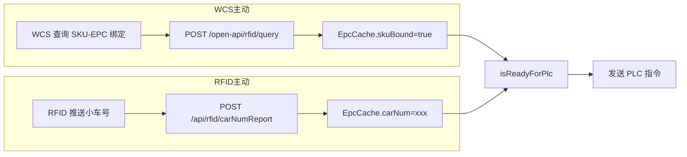

- 两条通道**完全独立运作**，互不阻塞。
- SKU-EPC 绑定查询在波次下发时同步发起，小车号推送由 RFID 实时异步推送。
- 仅当**两者都就绪**（skuBound=true 且 carNum 非空）时，才触发 PLC 指令发送。

---

## 十、PLC 分拣指令发送时机

### 10.1 有 EPC 的条码

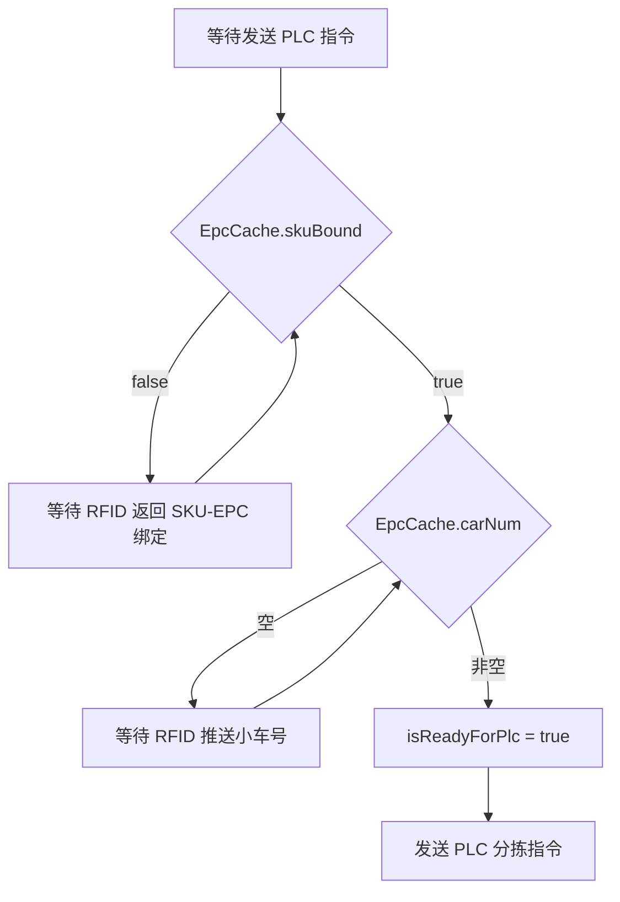

### 10.2 无 EPC 的条码

| 条件 | 行为 |
|------|------|
| 条码无 EPC | 跳过 SKU-EPC 绑定检查和小车号等待 |
| 小车号 | 使用 `DEFAULT_CAR_NUM`（001）兜底 |
| 发送时机 | 波次处理后直接发送 PLC 指令 |

### 10.3 发送条件汇总

| 条码类型 | 发送条件 |
|----------|----------|
| **有 EPC** | skuBound=true **且** carNum 非空 → 发送 PLC 指令 |
| **无 EPC** | 直接使用 DEFAULT_CAR_NUM=001 兜底 → 发送 PLC 指令 |

---

## 十一、响应格式统一

所有 HTTP 接口统一使用以下响应格式：

### 成功响应

```json
{
    "code": "200",
    "message": "操作成功描述"
}
```

### 失败响应

```json
{
    "code": "500",
    "message": "错误描述"
}
```

| 字段 | 说明 |
|------|------|
| `code` | `"200"` 表示成功，`"500"` 表示失败 |
| `message` | 成功时描述操作结果；失败时描述具体错误原因 |

---

## 十二、波次明细日志

### 12.1 日志模块

| 项目 | 说明 |
|------|------|
| **模块名** | WAVE_ITEM |
| **日志路径** | `./log/WAVE_ITEM/wave_item.log` |
| **记录时机** | 波次下发（InsertWaveInfo）处理过程中 |
| **记录内容** | 波次报文中 `items[]` 的每个子项，单独记录完整报文 |

### 12.2 记录方式

```
① WMS 下发 InsertWaveInfo 波次报文
② WCS 解析 JSON，提取 items[] 数组
③ 遍历 items[] 每个子项，以完整报文形式写入 wave_item.log
④ 每个子项记录为一条独立日志，便于追溯
```

---

## 十三、完整业务流程

以下为当前实现的完整业务流程：

```
1. WMS 下发容器绑定 → BindingLatticePort
2. WMS 下发波次 → InsertWaveInfo
   ├─ 解析 JSON → 建立 inco→grid 映射
   ├─ 检查 66 格口绑定完整性
   ├─ 收集 EPC 列表 → 提交 RFID SKU-EPC 绑定查询
   └─ 波次明细日志记录（WAVE_ITEM）
3. RFID 返回 SKU-EPC 绑定 → EpcCache.skuBound=true
4. RFID 推送小车号 → EpcCache.carNum=xxx → isReadyForPlc=true → 发送 PLC 指令
5. PLC 分拣 → 落格反馈 → 记录分拣结果
6. PLC 锁格 → 满箱回传 WMS
7. 波次完成 → 完结回传 WMS
```

### 流程要点

| 步骤 | 关键动作 | 关键状态 |
|------|----------|----------|
| 1 | WMS 下发容器绑定 | BindingLatticePort 完成 |
| 2 | WMS 下发波次 | inco→grid 映射建立；EPC 列表提交 RFID 查询；WAVE_ITEM 日志落盘 |
| 3 | RFID 返回绑定 | EpcCache.skuBound = true |
| 4 | RFID 推送小车号 | EpcCache.carNum 非空 → isReadyForPlc = true |
| 5 | PLC 分拣执行 | 落格反馈 → 分拣结果落库 |
| 6 | 满箱锁格 | 锁格 + 换容 + 回传 WMS |
| 7 | 波次完成 | 汇总回传 WMS，波次闭环 |

---

## 十四、待确认事项

以下项来自业务描述中的客户待定点，评审时需单独拍板：

| 编号 | 事项 | 现状 |
|------|------|------|
| 1 | 下发 PLC 的标识：EPC 编码 vs 条码 | 客户不明确，目前待定 |
| 2 | UI 查询键：条码 vs EPC | 客户不确定，目前待定 |

---

## 附录：流程与角色对照简表

| 序号 | 业务环节 | 主要参与方 | 关键结果 |
|------|----------|------------|----------|
| 1 | 容器绑定 | WMS → WCS | BindingLatticePort 完成 |
| 2 | 波次下发 | WMS → WCS | 解析 JSON → inco→grid 映射；检查 66 格口绑定；收集 EPC 列表 |
| 3 | SKU-EPC 绑定查询 | WCS → RFID | EpcCache.skuBound = true |
| 4 | EPC 小车号推送 | RFID → WCS | RFID 主动推送 EPC→barcode+carNum，存入 EpcCache |
| 5 | 波次明细日志 | WCS | WAVE_ITEM 模块，每个 items[] 子项单独记录 |
| 6 | PLC 分拣指令发送 | WCS → PLC | skuBound=true + carNum 非空 → isReadyForPlc=true |
| 7 | 分拣执行 | PLC | 落格回传，记录分拣结果 |
| 8 | 满箱锁格换容 | PLC → WCS → WMS | 满箱数据及时回传 |
| 9 | 波次完成汇总回传 | WCS → WMS | 波次闭环 |
| 10 | 取消任务 | WMS ↔ WCS | 已分拣则拒绝 |
| 11 | 落库 | WCS → DB | 落格数据全量保存 |
| 12 | UI 查询 | 操作员 → WCS | 按条码/EPC 查物件 |