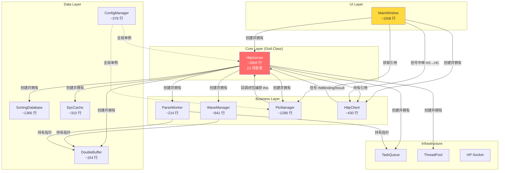
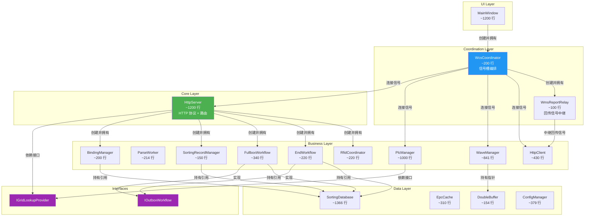

# WCS_httpServer 代码架构审查报告 -- 高内聚低耦合分析

> 审查日期：2026-08-12
> 分析方法：基于实际代码的静态分析，逐文件读取头文件与实现文件，精确记录每个类的职责和调用关系。

---

## 一、核心类职责与代码规模总览

| 类名                  | 文件                                                                                                                                                                                          | 头文件行数 | 实现文件行数   | 总行数   | 职责数量   |
| ------------------- | ------------------------------------------------------------------------------------------------------------------------------------------------------------------------------------------- |:-----:|:--------:|:-----:|:------:|
| **HttpServer**      | [HttpServer.h](file:///d:/WCS/WCSApp/WCS_httpServer/WCS_httpServer/HttpServer.h) / [HttpServer.cpp](file:///d:/WCS/WCSApp/WCS_httpServer/WCS_httpServer/HttpServer.cpp)                     | 237   | ~2569    | ~2806 | **23** |
| **PlcManager**      | [PlcManager.h](file:///d:/WCS/WCSApp/WCS_httpServer/WCS_httpServer/PlcManager.h) / [PlcManager.cpp](file:///d:/WCS/WCSApp/WCS_httpServer/WCS_httpServer/PlcManager.cpp)                     | 304   | ~994     | ~1298 | **9**  |
| **SortingDatabase** | [SortingDatabase.h](file:///d:/WCS/WCSApp/WCS_httpServer/WCS_httpServer/SortingDatabase.h) / [SortingDatabase.cpp](file:///d:/WCS/WCSApp/WCS_httpServer/WCS_httpServer/SortingDatabase.cpp) | 239   | ~1127    | ~1366 | **8**  |
| **MainWindow**      | [MainWindow.h](file:///d:/WCS/WCSApp/WCS_httpServer/WCS_httpServer/MainWindow.h) / [MainWindow.cpp](file:///d:/WCS/WCSApp/WCS_httpServer/WCS_httpServer/MainWindow.cpp)                     | 154   | ~1354    | ~1508 | **6**  |
| **WaveManager**     | [WaveManager.h](file:///d:/WCS/WCSApp/WCS_httpServer/WCS_httpServer/WaveManager.h) / [WaveManager.cpp](file:///d:/WCS/WCSApp/WCS_httpServer/WCS_httpServer/WaveManager.cpp)                 | 233   | ~608     | ~841  | **6**  |
| **HttpClient**      | [HttpClient.h](file:///d:/WCS/WCSApp/WCS_httpServer/WCS_httpServer/HttpClient.h) / [HttpClient.cpp](file:///d:/WCS/WCSApp/WCS_httpServer/WCS_httpServer/HttpClient.cpp)                     | 86    | ~344     | ~430  | **3**  |
| **ConfigManager**   | [ConfigManager.h](file:///d:/WCS/WCSApp/WCS_httpServer/WCS_httpServer/ConfigManager.h) / [ConfigManager.cpp](file:///d:/WCS/WCSApp/WCS_httpServer/WCS_httpServer/ConfigManager.cpp)         | 115   | ~264     | ~379  | **2**  |
| **EpcCache**        | [EpcCache.h](file:///d:/WCS/WCSApp/WCS_httpServer/WCS_httpServer/EpcCache.h)                                                                                                                | 310   | 0（头文件实现） | ~310  | **2**  |
| **DoubleBuffer**    | [DoubleBuffer.h](file:///d:/WCS/WCSApp/WCS_httpServer/WCS_httpServer/DoubleBuffer.h)                                                                                                        | 154   | 0（模板头文件） | ~154  | **1**  |
| **ParseWorker**     | [ParseWorker.h](file:///d:/WCS/WCSApp/WCS_httpServer/WCS_httpServer/ParseWorker.h) / [ParseWorker.cpp](file:///d:/WCS/WCSApp/WCS_httpServer/WCS_httpServer/ParseWorker.cpp)                 | 44    | ~170     | ~214  | **1**  |

---

## 二、各类职责详细分析

### 2.1 HttpServer（God Class，严重超标）

**代码位置**：[HttpServer.h:L56-L237](file:///d:/WCS/WCSApp/WCS_httpServer/WCS_httpServer/HttpServer.h#L56-L237) / [HttpServer.cpp:L1-L2569](file:///d:/WCS/WCSApp/WCS_httpServer/WCS_httpServer/HttpServer.cpp#L1-L2569)

**识别到的 23 项职责：**

| #   | 职责                                                                                    | 代码位置                                                                                                                                                                                                            | 是否应交由独立类      |
|:---:| ------------------------------------------------------------------------------------- | --------------------------------------------------------------------------------------------------------------------------------------------------------------------------------------------------------------- |:-------------:|
| 1   | HTTP 服务器生命周期管理（start/stop）                                                            | [HttpServer.cpp:L593-L651](file:///d:/WCS/WCSApp/WCS_httpServer/WCS_httpServer/HttpServer.cpp#L593-L651)                                                                                                        | 是（保留）         |
| 2   | HP-Socket 回调处理（OnRequestLine/OnBody/OnMessageComplete/OnHeadersComplete/OnParseError） | [HttpServer.cpp:L657-L732](file:///d:/WCS/WCSApp/WCS_httpServer/WCS_httpServer/HttpServer.cpp#L657-L732)                                                                                                        | 是（保留）         |
| 3   | TCP 连接回调（OnAccept/OnClose）                                                            | [HttpServer.cpp:L734-L799](file:///d:/WCS/WCSApp/WCS_httpServer/WCS_httpServer/HttpServer.cpp#L734-L799)                                                                                                        | 是（保留）         |
| 4   | **HTTP 请求路由分发**（4 条路由的 if-else 分发）                                                    | [HttpServer.cpp:L805-L1085](file:///d:/WCS/WCSApp/WCS_httpServer/WCS_httpServer/HttpServer.cpp#L805-L1085)                                                                                                      | 是（保留）         |
| 5   | **波次下发完整流程**（JSON解析、校验、入队、绑定检查、幂等检查）                                                  | [HttpServer.cpp:L851-L1017](file:///d:/WCS/WCSApp/WCS_httpServer/WCS_httpServer/HttpServer.cpp#L851-L1017)                                                                                                      | **应拆分**       |
| 6   | **容器绑定管理**（格口-容器映射、线程安全读写、绑定完整性校验）                                                    | [HttpServer.h:L82-L107](file:///d:/WCS/WCSApp/WCS_httpServer/WCS_httpServer/HttpServer.h#L82-L107)、[HttpServer.cpp:L1128-L1266](file:///d:/WCS/WCSApp/WCS_httpServer/WCS_httpServer/HttpServer.cpp#L1128-L1266) | **应拆分**       |
| 7   | **格口分拣记录管理**（GridSortRecord 的增删查）                                                     | [HttpServer.h:L231-L232](file:///d:/WCS/WCSApp/WCS_httpServer/WCS_httpServer/HttpServer.h#L231-L232)                                                                                                            | **应拆分**       |
| 8   | **格口分拣计数管理**（T-S7-06 上限检查）                                                            | [HttpServer.h:L235-L236](file:///d:/WCS/WCSApp/WCS_httpServer/WCS_httpServer/HttpServer.h#L235-L236)                                                                                                            | **应拆分**       |
| 9   | **PLC 反馈业务处理**（分拣标记、EPC 防重、冲突检测、异常处理、DB 写入）                                           | [HttpServer.cpp:L223-L481](file:///d:/WCS/WCSApp/WCS_httpServer/WCS_httpServer/HttpServer.cpp#L223-L481)                                                                                                        | **应拆分**       |
| 10  | **锁格回传 WMS**（构建 33.md 报文、发送）                                                          | [HttpServer.cpp:L1561-L1644](file:///d:/WCS/WCSApp/WCS_httpServer/WCS_httpServer/HttpServer.cpp#L1561-L1644)                                                                                                    | **应拆分**       |
| 11  | **波次完成回传**（构建回传 JSON、异步入池）                                                            | [HttpServer.cpp:L1646-L1702](file:///d:/WCS/WCSApp/WCS_httpServer/WCS_httpServer/HttpServer.cpp#L1646-L1702)                                                                                                    | **应拆分**       |
| 12  | **满箱回传 H7 完整流程**（触发、构建报文、Outbox 入队、发送、结果处理、重试调度）                                      | [HttpServer.cpp:L1704-L2041](file:///d:/WCS/WCSApp/WCS_httpServer/WCS_httpServer/HttpServer.cpp#L1704-L2041)                                                                                                    | **应拆分**       |
| 13  | **完结回传 H8 完整流程**（触发、构建报文、Outbox 入队、发送、结果处理、重试调度）                                      | [HttpServer.cpp:L2043-L2264](file:///d:/WCS/WCSApp/WCS_httpServer/WCS_httpServer/HttpServer.cpp#L2043-L2264)                                                                                                    | **应拆分**       |
| 14  | **波次取消流程**（校验、状态迁移、清理数据）                                                              | [HttpServer.cpp:L1280-L1400](file:///d:/WCS/WCSApp/WCS_httpServer/WCS_httpServer/HttpServer.cpp#L1280-L1400)                                                                                                    | **应拆分**       |
| 15  | **波次对账**（计划/实分/满箱/异常综合分析）                                                             | [HttpServer.cpp:L2267-L2351](file:///d:/WCS/WCSApp/WCS_httpServer/WCS_httpServer/HttpServer.cpp#L2267-L2351)                                                                                                    | **应拆分**       |
| 16  | **RFID 小车号推送处理**（解析、存入 EpcCache、触发 PLC 发送）                                            | [HttpServer.cpp:L2354-L2416](file:///d:/WCS/WCSApp/WCS_httpServer/WCS_httpServer/HttpServer.cpp#L2354-L2416)                                                                                                    | **应拆分**       |
| 17  | **EPC 绑定查询**（提交查询、结果回调、逐条就绪检查）                                                        | [HttpServer.cpp:L2432-L2515](file:///d:/WCS/WCSApp/WCS_httpServer/WCS_httpServer/HttpServer.cpp#L2432-L2515)                                                                                                    | **应拆分**       |
| 18  | **EPC 就绪发送 PLC**（trySendToPlcForEpc）                                                  | [HttpServer.cpp:L2523-L2569](file:///d:/WCS/WCSApp/WCS_httpServer/WCS_httpServer/HttpServer.cpp#L2523-L2569)                                                                                                    | **应拆分**       |
| 19  | **健康检查**（连接统计、线程池监控、阻塞检测）                                                             | [HttpServer.cpp:L1517-L1555](file:///d:/WCS/WCSApp/WCS_httpServer/WCS_httpServer/HttpServer.cpp#L1517-L1555)                                                                                                    | 可保留或拆分        |
| 20  | **线程池管理**（m_pBusinessPool、m_pPlcRecvPool 的创建和销毁）                                      | [HttpServer.cpp:L77-L91](file:///d:/WCS/WCSApp/WCS_httpServer/WCS_httpServer/HttpServer.cpp#L77-L91)                                                                                                            | 可保留           |
| 21  | **信号槽连接编排**（构造函数中大量 connect）                                                          | [HttpServer.cpp:L96-L561](file:///d:/WCS/WCSApp/WCS_httpServer/WCS_httpServer/HttpServer.cpp#L96-L561)                                                                                                          | 可保留（Mediator） |
| 22  | **API 路由配置**（4 条路由的 setter/getter）                                                    | [HttpServer.h:L75-L78](file:///d:/WCS/WCSApp/WCS_httpServer/WCS_httpServer/HttpServer.h#L75-L78)                                                                                                                | 可保留           |
| 23  | **JSON 响应构建**（sendJsonResponse/okResponse/errResponse）                                | [HttpServer.cpp:L1092-L1120](file:///d:/WCS/WCSApp/WCS_httpServer/WCS_httpServer/HttpServer.cpp#L1092-L1120)                                                                                                    | 可保留           |

**结论：HttpServer 是典型的 God Class，承担了 23 项职责，远超单一职责原则（SRP）的合理范围（建议 3~5 项）。**

---

### 2.2 PlcManager

**代码位置**：[PlcManager.h:L148-L304](file:///d:/WCS/WCSApp/WCS_httpServer/WCS_httpServer/PlcManager.h#L148-L304) / [PlcManager.cpp:L1-L994](file:///d:/WCS/WCSApp/WCS_httpServer/WCS_httpServer/PlcManager.cpp#L1-L994)

| #   | 职责                                                             | 代码位置                                                                                                     |
|:---:| -------------------------------------------------------------- | -------------------------------------------------------------------------------------------------------- |
| 1   | TCP 服务器监听（HP-Socket CTcpServerListener）                        | [PlcManager.cpp:L62-L128](file:///d:/WCS/WCSApp/WCS_httpServer/WCS_httpServer/PlcManager.cpp#L62-L128)   |
| 2   | S7 PLC 连接管理（connectS7/disconnectS7/isS7Connected）              | [PlcManager.cpp:L501-L568](file:///d:/WCS/WCSApp/WCS_httpServer/WCS_httpServer/PlcManager.cpp#L501-L568) |
| 3   | S7 心跳线程（每 2 秒检测，断线重连）                                          | [PlcManager.cpp:L665-L694](file:///d:/WCS/WCSApp/WCS_httpServer/WCS_httpServer/PlcManager.cpp#L665-L694) |
| 4   | S7 锁格状态轮询（DB77 边沿检测）                                           | [PlcManager.cpp:L576-L659](file:///d:/WCS/WCSApp/WCS_httpServer/WCS_httpServer/PlcManager.cpp#L576-L659) |
| 5   | TCP 协议解析（落格反馈、锁格/解锁消息、批次信号）                                    | [PlcManager.cpp:L824-L971](file:///d:/WCS/WCSApp/WCS_httpServer/WCS_httpServer/PlcManager.cpp#L824-L971) |
| 6   | 批量发送指令（sendCodeInfo/sendBatchCodes/sendBatchCodesWithEpcCache） | [PlcManager.cpp:L140-L432](file:///d:/WCS/WCSApp/WCS_httpServer/WCS_httpServer/PlcManager.cpp#L140-L432) |
| 7   | 统计数据收集（PlcStats 快照）                                            | [PlcManager.cpp:L444-L495](file:///d:/WCS/WCSApp/WCS_httpServer/WCS_httpServer/PlcManager.cpp#L444-L495) |
| 8   | 批量反馈机制（100ms 定时刷新）                                             | [PlcManager.cpp:L978-L993](file:///d:/WCS/WCSApp/WCS_httpServer/WCS_httpServer/PlcManager.cpp#L978-L993) |
| 9   | 回调注册（lookup/feedback/carNum）                                   | [PlcManager.h:L177-L181](file:///d:/WCS/WCSApp/WCS_httpServer/WCS_httpServer/PlcManager.h#L177-L181)     |

**评估：职责较多但可接受。TCP 和 S7 是两种不同的通信协议，可考虑拆分。回调机制（m_lookupCb/m_carNumCb）引入了对 EpcCache 和 DoubleBuffer 的隐式依赖。**

---

### 2.3 WaveManager

**代码位置**：[WaveManager.h:L117-L233](file:///d:/WCS/WCSApp/WCS_httpServer/WCS_httpServer/WaveManager.h#L117-L233) / [WaveManager.cpp:L1-L608](file:///d:/WCS/WCSApp/WCS_httpServer/WCS_httpServer/WaveManager.cpp#L1-L608)

| #   | 职责                                                          | 代码位置                                                                                                       |
|:---:| ----------------------------------------------------------- | ---------------------------------------------------------------------------------------------------------- |
| 1   | 波次数据设置（setWaveData/setRecvSet）                              | [WaveManager.cpp:L10-L35](file:///d:/WCS/WCSApp/WCS_httpServer/WCS_httpServer/WaveManager.cpp#L10-L35)     |
| 2   | 分拣状态跟踪（markSorted/markException/isSorted/isException）       | [WaveManager.cpp:L37-L155](file:///d:/WCS/WCSApp/WCS_httpServer/WCS_httpServer/WaveManager.cpp#L37-L155)   |
| 3   | 波次完成判定（isWaveComplete/checkWaveCompleteLocked）              | [WaveManager.cpp:L157-L178](file:///d:/WCS/WCSApp/WCS_httpServer/WCS_httpServer/WaveManager.cpp#L157-L178) |
| 4   | 状态机管理（setState/startSorting/triggerFullbox/resumeSorting 等） | [WaveManager.cpp:L212-L508](file:///d:/WCS/WCSApp/WCS_httpServer/WCS_httpServer/WaveManager.cpp#L212-L508) |
| 5   | 波次对账（reconcile）                                             | [WaveManager.cpp:L516-L561](file:///d:/WCS/WCSApp/WCS_httpServer/WCS_httpServer/WaveManager.cpp#L516-L561) |
| 6   | 波次取消（tryCancelWave，含互斥锁）                                    | [WaveManager.cpp:L568-L608](file:///d:/WCS/WCSApp/WCS_httpServer/WCS_httpServer/WaveManager.cpp#L568-L608) |

**评估：职责相对聚合，设计较好。状态机逻辑清晰，线程安全处理到位。但 WaveManager 持有 GridBuffer 指针（m_pBuffer），通过委托查询格口信息，这个设计合理。**

---

### 2.4 ParseWorker

**代码位置**：[ParseWorker.h:L16-L44](file:///d:/WCS/WCSApp/WCS_httpServer/WCS_httpServer/ParseWorker.h#L16-L44) / [ParseWorker.cpp:L1-L170](file:///d:/WCS/WCSApp/WCS_httpServer/WCS_httpServer/ParseWorker.cpp#L1-L170)

| #   | 职责                                                                     |
|:---:| ---------------------------------------------------------------------- |
| 1   | 从 TaskQueue 阻塞取任务 → 解析 WMS JSON → 构建 GridEntry 映射 → 原子交换到 DoubleBuffer |

**评估：职责单一，设计优秀。低优先级线程运行，不抢占 CPU。信号 waveParsed 将解析结果传递给上层。**

---

### 2.5 HttpClient

**代码位置**：[HttpClient.h:L20-L86](file:///d:/WCS/WCSApp/WCS_httpServer/WCS_httpServer/HttpClient.h#L20-L86) / [HttpClient.cpp:L1-L344](file:///d:/WCS/WCSApp/WCS_httpServer/WCS_httpServer/HttpClient.cpp#L1-L344)

| #   | 职责                                              | 代码位置                                                                                                     |
|:---:| ----------------------------------------------- | -------------------------------------------------------------------------------------------------------- |
| 1   | WMS 回传（sendWaveComplete/sendGenericFeedback，异步） | [HttpClient.cpp:L34-L186](file:///d:/WCS/WCSApp/WCS_httpServer/WCS_httpServer/HttpClient.cpp#L34-L186)   |
| 2   | RFID 绑定查询（queryRfidBinding，异步）                  | [HttpClient.cpp:L192-L251](file:///d:/WCS/WCSApp/WCS_httpServer/WCS_httpServer/HttpClient.cpp#L192-L251) |
| 3   | 超时保护与请求追踪（PendingRequest 映射）                    | [HttpClient.cpp:L88-L148](file:///d:/WCS/WCSApp/WCS_httpServer/WCS_httpServer/HttpClient.cpp#L88-L148)   |

**评估：职责基本单一，设计良好。但同时承担了 WMS 回传和 RFID 查询两种不同下游的 HTTP 通信，可考虑按下游系统拆分为两个独立客户端。**

---

### 2.6 SortingDatabase

**代码位置**：[SortingDatabase.h:L121-L239](file:///d:/WCS/WCSApp/WCS_httpServer/WCS_httpServer/SortingDatabase.h#L121-L239) / [SortingDatabase.cpp:L1-L1127](file:///d:/WCS/WCSApp/WCS_httpServer/WCS_httpServer/SortingDatabase.cpp#L1-L1127)

| #   | 职责                                                                           |
|:---:| ---------------------------------------------------------------------------- |
| 1   | 分拣记录 CRUD（原有接口 insertRecord/queryByBarcode 等）                                |
| 2   | 波次管理（upsertReturnWave/updateWaveStatus/insertWaveItems）                      |
| 3   | 容器绑定持久化（bindGridBox/getActiveBind/archiveGridBinds）                          |
| 4   | 分拣流水（insertSortTxn/isEpcAlreadySorted）                                       |
| 5   | 满箱回传出站（insertOutboxFullbox/getPendingOutboxFullbox/markOutboxFullboxSuccess） |
| 6   | 完结回传出站（insertOutboxEnd/getPendingOutboxEnd/markOutboxEndSuccess）             |
| 7   | 异常记录（insertException/getOpenExceptions/queryExceptions）                      |
| 8   | 跨线程安全（ensureConnection 按需创建线程隔离连接）                                           |

**评估：数据库层职责较多但合理，因为 SQLite 是单一数据源，所有表操作集中在一个类中便于事务管理。1127 行代码对数据库层来说可接受。**

---

### 2.7 EpcCache

**代码位置**：[EpcCache.h:L46-L310](file:///d:/WCS/WCSApp/WCS_httpServer/WCS_httpServer/EpcCache.h#L46-L310)（头文件实现）

| #   | 职责                                                             |
|:---:| -------------------------------------------------------------- |
| 1   | EPC 短缓存（get/set/setBatch/setSkuBinding/setBatchWithCar，TTL 管理） |
| 2   | 就绪检查（isReadyForPlc/getPlcData，判断 SKU 绑定 + carNum 是否完备）         |

**评估：职责单一，设计良好。TTL 过期自动失效，线程安全。310 行头文件实现略多，但全部是模板无关的纯逻辑，可接受。**

---

### 2.8 DoubleBuffer（模板类）

**代码位置**：[DoubleBuffer.h:L51-L157](file:///d:/WCS/WCSApp/WCS_httpServer/WCS_httpServer/DoubleBuffer.h#L51-L157)

| #   | 职责                           |
|:---:| ---------------------------- |
| 1   | 双缓冲无锁 Map（读无锁、写原子交换、延迟删除旧指针） |

**评估：职责单一，设计优秀。利用 atomic 实现无锁读取，适合高频读取场景。**

---

### 2.9 MainWindow

**代码位置**：[MainWindow.h:L40-L154](file:///d:/WCS/WCSApp/WCS_httpServer/WCS_httpServer/MainWindow.h#L40-L154) / [MainWindow.cpp:L1-L1354](file:///d:/WCS/WCSApp/WCS_httpServer/WCS_httpServer/MainWindow.cpp#L1-L1354)

| #   | 职责                                                                      | 代码位置                                                                                                         |
|:---:| ----------------------------------------------------------------------- | ------------------------------------------------------------------------------------------------------------ |
| 1   | UI 构建与布局（setupUI，约 400 行）                                               | [MainWindow.cpp:L87-L505](file:///d:/WCS/WCSApp/WCS_httpServer/WCS_httpServer/MainWindow.cpp#L87-L505)       |
| 2   | 服务编排（创建 HttpServer、HttpClient、PlcManager 并连接）                           | [MainWindow.cpp:L540-L900](file:///d:/WCS/WCSApp/WCS_httpServer/WCS_httpServer/MainWindow.cpp#L540-L900)     |
| 3   | UI 刷新（onRefreshTimer/updateWavePanel/updatePlcPanel/updateBindingPanel） | [MainWindow.cpp:L902-L1159](file:///d:/WCS/WCSApp/WCS_httpServer/WCS_httpServer/MainWindow.cpp#L902-L1159)   |
| 4   | 日志管理（appendLog/flushLogBuffer，动态降频）                                     | [MainWindow.cpp:L1169-L1259](file:///d:/WCS/WCSApp/WCS_httpServer/WCS_httpServer/MainWindow.cpp#L1169-L1259) |
| 5   | 分拣记录查询（onQueryRecords）                                                  | [MainWindow.cpp:L1265-L1354](file:///d:/WCS/WCSApp/WCS_httpServer/WCS_httpServer/MainWindow.cpp#L1265-L1354) |
| 6   | **WMS 回传信号中继**（HttpServer 信号 → HttpClient 方法调用）                         | [MainWindow.cpp:L695-L786](file:///d:/WCS/WCSApp/WCS_httpServer/WCS_httpServer/MainWindow.cpp#L695-L786)     |

**评估：MainWindow 承担了"信号中继"职责，这在 Qt 信号槽架构中是常见模式，但职责 6（WMS 回传信号中继）不应该是 UI 层的职责。建议将信号中继逻辑移到独立的协调层。**

---

### 2.10 ConfigManager

**代码位置**：[ConfigManager.h:L99-L115](file:///d:/WCS/WCSApp/WCS_httpServer/WCS_httpServer/ConfigManager.h#L99-L115) / [ConfigManager.cpp:L1-L264](file:///d:/WCS/WCSApp/WCS_httpServer/WCS_httpServer/ConfigManager.cpp#L1-L264)

| #   | 职责                                  |
|:---:| ----------------------------------- |
| 1   | XML 配置文件的读写（load/save/saveNow，延迟保存） |
| 2   | 单例管理（instance() 静态方法）               |

**评估：职责单一，设计良好。延迟保存机制（2 秒聚合窗口）有效减少高频写入场景下的 IO 压力。**

---

## 三、耦合问题识别

### 3.1 God Class 问题：HttpServer

HttpServer 是项目中最严重的耦合中心。它同时负责：

- **HTTP 协议层**：HP-Socket 回调、请求路由
- **业务逻辑层**：波次校验、容器绑定、分拣处理、冲突检测
- **数据访问层**：直接操作 m_containerBindings、m_gridSortRecords、m_gridSortedCount 等内部数据结构
- **回传管理层**：H7 满箱回传、H8 完结回传的完整生命周期
- **编排层**：连接 PlcManager 信号、WaveManager 信号、ParseWorker 信号

具体表现为：

1. **构造函数中 20+ 个 connect 调用**（[HttpServer.cpp:L96-L561](file:///d:/WCS/WCSApp/WCS_httpServer/WCS_httpServer/HttpServer.cpp#L96-L561)），将 5 个不同子系统的信号都连接到 HttpServer 的 lambda 中处理
2. **直接管理 6 个内部数据结构**：m_containerBindings、m_gridSortRecords、m_gridSortedCount、m_connStates、m_connAcceptTime、m_warnedPlcFailCodes
3. **包含 4 套完整的业务工作流**：满箱 H7、完结 H8、锁格回传、波次完成回传

### 3.2 双向依赖关系

| 双向依赖对                            | 描述                                                                                                              | 涉及文件                                                                                                         |
| -------------------------------- | --------------------------------------------------------------------------------------------------------------- | ------------------------------------------------------------------------------------------------------------ |
| **HttpServer ↔ PlcManager**      | HttpServer 拥有 PlcManager 并设置回调（setLookupCallback/setCarNumCallback），回调闭包引用 HttpServer 的 m_pBuffer 和 m_pEpcCache | [HttpServer.cpp:L62-L75](file:///d:/WCS/WCSApp/WCS_httpServer/WCS_httpServer/HttpServer.cpp#L62-L75)         |
| **HttpServer ↔ WaveManager**     | HttpServer 拥有 WaveManager 并直接调用其所有方法，WaveManager 持有 GridBuffer 指针（HttpServer 也拥有）                               | [WaveManager.h:L210](file:///d:/WCS/WCSApp/WCS_httpServer/WCS_httpServer/WaveManager.h#L210)                 |
| **HttpServer ↔ SortingDatabase** | HttpServer 在业务逻辑中大量直接调用 SortingDatabase 方法                                                                      | [HttpServer.cpp:L125-L160](file:///d:/WCS/WCSApp/WCS_httpServer/WCS_httpServer/HttpServer.cpp#L125-L160) 等多处 |

### 3.3 直接操作其他类内部数据结构

| 操作方        | 被操作方        | 操作的数据结构                                                        | 代码位置                                                                                                         |
| ---------- | ----------- | -------------------------------------------------------------- | ------------------------------------------------------------------------------------------------------------ |
| HttpServer | PlcManager  | 通过 setLookupCallback 闭包访问 m_pBuffer、m_pEpcCache                | [HttpServer.cpp:L64-L75](file:///d:/WCS/WCSApp/WCS_httpServer/WCS_httpServer/HttpServer.cpp#L64-L75)         |
| HttpServer | WaveManager | 直接调用 m_pWaveMgr->setState()、m_pWaveMgr->markSorted() 等         | [HttpServer.cpp:L98-L110](file:///d:/WCS/WCSApp/WCS_httpServer/WCS_httpServer/HttpServer.cpp#L98-L110) 等多处   |
| HttpServer | GridBuffer  | 直接调用 m_pBuffer->activeMap()、m_pBuffer->get()                   | [HttpServer.cpp:L132-L134](file:///d:/WCS/WCSApp/WCS_httpServer/WCS_httpServer/HttpServer.cpp#L132-L134) 等多处 |
| HttpServer | EpcCache    | 直接调用 m_pEpcCache->setSkuBinding()、m_pEpcCache->isReadyForPlc() | [HttpServer.cpp:L2479-L2485](file:///d:/WCS/WCSApp/WCS_httpServer/WCS_httpServer/HttpServer.cpp#L2479-L2485) |
| MainWindow | WaveManager | 直接调用 m_pServer->waveManager()->setState()                      | [MainWindow.cpp:L749](file:///d:/WCS/WCSApp/WCS_httpServer/WCS_httpServer/MainWindow.cpp#L749)               |

### 3.4 循环依赖

虽然没有直接的 C++ 头文件循环引用（使用了前向声明），但存在**运行时循环依赖**：

```
HttpServer → PlcManager（拥有 + 连接信号）
HttpServer → PlcManager::setLookupCallback(lambda) → lambda 捕获 this → 访问 HttpServer::m_pBuffer
HttpServer → PlcManager::setCarNumCallback(lambda) → lambda 捕获 this → 访问 HttpServer::m_pEpcCache
```

这会形成隐式循环：HttpServer 拥有 PlcManager，但 PlcManager 的回调闭包又反向引用 HttpServer 的内部状态。

### 3.5 信号槽连接合理性分析

**当前信号槽连接路径：**

```
PlcManager::plcFeedbackBusinessBatch
    → HttpServer (lambda) → m_pPlcRecvPool → 业务处理 → markSorted → SQLite

WaveManager::waveReadyToReport
    → HttpServer (lambda) → buildReportFromRecords → waveCompleteReportReady

HttpServer::waveCompleteReportReady
    → MainWindow (lambda) → HttpClient::sendGenericFeedback

HttpClient::reportResult
    → MainWindow (lambda) → HttpServer::onFullboxReplyFinished / onEndReplyFinished
```

**问题分析：**

1. **MainWindow 作为信号中继**：HttpServer 的满箱/完结/锁格回传信号需要通过 MainWindow 中转到 HttpClient。MainWindow 不应该承担这个协调职责。这是架构层面的耦合问题。
2. **QueuedConnection 使用合理**：PlcManager 信号连接到 HttpServer 时使用了 Qt::QueuedConnection，确保跨线程安全。
3. **Lambda 闭包过长**：HttpServer 构造函数中多个 connect 的 lambda 体长达 50-100 行，违背了信号槽应简洁的原则。

---

## 四、改进建议

### 4.1 职责拆分方案

#### 4.1.1 从 HttpServer 拆出：`BindingManager`（容器绑定管理器）

**当前代码位置**：[HttpServer.h:L82-L107](file:///d:/WCS/WCSApp/WCS_httpServer/WCS_httpServer/HttpServer.h#L82-L107)、[HttpServer.cpp:L1128-L1266](file:///d:/WCS/WCSApp/WCS_httpServer/WCS_httpServer/HttpServer.cpp#L1128-L1266)

**拆分后职责：**

- 容器绑定 CRUD（线程安全）
- 绑定完整性校验（areAllBindingsComplete）
- 绑定变更信号（bindingUpdated）
- 从 XML 持久化加载/保存

**预计减少 HttpServer 代码行数：~200 行**

#### 4.1.2 从 HttpServer 拆出：`SortingRecordManager`（分拣记录管理器）

**当前代码位置**：[HttpServer.h:L231-L236](file:///d:/WCS/WCSApp/WCS_httpServer/WCS_httpServer/HttpServer.h#L231-L236)、[HttpServer.cpp:L450-L470](file:///d:/WCS/WCSApp/WCS_httpServer/WCS_httpServer/HttpServer.cpp#L450-L470)

**拆分后职责：**

- 格口分拣记录（GridSortRecord）的线程安全增删查
- 格口分拣计数（m_gridSortedCount）管理
- 格口上限检查逻辑

**预计减少 HttpServer 代码行数：~150 行**

#### 4.1.3 从 HttpServer 拆出：`FullboxWorkflow`（满箱回传工作流）

**当前代码位置**：[HttpServer.cpp:L1704-L2041](file:///d:/WCS/WCSApp/WCS_httpServer/WCS_httpServer/HttpServer.cpp#L1704-L2041)

**拆分后职责：**

- buildFullboxPayload（构建满箱报文）
- sendFullbox（触发入口）
- onFullboxReplyFinished（结果处理）
- pollOutboxFullbox（重试调度）

**预计减少 HttpServer 代码行数：~340 行**

#### 4.1.4 从 HttpServer 拆出：`EndWorkflow`（完结回传工作流）

**当前代码位置**：[HttpServer.cpp:L2043-L2264](file:///d:/WCS/WCSApp/WCS_httpServer/WCS_httpServer/HttpServer.cpp#L2043-L2264)

**拆分后职责：**

- buildEndPayload（构建完结报文）
- sendEnd（触发入口）
- onEndReplyFinished（结果处理）
- pollOutboxEnd（重试调度）

**预计减少 HttpServer 代码行数：~220 行**

#### 4.1.5 从 HttpServer 拆出：`RfidCoordinator`（RFID 协调器）

**当前代码位置**：[HttpServer.cpp:L2354-L2569](file:///d:/WCS/WCSApp/WCS_httpServer/WCS_httpServer/HttpServer.cpp#L2354-L2569)

**拆分后职责：**

- handleRfidCarNumReport（RFID 小车号推送处理）
- submitEpcBindingQueries（EPC 绑定查询）
- onRfidBindingResult（绑定结果回调）
- trySendToPlcForEpc（就绪检查与发送）

**预计减少 HttpServer 代码行数：~220 行**

#### 4.1.6 从 MainWindow 拆出：`WmsReportRelay`（WMS 回传信号中继）

**当前代码位置**：[MainWindow.cpp:L695-L786](file:///d:/WCS/WCSApp/WCS_httpServer/WCS_httpServer/MainWindow.cpp#L695-L786)

**拆分后职责：**

- 连接 HttpServer 回传信号到 HttpClient 方法
- 区分锁格/满箱/完结回传的 context 路由
- 回传结果回调分发

**预计减少 MainWindow 代码行数：~100 行**

### 4.2 重构信号槽连接

#### 4.2.1 当前问题

HttpServer 构造函数中约 20 个 connect 调用，lambda 体过长，如下示例：

```cpp
// HttpServer.cpp:L96-L188 - 一个 lambda 超过 90 行
connect(m_pWorker, &ParseWorker::waveParsed, this,
    [this](const QString& orderCode, int skuCount, int orderQty, qint64, 
           const QSet<QString>& recvSet, const QStringList& epcList) {
        // ... 90+ 行业务逻辑
    }, Qt::QueuedConnection);
```

#### 4.2.2 建议方案

**方案 A：提取为私有方法**

将每个 connect 的 lambda 体提取为 HttpServer 的私有方法：

```cpp
// 改造前
connect(m_pWorker, &ParseWorker::waveParsed, this,
    [this](const QString& orderCode, ...) { /* 90 行 */ }, Qt::QueuedConnection);

// 改造后
connect(m_pWorker, &ParseWorker::waveParsed, this,
    &HttpServer::onWaveParsed, Qt::QueuedConnection);

void HttpServer::onWaveParsed(const QString& orderCode, int skuCount, 
                               int orderQty, qint64, const QSet<QString>& recvSet, 
                               const QStringList& epcList) {
    // 业务逻辑
}
```

**方案 B：引入 Mediator 模式**

使用独立的协调类（如 `WcsCoordinator`）来管理所有信号槽连接：

```cpp
class WcsCoordinator : public QObject {
    Q_OBJECT
public:
    WcsCoordinator(HttpServer* server, PlcManager* plc, WaveManager* wave, 
                   ParseWorker* worker, HttpClient* client);
    void connectAll();

private:
    void onWaveParsed(...);
    void onPlcFeedback(...);
    void onGridLocked(...);
    // ...
};
```

### 4.3 引入接口层解耦

#### 4.3.1 PlcManager 回调接口化

**当前问题：** PlcManager 通过 std::function 回调（m_lookupCb、m_carNumCb）获取格口和小车号，回调闭包捕获了 HttpServer 的 this 指针。

**建议方案：** 引入接口类：

```cpp
// 新增接口
class IGridLookupProvider {
public:
    virtual ~IGridLookupProvider() = default;
    virtual QString lookupGrid(const QString& epc) const = 0;
    virtual QString lookupCarNum(const QString& epc) const = 0;
};

// HttpServer 实现该接口
class HttpServer : public QObject, public CHttpServerListener, public IGridLookupProvider {
    // ...
    QString lookupGrid(const QString& epc) const override {
        return m_pBuffer ? m_pBuffer->get(epc).gridNum : QString();
    }
    QString lookupCarNum(const QString& epc) const override {
        // ...
    }
};

// PlcManager 依赖接口而非具体类
class PlcManager : public QObject, public CTcpServerListener {
    void setLookupProvider(IGridLookupProvider* provider) { m_pLookupProvider = provider; }
    IGridLookupProvider* m_pLookupProvider = nullptr;
};
```

#### 4.3.2 回传工作流接口化

**当前问题：** HttpServer 中 H7 满箱和 H8 完结回传的代码结构高度相似（构建报文 → 入 Outbox → 发送 → 重试），但分别实现了两套几乎相同的逻辑。

**建议方案：** 提取公共基类：

```cpp
class IOutboxWorkflow {
public:
    virtual ~IOutboxWorkflow() = default;
    virtual QJsonObject buildPayload() = 0;
    virtual void onReplyFinished(const QString& msgId, bool success, const QString& body) = 0;
    virtual void pollOutbox() = 0;
    virtual void sendToWms(const QString& msgId, const QJsonObject& payload) = 0;
};

class FullboxWorkflow : public IOutboxWorkflow { /* ... */ };
class EndWorkflow : public IOutboxWorkflow { /* ... */ };
```

---

## 五、Mermaid 图表

### 5.1 当前类依赖关系图



### 5.2 建议的重构后架构图



### 5.3 高内聚低耦合评分表

| 类名                  | 内聚性得分<br/>(1-10) | 耦合性得分<br/>(1-10, 越低越好) | 综合评价         | 主要问题                       |
| ------------------- |:----------------:|:----------------------:| ------------ | -------------------------- |
| **HttpServer**      | 2                | 9                      | **严重违反 SRP** | God Class，23 项职责，耦合所有子系统   |
| **PlcManager**      | 6                | 6                      | 中等           | TCP+S7 两种协议混合，回调闭包反向依赖     |
| **WaveManager**     | 8                | 3                      | 良好           | 状态机清晰，依赖 GridBuffer 指针（合理） |
| **ParseWorker**     | 9                | 2                      | 优秀           | 职责单一，低优先级线程                |
| **HttpClient**      | 7                | 4                      | 良好           | WMS 回传+RFID 查询两种下游混合       |
| **SortingDatabase** | 5                | 5                      | 可接受          | 8 类表操作集中在一个类，DB 层可接受       |
| **EpcCache**        | 8                | 2                      | 良好           | 职责单一，TTL 管理                |
| **DoubleBuffer**    | 9                | 1                      | 优秀           | 单一职责，无锁设计                  |
| **MainWindow**      | 5                | 5                      | 中等           | 信号中继职责不应在 UI 层             |
| **ConfigManager**   | 8                | 2                      | 良好           | 单一职责，延迟保存                  |

**评分说明：**

- 内聚性：1=完全发散（God Class），10=高度内聚（单一职责）
- 耦合性：1=完全独立，10=与所有类强耦合
- 理想状态：内聚性 >= 7，耦合性 <= 3

---

## 六、重构优先级建议

| 优先级    | 重构项                                           | 预计收益                  | 预计风险                 | 预计工作量 |
|:------:| --------------------------------------------- | --------------------- | -------------------- |:-----:|
| **P0** | 从 HttpServer 拆出 FullboxWorkflow 和 EndWorkflow | 减少 ~560 行，解耦 H7/H8 回传 | 低（纯逻辑提取）             | 2-3 天 |
| **P0** | 从 HttpServer 拆出 BindingManager                | 减少 ~200 行，容器绑定独立管理    | 低（数据内聚）              | 1-2 天 |
| **P1** | 从 HttpServer 拆出 RfidCoordinator               | 减少 ~220 行，RFID 流程独立   | 中（涉及 EpcCache 交互）    | 2 天   |
| **P1** | 引入 IGridLookupProvider 接口解耦 PlcManager        | 消除回调闭包反向依赖            | 中（需修改 PlcManager 接口） | 1 天   |
| **P1** | 从 MainWindow 拆出 WmsReportRelay                | 减少 ~100 行，UI 层不再做信号中继 | 低（纯信号转发）             | 0.5 天 |
| **P2** | 引入 IOutboxWorkflow 接口统一 H7/H8 回传              | 消除重复代码，~200 行冗余       | 中（需设计抽象层）            | 2 天   |
| **P2** | 引入 WcsCoordinator 协调所有信号槽连接                   | 构造函数从 460 行降至 ~100 行  | 高（影响所有信号连接）          | 3 天   |
| **P3** | 将 HttpClient 拆分为 WmsClient 和 RfidClient       | 每个 ~200 行，职责更清晰       | 低（纯拆分）               | 1 天   |

---

## 七、总结

1. **最严重问题**：HttpServer 是典型的 God Class，2806 行代码承担了 23 项职责，严重违反单一职责原则（SRP）。建议按上述方案拆分为 6-7 个独立类。

2. **架构亮点**：ParseWorker、DoubleBuffer、EpcCache、ConfigManager 设计良好，职责单一，是高内聚低耦合的典范。

3. **信号槽使用**：QueuedConnection 的使用合理，但 lambda 体过长（最高 90+ 行），建议提取为私有方法或引入 Mediator 模式。

4. **耦合路径**：最严重的耦合路径是 PlcManager 通过回调闭包反向依赖 HttpServer 的内部状态，建议通过接口（IGridLookupProvider）解耦。

5. **重构收益**：按 P0 优先级执行后，HttpServer 可从 2806 行降至约 1200 行，职责从 23 项降至约 7 项（HTTP 协议、路由、核心编排），内聚性得分可从 2 提升至 6-7。