# 双缓冲无锁设计（DoubleBuffer）

## 一、设计目标

分拣系统需要高频查询 EPC → 格口映射（PLC 发送指令、UI 刷新、波次统计），同时波次下发时会全量替换映射表。传统读写锁在高频读场景下性能瓶颈明显，双缓冲通过 **原子指针交换** 实现真正的无锁读取。

| 对比项 | 读写锁 `QReadWriteLock` | 双缓冲 `std::atomic` |
|--------|------------------------|---------------------|
| 读开销 | 加锁/解锁（原子操作） | 一次 `load()` |
| 写阻塞读 | 写锁期间全部读阻塞 | **永不阻塞读** |
| 读阻塞写 | 读锁期间写等待 | **永不阻塞写** |
| 内存 | 单份 Map | 2~N 份 Map（延迟释放） |

---

## 二、核心原理

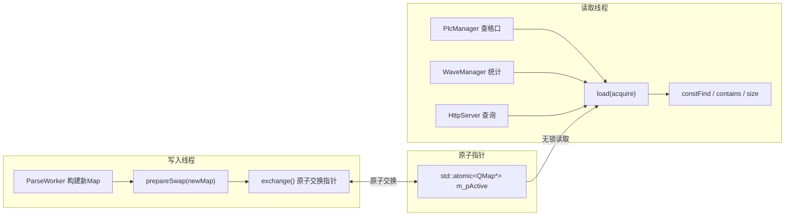

**核心思想**：只有一个 `std::atomic<QMap*>` 指针，写线程交换指针指向新 Map，读线程始终读取指针指向的 Map。交换后旧 Map 延迟释放，保证正在读的线程安全。

---

## 三、内存模型

### 3.1 三种 Map 的状态

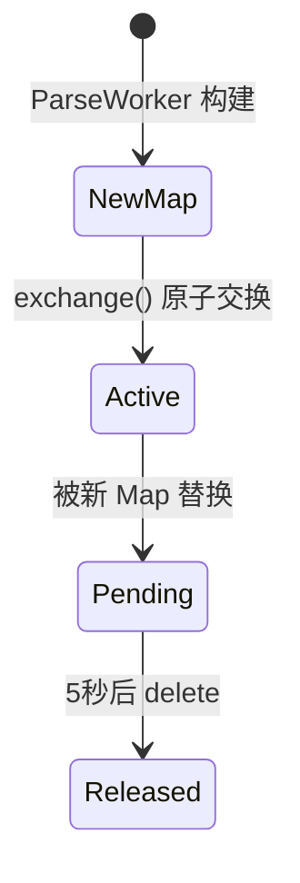

### 3.2 时间线

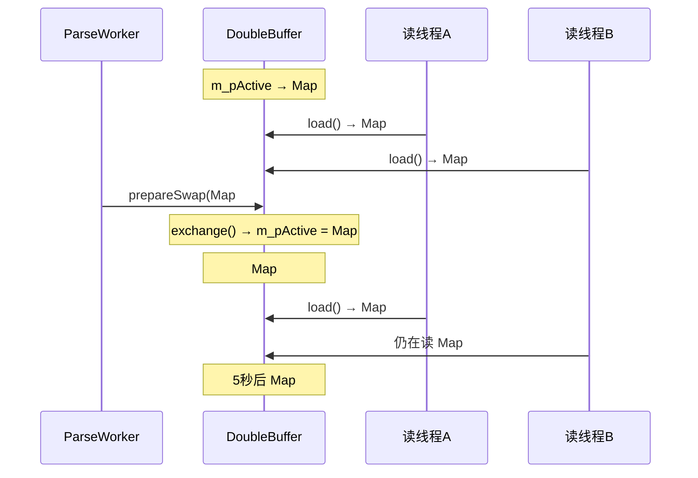

**关键保证**：`exchange()` 返回旧指针时，旧 Map 不会被立即销毁，而是延迟 5 秒。这 5 秒足够所有正在读旧 Map 的线程完成操作。

---

## 四、核心代码解析

### 4.1 类结构

```cpp
template<typename K, typename V>
class DoubleBuffer
{
    // ★ 唯一原子变量：指向当前活跃 Map 的指针
    std::atomic<QMap<K, V>*> m_pActive;

    // ★ 待删除队列：存储旧 Map 指针 + 时间戳
    std::deque<PendingDelete<QMap<K, V>>> m_pendingDeletes;

    // ★ 删除队列锁：仅保护队列操作，不保护 Map 读取
    std::mutex m_deleteMutex;
};
```

### 4.2 无锁读取

```cpp
// ★ 所有读操作仅一行 load()，无任何锁
V get(const K& key, const V& defaultValue = V()) const
{
    QMap<K, V>* pMap = m_pActive.load(std::memory_order_acquire);  // 原子读取指针
    if (!pMap) return defaultValue;
    auto it = pMap->constFind(key);                                 // 普通 Map 查找
    return (it != pMap->constEnd()) ? it.value() : defaultValue;
}
```

- `memory_order_acquire`：保证读到指针后，该指针指向的 Map 内容对当前线程可见
- `constFind`：Qt 的 const 查找，线程安全（只要 Map 不被修改）
- **关键契约**：交换后不再修改旧 Map，只读不写 → 不需要锁

### 4.3 原子交换写入

```cpp
void prepareSwap(QMap<K, V>* newMap)
{
    // ① 先清理过期的旧 Map（>5秒）
    cleanupOldMaps();

    // ② 原子交换：m_pActive ← newMap，返回旧指针
    QMap<K, V>* old = m_pActive.exchange(newMap, std::memory_order_acq_rel);

    // ③ 旧 Map 入延迟删除队列
    if (old)
    {
        std::lock_guard<std::mutex> lock(m_deleteMutex);
        m_pendingDeletes.emplace_back(old);  // 记录时间戳
    }
}
```

- `memory_order_acq_rel`：同时具有 acquire（看到之前的写入）和 release（对后续读可见）
- **旧 Map 不立即删除**：正在读旧 Map 的线程不受影响

### 4.4 延迟删除机制

```cpp
void cleanupOldMaps()
{
    std::lock_guard<std::mutex> lock(m_deleteMutex);
    auto now = std::chrono::steady_clock::now();
    auto it = m_pendingDeletes.begin();
    while (it != m_pendingDeletes.end())
    {
        auto elapsed = std::chrono::duration_cast<std::chrono::seconds>(
            now - it->deleteTime);
        if (elapsed.count() >= DOUBLE_BUFFER_CLEANUP_S)  // 默认 5 秒
        {
            delete it->ptr;           // 安全删除
            it = m_pendingDeletes.erase(it);
        }
        else
        {
            ++it;
        }
    }
}
```

**为什么是 5 秒？**

```mermaid
gantt
    title 旧 Map 生命周期
    dateFormat X
    axisFormat %s

    section 读线程
    读线程A 读 Map#1       :active, r1, 0, 1
    读线程B 读 Map#1       :active, r2, 0, 2

    section 写线程
    构建 Map#2             :w1, 0, 3
    exchange 交换           :milestone, m1, 3, 0
    等待删除 Map#1          :w2, 3, 8

    section 安全窗口
    5秒安全窗口             :crit, 3, 8
    Map#1 delete           :milestone, m2, 8, 0
```

- 写入线程 `exchange()` 在 ParseWorker 子线程中执行，耗时 < 1ms
- 读线程 `load()` + `constFind()` 在任意线程中执行，耗时 < 0.1ms
- 5 秒远大于任何读操作的最大耗时，保证安全

---

## 五、在 WCS_httpServer 中的使用

### 5.1 架构全景

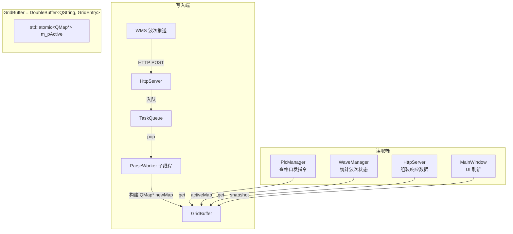

### 5.2 写入路径

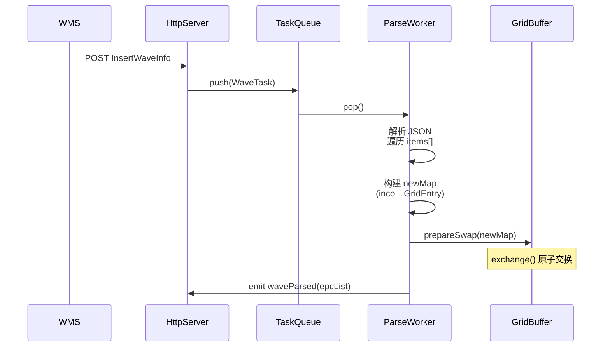

### 5.3 读取路径（高频）

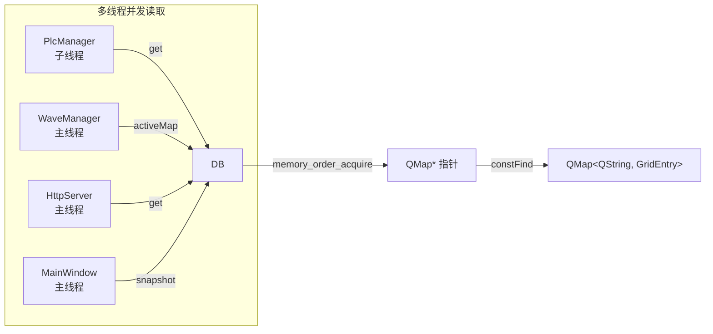

- PlcManager 在 HP-Socket 回调线程中通过 `m_pBuffer->get(code)` 获取格口号
- 所有读取操作仅一行 `load()`，零锁竞争
- 即使正在交换，读线程也不会阻塞或读取到不一致数据

### 5.4 GridEntry 数据结构

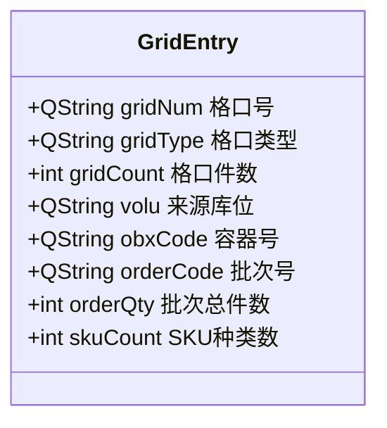

一个 EPC 编码 → 一次 `get()` 即可获得所有格口和批次信息，无需多次查询。

---

## 六、线程安全保证

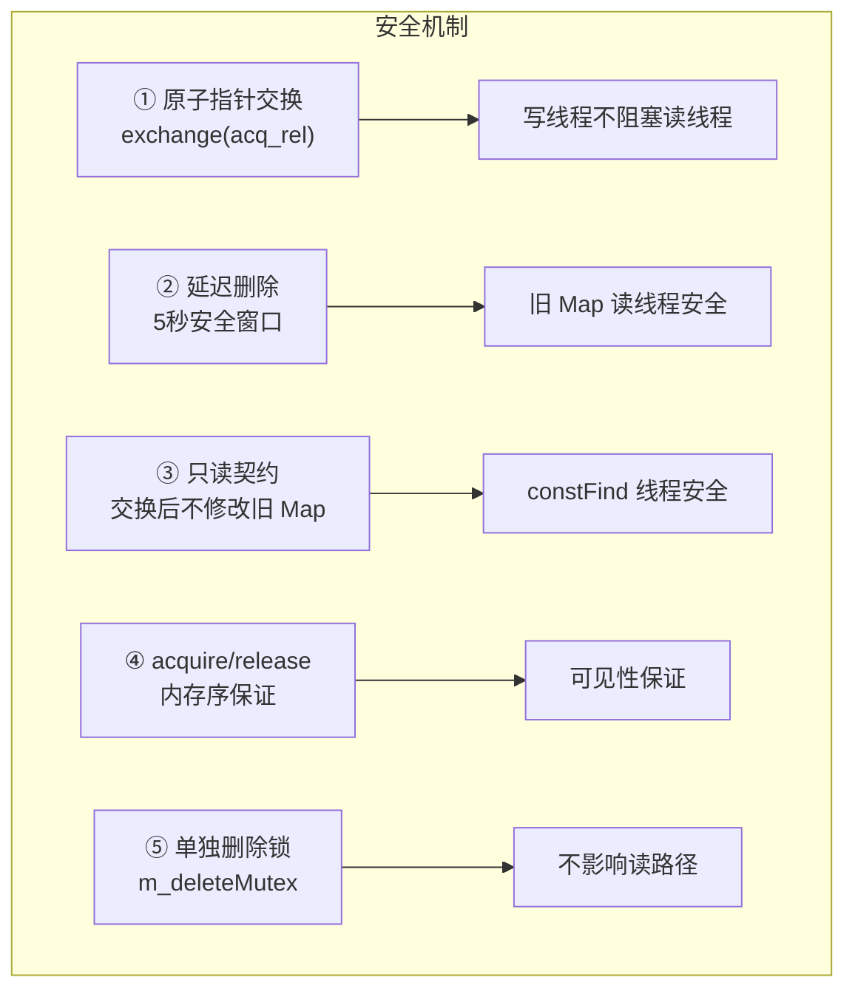

### 6.1 内存序详解

| 操作 | 内存序 | 作用 |
|------|--------|------|
| 读取 `load()` | `memory_order_acquire` | 保证读到指针后，Map 内容可见 |
| 写入 `exchange()` | `memory_order_acq_rel` | 同时保证：看到旧 Map 的修改 + 新 Map 对后续读可见 |

**简化理解**：写入线程在 `exchange()` 之前对新 Map 的所有修改，一定会被读取线程在 `load()` 之后看到。

---

## 七、与 WCSApp 的版本对比

| 特性 | WCSApp 版本 (`src/DoubleBuffer.h`) | WCS_httpServer 版本 (`WCS_httpServer/DoubleBuffer.h`) |
|------|-----------------------------------|------------------------------------------------------|
| 延迟删除 | `QTimer::singleShot(5000, ...)` | `std::deque` + `cleanupOldMaps()` |
| 删除线程 | 主线程（依赖事件循环） | 任意调用的线程（主动清理） |
| 队列管理 | 无（单次删除） | 队列管理（支持多次交换） |
| 适用场景 | 低频交换（WCSApp 按需交换） | 高频交换（波次频繁下发） |

WCS_httpServer 版本的改进：
- 不依赖 Qt 事件循环，可在任意线程安全调用
- 主动清理过期指针，避免内存泄漏
- 支持连续多次 `prepareSwap()` 而不堆积太多旧 Map

---

## 八、性能数据

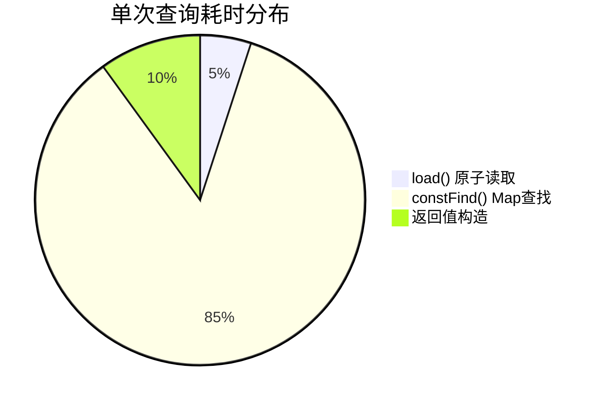

| 指标 | 值 |
|------|-----|
| 单次 `get()` 耗时 | < 0.1μs（Map 在 L1/L2 缓存中） |
| 单次 `exchange()` 耗时 | < 0.3μs（原子操作） |
| 1 万条并发读取 | < 10ms（无锁，并行） |
| 读阻塞写 | 0（永远不阻塞） |
| 写阻塞读 | 0（永远不阻塞） |

---

## 九、总结

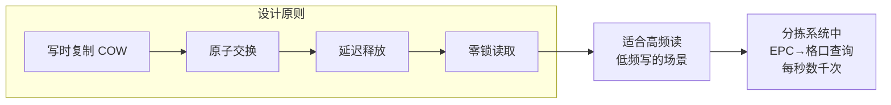

**核心优势**：
1. 读操作零开销（仅一次原子 `load()`）
2. 读写永不相互阻塞
3. 内存安全（延迟删除保证旧 Map 生命周期）
4. 实现简洁（< 150 行代码）