# 数据库表设计方案（ER 图版）

## 1. 概述

- **数据库引擎**：SQLite（本地嵌入式数据库，无需独立服务）
- **数据库文件**：`data/sorting_records.db`（位于 exe 同目录下）
- **连接方式**：Qt `QSqlDatabase` (`QSQLITE` 驱动)
- **性能模式**：WAL (Write-Ahead Logging)，支持读写并发
- **线程安全**：`QMutex` 保护所有数据库操作
- **配置宏**：`define.h` 中 `SORTING_DB_FILE` 定义文件路径

**PRAGMA 配置**：

| 指令 | 值 | 说明 |
|------|----|------|
| `journal_mode` | WAL | 允许读写并发，提升高并发场景性能 |
| `synchronous` | NORMAL | 安全性和写入性能之间取得平衡 |
| `cache_size` | 5000 | 约 20MB 缓存，减少磁盘 I/O |

---

## 2. 全局 ER 图

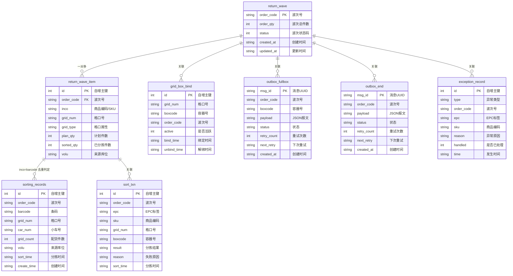
```mermaid
erDiagram
    return_wave ||--o{ return_wave_item : "一对多"
    return_wave ||--o{ grid_box_bind : "关联"
    return_wave ||--o{ outbox_fullbox : "关联"
    return_wave ||--o{ outbox_end : "关联"
    return_wave ||--o{ exception_record : "关联"
    return_wave_item ||--o{ sorting_records : "inco=barcode 去重判定"
    return_wave_item ||--o{ sort_txn : "关联"

    return_wave {
        string order_code PK "波次号"
        int order_qty "波次总件数"
        int status "波次状态码"
        string created_at "创建时间"
        string updated_at "更新时间"
    }

    return_wave_item {
        int id PK "自增主键"
        string order_code FK "波次号"
        string inco "商品编码/SKU"
        string grid_num "格口号"
        string grid_type "格口属性"
        int plan_qty "计划件数"
        int sorted_qty "已分拣件数"
        string volu "来源库位"
    }

    sorting_records {
        int id PK "自增主键"
        string order_code "波次号"
        string barcode "条码"
        string grid_num "格口号"
        string car_num "小车号"
        int grid_count "配货件数"
        string volu "来源库位"
        string sort_time "分拣时间"
        string create_time "创建时间"
    }

    sort_txn {
        int id PK "自增主键"
        string order_code "波次号"
        string epc "EPC标签"
        string sku "商品编码"
        string grid_num "格口号"
        string boxcode "容器号"
        string result "分拣结果"
        string reason "失败原因"
        string sort_time "分拣时间"
    }

    grid_box_bind {
        int id PK "自增主键"
        string grid_num "格口号"
        string boxcode "容器号"
        string order_code "波次号"
        int active "是否活跃"
        string bind_time "绑定时间"
        string unbind_time "解绑时间"
    }

    outbox_fullbox {
        string msg_id PK "消息UUID"
        string order_code "波次号"
        string boxcode "容器号"
        string payload "JSON报文"
        string status "状态"
        int retry_count "重试次数"
        string next_retry "下次重试"
        string created_at "创建时间"
    }

    outbox_end {
        string msg_id PK "消息UUID"
        string order_code "波次号"
        string payload "JSON报文"
        string status "状态"
        int retry_count "重试次数"
        string next_retry "下次重试"
        string created_at "创建时间"
    }

    exception_record {
        int id PK "自增主键"
        string type "异常类型"
        string order_code "波次号"
        string epc "EPC标签"
        string sku "商品编码"
        string reason "异常原因"
        int handled "是否已处理"
        string time "发生时间"
    }
```

---

## 3. 表组 ER 图（按功能分组）

### 3.1 波次管理组

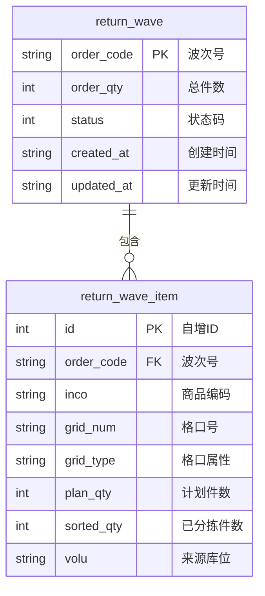
```mermaid
erDiagram
    return_wave ||--o{ return_wave_item : "包含"

    return_wave {
        string order_code PK "波次号"
        int order_qty "总件数"
        int status "状态码"
        string created_at "创建时间"
        string updated_at "更新时间"
    }

    return_wave_item {
        int id PK "自增ID"
        string order_code FK "波次号"
        string inco "商品编码"
        string grid_num "格口号"
        string grid_type "格口属性"
        int plan_qty "计划件数"
        int sorted_qty "已分拣件数"
        string volu "来源库位"
    }
```

**数据流**：`WMS 推送波次` → `return_wave (1条)` → `return_wave_item (N条)`

### 3.2 分拣核心组

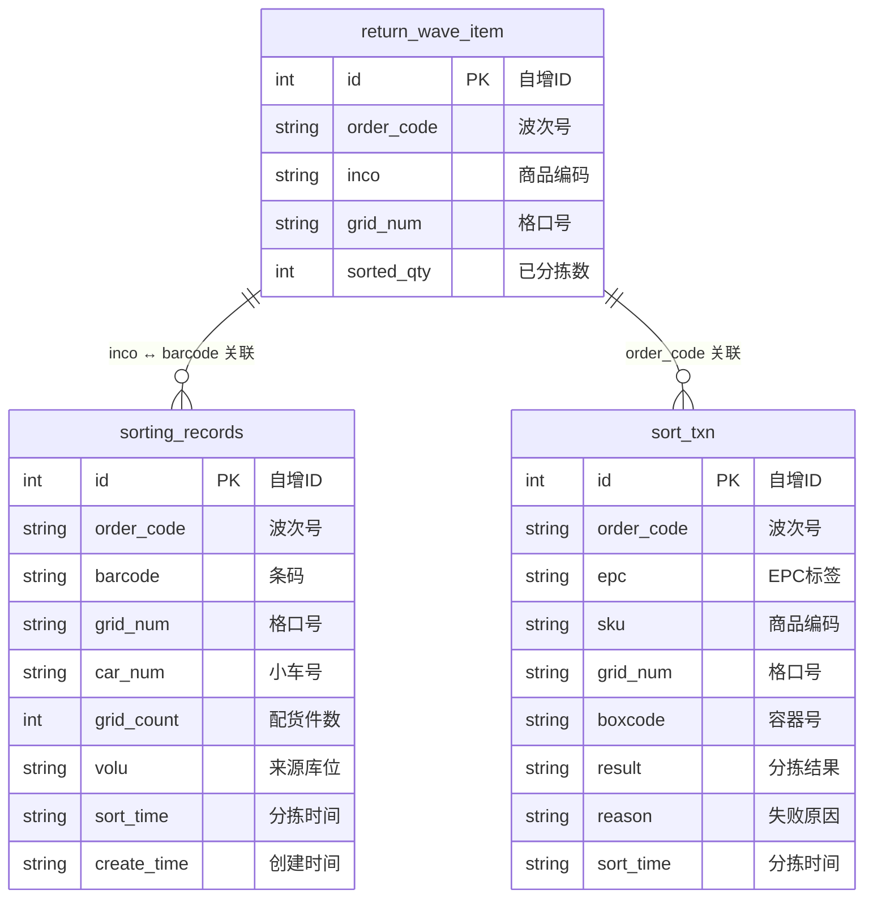
```mermaid
erDiagram
    return_wave_item ||--o{ sorting_records : "inco ↔ barcode 关联"
    return_wave_item ||--o{ sort_txn : "order_code 关联"

    sorting_records {
        int id PK "自增ID"
        string order_code "波次号"
        string barcode "条码"
        string grid_num "格口号"
        string car_num "小车号"
        int grid_count "配货件数"
        string volu "来源库位"
        string sort_time "分拣时间"
        string create_time "创建时间"
    }

    sort_txn {
        int id PK "自增ID"
        string order_code "波次号"
        string epc "EPC标签"
        string sku "商品编码"
        string grid_num "格口号"
        string boxcode "容器号"
        string result "分拣结果"
        string reason "失败原因"
        string sort_time "分拣时间"
    }

    return_wave_item {
        int id PK "自增ID"
        string order_code "波次号"
        string inco "商品编码"
        string grid_num "格口号"
        int sorted_qty "已分拣数"
    }
```

**NOT EXISTS 去重逻辑**（UI 查询区分已分拣/待分拣）：

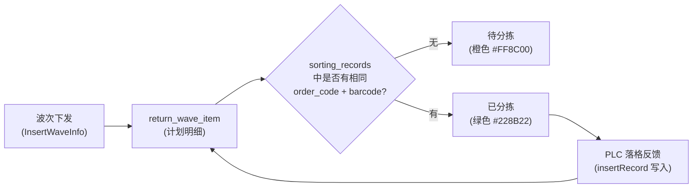
```mermaid
flowchart LR
    A["波次下发<br/>(InsertWaveInfo)"] --> B["return_wave_item<br/>(计划明细)"]
    B --> C{"sorting_records<br/>中是否有相同<br/>order_code + barcode?"}
    C -->|"无"| D["待分拣<br/>(橙色 #FF8C00)"]
    C -->|"有"| E["已分拣<br/>(绿色 #228B22)"]
    E --> F["PLC 落格反馈<br/>(insertRecord 写入)"]
    F --> B
```

### 3.3 格口绑定组

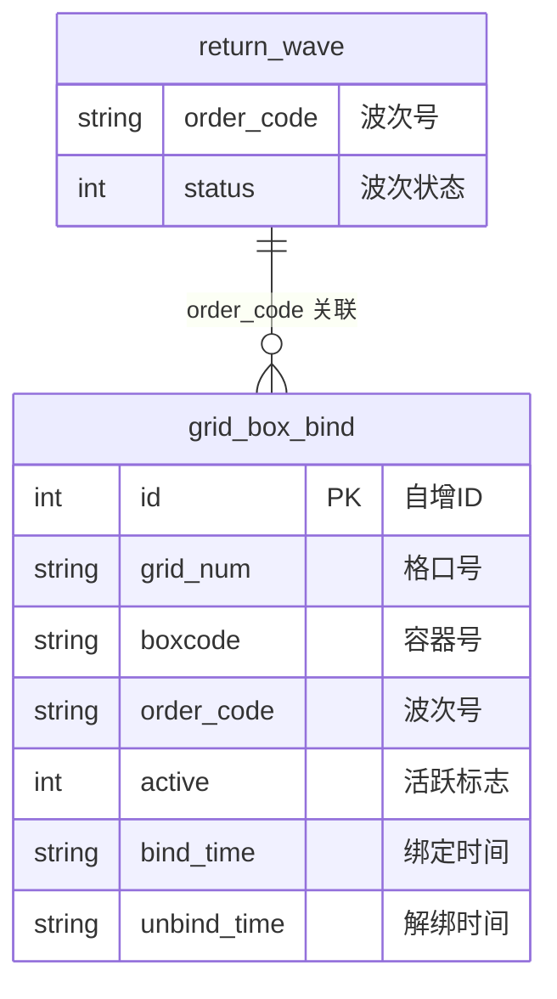
```mermaid
erDiagram
    return_wave ||--o{ grid_box_bind : "order_code 关联"

    grid_box_bind {
        int id PK "自增ID"
        string grid_num "格口号"
        string boxcode "容器号"
        string order_code "波次号"
        int active "活跃标志"
        string bind_time "绑定时间"
        string unbind_time "解绑时间"
    }

    return_wave {
        string order_code "波次号"
        int status "波次状态"
    }
```

**绑定生命周期**：

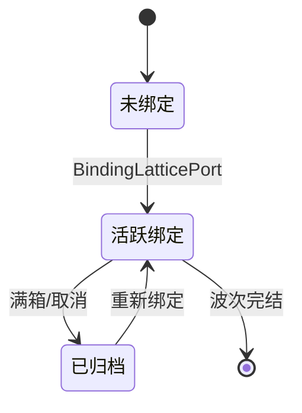
```mermaid
stateDiagram-v2
    [*] --> 未绑定
    未绑定 --> 活跃绑定: BindingLatticePort
    活跃绑定 --> 已归档: 满箱/取消
    已归档 --> 活跃绑定: 重新绑定
    活跃绑定 --> [*]: 波次完结
```

### 3.4 出站消息组（可靠投递）

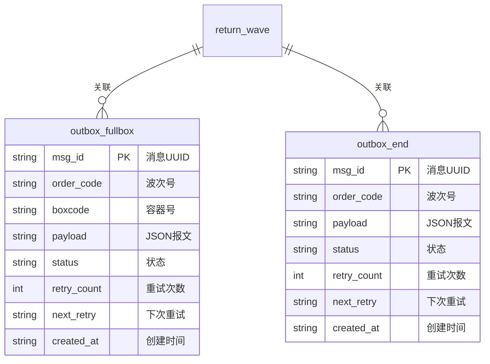
```mermaid
erDiagram
    return_wave ||--o{ outbox_fullbox : "关联"
    return_wave ||--o{ outbox_end : "关联"

    outbox_fullbox {
        string msg_id PK "消息UUID"
        string order_code "波次号"
        string boxcode "容器号"
        string payload "JSON报文"
        string status "状态"
        int retry_count "重试次数"
        string next_retry "下次重试"
        string created_at "创建时间"
    }

    outbox_end {
        string msg_id PK "消息UUID"
        string order_code "波次号"
        string payload "JSON报文"
        string status "状态"
        int retry_count "重试次数"
        string next_retry "下次重试"
        string created_at "创建时间"
    }
```

**可靠投递状态机**：

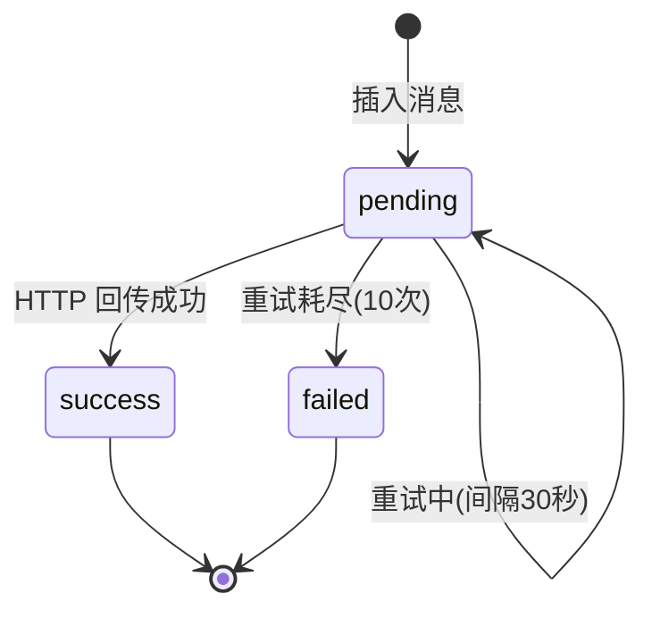
```mermaid
stateDiagram-v2
    [*] --> pending: 插入消息
    pending --> success: HTTP 回传成功
    pending --> failed: 重试耗尽(10次)
    pending --> pending: 重试中(间隔30秒)
    success --> [*]
    failed --> [*]
```

### 3.5 异常记录组

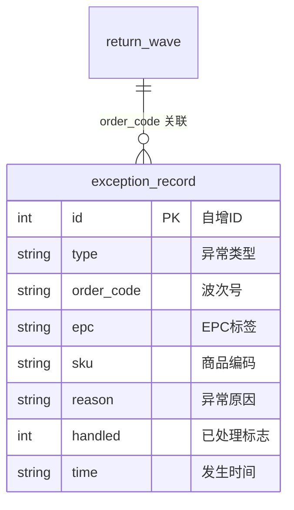
```mermaid
erDiagram
    return_wave ||--o{ exception_record : "order_code 关联"

    exception_record {
        int id PK "自增ID"
        string type "异常类型"
        string order_code "波次号"
        string epc "EPC标签"
        string sku "商品编码"
        string reason "异常原因"
        int handled "已处理标志"
        string time "发生时间"
    }
```

---

## 4. 数据流全景图

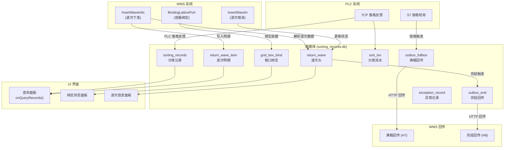
```mermaid
flowchart TB
    subgraph WMS["WMS 系统"]
        A1["InsertWaveInfo<br/>(波次下发)"]
        A2["BindingLatticePort<br/>(容器绑定)"]
        A3["InsertWaveIn<br/>(波次取消)"]
    end

    subgraph DB["数据库 (sorting_records.db)"]
        T1["return_wave<br/>波次头"]
        T2["return_wave_item<br/>波次明细"]
        T3["grid_box_bind<br/>格口绑定"]
        T4["sorting_records<br/>分拣记录"]
        T5["sort_txn<br/>分拣流水"]
        T6["outbox_fullbox<br/>满箱回传"]
        T7["outbox_end<br/>完结回传"]
        T8["exception_record<br/>异常记录"]
    end

    subgraph PLC["PLC 系统"]
        P1["S7 锁格轮询"]
        P2["TCP 落格反馈"]
    end

    subgraph UI["UI 界面"]
        U1["查询面板<br/>onQueryRecords()"]
        U2["绑定状态面板"]
        U3["波次信息面板"]
    end

    subgraph WMS_OUT["WMS 回传"]
        O1["满箱回传 (H7)"]
        O2["完结回传 (H8)"]
    end

    %% 数据流向
    A1 -->|"解析波次数据"| T1
    A1 -->|"写入明细"| T2
    A2 -->|"绑定容器"| T3
    A3 -->|"更新状态"| T1

    P2 -->|"PLC 落格反馈"| T4
    P2 --> T5
    P1 -->|"锁格触发"| T6

    T4 --> U1
    T2 --> U1
    T3 --> U2
    T1 --> U3

    T6 -->|"HTTP 回传"| O1
    T7 -->|"HTTP 回传"| O2
    T1 -->|"完结触发"| T7
```

---

## 5. 波次状态流转图

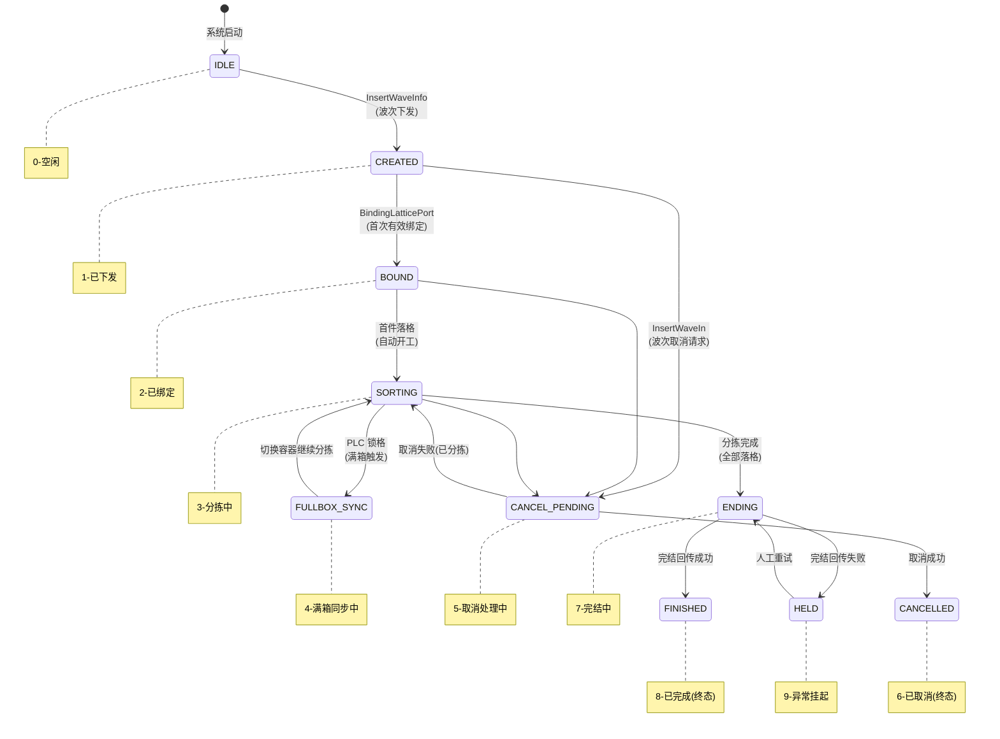
```mermaid
stateDiagram-v2
    [*] --> IDLE: 系统启动
    IDLE --> CREATED: InsertWaveInfo<br/>(波次下发)
    CREATED --> BOUND: BindingLatticePort<br/>(首次有效绑定)
    BOUND --> SORTING: 首件落格<br/>(自动开工)
    SORTING --> FULLBOX_SYNC: PLC 锁格<br/>(满箱触发)
    FULLBOX_SYNC --> SORTING: 切换容器继续分拣
    SORTING --> ENDING: 分拣完成<br/>(全部落格)
    ENDING --> FINISHED: 完结回传成功
    ENDING --> HELD: 完结回传失败
    CREATED --> CANCEL_PENDING: InsertWaveIn<br/>(波次取消请求)
    BOUND --> CANCEL_PENDING
    SORTING --> CANCEL_PENDING
    CANCEL_PENDING --> CANCELLED: 取消成功
    CANCEL_PENDING --> SORTING: 取消失败(已分拣)
    HELD --> ENDING: 人工重试

    note right of IDLE: 0-空闲
    note right of CREATED: 1-已下发
    note right of BOUND: 2-已绑定
    note right of SORTING: 3-分拣中
    note right of FULLBOX_SYNC: 4-满箱同步中
    note right of CANCEL_PENDING: 5-取消处理中
    note right of CANCELLED: 6-已取消(终态)
    note right of ENDING: 7-完结中
    note right of FINISHED: 8-已完成(终态)
    note right of HELD: 9-异常挂起
```

---

## 6. UI 查询与状态判断逻辑

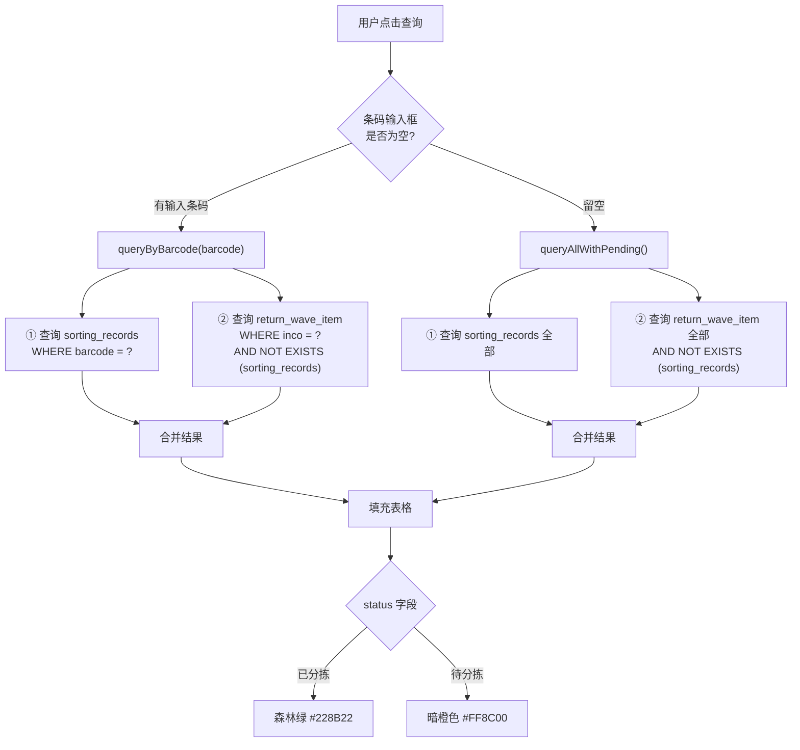
```mermaid
flowchart TD
    START["用户点击查询"] --> INPUT{"条码输入框<br/>是否为空?"}
    INPUT -->|"有输入条码"| Q1["queryByBarcode(barcode)"]
    INPUT -->|"留空"| Q2["queryAllWithPending()"]

    Q1 --> Q1_STEP1["① 查询 sorting_records<br/>WHERE barcode = ?"]
    Q1 --> Q1_STEP2["② 查询 return_wave_item<br/>WHERE inco = ?<br/>AND NOT EXISTS (sorting_records)"]
    Q1_STEP1 --> MERGE1["合并结果"]
    Q1_STEP2 --> MERGE1

    Q2 --> Q2_STEP1["① 查询 sorting_records 全部"]
    Q2 --> Q2_STEP2["② 查询 return_wave_item 全部<br/>AND NOT EXISTS (sorting_records)"]
    Q2_STEP1 --> MERGE2["合并结果"]
    Q2_STEP2 --> MERGE2

    MERGE1 --> DISPLAY["填充表格"]
    MERGE2 --> DISPLAY

    DISPLAY --> COLOR{"status 字段"}
    COLOR -->|"已分拣"| GREEN["森林绿 #228B22"]
    COLOR -->|"待分拣"| ORANGE["暗橙色 #FF8C00"]
```

---

## 7. 表结构详细说明

### 7.1 `sorting_records` — 分拣记录表

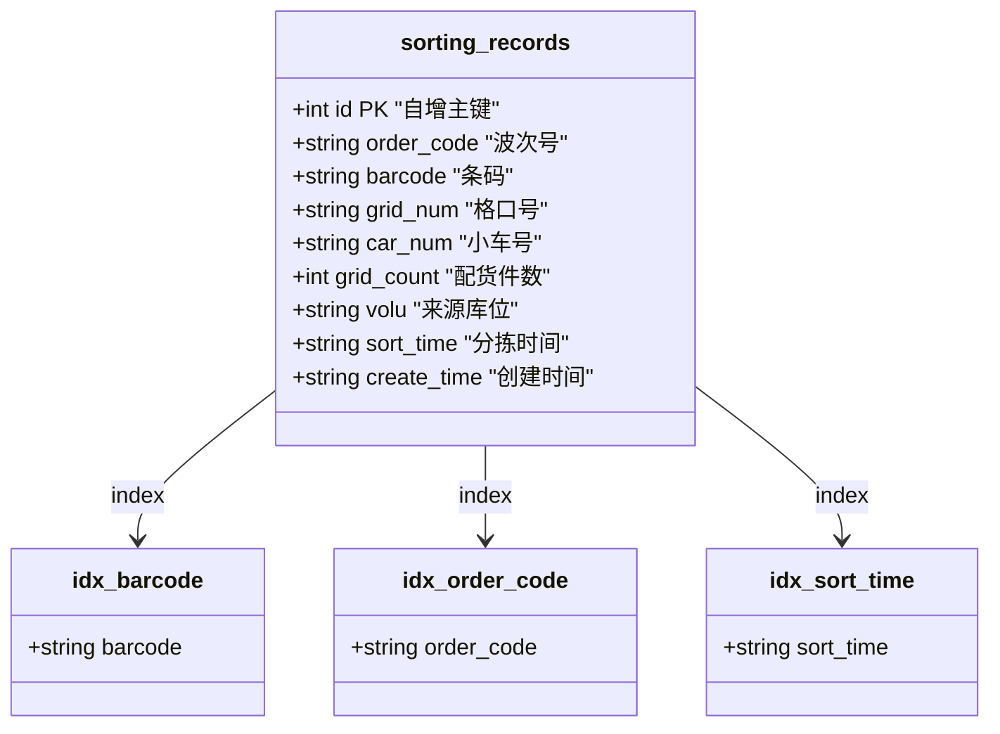
```mermaid
classDiagram
    class sorting_records {
        +int id PK "自增主键"
        +string order_code "波次号"
        +string barcode "条码"
        +string grid_num "格口号"
        +string car_num "小车号"
        +int grid_count "配货件数"
        +string volu "来源库位"
        +string sort_time "分拣时间"
        +string create_time "创建时间"
    }
    class idx_barcode {
        +string barcode
    }
    class idx_order_code {
        +string order_code
    }
    class idx_sort_time {
        +string sort_time
    }
    sorting_records --> idx_barcode : index
    sorting_records --> idx_order_code : index
    sorting_records --> idx_sort_time : index
```

**用途**：存储 PLC 落格反馈的每条分拣记录，用于 UI 查询展示和统计。

**索引**：

| 索引名 | 字段 | 用途 |
|--------|------|------|
| `idx_barcode` | `barcode` | 加速按条码查询历史 |
| `idx_order_code` | `order_code` | 加速按波次号查询 |
| `idx_sort_time` | `sort_time` | 加速按时间范围查询 |

**主要 SQL 操作**：

| 操作 | SQL 宏 | 说明 |
|------|--------|------|
| 插入 | `SQL_INSERT_RECORD` | PLC 落格反馈时写入 |
| 按条码查 | `SQL_QUERY_BY_BARCODE` | UI 条码查询，状态=已分拣 |
| 按时间查 | `SQL_QUERY_BY_TIME` | 按时间范围查询 |
| 按波次查 | `SQL_QUERY_BY_ORDER` | 按波次号查询 |
| 查全部 | `SQL_QUERY_ALL` | 查询所有记录 |
| 统计总数 | `SQL_COUNT_ALL` | 数据库总记录数 |
| 统计今日 | `SQL_COUNT_TODAY` | 当日记录数 |
| 清理过期 | `SQL_DELETE_OLD` | 删除 N 天前记录 |

---

### 7.2 `return_wave` — 退货波次头表

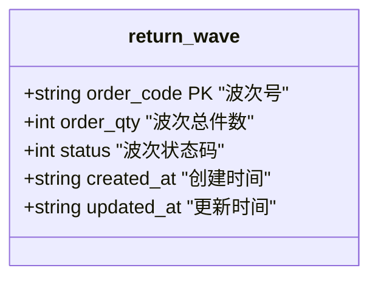
```mermaid
classDiagram
    class return_wave {
        +string order_code PK "波次号"
        +int order_qty "波次总件数"
        +int status "波次状态码"
        +string created_at "创建时间"
        +string updated_at "更新时间"
    }
```

**用途**：记录 WMS 下发的波次头信息，跟踪波次状态流转。

**波次状态枚举**（`WaveManager.h`）：

| 值 | 枚举名 | 中文 | 说明 |
|----|--------|------|------|
| 0 | `WAVE_IDLE` | 空闲 | 可接收新波次 |
| 1 | `WAVE_CREATED` | 已下发 | 波次下发成功落库 |
| 2 | `WAVE_BOUND` | 已绑定 | 至少一个业务格口完成有效容器绑定 |
| 3 | `WAVE_SORTING` | 分拣中 | 已开始分拣 |
| 4 | `WAVE_FULLBOX_SYNC` | 满箱同步中 | 正在调用/重试满箱回传 |
| 5 | `WAVE_CANCEL_PENDING` | 取消处理中 | 收到波次取消请求，判定中 |
| 6 | `WAVE_CANCELLED` | 已取消 | 波次取消成功（终态） |
| 7 | `WAVE_ENDING` | 完结中 | 正在调用/重试完结回传 |
| 8 | `WAVE_FINISHED` | 已完成 | 完结回传成功（终态） |
| 9 | `WAVE_HELD` | 异常挂起 | 接口失败/数据冲突，待人工处理 |

**SQL 操作**：

| 操作 | SQL 宏 | 说明 |
|------|--------|------|
| 插入/更新 | `SQL_UPSERT_RETURN_WAVE` | UPSERT，幂等覆盖 |
| 按波次查询 | `SQL_SELECT_WAVE_BY_ORDER` | 查询波次头信息 |
| 更新状态 | `SQL_UPDATE_WAVE_STATUS` | 状态变更时更新 |

---

### 7.3 `return_wave_item` — 退货波次明细表

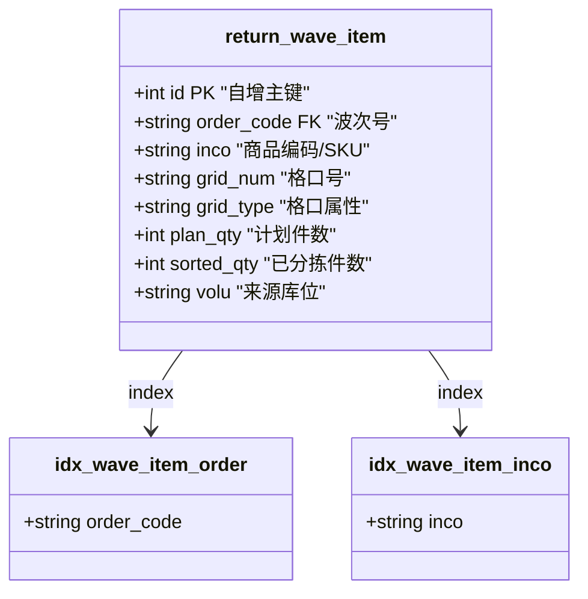
```mermaid
classDiagram
    class return_wave_item {
        +int id PK "自增主键"
        +string order_code FK "波次号"
        +string inco "商品编码/SKU"
        +string grid_num "格口号"
        +string grid_type "格口属性"
        +int plan_qty "计划件数"
        +int sorted_qty "已分拣件数"
        +string volu "来源库位"
    }
    class idx_wave_item_order {
        +string order_code
    }
    class idx_wave_item_inco {
        +string inco
    }
    return_wave_item --> idx_wave_item_order : index
    return_wave_item --> idx_wave_item_inco : index
```

**用途**：记录波次中每条商品→格口的分配明细，用于 UI 查询待分拣记录。

**格口类型**（`grid_type` 字段可选值）：

| 值 | 说明 |
|------|------|
| `普通格口` | 默认，常规分拣格口 |
| `专属发货格口` | 指定发货的专有格口 |
| `分类格口` | 按类别分配的格口 |
| `异常口` | 异常处理格口 |
| `混分格口` | 混合分拣格口 |

**SQL 操作**：

| 操作 | SQL 宏 | 说明 |
|------|--------|------|
| 批量插入 | `SQL_INSERT_WAVE_ITEM` | 事务内先删后插，支持覆盖重下 |
| 按波次查询 | `SQL_SELECT_WAVE_ITEMS` | 查询波次所有明细 |
| 增量分拣 | `SQL_INCREMENT_SORTED_QTY` | `sorted_qty + 1` |
| 查待分拣(按条码) | `SQL_QUERY_PENDING_BY_BARCODE` | 排除已落格（NOT EXISTS） |
| 查待分拣(按时间) | `SQL_QUERY_PENDING_BY_WAVE_TIME` | 按波次创建时间范围 |
| 查全部待分拣 | `SQL_QUERY_ALL_PENDING` | 留空查全部 |

---

### 7.4 `grid_box_bind` — 格口容器绑定表

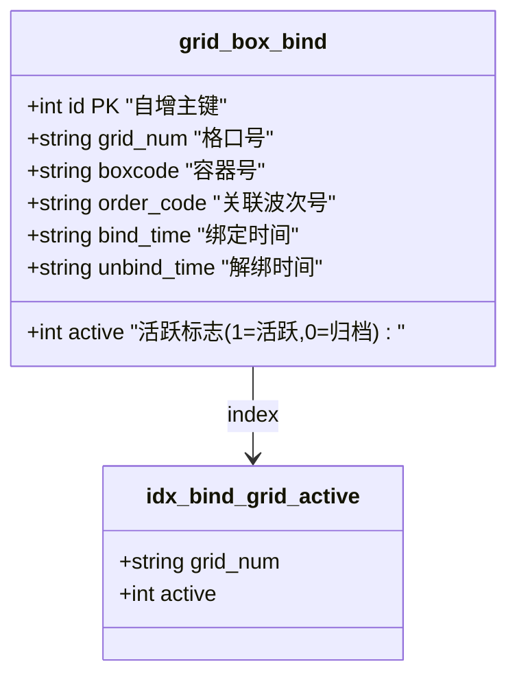
```mermaid
classDiagram
    class grid_box_bind {
        +int id PK "自增主键"
        +string grid_num "格口号"
        +string boxcode "容器号"
        +string order_code "关联波次号"
        +int active "活跃标志(1=活跃,0=归档)"
        +string bind_time "绑定时间"
        +string unbind_time "解绑时间"
    }
    class idx_bind_grid_active {
        +string grid_num
        +int active
    }
    grid_box_bind --> idx_bind_grid_active : index
```

**用途**：记录格口与容器的绑定关系，支持绑定历史追溯。

**绑定切换流程**：

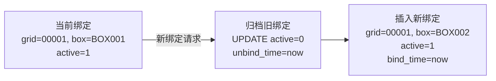
```mermaid
flowchart LR
    A["当前绑定<br/>grid=00001, box=BOX001<br/>active=1"] -->|"新绑定请求"| B["归档旧绑定<br/>UPDATE active=0<br/>unbind_time=now"]
    B --> C["插入新绑定<br/>grid=00001, box=BOX002<br/>active=1<br/>bind_time=now"]
```

**SQL 操作**：

| 操作 | SQL 宏 | 说明 |
|------|--------|------|
| 插入绑定 | `SQL_INSERT_GRID_BIND` | 新绑定 active=1 |
| 归档旧绑定 | `SQL_ARCHIVE_OLD_BIND` | 同格口旧绑定 active=0 |
| 查询活跃绑定 | `SQL_SELECT_ACTIVE_BIND` | 查询格口当前活跃容器 |

---

### 7.5 `sort_txn` — 分拣流水表

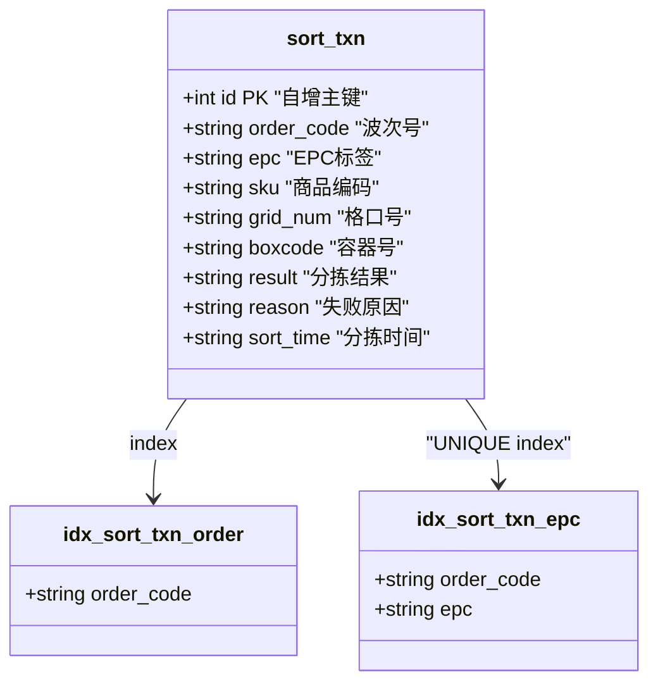
```mermaid
classDiagram
    class sort_txn {
        +int id PK "自增主键"
        +string order_code "波次号"
        +string epc "EPC标签"
        +string sku "商品编码"
        +string grid_num "格口号"
        +string boxcode "容器号"
        +string result "分拣结果"
        +string reason "失败原因"
        +string sort_time "分拣时间"
    }
    class idx_sort_txn_order {
        +string order_code
    }
    class idx_sort_txn_epc {
        +string order_code
        +string epc
    }
    sort_txn --> idx_sort_txn_order : index
    sort_txn --> idx_sort_txn_epc : "UNIQUE index"
```

**用途**：存储每次 PLC 落格反馈的完整分拣明细，带 EPC 防重机制。

**`sorting_records` vs `sort_txn` 对比**：

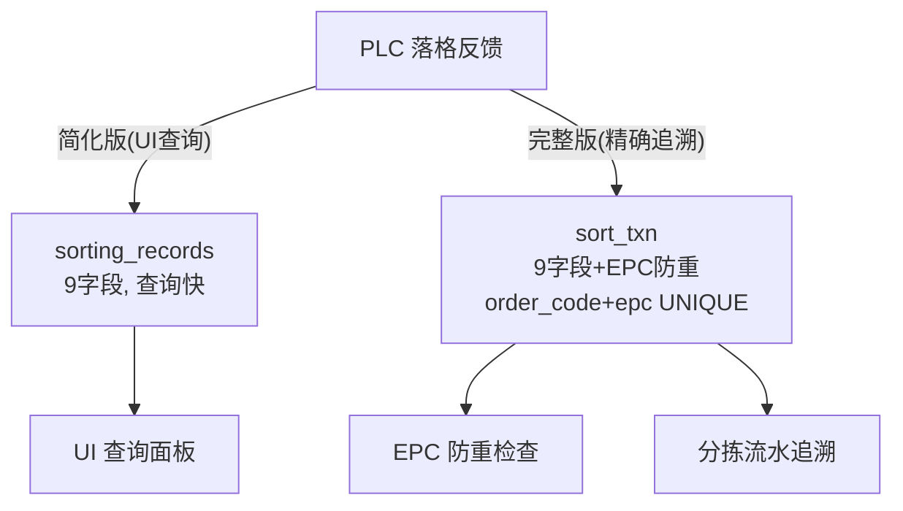
```mermaid
flowchart TD
    PLC["PLC 落格反馈"] -->|"简化版(UI查询)"| SR["sorting_records<br/>9字段, 查询快"]
    PLC -->|"完整版(精确追溯)"| ST["sort_txn<br/>9字段+EPC防重<br/>order_code+epc UNIQUE"]

    SR --> UI["UI 查询面板"]
    ST --> DEDUP["EPC 防重检查"]
    ST --> TRACE["分拣流水追溯"]
```

---

### 7.6 `outbox_fullbox` — 满箱回传出站表

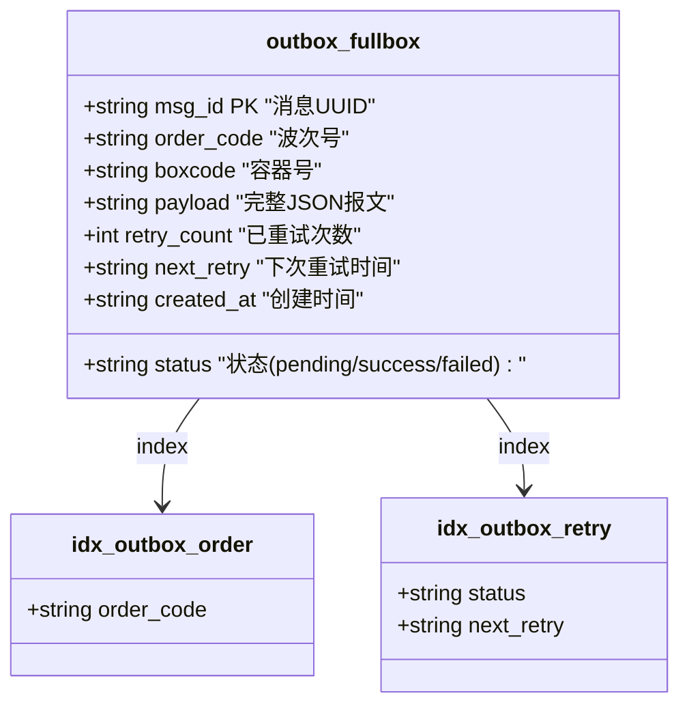
```mermaid
classDiagram
    class outbox_fullbox {
        +string msg_id PK "消息UUID"
        +string order_code "波次号"
        +string boxcode "容器号"
        +string payload "完整JSON报文"
        +string status "状态(pending/success/failed)"
        +int retry_count "已重试次数"
        +string next_retry "下次重试时间"
        +string created_at "创建时间"
    }
    class idx_outbox_order {
        +string order_code
    }
    class idx_outbox_retry {
        +string status
        +string next_retry
    }
    outbox_fullbox --> idx_outbox_order : index
    outbox_fullbox --> idx_outbox_retry : index
```

**用途**：存储满箱回传 WMS 的出站消息，支持失败重试的可靠投递机制。

**可靠投递流程**：

```mermaid
sequenceDiagram
    participant PLC as PLC锁格
    participant WCS as WCS_httpServer
    participant DB as SQLite
    participant Timer as 出站调度(5s)
    participant WMS as WMS系统

    PLC->>WCS: 锁格信号(grid=00001)
    WCS->>DB: insertOutboxFullbox(msg_id, payload)
    Note over DB: status='pending',<br/>next_retry=now+30s
    Timer->>DB: 查询待重试(getPendingOutboxFullbox)
    DB->>Timer: 返回待发送消息
    Timer->>WMS: HTTP POST (payload)
    alt 成功(200)
        WMS->>Timer: 成功响应
        Timer->>DB: markOutboxFullboxSuccess(msg_id)
        Note over DB: status='success'
    else 失败
        WMS->>Timer: 超时/错误
        Timer->>DB: updateOutboxFullboxStatus(status='pending')
        Note over DB: retry_count+1,<br/>next_retry=now+30s
        alt 重试>=10次
            Timer->>DB: status='failed'
        end
    end
```

---

### 7.7 `outbox_end` — 完结回传出站表

```mermaid
classDiagram
    class outbox_end {
        +string msg_id PK "消息UUID"
        +string order_code "波次号"
        +string payload "完整JSON报文"
        +string status "状态(pending/success/failed)"
        +int retry_count "已重试次数"
        +string next_retry "下次重试时间"
        +string created_at "创建时间"
    }
```

**用途**：存储任务完结回传 WMS 的出站消息（波次完结通知），支持失败重试。

**与 `outbox_fullbox` 的区别**：

| 对比项 | `outbox_fullbox` | `outbox_end` |
|--------|-----------------|-------------|
| 触发时机 | PLC 锁格（满箱） | 波次分拣完成 |
| 回传内容 | 单个格口满箱数据 | 整个波次完结数据 |
| 特有字段 | `boxcode`（容器号） | 无 |
| 重试策略 | 相同（10次/30秒间隔） | 相同 |

---

### 7.8 `exception_record` — 异常记录表

```mermaid
classDiagram
    class exception_record {
        +int id PK "自增主键"
        +string type "异常类型"
        +string order_code "波次号"
        +string epc "EPC标签"
        +string sku "商品编码"
        +string reason "异常原因描述"
        +int handled "已处理标志(0=未处理,1=已处理)"
        +string time "异常发生时间"
    }
```

**异常类型**：

```mermaid
flowchart LR
    subgraph 异常类型
        RF["read_fail<br/>读码失败"]
        NB["no_bind<br/>无绑定"]
        NM["no_match<br/>无匹配格口"]
        CF["conflict<br/>冲突"]
        DF["device_fail<br/>设备失败"]
    end
```

**SQL 操作**：

| 操作 | SQL 宏 | 说明 |
|------|--------|------|
| 插入异常 | `SQL_INSERT_EXCEPTION` | 写入异常记录 |
| 查询未处理 | `SQL_SELECT_OPEN_EXCEPTIONS` | 按波次查询未处理异常 |
| 多条件查询 | `queryExceptions()` | 动态拼接 WHERE 条件（orderCode/EPC/类型/时间范围） |

---

## 8. 数据生命周期全景

```mermaid
flowchart TD
    subgraph Phase1["阶段1: 波次下发"]
        WMS1["WMS → InsertWaveInfo"] --> WAVE["return_wave 插入<br/>status=WAVE_CREATED"]
        WMS1 --> ITEMS["return_wave_item 批量插入<br/>(N条明细)"]
    end

    subgraph Phase2["阶段2: 容器绑定"]
        WMS2["WMS → BindingLatticePort"] --> BIND["grid_box_bind 插入<br/>active=1"]
        BIND --> BOUND["return_wave.status → WAVE_BOUND"]
    end

    subgraph Phase3["阶段3: 分拣作业"]
        PLC_IN["PLC 首件落格"] --> START["return_wave.status → WAVE_SORTING"]
        PLC_IN2["PLC 落格反馈"] --> SORTED["sorting_records 插入<br/>incrementSortedQty"]
    end

    subgraph Phase4["阶段4: 满箱回传"]
        PLC_LOCK["PLC 锁格"] --> FULLBOX["outbox_fullbox 插入<br/>status=pending"]
        FULLBOX --> RETRY1["重试调度(5s轮询)"]
        RETRY1 -->|成功| SUCCESS1["outbox_fullbox.status → success"]
        RETRY1 -->|失败| RETRY1
    end

    subgraph Phase5["阶段5: 波次完结"]
        WAVE_END["分拣完成 + 全部满箱回传成功"] --> END_MSG["outbox_end 插入<br/>status=pending"]
        END_MSG --> RETRY2["重试调度(5s轮询)"]
        RETRY2 -->|成功| FINISHED["outbox_end.status → success<br/>return_wave.status → WAVE_FINISHED"]
        RETRY2 -->|失败| RETRY2
    end

    Phase1 --> Phase2
    Phase2 --> Phase3
    Phase3 --> Phase4
    Phase4 --> Phase5
```

---

## 9. 关键设计决策

### 9.1 为什么有两张分拣记录表（`sorting_records` + `sort_txn`）？

```mermaid
flowchart LR
    subgraph sorting_records["sorting_records(简化版)"]
        SR1["用于UI快速查询显示"]
        SR2["字段少, 查询快"]
        SR3["无唯一约束"]
    end
    subgraph sort_txn["sort_txn(完整版)"]
        ST1["用于精确分拣流水追溯"]
        ST2["带EPC防重"]
        ST3["order_code+epc UNIQUE"]
    end
    sorting_records --- sort_txn
```

### 9.2 为什么 NOT EXISTS 去重而不是 JOIN？

```sql
-- NOT EXISTS 方式（当前实现）✓
SELECT i.order_code, i.inco, i.grid_num, i.plan_qty, i.volu
FROM return_wave_item i
WHERE NOT EXISTS (
  SELECT 1 FROM sorting_records s
  WHERE s.barcode = i.inco AND s.order_code = i.order_code
)

-- VS LEFT JOIN 方式
SELECT i.* FROM return_wave_item i
LEFT JOIN sorting_records s ON s.barcode = i.inco AND s.order_code = i.order_code
WHERE s.id IS NULL
```

**选择 NOT EXISTS 的原因**：
- 语义更清晰：排除已落格 = 不存在于 sorting_records 中
- SQLite 优化器对 `NOT EXISTS` 与 `LEFT JOIN ... NULL` 的查询计划等价
- 避免 `LEFT JOIN` 可能产生的重复行

### 9.3 为什么 outbox 分为两张表？

```mermaid
flowchart LR
    FB["outbox_fullbox<br/>满箱回传<br/>需 boxcode 字段"] --> WMS
    END["outbox_end<br/>完结回传<br/>无需 boxcode 字段"] --> WMS
    WMS["WMS 系统"]
```

- 满箱回传（`outbox_fullbox`）需要 `boxcode` 字段（容器号），完结回传（`outbox_end`）不需要
- 两张表结构不同，拆分后避免大量空字段
- 独立的重试策略和调度逻辑

### 9.4 为什么所有时间字段用 TEXT？

SQLite 无原生 DATETIME 类型，TEXT 存储 ISO 8601 格式（`yyyy-MM-dd HH:mm:ss.zzz`）：
- 可读性好，直接查看数据库文件即可理解
- Qt 的 `QDateTime` 可以无缝转换
- 支持字符串比较操作（按字典序，与时间顺序一致）

---

## 10. 配置参数

所有配置集中在 `define.h`：

| 宏 | 默认值 | 说明 |
|----|--------|------|
| `SORTING_DB_FILE` | `data/sorting_records.db` | 数据库文件路径 |
| `SORTING_DB_RETAIN_DAYS` | 90 | 分拣记录保留天数 |
| `SORTING_QUERY_MAX_RESULTS` | 1000 | 单次查询最大返回记录数 |
| `OUTBOX_RETRY_MAX_DEFAULT` | 10 | 出站消息最大重试次数 |
| `OUTBOX_RETRY_INTERVAL_SEC` | 30 | 出站消息重试间隔（秒） |
| `OUTBOX_POLL_INTERVAL_SEC` | 5 | 出站调度扫描间隔（秒） |
| `OUTBOX_POLL_BATCH_SIZE` | 10 | 每批处理消息数上限 |