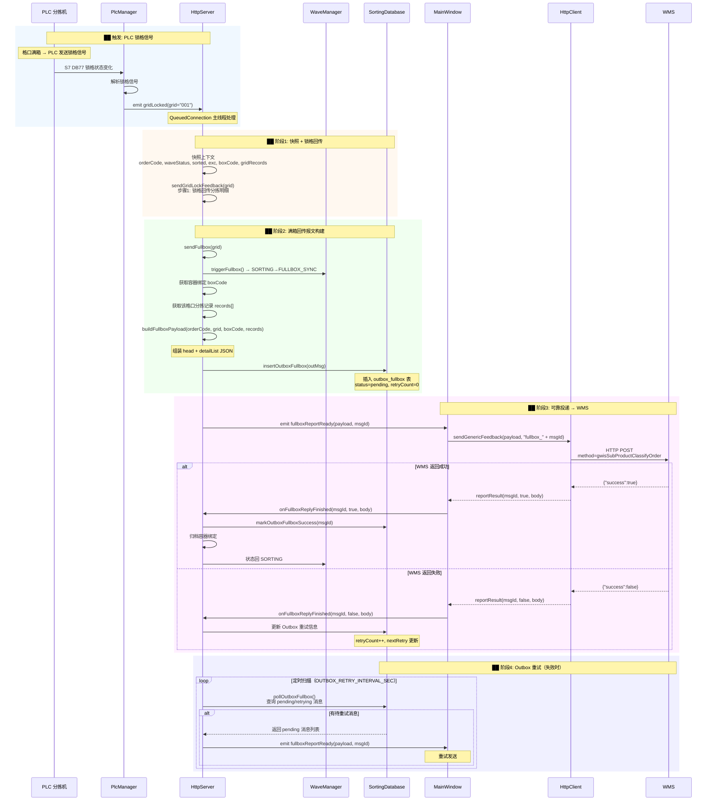
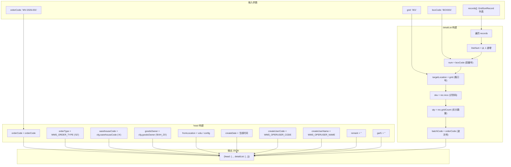
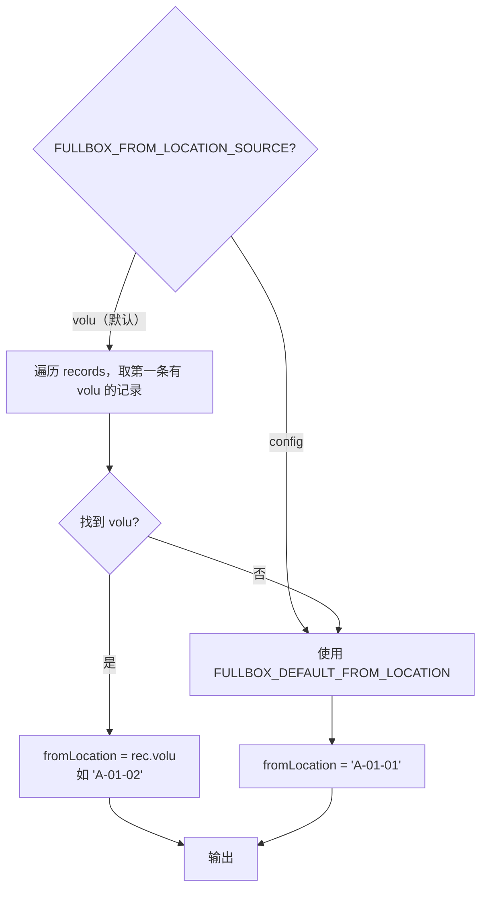
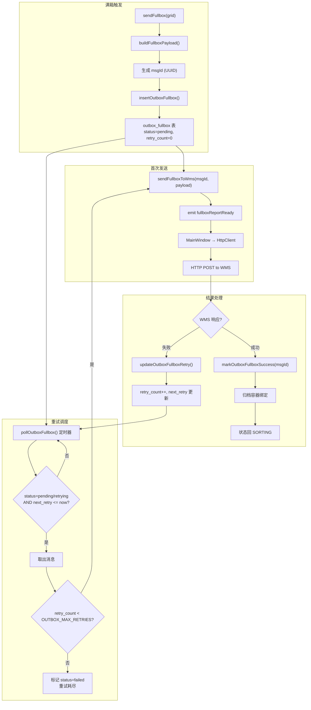

# 满箱回传报文数据流详解（H7 gwisSubProductClassifyOrder）

> 版本: V1.0 | 日期: 2026-08-07 | 方向: WCS → WMS | Method: `gwisSubProductClassifyOrder`

---

## 一、报文位置

这是 **WCS 向 WMS 回传的满箱报文**（H7），在 PLC 发出锁格信号后由 WCS 自动触发。

```
方向: WCS → WMS
Method: gwisSubProductClassifyOrder
报文定义: define.h WMS_METHOD_FULLBOX
```

---

## 二、报文结构

```json
{
    "head": {
        "orderCode":      "WV-2026-001",          // 波次号（H4 下发）
        "orderType":      "02",                    // 业务类型（define.h WMS_ORDER_TYPE）
        "warehouseCode":  "A",                     // 仓库编码（XML 配置）
        "goodsOwner":     "BXH_ZS",                // 货主编码（XML 配置）
        "fromLocation":   "A-01-02",               // 来源库位（volu / config 配置）
        "createDate":     "2026-08-07 14:30:00.000",
        "createUserCode": "WCS_SYS",               // 操作人编码（define.h）
        "createUserName": "WCS系统",                // 操作人名称（define.h）
        "remark":         "",
        "gwf1":           "",                       // 备用字段
        "detailList": [
            {
                "lineNum":        "1",              // 行号（从 1 递增）
                "num":            "BOX001",          // 框号 = 容器号
                "targetLocation": "001",             // 格口号
                "sku":            "WV00000001",      // 识别码/SKU
                "qty":            "5",               // 该容器内实分数量
                "batchCode":      "WV-2026-001"      // 波次号
            },
            {
                "lineNum":        "2",
                "num":            "BOX001",
                "targetLocation": "001",
                "sku":            "WV00000002",
                "qty":            "3",
                "batchCode":      "WV-2026-001"
            }
        ]
    }
}
```

---

## 三、完整触发链路



---

## 四、报文构建详解（buildFullboxPayload）



### fromLocation 取值策略



---

## 五、Outbox 可靠投递机制



### 相关配置宏（define.h）

| 宏 | 默认值 | 说明 |
|----|--------|------|
| `OUTBOX_RETRY_INTERVAL_SEC` | 30 | 重试间隔（秒） |
| `OUTBOX_MAX_RETRIES` | 5 | 最大重试次数 |
| `WMS_METHOD_FULLBOX` | `"gwisSubProductClassifyOrder"` | 满箱回传 method |
| `FULLBOX_FROM_LOCATION_SOURCE` | `"volu"` | fromLocation 来源 |
| `FULLBOX_DEFAULT_FROM_LOCATION` | `"A-01-01"` | 默认来源库位 |

---

## 六、字段映射速查

| JSON 字段 | 来源 | 说明 |
|-----------|------|------|
| `head.orderCode` | WaveManager::orderCode() | 波次号 |
| `head.orderType` | define.h WMS_ORDER_TYPE | 固定 "02" |
| `head.warehouseCode` | XML 配置 cfg.warehouseCode | 仓库编码 |
| `head.goodsOwner` | XML 配置 cfg.goodsOwner | 货主编码 |
| `head.fromLocation` | GridSortRecord.volu / config | 来源库位 |
| `head.createDate` | QDateTime::currentDateTime() | 当前时间 |
| `head.createUserCode` | define.h WMS_OPERUSER_CODE | 操作人 |
| `head.createUserName` | define.h WMS_OPERUSER_NAME | 操作人名称 |
| `detailList[].lineNum` | 自增计数器 | 从 1 开始 |
| `detailList[].num` | boxCode (容器号) | 框号 |
| `detailList[].targetLocation` | grid (格口号) | 目标格口 |
| `detailList[].sku` | GridSortRecord.inco | 识别码/SKU |
| `detailList[].qty` | GridSortRecord.gridCount | 实分数量 |
| `detailList[].batchCode` | orderCode | 波次号 |

---

## 七、代码位置索引

| 步骤 | 文件 | 行号 | 说明 |
|------|------|------|------|
| PLC 锁格信号连接 | [HttpServer.cpp](file:///d:/WCS/WCSApp/WCS_httpServer/WCS_httpServer/HttpServer.cpp#L491-L530) | 491-530 | `gridLocked` → 锁格回传 + 满箱回传 |
| 满箱触发入口 | [HttpServer.cpp](file:///d:/WCS/WCSApp/WCS_httpServer/WCS_httpServer/HttpServer.cpp#L1780-L1872) | 1780-1872 | `sendFullbox()` 完整流程 |
| 报文构建 | [HttpServer.cpp](file:///d:/WCS/WCSApp/WCS_httpServer/WCS_httpServer/HttpServer.cpp#L1705-L1767) | 1705-1767 | `buildFullboxPayload()` |
| 发送到 WMS | [HttpServer.cpp](file:///d:/WCS/WCSApp/WCS_httpServer/WCS_httpServer/HttpServer.cpp#L1878-L1883) | 1878-1883 | `sendFullboxToWms()` → `fullboxReportReady` 信号 |
| 回传结果处理 | [HttpServer.cpp](file:///d:/WCS/WCSApp/WCS_httpServer/WCS_httpServer/HttpServer.cpp#L1890-L1975) | 1890-1975 | `onFullboxReplyFinished()` |
| Outbox 重试调度 | [HttpServer.cpp](file:///d:/WCS/WCSApp/WCS_httpServer/WCS_httpServer/HttpServer.cpp#L1978-L2016) | 1978-2016 | `pollOutboxFullbox()` |
| MainWindow 中继 | [MainWindow.cpp](file:///d:/WCS/WCSApp/WCS_httpServer/WCS_httpServer/MainWindow.cpp#L726-L731) | 726-731 | `fullboxReportReady` → `sendGenericFeedback` |
| 满箱回传 method | [define.h](file:///d:/WCS/WCSApp/WCS_httpServer/WCS_httpServer/define.h#L38) | 38 | `WMS_METHOD_FULLBOX` |
| Outbox 配置 | [define.h](file:///d:/WCS/WCSApp/WCS_httpServer/WCS_httpServer/define.h#L71-L82) | 71-82 | 重试间隔、最大重试次数 |

---

## 八、与 InsertWaveInfo 的对比

| 对比项 | InsertWaveInfo（H4） | 满箱回传（H7） |
|--------|---------------------|---------------|
| 方向 | WMS → WCS | WCS → WMS |
| 触发时机 | WMS 主动下发波次 | PLC 锁格信号自动触发 |
| 报文位置 | 根节点直接 items[] | head.detailList[] |
| 字段用途 | 波次计划（格口分配） | 满箱汇总（实分结果） |
| 可靠性 | 无（WMS 可重试下发） | Outbox 可靠投递 + 重试 |