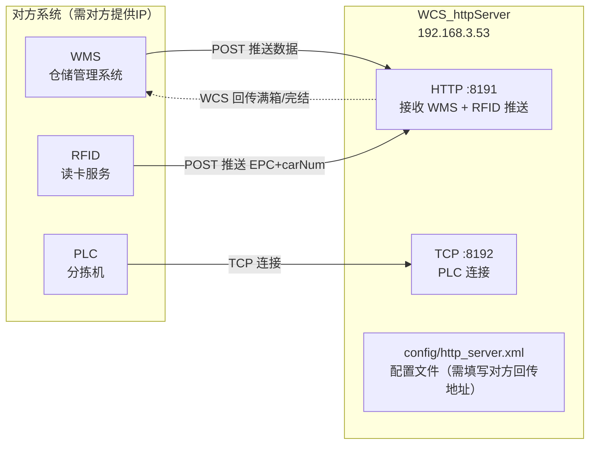
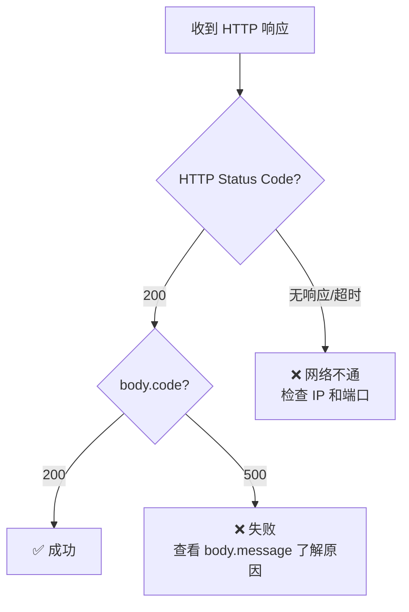
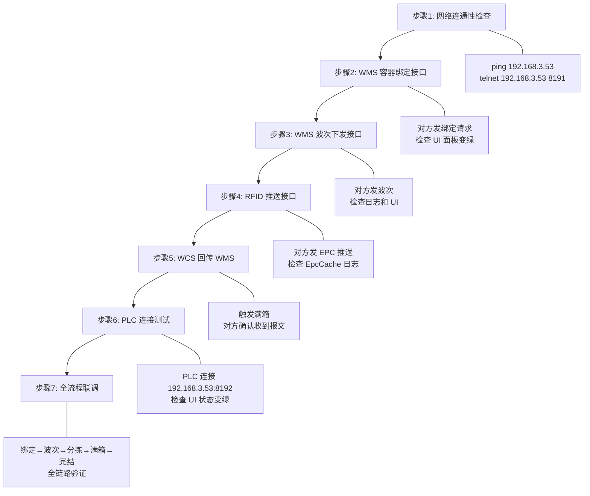

# 现场联合调试指南

> 版本: V3.0 | 日期: 2026-08-10 | 我方 IP: **192.168.3.53**
> 用途: 与客户系统（WMS / RFID / PLC）进行接口联调

---

## 一、接口总览（你需要告诉对方什么）

### 1.1 端口与地址



| 角色 | 我方提供 | 对方需要 | 示例 |
|------|---------|---------|------|
| **WMS** | `http://192.168.3.53:8191` | 对方 HTTP 推送地址 | `http://192.168.3.53:8191/api/DispatchSortingCommand/InsertWaveInfo` |
| **RFID** | `http://192.168.3.53:8191/api/rfid/carNumReport` | 对方 HTTP 推送地址 | 同上（共用 8191 端口） |
| **PLC** | `192.168.3.53:8192` | 对方 TCP 连接地址 | `192.168.3.53:8192` |

> **对方需要提供的信息：**
> 
> | 信息 | 配置位置 | 当前值 |
> |------|---------|--------|
> | WMS 回传 URL | `config/http_server.xml` → `feedbackUrl` | `http://47.93.21.77:9090/gids5/service/...` |
> | WMS 回传 AppKey | `config/http_server.xml` → `appkey` | `dz_bxh_wcs_zs` |
> | RFID SKU-EPC 查询 URL | `config/http_server.xml` → `rfidUrl` | `http://192.168.3.53:9100/open-api/rfid/query` |
> | PLC S7 IP | `config/http_server.xml` → `plcS7Ip` | `192.168.0.1` |

---

## 二、配置文件说明（重要）

### 2.1 配置文件位置

```
{WCS_httpServer.exe 所在目录}/config/http_server.xml
```

### 2.2 联调前必须修改的配置项

| 配置项 | 当前值 | 说明 | 生效方式 |
|--------|--------|------|---------|
| `feedbackUrl` | `http://47.93.21.77:9090/...` | **← 改为对方 WMS 回传地址** | 立即生效 |
| `appkey` | `dz_bxh_wcs_zs` | **← 改为对方给的 AppKey** | 立即生效 |
| `useTestEnv` | `1` | 1=测试环境, 0=正式环境 | 立即生效 |
| `rfidUrl` | `http://192.168.3.53:9100/open-api/rfid/query` | **← 改为对方 RFID 查询地址** | 需重启 |
| `plcS7Ip` | `192.168.0.1` | **← 改为对方 PLC S7 IP** | 需重启 |
| `wmsListenPort` | `8191` | 我方监听端口，一般不改 | 需重启 |
| `plcListenPort` | `8192` | PLC 连接端口，一般不改 | 需重启 |
| `warehouseCode` | `A` | **← 改为对方要求的仓库编码** | 立即生效 |
| `goodsOwner` | `BXH_ZS` | **← 改为对方要求的货主编码** | 立即生效 |

> **注意：** 配置文件中使用 `<rfidUrl>` 标签定义 RFID SKU-EPC 绑定查询地址。旧版配置文件中可能存在 `<rfidQueryUrl>` 标签，这是历史遗留条目，现已统一使用 `<rfidUrl>`。如果旧条目存在，直接删除或忽略即可。

### 2.3 配置文件完整结构

```xml
<?xml version="1.0" encoding="UTF-8"?>
<config>
    <!-- 一、WMS 监听端口（我方提供） -->
    <wmsListenPort>8191</wmsListenPort>

    <!-- 二、WMS 回传接口（对方提供，填写对方 IP:Port） -->
    <feedbackUrl>http://{对方IP}:{对方端口}/gids5/service/thirdPartyData/dz_bxh_wcs_zs</feedbackUrl>
    <appkey>dz_bxh_wcs_zs</appkey>
    <feedbackTestUrl>http://{对方测试IP}:{对方端口}/gids5/service/thirdPartyData/dz_bxh_wcs_cs</feedbackTestUrl>
    <appkeyTest>dz_bxh_wcs_cs</appkeyTest>
    <useTestEnv>1</useTestEnv>  <!-- 1=测试, 0=正式 -->

    <!-- 三、WMS 业务参数（对方提供） -->
    <warehouseCode>A</warehouseCode>
    <goodsOwner>BXH_ZS</goodsOwner>

    <!-- 四、波次管理 -->
    <waveTimeoutMin>0</waveTimeoutMin>
    <maxRetryCount>3</maxRetryCount>

    <!-- 五、网络超时 -->
    <httpTimeoutMs>3000</httpTimeoutMs>
    <waveCompleteTimeoutMs>2000</waveCompleteTimeoutMs>

    <!-- 六、PLC 通信（对方提供 PLC IP） -->
    <plcListenPort>8192</plcListenPort>
    <plcS7Ip>{对方PLC_IP}</plcS7Ip>

    <!-- 七、线程池 -->
    <businessPoolSize>90</businessPoolSize>
    <plcRecvPoolSize>4</plcRecvPoolSize>

    <!-- 八、日志 -->
    <logRetainDays>30</logRetainDays>

    <!-- 九、RFID SKU-EPC 绑定查询 URL（对方提供） -->
    <rfidUrl>http://{对方RFID_IP}:9100/open-api/rfid/query</rfidUrl>

    <!-- 十、API 路由 -->
    <apiInsertWaveInfo>/api/DispatchSortingCommand/InsertWaveInfo</apiInsertWaveInfo>
    <apiBindingLatticePort>/api/DispatchSortingCommand/BindingLatticePort</apiBindingLatticePort>
    <apiInsertWaveIn>/api/DispatchSortingCommand/InsertWaveIn</apiInsertWaveIn>

    <!-- 十一、H7 满箱配置 -->
    <h7FromLocationSource>volu</h7FromLocationSource>
    <h7DefaultFromLocation>A-01</h7DefaultFromLocation>

    <!-- 十二、容器绑定（运行时由 WMS 下发填充） -->
    <binding grid="00001"></binding>
    ...
    <binding grid="00066"></binding>
</config>
```

---

## 三、WMS → WCS：对方需要调用的接口（我方接收）

### 3.1 接口列表

| 序号 | 接口路径 | Method | 用途 | 阶段 |
|------|---------|--------|------|------|
| ① | `/api/DispatchSortingCommand/BindingLatticePort` | POST | 容器格口绑定 | 预绑定阶段 |
| ② | `/api/DispatchSortingCommand/InsertWaveInfo` | POST | 波次下发（格口分配） | 分拣开始 |
| ③ | `/api/DispatchSortingCommand/InsertWaveIn` | POST | 波次取消 | 退货取消 |

### 3.2 通用响应格式

无论成功还是失败，我方统一返回以下 JSON 格式，`code` 统一为**字符串类型**：

**成功响应：**
```json
{
    "code": "200",
    "message": ""
}
```

**失败响应：**
```json
{
    "code": "500",
    "message": "错误描述"
}
```

> **注意：** 部分接口的成功响应中可能额外包含 `sentTime`、`orderCode` 等业务字段，但 `code` 和 `message` 字段始终存在且格式统一。

### 3.3 判断响应成功的方法



**简单判断规则：** `HTTP 200` 且 `body.code` 为 `"200"` 即为成功。`code` 为 `"500"` 时需查看 `message` 了解具体错误原因。

### 3.4 接口 ①：容器格口绑定

**请求（对方 → 我方）：**

```
curl.exe -X POST "http://192.168.3.53:8191/api/DispatchSortingCommand/BindingLatticePort?latticehole=001&boxcode=BOX001"
```

| 参数 | 位置 | 必填 | 说明 |
|------|------|------|------|
| `latticehole` | QueryString | 是 | 格口号（1-66） |
| `boxcode` | QueryString | 是 | 容器号/框号 |

**成功响应：**
```json
{
    "code": "200",
    "message": "收到信息"
}
```

**失败响应示例：**
```json
{
    "code": "500",
    "message": "缺少 latticehole 参数"
}
```

### 3.5 接口 ②：波次下发

> **重要提示：** PowerShell 中 curl 的 `-d` 参数会剥离双引号导致 JSON 格式损坏，**必须**使用 `--data-binary @文件路径` 方式发送请求。

**请求（对方 → 我方）：**

```
curl.exe -v -X POST "http://192.168.3.53:8191/api/DispatchSortingCommand/InsertWaveInfo" -H "Content-Type: application/json;charset=utf-8" --data-binary @D:\test\body.json
```

**body.json 示例：**
```json
{
    "orderCode": "PB202203200003",
    "orderQty": 12312,
    "items": [
        {
            "obxCode": "BOX202203200080",
            "inco": "WV34S1CN2001B60L",
            "epcn": "AC78A59C0C4010A22811029240003546",
            "gridNum": "1",
            "gridNumber": "100",
            "gridType": "普通格口",
            "volu": "1234"
        }
    ]
}
```

| 字段 | 必填 | 说明 |
|------|------|------|
| `orderCode` | 是 | 波次号 |
| `orderQty` | 是 | 总数量 |
| `items[].obxCode` | 否 | 容器号 |
| `items[].inco` | 是 | EPC编码（商品编码），WMS侧称为商品编码，即EPC标签值 |
| `items[].epcn` | 否 | EPC 编码 |
| `items[].gridNum` | 是 | 格口号 |
| `items[].gridNumber` | 否 | 格口分配数量 |
| `items[].gridType` | 是 | 格口类型 |
| `items[].volu` | 否 | 体积/库位（用于满箱回传 fromLocation） |

**成功响应：**
```json
{
    "code": "200",
    "message": "",
    "sentTime": "2026-08-10 12:00:00.000"
}
```

**失败响应：**
```json
{
    "code": "500",
    "message": "具体错误描述"
}
```

**失败响应示例（绑定不完整）：**
```json
{
    "code": "500",
    "message": "格口绑定不完整(60/66)，未绑定格口: [5,12,33,45,58,61]"
}
```

### 3.6 接口 ③：波次取消

> **重要提示：** 同样必须使用 `--data-binary @文件路径` 方式。

**请求（对方 → 我方）：**

```
curl.exe -X POST "http://192.168.3.53:8191/api/DispatchSortingCommand/InsertWaveIn" -H "Content-Type: application/json" --data-binary @cancel.json
```

**cancel.json 示例：**
```json
{
    "orderCode": "WV-2026-001",
    "cancelReason": "业务调整"
}
```

**成功响应：**
```json
{
    "code": "200",
    "message": "取消成功"
}
```

**失败响应（已分拣不允许取消）：**
```json
{
    "code": "500",
    "message": "波次已开始分拣，不允许取消"
}
```

---

## 四、WCS → WMS：我方回传的接口（对方接收）

### 4.1 配置方式

在 `config/http_server.xml` 中修改对方的接收地址（**对方提供，我方填写**）：

```xml
<!-- 回传 URL（WCS → WMS），改为对方提供的实际地址 -->
<feedbackUrl>http://{对方IP}:{对方端口}/gids5/service/thirdPartyData/dz_bxh_wcs_zs</feedbackUrl>
<appkey>{对方给的AppKey}</appkey>

<!-- 测试环境 -->
<useTestEnv>1</useTestEnv>  <!-- 1=测试环境, 0=正式环境 -->
<feedbackTestUrl>http://{对方测试IP}:{对方端口}/gids5/service/thirdPartyData/dz_bxh_wcs_cs</feedbackTestUrl>
<appkeyTest>{对方给的测试AppKey}</appkeyTest>
```

> 配置文件路径：`{WCS_httpServer.exe 所在目录}/config/http_server.xml`
> 修改后**立即生效**（无需重启服务）。

### 4.2 我方回传的接口

| 序号 | method | 方向 | 用途 | 触发时机 |
|------|--------|------|------|---------|
| H7 | `gwisSubProductClassifyOrder` | WCS→WMS | 满箱回传 | PLC 锁格信号触发 |
| H8 | `gwisSubProductClassifyEndOrder` | WCS→WMS | 完结回传 | 波次所有分拣完成 |

### 4.3 满箱回传报文（H7）

我方发送到对方配置的 URL，method 为 `gwisSubProductClassifyOrder`：

```json
{
    "head": {
        "orderCode": "WV-2026-001",
        "orderType": "02",
        "warehouseCode": "A",
        "goodsOwner": "BXH_ZS",
        "fromLocation": "A-01-02",
        "createDate": "2026-08-10 14:30:00.000",
        "createUserCode": "admin",
        "createUserName": "管理员",
        "remark": "",
        "gwf1": "",
        "detailList": [
            {
                "lineNum": "1",
                "num": "BOX001",
                "targetLocation": "001",
                "sku": "WV00000001",
                "qty": "5",
                "batchCode": "WV-2026-001"
            }
        ]
    }
}
```

### 4.4 判断回传成功的方法

对方返回 HTTP 200 且 `body.success == true` 即为成功。我方内部会自动处理：

- **成功** → 归档容器绑定，标记 Outbox 成功
- **失败** → 自动重试（30 秒间隔，最多 5 次）

---

## 五、RFID → WCS：RFID 推送接口（我方接收）

### 5.1 接口信息

```
curl.exe -v -X POST "http://192.168.3.53:8191/api/rfid/carNumReport" -H "Content-Type: application/json;charset=utf-8" --data-binary @rfid.json
```

### 5.2 请求格式

**rfid.json 示例：**
```json
{
    "data": [
        {
            "epc": "AC78A59C0C4010A22811029240003546",
            "barcode": "WV34S1CN2001B60L",
            "carNum": "001"
        }
    ]
}
```

| 字段 | 类型 | 必填 | 说明 |
|------|------|------|------|
| `data[].epc` | string | 是 | EPC 编码 |
| `data[].barcode` | string | 是 | EPC/识别码 |
| `data[].carNum` | string | 否 | 小车号（3位补零），为空时用默认值"001" |

### 5.3 响应格式

```json
{
    "code": "200",
    "message": "OK"
}
```

---

## 六、WCS → RFID：SKU-EPC 绑定查询（我方请求对方）

### 6.1 配置方式

在 `config/http_server.xml` 中配置对方的 RFID 查询地址（**对方提供，我方填写**）：

```xml
<!-- RFID SKU-EPC 绑定查询 URL（WCS 查询 RFID 获取 EPC→barcode 映射） -->
<rfidUrl>http://192.168.3.53:9100/open-api/rfid/query</rfidUrl>
```

> 修改后**需重启服务**。

### 6.2 请求格式（我方 → 对方）

```
POST http://{对方RFID_IP}:{对方RFID端口}/open-api/rfid/query
Content-Type: application/json
```
```json
{
    "epcList": ["EPC00000001", "EPC00000002", "EPC00000003"]
}
```

### 6.3 期望响应格式（对方 → 我方）

```json
{
    "data": [
        {
            "epc": "EPC00000001",
            "barcode": "WV34S1CN2001B60L"
        },
        {
            "epc": "EPC00000002",
            "barcode": "WV34S1CN2001B61L"
        }
    ]
}
```

| 字段 | 说明 |
|------|------|
| `data[].epc` | EPC 编码 |
| `data[].barcode` | EPC/识别码（SKU 绑定结果） |

> **注意：** 此查询是逐条异步处理的，不阻塞主业务流程。查询失败/超时（5秒）不报错，仅记录告警日志。

---

## 七、Mock RFID 服务（联调时对方 RFID 未就绪时使用）

当对方 RFID 系统尚未部署时，可使用以下 Python 脚本在本地模拟 RFID 的 SKU-EPC 绑定查询响应。

### 7.1 Python 脚本

```python
from http.server import HTTPServer, BaseHTTPRequestHandler
import json

class RFIDMock(BaseHTTPRequestHandler):
    def do_POST(self):
        length = int(self.headers.get('Content-Length', 0))
        body = json.loads(self.rfile.read(length)) if length else {}
        if self.path == '/open-api/rfid/query':
            epcList = body.get('epcList', [])
            resp = {"data": []}
            for epc in epcList:
                resp["data"].append({"epc": epc, "barcode": "WV34S1CN2001B60L"})
            self._send_json(resp)
        else:
            self._send_json({"code": "500"}, 404)
    def _send_json(self, data, code=200):
        self.send_response(code)
        self.send_header('Content-Type', 'application/json;charset=utf-8')
        self.end_headers()
        self.wfile.write(json.dumps(data, ensure_ascii=False).encode('utf-8'))
HTTPServer(('0.0.0.0', 9100), RFIDMock).serve_forever()
```

### 7.2 使用方法

1. 在 `192.168.3.53` 上保存脚本为 `rfid_mock.py`
2. 运行：`python rfid_mock.py`
3. 确认 `config/http_server.xml` 中 `rfidUrl` 配置为 `http://192.168.3.53:9100/open-api/rfid/query`
4. 该 Mock 服务对所有 EPC 查询统一返回 `WV34S1CN2001B60L` 作为 SKU 绑定结果

---

## 八、PLC 模拟（联调时对方 PLC 未就绪时使用）

### 8.1 PLC 锁格模拟

在 PLC 未就绪时，可用 PowerShell 脚本模拟 PLC 下发锁格指令：

```powershell
$client = New-Object System.Net.Sockets.TcpClient
$client.Connect("192.168.3.53", 8192)
$stream = $client.GetStream()
$data = [System.Text.Encoding]::UTF8.GetBytes("{001|L}")
$stream.Write($data, 0, $data.Length)
$stream.Close()
$client.Close()
```

> **说明：** `{001|L}` 表示格口 001 锁格（L = Lock）。PLC 通过 TCP 连接 8192 端口发送此指令触发满箱回传。

### 8.2 PLC 落格反馈模拟

模拟 PLC 上报分拣落格反馈：

```powershell
$client = New-Object System.Net.Sockets.TcpClient
$client.Connect("192.168.3.53", 8192)
$stream = $client.GetStream()
$data = [System.Text.Encoding]::UTF8.GetBytes("{WV34S1CN2001B60L|001|001}")
$stream.Write($data, 0, $data.Length)
$stream.Close()
$client.Close()
```

> **格式说明：** `{EPC|格口号|小车号}` —— 表示EPC（商品编码） `WV34S1CN2001B60L` 已落入格口 `001`，由小车 `001` 运输。

---

## 九、完整端到端模拟流程（5 步）

当所有系统就绪后，按以下顺序执行端到端联调：

| 步骤 | 操作 | 命令 / 说明 | 验证点 |
|------|------|------------|--------|
| **步骤 1** | 绑定容器 | `curl.exe -X POST "http://192.168.3.53:8191/api/DispatchSortingCommand/BindingLatticePort?latticehole=001&boxcode=BOX001"` | 响应 `{"code":"200","message":"收到信息"}`，UI 格口 001 变绿 |
| **步骤 2** | 下发波次 | `curl.exe -v -X POST "http://192.168.3.53:8191/api/DispatchSortingCommand/InsertWaveInfo" -H "Content-Type: application/json;charset=utf-8" --data-binary @D:\test\body.json` | 响应 `{"code":"200","message":"","sentTime":"..."}`，UI 显示波次信息 |
| **步骤 3** | RFID 推送小车号 | `curl.exe -v -X POST "http://192.168.3.53:8191/api/rfid/carNumReport" -H "Content-Type: application/json;charset=utf-8" --data-binary @rfid.json` | 响应 `{"code":"200","message":"OK"}`，日志 `./log/EPC/epc.log` 有记录 |
| **步骤 4** | PLC 落格反馈 | PowerShell 执行落格反馈脚本（见 8.2） | 日志 `./log/PLC/plc.log` 有落格记录 |
| **步骤 5** | PLC 锁格 | PowerShell 执行锁格脚本（见 8.1） | 触发满箱回传 WMS，日志 `./log/WCS/wcs.log` 有满箱记录 |

### 9.1 步骤 1 详细说明

```bash
curl.exe -X POST "http://192.168.3.53:8191/api/DispatchSortingCommand/BindingLatticePort?latticehole=001&boxcode=BOX001"
```

**预期响应：**
```json
{"code": "200", "message": "收到信息"}
```

### 9.2 步骤 2 详细说明

先准备 `D:\test\body.json` 文件，内容见 3.5 节。

```bash
curl.exe -v -X POST "http://192.168.3.53:8191/api/DispatchSortingCommand/InsertWaveInfo" -H "Content-Type: application/json;charset=utf-8" --data-binary @D:\test\body.json
```

**预期响应：**
```json
{"code": "200", "message": "", "sentTime": "2026-08-10 12:00:00.000"}
```

### 9.3 步骤 3 详细说明

先准备 `rfid.json` 文件，内容见 5.2 节。

```bash
curl.exe -v -X POST "http://192.168.3.53:8191/api/rfid/carNumReport" -H "Content-Type: application/json;charset=utf-8" --data-binary @rfid.json
```

**预期响应：**
```json
{"code": "200", "message": "OK"}
```

### 9.4 步骤 4 详细说明

在 PowerShell 中执行：

```powershell
$client = New-Object System.Net.Sockets.TcpClient
$client.Connect("192.168.3.53", 8192)
$stream = $client.GetStream()
$data = [System.Text.Encoding]::UTF8.GetBytes("{WV34S1CN2001B60L|001|001}")
$stream.Write($data, 0, $data.Length)
$stream.Close()
$client.Close()
```

### 9.5 步骤 5 详细说明

在 PowerShell 中执行：

```powershell
$client = New-Object System.Net.Sockets.TcpClient
$client.Connect("192.168.3.53", 8192)
$stream = $client.GetStream()
$data = [System.Text.Encoding]::UTF8.GetBytes("{001|L}")
$stream.Write($data, 0, $data.Length)
$stream.Close()
$client.Close()
```

---

## 十、调试步骤（推荐顺序）



### 各步骤详细操作

#### 步骤 1：网络连通性检查

**我方操作：**
```powershell
# 测试能否 ping 通对方 WMS 服务器
ping {对方IP}

# 测试对方 WMS 端口是否可达
Test-NetConnection {对方IP} -Port {对方端口}

# 测试对方 RFID 端口
Test-NetConnection {对方IP} -Port {对方RFID端口}
```

**对方操作：**
```powershell
# 测试能否 ping 通我方
ping 192.168.3.53

# 测试我方 8191 端口是否可达
Test-NetConnection 192.168.3.53 -Port 8191

# 测试我方 8192 端口是否可达（PLC）
Test-NetConnection 192.168.3.53 -Port 8192
```

#### 步骤 2：WMS 容器绑定接口调试

**对方操作：** 发送 66 条绑定请求：
```bash
curl.exe -X POST "http://192.168.3.53:8191/api/DispatchSortingCommand/BindingLatticePort?latticehole=001&boxcode=BOX001"
```

**我方检查：** UI 容器绑定面板中，格口 001 变为绿色。

#### 步骤 3：WMS 波次下发接口调试

**对方操作：** 发送波次数据：
```bash
curl.exe -v -X POST "http://192.168.3.53:8191/api/DispatchSortingCommand/InsertWaveInfo" -H "Content-Type: application/json;charset=utf-8" --data-binary @D:\test\body.json
```

**body.json 示例：**
```json
{
    "orderCode": "TEST-001",
    "orderQty": 5,
    "items": [
        {
            "obxCode": "BOX001",
            "inco": "WV00000001",
            "epcn": "AC78A59C0C4010A22811029240003546",
            "gridNum": "1",
            "gridNumber": "100",
            "gridType": "普通格口"
        }
    ]
}
```

**我方检查：**
- UI 波次信息面板显示波次号、SKU 数、状态
- 日志 `./log/HTTP/http.log` 中有波次下发记录
- 日志 `./log/WAVE_ITEM/wave_item.log` 中有波次明细记录
- 数据库 `./data/sorting_records.db` 中 `return_wave` 和 `return_wave_item` 表有数据

#### 步骤 4：RFID 推送接口调试

**对方操作：** 推送 EPC 数据：
```bash
curl.exe -v -X POST "http://192.168.3.53:8191/api/rfid/carNumReport" -H "Content-Type: application/json;charset=utf-8" --data-binary @rfid.json
```

**我方检查：** 日志 `./log/EPC/epc.log` 中有 `setBatchWithCar` 记录。

#### 步骤 5：WCS 回传 WMS 调试

**我方操作：** 确认 `config/http_server.xml` 中回传 URL 已改为对方地址。

**对方检查：** 能否收到满箱回传（H7）和完结回传（H8）报文。

#### 步骤 6：PLC 连接测试

**对方操作：** PLC 作为 TCP 客户端连接我方 `192.168.3.53:8192`。

**我方检查：** UI 中 PLC 面板 TCP 状态变为绿色"已连接"。

#### 步骤 7：全流程联调

完整流程：绑定 66 个容器 → 下发波次 → PLC 连接 → 分拣落格 → 满箱锁定 → 回传 WMS → 波次完成。

---

## 十一、日志排查指南

| 日志文件 | 路径 | 内容 |
|---------|------|------|
| HTTP 日志 | `./log/HTTP/http.log` | WMS 请求接收、校验、响应 |
| PLC 日志 | `./log/PLC/plc.log` | PLC 连接、发送、接收 |
| WCS 日志 | `./log/WCS/wcs.log` | 波次状态、分拣记录 |
| EPC 日志 | `./log/EPC/epc.log` | EpcCache 读写、TTL 过期、SKU 绑定 |
| 波次明细日志 | `./log/WAVE_ITEM/wave_item.log` | 波次中每条 SKU 的分配明细 |
| 生命周期日志 | `./log/LIFECYCLE/lifecycle.log` | EPC全生命周期 |

### 常见问题排查

| 现象 | 可能原因 | 检查方法 |
|------|---------|---------|
| 对方收不到 WCS 响应 | 端口不通 / 防火墙 | `telnet 192.168.3.53 8191` |
| 绑定返回 code 500 | 参数缺失 | 检查 QueryString 是否有 latticehole 和 boxcode |
| 波次下发返回 code 500 | 容器未全部绑定 | 检查 UI 面板，确认 66 个格口全部变绿 |
| 波次下发返回 code 500 | 波次已分拣 | 先取消旧波次再下发新波次 |
| 满箱回传对方收不到 | `feedbackUrl` 配置错误 | 检查 `config/http_server.xml` 中 feedbackUrl 是否为对方地址 |
| 满箱回传一直重试 | 对方返回 success=false | 看对方日志，检查报文格式是否匹配 |
| EpcCache 查不到 | 过期或未推送 | 看 `EPC/epc.log` 中 setBatch 和 getCarNum 记录 |
| SKU-EPC 绑定查询无响应 | `rfidUrl` 配置错误 | 检查 `config/http_server.xml` 中 rfidUrl 是否为对方地址 |
| 配置文件版本不匹配 | 旧版 XML 缺少新字段 | 首次启动自动生成新版，对比后手动合并 |
| curl 发送 JSON 失败 | PowerShell 中 `-d` 剥离双引号 | 改用 `--data-binary @文件路径` 方式 |

---

## 十二、代码位置索引

| 功能 | 文件 | 行号 |
|------|------|------|
| 响应格式 | [HttpServer.cpp](file:///d:/WCS/WCSApp/WCS_httpServer/WCS_httpServer/HttpServer.cpp) | 1084-1100 |
| 绑定处理 | [HttpServer.cpp](file:///d:/WCS/WCSApp/WCS_httpServer/WCS_httpServer/HttpServer.cpp) | 1108-1246 |
| 波次下发处理 | [HttpServer.cpp](file:///d:/WCS/WCSApp/WCS_httpServer/WCS_httpServer/HttpServer.cpp) | 852-996 |
| 波次取消处理 | [HttpServer.cpp](file:///d:/WCS/WCSApp/WCS_httpServer/WCS_httpServer/HttpServer.cpp) | 1248-1380 |
| RFID 推送处理 | [HttpServer.cpp](file:///d:/WCS/WCSApp/WCS_httpServer/WCS_httpServer/HttpServer.cpp) | 2338-2387 |
| SKU-EPC 绑定查询 | [HttpClient.cpp](file:///d:/WCS/WCSApp/WCS_httpServer/WCS_httpServer/HttpClient.cpp) | 188-260 |
| 满箱回传构建 | [HttpServer.cpp](file:///d:/WCS/WCSApp/WCS_httpServer/WCS_httpServer/HttpServer.cpp) | 1705-1767 |
| 满箱回传发送 | [HttpServer.cpp](file:///d:/WCS/WCSApp/WCS_httpServer/WCS_httpServer/HttpServer.cpp) | 1878-1883 |
| 端口/URL 配置 | [define.h](file:///d:/WCS/WCSApp/WCS_httpServer/WCS_httpServer/define.h) | 12-28 |
| XML 配置文件 | [define.h](file:///d:/WCS/WCSApp/WCS_httpServer/WCS_httpServer/define.h) | 142 |
| 配置文件模板 | [http_server.xml](file:///d:/WCS/WCSApp/WCS_httpServer/WCS_httpServer/config/http_server.xml) | 全文 |