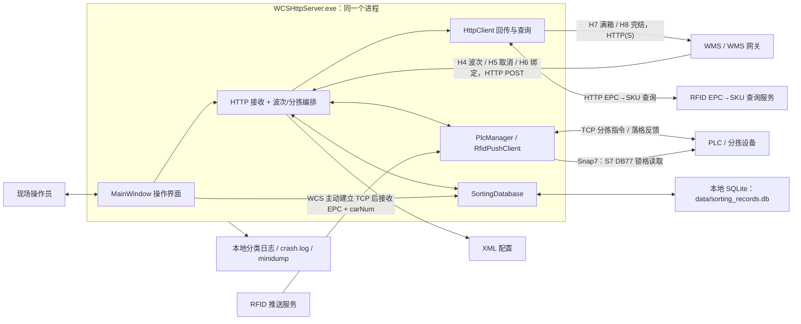
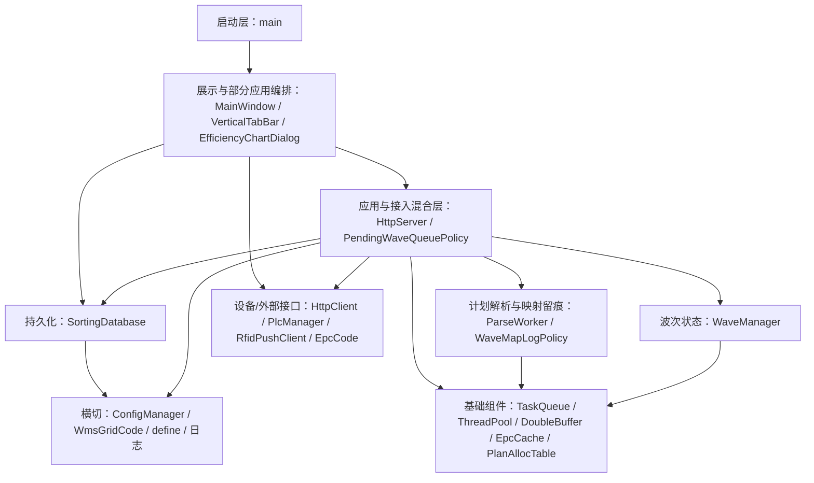
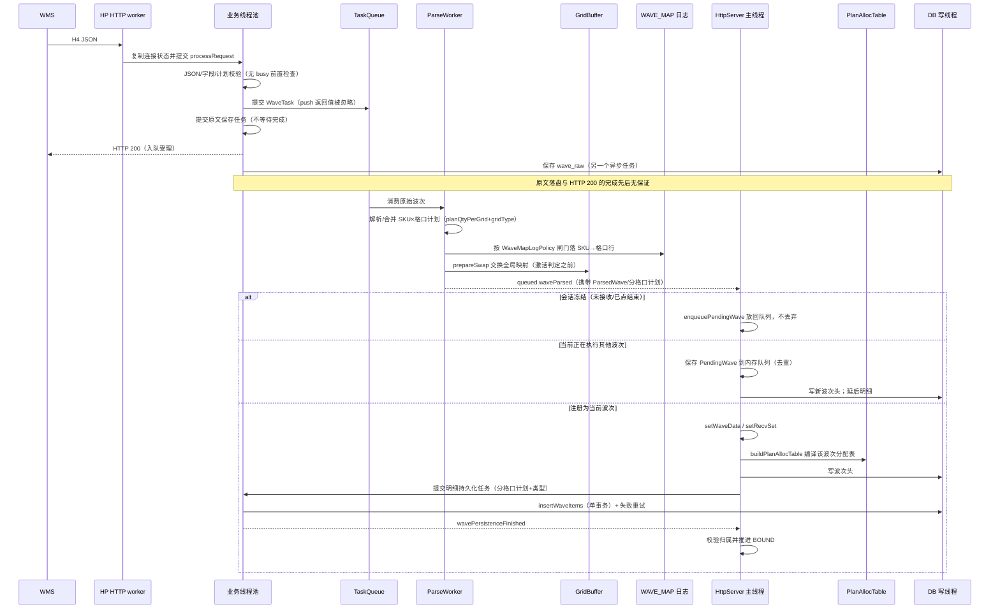
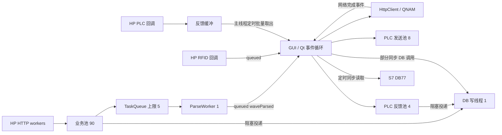
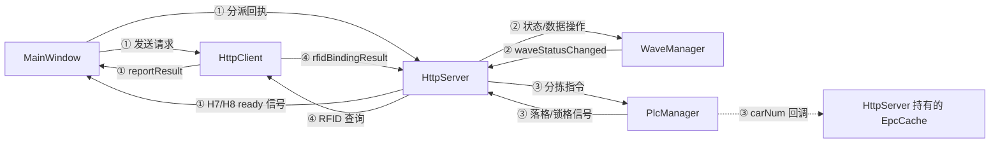
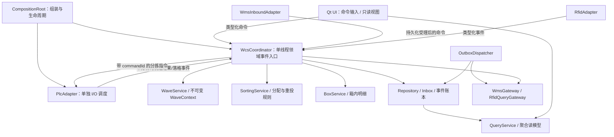
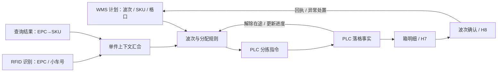

# WCSHttpServer 软件架构分析报告

- 分析日期：2026-09-19（生产运行后复审更新；首版分析日期 2026-09-12）
- 项目目录：D:/WCS/WCSApp/WCS_httpServer
- 基线提交：**c22a78f**（release-2.0「生产稳定运行」+ 波次 SKU→格口映射留痕）；首版基线为 75f66dd，本次审阅范围覆盖 75f66dd..c22a78f 的全部改动。
- 更新说明：项目已正式投入生产使用（release-2.0）。本次更新重新阅读了基线之后的 20 个业务提交（第一方代码 +11,586 / −1,029 行），重新计算模块统计与 include 依赖，逐条复评首版 R1–R16 风险在当前代码中的状态，并把「设计理念/高技术价值」扩写为与当前实现一致；第 5 节风险表标注每条风险的现状（已修复/部分修复/仍存在），源码行号均指向当前工作区。另新增第 10 节「生产运行状态」，依据发布目录文件事实、提交记录与现场根因文档汇总，不代表对运行中进程的实时观测。
- 方法：构建清单核对、第一方源码阅读、调用与信号连接追踪、include 依赖图及强连通分量扫描、基线 diff 归因、配置与测试脚本检查、发布目录与日志时间线核对。
- 边界：本次仍未编译、未启动应用、未连接 WMS/RFID/PLC、未执行集成或压力测试。下文“已确认”指静态代码路径成立；故障发生频率、现场吞吐和二进制实际行为仍需隔离环境验证。
- 范围：以 WCS_httpServer/WCS_httpServer.vcxproj 纳入的实现和其头文件为准；src/ 是另一套未被该工程引用的旧实现。报告不复制配置中的密钥与凭据。
- 补充：第 7–8 节归纳设计理念、关键取舍和高技术价值；基于同一审阅范围，不将设计意图视为已验证的运行保证。
- 一致性说明：模块数量与规模统计、依赖表、风险证据行号均以 2026-09-19 工作区为准；提交信息.md 的自动同步区停留在 2026-09-14（e6dc5b4），之后 5 个提交的完整信息以 git 提交消息为准。

## 架构判断

当前系统是一个 **Windows 上的单进程 Qt Widgets 分拣控制应用**，同时承担操作界面、WMS 接口、RFID 接入、PLC 通信、波次调度、数据持久化和失败补传。项目已正式投入生产使用（release-2.0，2026-09-17 打标，2026-09-19 跟进波次 SKU→格口映射留痕后重构建）。已有模块拆分和部分异步隔离，但模块间的业务边界尚未被接口、独立构建单元或统一状态所有权约束；生产化迭代进一步把计划分配、超计划处置、切出/切回等新规则加进了 HttpServer/MainWindow 两个大文件。

最值得保留的是设备与任务接收的生命周期分离、数据库专用写线程、PLC 反馈批处理、EPC 在途控制、报文落库和人工恢复能力；生产化新增的**计划分配表（编译式计划+在途认领+不变量巡检）、待执行队列出队口径纯函数化、波次切出/切回与断电兜底重建、SKU→格口映射留痕、离线仿真与只读核对脚本**同样值得沉淀。最需要优先处理的是 **PLC 流完整性与反馈缓冲（R3）、Outbox 交付一致性（R7）、退出时的资源所有权（R2）、发送确认语义（R5）、配置并发与凭据脱敏（R10/R14）**。首版 P0 的波次映射隔离已由「每波次分配表 + 队列出队口径」显著收敛，但全局映射仍先于激活交换，跨波次污染窗口未完全关闭（R1 部分修复）。

按同名头文件/实现文件合并，第一方现为 **27 个模块、30,310 物理行**（首版 22 个、19,901 行；净增 10,409 行，其中 5 个新模块合计 1,225 行），包括注释、空行和遗留模块，不含供应商代码及 src/ 副本。HttpServer.cpp 为 8,828 行（+3,327），MainWindow.cpp 为 6,850 行（+3,215），SortingDatabase.cpp 为 2,887 行（+765），PlcManager.cpp 为 1,406 行（+177）。前三者仍承担了大量跨层职责；本轮改动把「按格口计划分配、超计划处置、波次切出/切回」等新业务规则继续加到了 HttpServer 上。

## 1. 系统上下文与外部依赖

### 1.1 系统边界

设备通信、操作界面和接口运行在同一故障域。关闭主窗口现在触发「切出当前波次」（绑定归档+清内存，进度/报文保留 DB 可切回），而非核心组件退出；窗口事件循环的长时间阻塞仍会影响 Qt 网络回调、RFID 业务入口和定时任务。[入口](D:/WCS/WCSApp/WCS_httpServer/WCS_httpServer/main.cpp:158)、[组件组装](D:/WCS/WCSApp/WCS_httpServer/WCS_httpServer/MainWindow.cpp:1349)、[关闭切出](D:/WCS/WCSApp/WCS_httpServer/WCS_httpServer/HttpServer.cpp:3661)

### 1.2 外部交互清单

| 外部对象        | 方向与职责                                                                    | 当前实现/配置依据                                                                              |
| ----------- | ------------------------------------------------------------------------ | -------------------------------------------------------------------------------------- |
| WMS H4      | WMS → WCS，POST /api/DispatchSortingCommand/InsertWaveInfo；提交波次与 SKU/格口计划 | HttpServer::processRequest、validateInsertWaveInfo；路径可配置                                |
| WMS H5      | WMS → WCS，POST /api/DispatchSortingCommand/InsertWaveIn；取消波次             | 分拣开始后的取消有状态限制，并非任意时刻可取消                                                                |
| WMS H6      | WMS → WCS，POST /api/DispatchSortingCommand/BindingLatticePort；绑定格口与容器    | 优先读 query 的 latticehole/boxcode，兼容 JSON body                                           |
| WMS H7      | WCS → WMS；满箱及相关装箱明细回传                                                    | HttpClient::sendGenericFeedback；网关 method 默认 gwisSubProductClassifyOrder               |
| WMS H8      | WCS → WMS；波次完结回传                                                         | HttpClient::sendEndFeedback；独立 URL/method，默认 gwisSubProductClassifyEndOrder            |
| RFID TCP 服务 | WCS 主动连接，服务端推送 EPC 与小车号                                                  | RfidPushClient；默认目标端口 2010；有重连和可配置心跳；EPC 经 EpcCode 规则归一（长度可配），原始整帧三层留痕（run.log/UI/rfid_raw 表） |
| RFID 查询服务   | WCS 根据 EPC 查询 SKU/barcode 映射                                             | HttpClient 的异步 HTTP 查询；Authorization 值来自配置；查询响应侧复用同一 EPC 识别实现                               |
| PLC TCP 对端  | PLC 主动连接 WCS 的 TCP 监听端口；WCS 下发 EPC/格口/小车号，PLC 返回落格结果                     | PlcManager；发送 {EPC\|格口\|车号}；下发前经计划分配表认领（超计划改投异常口 66）；反馈支持 5 字段 {epc\|grid\|firstCar\|lastCar\|status} 与旧 3 字段格式 |
| PLC S7 对端   | WCS 通过 Snap7 读取锁格状态并监测重连                                                 | 当前有效业务为 DB77、偏移 0、25 字节锁格位图；DB1 分拣写入代码已注释；S7 client 与轮询归 PlcManager 独占                                   |
| 操作员         | 接收启停、开始分拣、切换/新建任务、切回、H7/H8 补传、清绑定、查询与配置编辑                                  | MainWindow；操作与应用服务调用直接相连；「关闭=切出 / 开启=新任务 / 切回继续」闭环                                  |
| 本地文件系统      | 保存状态、原始波次、待发报文、配置、日志（含 WAVE_MAP 映射留痕、rfid_raw）与崩溃转储                        | exe 目录下 config/、data/、log/；部分底层日志/崩溃路径还依赖当前工作目录                                        |

有效 HTTP 路由只有上述三个 WMS POST 入口。旧注释中的“查询 API”以及历史 RFID HTTP 推送入口不应作为当前接口能力；未知路径目前返回 500。[路由实现](D:/WCS/WCSApp/WCS_httpServer/WCS_httpServer/HttpServer.cpp:4744)、[旧 RFID 路由删除说明与兜底](D:/WCS/WCSApp/WCS_httpServer/WCS_httpServer/HttpServer.cpp:2376)、[S7 写入停用](D:/WCS/WCSApp/WCS_httpServer/WCS_httpServer/PlcManager.cpp:190)

### 1.3 配置真值与部署差异

配置加载位置是 **实际 exe 所在目录/config/http_server.xml**，缺失时才使用 AppConfig/define.h 默认值生成配置。源码目录的样例不等于运行配置。[加载](D:/WCS/WCSApp/WCS_httpServer/WCS_httpServer/ConfigManager.cpp:359)

| 配置项                 | 源码默认/样例                            | 仓库发布目录配置（release）                      |
| ------------------- | ---------------------------------- | ------------------------------------- |
| WMS HTTP 监听端口       | 8191                               | 8191                                  |
| PLC TCP 监听端口        | 8192                               | **2000**                              |
| RFID TCP 目标端口       | 2010                               | 2010                                  |
| 环境开关                | useTestEnv = 1                     | useTestEnv = 1（运行时日志 env=test）          |
| 业务/PLC 发送/PLC 反馈池大小 | 90 / 8 / 4                         | 90 / 8 / 4                            |
| 业务格口数量              | define.h 固定为 66                    | XML 不覆盖此宏                             |
| WMS 格口编码            | 前缀 22，宽度 3；例如 22007 → 007          | 同样配置                                  |
| 计划分配表                | —                                  | allocEnabled=true；gapMove（禁用/锁格）均开启；在途上限 2000；审计/认领超时均 30000 ms；开工预检仅告警（allocRequirePlanValid=false） |
| 超计划处置                | —（源码样例已含）                        | sortingOverplanPolicy=exception；exceptionGrid=66 |
| EPC 识别长度             | 代码默认 24（define.h:306）               | rfidEpcTruncateLen=**25**；<2 不识别           |
| 同波次重扫重投             | 开启；冷却 1000 ms；最多 3 次；在途超时 30000 ms | 同样配置（rescanResendEnabled=true）          |
| 落格去重/超收             | —                                  | sortingEpcDedup=true；sortingAllowOverrecv=false；orderQtyValidate=strict；conflictPolicy=STRICT_EXCEPTION |
| 波次与绑定参数             | —                                  | expectedBindCount=1；waveTimeoutMin=0；h7FromLocationSource=sobi；h7DefaultTargetLocation=66 |
| HTTP 回传超时            | 3000 ms                            | 10000 ms                               |
| 面板开关                | logEffPanelOn 默认 true（define.h）    | showLivePage=false；showPlanAllocPage=false；logEffPanelOn=true（三者均仅启动时读取；logEffPanelOn 控制运行日志页效率统计面板，原「效率统计」按钮已隐藏） |
| WAVE_MAP 留痕闸门        | define.h:169 上限 5000 SKU，首尾各 30 行    | 同样常量；环境变量 WCS_WAVE_MAP_FULL=1 强制全量        |

证据：[默认常量](D:/WCS/WCSApp/WCS_httpServer/WCS_httpServer/define.h:53)、[业务格口](D:/WCS/WCSApp/WCS_httpServer/WCS_httpServer/define.h:191)、[EPC 长度默认](D:/WCS/WCSApp/WCS_httpServer/WCS_httpServer/define.h:306)、[留痕闸门常量](D:/WCS/WCSApp/WCS_httpServer/WCS_httpServer/define.h:155)、[源码样例](D:/WCS/WCSApp/WCS_httpServer/WCS_httpServer/config/http_server.xml:129)、[发布配置](D:/WCS/WCSApp/WCS_httpServer/release_WcsHttpServer/config/http_server.xml:51)。这些是文件中的值；结合 2026-09-19 08:49 的 WCS.log 启动行（端口 8191/2000、env=test），发布配置当前呈「测试/联调形态」——feedbackTestUrl/rfidQueryUrl/RFID 推送/S7 均指向本机 127.0.0.1 的 mock 对端，不能据此断言现场正以正式 WMS 地址运行。

发布目录还带 config_backup.zip、config_backup/ 下「启用mock前备份」与「还原正式前备份」两组快照（20260906–20260916 多时点），以及 mock_env/启用Mock配置.bat、还原正式配置.bat 两个切换工具；配置根目录存在 2026-09-08/09/15/17/19 多个 bak。这说明现场在「正式 ↔ mock」两套配置间切换已是常规操作，配置管理靠人工备份而非版本化发布。

回传 URL/AppKey/method、环境、HTTP 超时、RFID 查询/心跳及部分波次参数可从 UI 应用热更新（2026-09-19 08:50:23 WCS.log 有「配置热生效」记录）；端口、设备连接地址、线程池、面板开关（showLivePage/showPlanAllocPage/logEffPanelOn 仅启动读一次）需要重启生效。热更新涉及共享配置的并发风险，见第 5 节。[热更新范围](D:/WCS/WCSApp/WCS_httpServer/WCS_httpServer/MainWindow.cpp:2718)

### 1.4 软件与构建依赖

| 依赖                      | 用途与核实结果                                                                                                               |
| ----------------------- | --------------------------------------------------------------------------------------------------------------------- |
| Windows / MSVC          | 单一 Visual Studio C++ 应用工程，Debug/Release 均为 x64，平台工具集 v142；依赖 Win32、Winsock、命名互斥体及 DbgHelp                             |
| Qt 5.15.2 msvc2019_64   | Core、Gui、Widgets、Network、Sql；Debug 另列 PrintSupport/Charts，Release 配置存在手工 PrintSupport 链接；Release 显式 C++17，Debug 未显式统一 |
| Qt VS Tools / QtMsBuild | 负责 moc/uic/rcc；工程依赖外部 Qt 安装及 QtMsBuild 路径                                                                             |
| HP-Socket               | HTTP server、PLC TCP server、RFID TCP client；头文件标识 5.8.5.4；发布使用 HPSocket_U 等库                                           |
| Snap7 / CSiemensPLC     | S7 通信；仓库两份 snap7.h/.cpp 内容相同，实际编译 WCS_httpServer/ 下副本                                                                 |
| Qt SQL 的 QSQLITE 驱动     | 当前数据库调用使用 QSqlDatabase/QSqlQuery，运行依赖匹配的 Qt SQL 插件                                                                    |
| sqlite3.c/.h            | sqlite3.c 被纳入编译，附带头版本 3.46.0；第一方未直接调用 sqlite3_*，**不能以此推定 QSQLITE 内实际 SQLite 版本**                                      |
| hlog / log4cxx          | 分类日志宏及底层输出；发布目录还带相关运行库与 log4cxx.properties                                                                            |
| QCustomPlot 2.1.1       | MainWindow.cpp 内效率图表对话框，直接编译供应商源码                                                                                     |
| 其他随库/发布包附带文件            | HControl、QtXlsx、Vikey、tinyxml2，以及部分 QtWebSockets/OpenSSL/sqlite3 DLL 等；未发现全部都被当前第一方直接使用，是否为传递依赖需通过二进制导入分析确认           |

构建路径大量写死为 D:/Qt 和 D:/WCS/...；Debug/Release 的 include、宏定义与链接清单也不一致。仓库未发现配套 CMake/qmake 工程、CI 构建流水线或可锁定全部依赖的清单。由此可以确认构建可迁移性不足，不能在未构建情况下断言某一配置必然失败。[工程配置](D:/WCS/WCSApp/WCS_httpServer/WCS_httpServer/WCS_httpServer.vcxproj:20)、[链接与编译清单](D:/WCS/WCSApp/WCS_httpServer/WCS_httpServer/WCS_httpServer.vcxproj:58)、[QSQLITE 创建](D:/WCS/WCSApp/WCS_httpServer/WCS_httpServer/SortingDatabase.cpp:248)

## 2. 分层结构与所有模块职责

### 2.1 实际分层

这是从实现抽取的逻辑层次，不是已经隔离的工程层次。整个系统仍只有一个应用构建目标。MainWindow 直接协调回传并访问数据库；HttpServer 同时处理接入协议、波次调度、恢复、EPC 路由、计划分配表、超计划处置、切出/切回和 Outbox；部分“工具”还反向依赖全局配置或 UI 日志头。生产化改造新增了四个「纯逻辑策略头」（PlanAllocTable/PendingWaveQueuePolicy/WaveMapLogPolicy/EpcCode），是模块化的一次进步，但业务主流程仍然集中在 HttpServer/MainWindow 两个大文件里；MainWindow.h 甚至直接 include 了 `../tests/BindingPanelPolicy.h`（产品源码反向依赖 tests 目录，见 4.1）。

### 2.2 第一方模块完整清单

行数为同名 .h/.cpp 合计；头文件实现也计入。表中所有模块均属于当前工程直接编译或纳入的第一方源码。

| 模块                        | 行数    | 主要职责与当前接入情况                                                                                  |
| ------------------------- | -----:| -------------------------------------------------------------------------------------------- |
| main                      | 229   | QApplication 入口；异常/信号崩溃转储、Qt 消息钩子、同登录会话单实例、目录创建、配置加载与显示 MainWindow                           |
| MainWindow                | 7,215 | 全部运行界面（多窗口切换、VerticalTabBar、分配表页）；组件组装；启停/补传/切波次操作；回传结果路由；绑定/波次/EPC/SKU/格口查询；内嵌效率图表与实时数据表 |
| HttpServer                | 9,692 | HP HTTP listener；三条 WMS 路由；拥有核心组件；波次排队/恢复/取消/切出切回、RFID 查询编排、EPC 路由、PLC 反馈处理、H7/H8 构建与调度、效率统计和健康日志；持有计划分配表（PlanAllocTable）与其互斥量，执行待执行队列出队判据（PendingWaveQueuePolicy） |
| WaveManager               | 1,079 | 波次状态、接收/分拣/异常集合与计数、状态快照、超时/重试、开始分拣、恢复和对账基础数据                                                 |
| ParseWorker               | 492   | 专用 QThread 消费 WaveTask，解析 H4，合并 SKU/格口数据、编译 PlanAllocTable、写 WAVE_MAP 映射留痕（WaveMapLogPolicy 判据）、发布 ParsedWave，并发送解析完成/异常信号 |
| HttpClient                | 630   | QNetworkAccessManager；H7/H8 请求、网关参数、超时、业务回执解析；RFID EPC→SKU 查询；EPC 识别（EpcCode）与留痕                             |
| PlcManager                | 1,785 | PLC TCP 监听/连接管理、指令编码/发送、多格口候选/锁格/禁用组合选格、反馈解析/批处理；S7 锁格轮询/重连与设备统计                                        |
| SiemensPLC / CSiemensPLC  | 196   | Snap7 客户端包装；连接、读写 DB、错误处理；保留的 DB1 编码/写入能力在当前主发送链路未启用                                         |
| RfidPushClient            | 522   | HP TCP client；主动连接 RFID、重连/心跳、ASCII 文本帧拼包/拆包；EPC 识别（EpcCode）与原始报文三层留痕；解析后转换为 QJsonObject 业务信号        |
| SortingDatabase           | 3,409 | 单例数据库门面；专用写线程与线程局部查询连接；建表/兼容迁移、计划/实绩/绑定/报文/Outbox/异常/统计的读写；分格口计划（含类型）持久化、绑定波次归属、rfid_raw 等新增表     |
| OutboxManager             | 361   | 泛化 H7/H8 持久化入队、任务扫描、重试与人工补传类；**仍已编译但未发现实例化，当前运行逻辑仍在 HttpServer**                              |
| DoubleBuffer / GridBuffer | 175   | 原子发布 SKU→GridEntry 映射；旧映射延后回收；提供快照、查询和活动裸指针                                                  |
| PlanAllocTable            | 745   | **新增**。波次级「计划分配表」纯数据结构：波次开始一次性编译 SKU×格口 计划/已落/在途/余量，claim/noteIssued/release/commitOnLanded/moveGap/sweepExpiredClaims/audit；不含锁，由 HttpServer 统一加锁 |
| EpcCache                  | 489   | EPC→SKU/小车号缓存、TTL、查询就绪及接收/发送计时；与 HttpServer 的在途/重投状态共同支撑分拣前置条件                               |
| TaskQueue / WaveTask      | 95    | 有界波次解析任务队列，QMutex/QWaitCondition 等待与停止                                                       |
| PendingWaveQueuePolicy    | 79    | **新增**。待执行波次队列「出队时机」纯逻辑判据：允许出队 == 接收中 且 本次会话未点「结束任务」；冻结/放行/队列空四种结论与中文文案              |
| ThreadPool                | 141   | std::thread 通用线程池；带 future 与无等待任务提交，队列/活动统计；当前不提供容量上限或完整排空协议                                 |
| ConfigManager / AppConfig | 601   | XML 读写、默认值、2 秒合并保存、外部文件哈希变化检测；新增 alloc*/超计划/EPC 识别/重扫重投等配置键；提供全局可变配置引用                            |
| WmsGridCode               | 115   | WMS 前缀格口编码与内部补零 key 的转换、归一；直接读取 ConfigManager                                                |
| define                    | 1,255 | 网络/协议/容量/线程/超时/业务常量、日志宏及大量 SQL；新增分格口计划、rfid_raw、WAVE_MAP 等相关常量和 SQL；集中但跨多种职责                          |
| LogService                | 98    | 统一引入分类日志接口和生命周期日志，供业务模块使用                                                                    |
| LifecycleLogger           | 224   | EPC 生命周期事件格式化、关联记录和输出                                                                        |
| log_center / LogCenter    | 254   | hlog/运行日志封装及 UI 日志辅助能力，头文件依赖 QTextEdit                                                       |
| EpcCode                   | 70    | **新增**。RFID EPC 码识别纯函数：在原文中定位首个「A + (长度−1) 位 ASCII 数字」形态（长度 XML 可配，默认 24；release 配置 25）；HttpClient/HttpServer/RfidPushClient 共用          |
| WaveMapLogPolicy          | 63    | **新增**。波次 SKU→格口映射留痕的落行判据（全量/首尾摘要/退化规则）与行数自证，无 IO；由 ParseWorker 调用写 log/WAVE_MAP/wave_map.log        |
| VerticalTabBar            | 268   | **新增**。左侧中文逐字竖排自绘标签栏（Q_OBJECT）；由 MainWindow 实例化，替代/补充原标签页导航                                       |
| WCS_httpServer            | 28    | 旧 Designer 主窗口壳，只调用 ui.setupUi；仍编译/moc/uic，但实际 main 不使用                                      |

模块入口依据：[构建源文件清单](D:/WCS/WCSApp/WCS_httpServer/WCS_httpServer/WCS_httpServer.vcxproj:112)、[核心对象创建](D:/WCS/WCSApp/WCS_httpServer/WCS_httpServer/HttpServer.cpp:40)、[主窗口职责](D:/WCS/WCSApp/WCS_httpServer/WCS_httpServer/MainWindow.h:36)、[旧窗口标记](D:/WCS/WCSApp/WCS_httpServer/WCS_httpServer/WCS_httpServer.h:1)、[计划分配表](D:/WCS/WCSApp/WCS_httpServer/WCS_httpServer/PlanAllocTable.h:1)、[出队判据](D:/WCS/WCSApp/WCS_httpServer/WCS_httpServer/PendingWaveQueuePolicy.h:1)、[映射留痕判据](D:/WCS/WCSApp/WCS_httpServer/WCS_httpServer/WaveMapLogPolicy.h:1)、[EPC 识别](D:/WCS/WCSApp/WCS_httpServer/WCS_httpServer/EpcCode.h:1)、[竖排标签栏](D:/WCS/WCSApp/WCS_httpServer/WCS_httpServer/VerticalTabBar.cpp:1)。

### 2.3 目录职责与遗留资产

| 目录/资产                     | 角色                                                       |
| ------------------------- | -------------------------------------------------------- |
| WCS_httpServer/           | 当前 VS 工程、有效第一方源码、部分供应商源码和源配置样例（样例已落后于发布配置，见 1.3）              |
| src/                      | 同名旧实现集合；未被当前 vcxproj 引用，不能作为现架构主实现                       |
| include/、lib/             | 第三方头/导入库；含当前未发现直接使用的历史依赖                                 |
| release_WcsHttpServer/    | exe（含 .ilk/.pdb）、DLL、Qt 插件、运行配置、数据库、日志（含 WAVE_MAP）/转储、config_backup 与多个 bak 混放；且已被 a9dba1a 整体提交进 git（R18） |
| tests/                     | 9 个用 cl 直接编译产品类的单测入口 + run_tests.bat + BindingPanelPolicy.h（被 MainWindow.h include，见 R19） |
| test/                      | Python/PowerShell/bat 模拟、压力与 E2E 脚本，以及历史结果；其中部分协议和端口已过时  |
| mock_env/                 | RFID/WMS/PLC/S7 模拟、GUI、场景演练和模拟器自测；新增启用Mock配置/还原正式配置两个配置切换 bat        |
| docs/、tools/              | 现场作业流程图/操作手册、20+ 份根因与验证用例文档、只读核对/导出脚本、离线仿真、mermaid 离线渲染工具与流程图产物 |
| _probe/                    | 排查大 H4/HP-Socket 回调、09-18 突发卡顿、绑定时序/失败、DB 插入性能、留痕成本的一次性探针；只表示排查意图 |
| doc/、协议 PDF、提交信息.md     | 设计/历史评估/协议与变更背景；结论优先服从当前源码；提交信息.md 自动同步区停在 2026-09-14（e6dc5b4），本报告写入 docs/ |

## 3. 核心业务数据流、状态与线程模型

### 3.1 核心业务实体

- **Wave/orderCode**：波次和任务上下文；计划数量由 orderQty 表示。
- **SKU/inco**：H4 中商品品种标识，解析后的主映射以 SKU 为 key。不能因旧注释把所有 inco/barcode 都称作 EPC。
- **EPC**：RFID 识别的单件编码；经 EpcCode 规则归一（定位首个「A + (长度−1) 位 ASCII 数字」，长度 rfidEpcTruncateLen 可配），原始整帧三层留痕；通过外部查询获取 SKU，并关联 carNum。
- **Grid**：内部通常归一为三位 key（如 007），对外可编码成 22007；业务配置 66 个，S7 位图覆盖范围为 200 位，两者不是同一个容量。计划格口带类型 gridType（0 分类/1 异常/2 发货）；exceptionGrid=66 是超计划件改投的物理异常口。
- **Container/boxcode**：格口当前容器绑定，决定 H7 装箱归属；绑定记录带波次归属（order_code）与归属纠偏路径。
- **PLC command/feedback**：分拣动作提交与实际落格反馈；分配表认领产生内存 claimId，但当前缺少贯穿两者的独立持久化 commandId。
- **PlanCell/ClaimRef/额度（PlanAllocTable）**：波次级编译计划与运行期配额（landed/reserv/remain），是“已落+在途≤计划”不变量与超计划改投的判定载体。
- **Outbox msgId**：本地回传记录身份和回调关联；其存在不自动构成 WMS 端幂等协议。
- **sumLocation**：当前 WaveSnapshot 用于 H8 的落格计件数；旧 UI/注释中出现的“去重格口总数”不能作为业务口径。[定义](D:/WCS/WCSApp/WCS_httpServer/WCS_httpServer/WaveManager.h:47)

### 3.2 启动与停止

启动顺序：

1. main 注册崩溃捕获和 Qt 日志钩子，创建 QApplication；通过 Local 命名互斥体限制同一登录会话重复打开。
2. 建立 exe 目录下配置/数据/日志目录，加载 XML。
3. MainWindow 创建界面及 HttpServer/HttpClient；HttpServer 创建队列、映射、WaveManager、ParseWorker、PLC/RFID 对象、缓存与线程池，打开数据库。
4. 注入接口配置、绑定、回调及信号连接；自动连接 PLC/RFID、启动解析线程。
5. 默认 AUTO_START_RECEIVE_ON_BOOT=1，在事件循环开始后自动执行一次“开始接收任务”。
6. 启动恢复会读数据库绑定、提示未完成波次；不会自动把历史波次完整恢复为当前分拣任务。

停止分成两层：

- **停止接收**：关闭/重置 WMS HTTP listener，必要时兜底写波次明细（停止时同步补落库）；PLC/RFID/解析组件和部分 Outbox 定时器保持。
- **退出进程**：停止设备/解析与定时器、关闭 DB、释放缓存和线程池。释放顺序已改善（设备→DB→缓存→池→队列/缓冲），但 DB/EpcCache 仍先于业务池/反馈池排空，worker wait 返回值未检查，见 R2。
- 新增“关闭=切出”：MainWindow closeEvent 走 switchOutWaveForExit——绑定归档 + 清内存，进度/明细/未成功 H7/H8 保留 DB，下次可切回继续；启动时只提示不自动装载历史波次。
- UI 的“结束任务”先发起 H8，再等回执/30 秒超时/人工操作进入 stopReceive；结束等待、HTTP 接收开关、m_endRequested（本次会话是否点过结束）和波次状态是几套独立状态。

证据：[启动](D:/WCS/WCSApp/WCS_httpServer/WCS_httpServer/main.cpp:158)、[自动接收](D:/WCS/WCSApp/WCS_httpServer/WCS_httpServer/MainWindow.cpp:260)、[接收/设备生命周期](D:/WCS/WCSApp/WCS_httpServer/WCS_httpServer/HttpServer.cpp:1496)、[析构顺序](D:/WCS/WCSApp/WCS_httpServer/WCS_httpServer/HttpServer.cpp:1214)、[停止兜底补落库](D:/WCS/WCSApp/WCS_httpServer/WCS_httpServer/HttpServer.cpp:1532)、[关闭切出](D:/WCS/WCSApp/WCS_httpServer/WCS_httpServer/HttpServer.cpp:3661)、[启动兜底恢复](D:/WCS/WCSApp/WCS_httpServer/WCS_httpServer/HttpServer.cpp:1610)。

### 3.3 H4 波次接收与计划发布

**时序图表示当前代码，包括其残余缺陷**：全局映射的 prepareSwap 仍发生在主线程激活判定之前（R1 部分修复）。本版新增的隔离手段是——激活时才编译的**每波次计划分配表**、发送前“SKU 属于哪个波次”的判定（排队波次的 SKU 挂起不投）、以及待执行队列的出队口径（PendingWaveQueuePolicy：只有“接收中 且 本次会话未点结束任务”才放行）。会话冻结时 waveParsed 不再丢弃，而是放回待执行队列，解析晚到波次由此保留。

HTTP 200 代表接收路径已经受理，不代表解析、持久化、绑定完成或可分拣。原文虽然会保存到 wave_raw，但保存异步于接收，且 TaskQueue::push 的返回值未作为受理依据（R6 部分修复）。[受理](D:/WCS/WCSApp/WCS_httpServer/WCS_httpServer/HttpServer.cpp:4834)、[push 返回值被忽略](D:/WCS/WCSApp/WCS_httpServer/WCS_httpServer/HttpServer.cpp:4839)、[wave_raw 异步保存](D:/WCS/WCSApp/WCS_httpServer/WCS_httpServer/HttpServer.cpp:4846)、[waveParsed 处理](D:/WCS/WCSApp/WCS_httpServer/WCS_httpServer/HttpServer.cpp:183)、[冻结回队](D:/WCS/WCSApp/WCS_httpServer/WCS_httpServer/HttpServer.cpp:202)、[忙碌排队](D:/WCS/WCSApp/WCS_httpServer/WCS_httpServer/HttpServer.cpp:219)、[激活注册](D:/WCS/WCSApp/WCS_httpServer/WCS_httpServer/HttpServer.cpp:254)、[分配表编译](D:/WCS/WCSApp/WCS_httpServer/WCS_httpServer/HttpServer.cpp:2797)、[映射交换](D:/WCS/WCSApp/WCS_httpServer/WCS_httpServer/ParseWorker.cpp:270)、[留痕落行](D:/WCS/WCSApp/WCS_httpServer/WCS_httpServer/ParseWorker.cpp:287)、[waveParsed 发出](D:/WCS/WCSApp/WCS_httpServer/WCS_httpServer/ParseWorker.cpp:421)

BOUND 当前主要在明细成功落库后推进（wavePersistenceFinished → 状态迁移），并非严格证明所有目标格口都绑定完毕；实际分拣仍由“开始分拣”动作启动，开工前另有计划格口绑定预检（预检默认仅告警，allocRequirePlanValid=false）。[持久化完成处理](D:/WCS/WCSApp/WCS_httpServer/WCS_httpServer/HttpServer.cpp:4385)、[计划预检](D:/WCS/WCSApp/WCS_httpServer/WCS_httpServer/HttpServer.cpp:4226)

### 3.4 RFID → SKU → PLC → 落格数据

1. RfidPushClient 从 TCP 数据流拼接并提取 ASCII 文本帧，先用 EpcCode 规则归一 EPC（在串中定位首个「A + (长度−1) 位 ASCII 数字」，长度 rfidEpcTruncateLen 可配，代码默认 24，release 配置 25），保留识别前原文 epcRaw；原始整帧三层留痕（run.log 十六进制+文本、UI 悬停/弹窗、rfid_raw 表批量落库）。车号从第一段流水号提取，第二段是设备编码，不能直接当作 carNum；空 EPC/NOREAD 只记日志。[帧解析](D:/WCS/WCSApp/WCS_httpServer/WCS_httpServer/RfidPushClient.cpp:299)、[EPC 识别](D:/WCS/WCSApp/WCS_httpServer/WCS_httpServer/RfidPushClient.cpp:355)、[留痕](D:/WCS/WCSApp/WCS_httpServer/WCS_httpServer/RfidPushClient.cpp:208)
2. HttpServer 记录推送/效率、归一 EPC 和小车号，更新 EpcCache；对缺失 SKU 的 EPC 发起 HttpClient 查询。
3. RFID 查询异步返回 EPC→SKU 映射，更新缓存并再次尝试发送；缺 SKU、未到 SORTING、信息未齐等路径有不同挂起/重试处理。
4. trySendToPlcForEpc 校验当前波次、在途、缓存及重扫限制，查当前 SKU/格口映射；发送前增加「SKU 属于当前波次」判定——SKU 属于排队波次时挂起不投。
5. PlcManager 先做只读预查，再经计划分配表认领：claim 按各格口剩余额度选格（多格口升序+游标），noteIssued 登记在途；满额返回 false 时按超计划处置（policy=exception 改投异常口 66，否则按 block 拦截留痕）。计划格口禁用/锁格时 moveGap 把未完成额度转给同 SKU 其他计划格口。
6. PLC 回传落格结果；PlcManager 解析并合并到反馈缓冲，批量信号进入专用反馈池。
7. HttpServer 在反馈池线程经 commitOnLanded 登记（landed 只增、同一 (格口,EPC) 去重、认领不匹配照实记账），处理成功、失败、未知 EPC/SKU、未绑定、落错格、异常口等分支，更新 WaveManager、在途状态、内存格口记录，再写 sorting_records 或 exception_record，并通知界面。落错格件不写明细、不进 H7；异常口 66 的件不计已分拣、不写箱内明细、不进 H7。

当前支持同波次重扫重投，并有冷却窗口、次数限制和在途超时；落格时经统一入口 noteEpcLanded 重置计时（覆盖全部落格分支），保证二次上传/重投可正常重放。重投读取当前 SKU 映射并再次经过分配表选格（已落格 EPC 重投免扣额度），仍不保证与首次实际格口一致；多格口或锁格变化时尤需明确语义。[重新读取映射](D:/WCS/WCSApp/WCS_httpServer/WCS_httpServer/HttpServer.cpp:8519)、[认领与免扣额度](D:/WCS/WCSApp/WCS_httpServer/WCS_httpServer/HttpServer.cpp:2641)、[再次选格](D:/WCS/WCSApp/WCS_httpServer/WCS_httpServer/PlcManager.cpp:456)。**重投动作次数、反馈次数、唯一 EPC 件数不能混为同一个计数**；当前实现和恢复存在口径不一致，见 R8。

证据：[RFID 入口](D:/WCS/WCSApp/WCS_httpServer/WCS_httpServer/HttpServer.cpp:61)、[查询回执](D:/WCS/WCSApp/WCS_httpServer/WCS_httpServer/HttpServer.cpp:7952)、[发送条件](D:/WCS/WCSApp/WCS_httpServer/WCS_httpServer/HttpServer.cpp:8431)、[分配表认领](D:/WCS/WCSApp/WCS_httpServer/WCS_httpServer/HttpServer.cpp:2660)、[改投异常口](D:/WCS/WCSApp/WCS_httpServer/WCS_httpServer/PlcManager.cpp:615)、[落格提交](D:/WCS/WCSApp/WCS_httpServer/WCS_httpServer/HttpServer.cpp:810)、[落错格拦截](D:/WCS/WCSApp/WCS_httpServer/WCS_httpServer/HttpServer.cpp:914)、[异常口反馈分支](D:/WCS/WCSApp/WCS_httpServer/WCS_httpServer/HttpServer.cpp:429)、[计时归零统一入口](D:/WCS/WCSApp/WCS_httpServer/WCS_httpServer/HttpServer.cpp:6653)、[PLC 实际编码发送](D:/WCS/WCSApp/WCS_httpServer/WCS_httpServer/PlcManager.cpp:165)。

### 3.5 H6、H7、H8 与恢复

| 流程      | 正常职责与实际行为                                                                        |
| ------- | -------------------------------------------------------------------------------- |
| H6 绑定   | 校验并更新内存格口→容器映射、通知配置/UI，然后另行提交 DB 绑定；HTTP 回应与 DB 成功仍不是同一个提交点，但绑定落库失败新增 bindPersistFailed 信号可见；归属按优先级判定（报文波次号>当前波次>切出窗口波次>空串待补齐）并经 attributePendingBindsToWave 纠偏 |
| H7 满箱   | 锁格边沿/人工满箱/收尾补发触发；按格口与容器组报文（分格口计划裁剪、异常口/落错格件剔除），写 outbox_fullbox，发送并处理回执；成功后更新报送/绑定相关状态。主路径写库失败仍会发送，补发/人工路径写库失败已阻断（R7） |
| H8 完结   | sendEnd 检查会话，处理未回传格口，建立完结报文与 outbox_end，进入 ENDING；回执、失败耗尽或超时驱动后续状态及 UI 接收停止。仍无“全部 H7 成功”屏障，insertOutboxEnd 结果未检查（R7） |
| 后台补传    | HttpServer 的两个 5 秒定时扫描负责实际调度；MainWindow 把信号转为 HttpClient 请求，并按 context 字符串前缀分发回执。非当前波次扫描标 cancelled 未变，切回时 resendOutbox 统一补发 pending/failed/cancelled |
| 历史恢复/切回 | 人工选波次后，从波次头、计划/原文、实绩/异常、绑定等重建内存；终态（内存+DB 双查）禁止切回；restoreLandedProgress 按 sorting_records 重建分配额度/去重集/箱内明细；绑定只读恢复；未完成状态可恢复后继续操作 |
| 切波次/新任务 | 保存/清理当前运行上下文（切出），维护待执行列表；待执行队列只在「开始接收任务」时出队（点结束后冻结，防止跳波次）；切出保留 120 秒绑定归属窗口；断电兜底：启动只提示不自动装载，绑定兜底归档 |

应把保障范围准确描述为：**已实现本地报文存储、有限重试、人工补偿与切回补发，但尚未形成一致的持久化消息交付闭环**。原因包括主路径 H7 写库失败仍发网、H8 无 H7 成功屏障且不检查入库结果、非当前波次 pending 可被取消（切回补发是补偿而非保证）、状态写入分散，以及未验证 WMS 幂等契约。不能把 OutboxManager 的类名、sort_txn 的唯一索引或日志中的“补传”当作全链路保证；OutboxManager 仍未被实例化。

证据：[H6](D:/WCS/WCSApp/WCS_httpServer/WCS_httpServer/HttpServer.cpp:4906)、[H6 归属判定](D:/WCS/WCSApp/WCS_httpServer/WCS_httpServer/HttpServer.cpp:4924)、[归属纠偏](D:/WCS/WCSApp/WCS_httpServer/WCS_httpServer/HttpServer.cpp:4050)、[H7 发送](D:/WCS/WCSApp/WCS_httpServer/WCS_httpServer/HttpServer.cpp:6132)、[H7 补发阻断](D:/WCS/WCSApp/WCS_httpServer/WCS_httpServer/HttpServer.cpp:6373)、[H8 发送](D:/WCS/WCSApp/WCS_httpServer/WCS_httpServer/HttpServer.cpp:7190)、[H7 扫描](D:/WCS/WCSApp/WCS_httpServer/WCS_httpServer/HttpServer.cpp:6954)、[H8 扫描](D:/WCS/WCSApp/WCS_httpServer/WCS_httpServer/HttpServer.cpp:7547)、[切回恢复](D:/WCS/WCSApp/WCS_httpServer/WCS_httpServer/HttpServer.cpp:2060)、[切出](D:/WCS/WCSApp/WCS_httpServer/WCS_httpServer/HttpServer.cpp:3586)、[进度重建](D:/WCS/WCSApp/WCS_httpServer/WCS_httpServer/HttpServer.cpp:3472)、[启动兜底](D:/WCS/WCSApp/WCS_httpServer/WCS_httpServer/HttpServer.cpp:1610)。

### 3.6 状态模型

WaveStatus 共十种状态，另有三个旧名称别名：

| 值   | 状态             | 当前解读                             |
| ---:| -------------- | -------------------------------- |
| 0   | IDLE           | 没有当前执行波次                         |
| 1   | CREATED        | 波次已注册，明细可能仍在持久化                  |
| 2   | BOUND          | 已准备到可开始阶段；名称比当前实际前置条件更强          |
| 3   | SORTING        | 分拣运行态                            |
| 4   | FULLBOX_SYNC   | 保留的满箱同步态；当前 H7 已尽量从整波次状态迁移中解耦    |
| 5   | CANCEL_PENDING | 取消处理中                            |
| 6   | CANCELLED      | 取消终态                             |
| 7   | ENDING         | 完结回传中                            |
| 8   | FINISHED       | 本地完结态；部分兜底路径也可进入，不能仅凭此证明 WMS 已确认 |
| 9   | HELD           | 异常挂起                             |

主要操作路径为 IDLE → CREATED → BOUND → SORTING → ENDING；终态、失败挂起与人工恢复由多个位置驱动。早期 CREATED/BOUND 可进入取消流程。不能仅从枚举注释推导“所有 H7 必须阻塞分拣”或“FINISHED 必然 H8 成功”。[状态枚举](D:/WCS/WCSApp/WCS_httpServer/WCS_httpServer/WaveManager.h:27)、[H8 会话超时](D:/WCS/WCSApp/WCS_httpServer/WCS_httpServer/HttpServer.cpp:4220)、[H8 回执](D:/WCS/WCSApp/WCS_httpServer/WCS_httpServer/HttpServer.cpp:4286)

实际还有并行状态：接收开关、UI StopPhase、当前/待执行波次、EPC 查询/在途/重投状态、格口物理锁定、业务禁用/绑定及 Outbox pending/success/failed/cancelled。这些状态目前分散在多个类内，缺少统一事件与不变量。

setState 的允许迁移如下；直接赋值/恢复/clearWave 路径并不全部受此表限制：[迁移实现](D:/WCS/WCSApp/WCS_httpServer/WCS_httpServer/WaveManager.cpp:321)

| 当前状态                 | setState 允许的目标状态              |
| -------------------- | ----------------------------- |
| IDLE                 | CREATED                       |
| CREATED              | BOUND、ENDING、CANCELLED、HELD   |
| BOUND                | SORTING、ENDING、CANCELLED、HELD |
| SORTING              | FULLBOX_SYNC、ENDING、HELD      |
| FULLBOX_SYNC         | SORTING、ENDING、HELD           |
| CANCEL_PENDING       | CANCELLED、CREATED、BOUND       |
| CANCELLED / FINISHED | IDLE                          |
| ENDING               | FINISHED、HELD                 |
| HELD                 | IDLE、FINISHED、BOUND           |

状态字段虽使用 atomic，但 load→校验→store 整段迁移不是一次 CAS。开工与取消另外共用互斥锁；不能由此推断所有状态变化都被统一串行化。本版把允许迁移集中到 WaveManager::setState 白名单（WaveManager.cpp:354–417），每次变更经 waveStatusChanged 异步落库；但 clearWave 仍绕白名单直接复位（WaveManager.cpp:517–521）。与波次状态并行的会话状态更多了：接收开关与「本次会话是否点过结束任务」（m_endRequested，PendingWaveQueuePolicy 判据）、切出窗口归属（120 秒）、分配表在途认领与剩余额度。这些并行状态仍分散在 HttpServer/WaveManager/EpcCache/PlanAllocTable 中，无统一事件流。[迁移白名单](D:/WCS/WCSApp/WCS_httpServer/WCS_httpServer/WaveManager.cpp:354)、[clearWave 旁路](D:/WCS/WCSApp/WCS_httpServer/WCS_httpServer/WaveManager.cpp:517)

### 3.7 持久化模型

| 表/数据                | 职责                              | 需注意的边界                                        |
| ------------------- | ------------------------------- | --------------------------------------------- |
| return_wave         | 波次头、计划数量与状态                     | 头与明细/实绩/Outbox 不总在同一事务中更新                     |
| return_wave_item    | 波次 SKU/格口计划：一行=(SKU,格口,grid_type,plan_qty) | 分格口计划随类型持久化，单事务 DELETE+INSERT 替换；旧库经 ALTER 补列迁移；恢复保留分格口计划  |
| wave_raw            | H4 原始 JSON                      | 为重建计划/恢复提供依据，但接收成功与其写入无统一提交点                  |
| sorting_records     | 成功落格实绩、EPC/SKU/格口/小车/容器/时间及报送信息 | 当前 H7 统计、历史查询与切回进度重建的主要来源；异常口件不写行                   |
| grid_box_bind       | 格口容器绑定、波次归属及历史 active 状态      | 同时存在 XML、内存、DB 三份副本；新增归属纠偏 UPDATE 与 idx_bind_order；归档+插入仍非同一事务，无 (格口,active) 唯一约束 |
| outbox_fullbox      | H7 报文、msgId、状态、重试时间/次数          | 当前执行由 HttpServer 承担；主路径写库失败仍发送，补发/人工路径写库失败已阻断              |
| outbox_end          | H8 报文及投递状态                      | 自动扫描按当前波次过滤；insert 结果未检查；无全部 H7 成功屏障                    |
| exception_record    | 未匹配、未绑定、落错格、超计划、超时等异常/留痕      | 包含不同业务语义，恢复不能简单全部算作分拣失败；与面板异常集合计数不同口径              |
| sort_txn            | 设计为单件分拣事务和波次/EPC 唯一性约束          | **insertSortTxn 全仓库无调用方**；isEpcAlreadySorted 查询恒为 false，DB 级防重失效      |
| rfid_raw（新增）       | RFID 整帧原文（原始/解析前后）批量落库           | 主线程 200 帧/1 秒单事务批量写；内存上限 20000 丢最旧；保留 7 天                      |
| wave_history（独立历史库） | 波次完结摘要                          | 位于 data/wave_history.db，只存摘要；不是完整波次数据快照       |
| daily_peak          | 每日效率峰值                          | 当前效率以 RFID 推送窗口计量，不能直接等同 PLC 成功落格产能           |
| log/WAVE_MAP/wave_map.log | 波次 SKU→格口映射留痕（非 DB）           | 解析线程增量落行；SKU≤5000 全量、超出首尾各 30 行摘要；WCS_WAVE_MAP_FULL=1 强制全量  |

主库路径是 exe/data/sorting_records.db，历史摘要另写 exe/data/wave_history.db。读写通过 Qt SQL；多数操作汇聚至一个 QThread，部分查询使用线程局部连接。写连接尝试配置 WAL、synchronous=NORMAL、cache_size=5000；线程局部查询连接名带线程 ID，并设置 busy_timeout=3000。所谓“只读查询连接”未强制只读，而且 cleanupOldRecords 会经该连接执行 DELETE/OPTIMIZE，因此当前不是严格的单写者模型。[连接实现](D:/WCS/WCSApp/WCS_httpServer/WCS_httpServer/SortingDatabase.cpp:236)、[查询连接清理写入](D:/WCS/WCSApp/WCS_httpServer/WCS_httpServer/SortingDatabase.cpp:858)、[独立历史归档](D:/WCS/WCSApp/WCS_httpServer/WCS_httpServer/SortingDatabase.cpp:1848)、[SQL/表定义](D:/WCS/WCSApp/WCS_httpServer/WCS_httpServer/define.h:271)

现有清理入口主要清理 sorting_records 旧数据；不能将“保留 90 天”理解为所有表、报文、异常和部署目录都会被统一清理。[清理实现](D:/WCS/WCSApp/WCS_httpServer/WCS_httpServer/SortingDatabase.cpp:192)

### 3.8 实际线程与调度模型

| 执行域                | 数量/配置                        | 承担的工作与边界                                                                                                           |
| ------------------ | ---------------------------- | ------------------------------------------------------------------------------------------------------------------ |
| GUI / Qt 主线程       | 1                            | MainWindow、HttpServer/WaveManager/HttpClient 等 QObject 的归属线程；UI、QNAM 回执、RFID queued 入口、状态/Outbox/日志/反馈批处理、计划分配表 claim/审计/超时清扫（30s）、rfid_raw 批量落库（1s） |
| HP HTTP I/O worker | 显式配置 16                      | 接收 HTTP、按连接拼 body、提交完整请求到业务池；不等于应用全部 I/O 线程总数                                                                      |
| 业务 ThreadPool      | 默认/发布配置 90                   | HTTP 业务处理、部分数据库任务、报文构造/状态落库；同池不同请求和同波次状态更新可能并发；任务队列无界                                                                  |
| ParseWorker::run   | 1 个 QThread                  | 阻塞消费 TaskQueue 并解析 H4、构建分格口计划；按 WaveMapLogPolicy 闸门写 WAVE_MAP 留痕（低优先级，不碰主线程/UI/DB）；QThread 对象由主线程持有                  |
| PLC 发送池            | 8                            | 异步 TCP 发送；单条实际发送结果经 m_sendResultCb 回主线程，但仅用于释放分配额度（R5）                                                                      |
| PLC 反馈池            | 4                            | 批量落格结果处理、commitOnLanded（分配表唯一跨线程入口，调用方持锁）、内存状态更新和 DB 提交；批次间可能并行                                                         |
| DB 写线程             | 1 个 QThread + QObject target | 写连接和通过 runOnDbThread 调用的操作串行执行；跨线程用 BlockingQueuedConnection，调用者会等待                                                |
| 线程局部查询连接           | 随调用线程懒创建                     | 部分查询及旧记录清理仍在调用者线程同步执行；其他查询仍可能走 DB 线程；不会自动把 UI 查询转到后台（波次列表已改批量查询，但仍在 UI 线程执行）                                          |
| S7 心跳线程            | 1 个 std::thread              | 检查连接、断线重连；锁格轮询与 S7 client 现归 PlcManager 独占（GUI 只收信号，不再共享访问）                                                                  |
| HP PLC/RFID 网络线程   | 由库管理                         | TCP listener/client 回调；不能把默认业务池数当作这些线程数                                                                            |
| hlog/log4cxx 内部执行  | 取决于库/配置                      | 本次未核实库内部线程数量                                                                                                       |

并发保护采用 std::mutex、Qt mutex、atomic、连接状态锁、EpcCache 锁、反馈缓冲锁和波次内部锁等组合。它们能保护部分容器/字段，但不能自动保障跨对象操作原子性、波次归属、事件顺序和对象生命周期。本版的正面改进是：计划分配表的「判定+改数」被约束在 HttpServer 的单一互斥量内（claim/noteIssued/commitOnLanded 同锁），feedback 池的 commitOnLanded 是唯一跨线程入口；S7 锁格轮询也从 GUI 移回了 PlcManager。

例如数据库内部串行只能保证“按到达 DB 队列的顺序执行”，不能保证 90 个业务线程发出的同一波次状态更新仍遵守原始事件顺序；UI 中仍存在同步 DB 查询（波次列表批量查询、统计刷新），其实际延迟需实测。[DB 调度](D:/WCS/WCSApp/WCS_httpServer/WCS_httpServer/SortingDatabase.h:346)、[S7 归 PlcManager](D:/WCS/WCSApp/WCS_httpServer/WCS_httpServer/PlcManager.cpp:804)、[异步状态落库](D:/WCS/WCSApp/WCS_httpServer/WCS_httpServer/HttpServer.cpp:150)

## 4. 模块依赖关系与循环依赖

### 4.1 静态依赖审计方法与结论

扫描第一方 .h/.cpp 的直接 include，将同名头/实现合并为模块，忽略模块自身头、Qt/标准库和供应商库边，再计算强连通分量。

**结果：27 个节点（本版新增 5 个模块），没有包含两个及以上模块的强连通分量，即未发现第一方 include 循环。** 这不意味着没有运行时相互调用，也不意味着线程安全或分层合理。前向声明 HttpClient 仅用于减少头文件依赖，不能据此宣称有循环。需要单列的一条跨目录依赖：MainWindow.h 直接 include `../tests/BindingPanelPolicy.h`（产品源码反向依赖 tests 目录），这也是 vcxproj 把 `$(ProjectDir)..\tests` 加入 include 路径的原因；该边未计入下表 27 节点图。

下表完整列出直接第一方 include 依赖（模块自身 .cpp include 自己 .h 的自环已忽略），未列传递依赖、信号和回调：

| 模块              | 直接依赖的第一方模块                                                                                                                                                          |
| --------------- | ------------------------------------------------------------------------------------------------------------------------------------------------------------------- |
| main            | ConfigManager、LogService、MainWindow                                                                                                                                 |
| MainWindow      | ConfigManager、HttpClient、HttpServer、LogService、PlcManager、SortingDatabase、VerticalTabBar、WmsGridCode、define（另跨目录依赖 tests/BindingPanelPolicy.h）                  |
| HttpServer      | ConfigManager、DoubleBuffer、EpcCache、EpcCode、HttpClient、LogService、ParseWorker、PendingWaveQueuePolicy、PlanAllocTable、PlcManager、RfidPushClient、SortingDatabase、TaskQueue、ThreadPool、WaveManager、WmsGridCode、define |
| WaveManager     | DoubleBuffer、LogService、define                                                                                                                                      |
| ParseWorker     | DoubleBuffer、LogService、PlanAllocTable、TaskQueue、WaveMapLogPolicy、WmsGridCode、define                                                                                 |
| HttpClient      | EpcCode、LogService、define                                                                                                                                           |
| PlcManager      | ConfigManager、EpcCache、LifecycleLogger、SiemensPLC、ThreadPool、define                                                                                                 |
| SiemensPLC      | LifecycleLogger、define                                                                                                                                              |
| RfidPushClient  | EpcCode、LogService、define                                                                                                                                           |
| SortingDatabase | LogService、WmsGridCode、define                                                                                                                                       |
| OutboxManager   | SortingDatabase、define                                                                                                                                              |
| DoubleBuffer    | define                                                                                                                                                              |
| PlanAllocTable  | 无                                                                                                                                                                   |
| EpcCache        | LogService、define                                                                                                                                                   |
| TaskQueue       | 无                                                                                                                                                                   |
| PendingWaveQueuePolicy | 无                                                                                                                                                            |
| ThreadPool      | 无                                                                                                                                                                   |
| ConfigManager   | LogService、define                                                                                                                                                   |
| WmsGridCode     | ConfigManager、define                                                                                                                                                |
| LogService      | LifecycleLogger、log_center                                                                                                                                          |
| LifecycleLogger | 无                                                                                                                                                                   |
| log_center      | define                                                                                                                                                              |
| define          | 无                                                                                                                                                                   |
| EpcCode         | 无                                                                                                                                                                   |
| WaveMapLogPolicy | 无                                                                                                                                                                   |
| VerticalTabBar  | 无；只依赖 Qt                                                                                                                                                            |
| WCS_httpServer  | 无；只依赖 Qt/生成 UI 头（且无任何第一方源引用它）                                                                                                                                     |

HttpServer 直接依赖 17 个第一方模块（首版 14 个），MainWindow 直接依赖 9 个（首版 8 个），仍是依赖最集中的两个入口。这里的数量只表示结构集中程度，不用作单独的质量评分。新增的四个纯逻辑头（PlanAllocTable/PendingWaveQueuePolicy/WaveMapLogPolicy/EpcCode）依赖面为零或很小，是当前最干净的模块边界；但 WmsGridCode、PlanAllocTable、WaveMapLogPolicy 未登记进 vcxproj 的 ClInclude 清单（仅被 include），依赖清单完整性仍不理想。

### 4.2 运行时闭环：单独标记

| 闭环                                                               | 性质与影响                                        |
| ---------------------------------------------------------------- | -------------------------------------------- |
| ① HttpServer → MainWindow → HttpClient → MainWindow → HttpServer | 应用回传闭环；发送、回执分派（仍按 fullbox_/end_/… 字符串前缀）和停止等待依赖 UI，妨碍无界面运行、独立测试和生命周期隔离 |
| ② HttpServer ↔ WaveManager                                       | 协调器修改状态，状态信号反向触发写库/下一波次/挂起重放；迁移已集中到 setState 白名单，但重入、顺序与状态归属仍需管理   |
| ③ HttpServer ↔ PlcManager                                        | 命令/反馈协作现经三个回调（planAlloc 认领/moveGap 缺口搬迁/selectLog 日志）+ 发送结果回调（仅用于释放额度）；小车号回调捕获 HttpServer，增加间接生命周期依赖 |
| ④ HttpServer ↔ HttpClient                                        | RFID 查询/结果闭环；当前主要通过 queued 信号保持 QNAM 线程归属；EPC 识别由双方共用 EpcCode 实现      |

证据：[UI 回传中继](D:/WCS/WCSApp/WCS_httpServer/WCS_httpServer/MainWindow.cpp:1391)、[状态反馈](D:/WCS/WCSApp/WCS_httpServer/WCS_httpServer/HttpServer.cpp:105)、[PLC 小车号回调](D:/WCS/WCSApp/WCS_httpServer/WCS_httpServer/HttpServer.cpp:76)、[回调使用](D:/WCS/WCSApp/WCS_httpServer/WCS_httpServer/PlcManager.cpp:508)、[RFID 回执连接](D:/WCS/WCSApp/WCS_httpServer/WCS_httpServer/HttpServer.cpp:4873)。

HttpServer 还注入了 setLookupCallback，但当前未发现 PlcManager 生产实现调用 m_lookupCb，因此没有把它画成正在使用的查询数据流；本版新增的 m_sendResultCb（实际发送结果）已被调用，但结果仅用于释放分配额度（R5）。运行时反馈闭环本身是正常控制业务，不应全部标成应消除的“循环依赖”；真正要消除的是 UI 中继、隐含所有权和跨线程共享可变状态。

### 4.3 跨层依赖与所有权

- MainWindow 是事实上的组件装配入口，却也解析 fullbox_/end_/resendFullbox_/resendEnd_ 等字符串，承担回传协议的分派；并直接 include ../tests/BindingPanelPolicy.h（R19）。
- HttpServer 通过 QObject parent 持有 WaveManager/ParseWorker/PlcManager/RfidPushClient，通过裸指针持有队列/映射/缓存/线程池，借用数据库单例和 HttpClient；同时持有计划分配表（PlanAllocTable）及其统一互斥量，是分配/调度/回传的事实中心。
- WaveManager 只管理部分内存领域状态，真正业务规则分散在 HttpServer、PlcManager、ParseWorker、PlanAllocTable 和数据库 SQL 中；状态迁移白名单已集中，但 clearWave 旁路仍在。
- 四个纯逻辑头（PlanAllocTable/PendingWaveQueuePolicy/WaveMapLogPolicy/EpcCode）依赖面为零或很小，是与 UI/IO 解耦的正确方向；但产品与测试双向共用头的边界还不清晰（tests/BindingPanelPolicy.h）。
- WmsGridCode 依赖 ConfigManager，导致存储层也间接依赖运行配置；LogService 引入 log_center 的 QTextEdit 依赖，核心业务编译边界仍牵涉 Widgets。
- 独立 OutboxManager 未接入，新增修复集中到 HttpServer；存在“已有抽象但实际另走一套实现”的维护债务。

## 5. 架构优缺点、技术债务与风险

### 5.1 已有优点

1. **现场单机部署路径直接**：一个 exe 联接 WMS 和设备，无额外服务编排要求，界面集成配置、查询和人工补偿；生产化期间持续以「现场口径文档 + 根因文档 + 核对脚本」形式沉淀运行知识。
2. **设备常驻与任务接收分离**：停止接收不必反复 new/delete PLC/RFID，减少日常启停的对象变化；「关闭=切出 / 开启=新任务 / 切回继续」闭环进一步把界面生命周期与波次生命周期分开。
3. **部分耗时操作已隔离**：HTTP I/O 与业务分离、H4 专用解析线程、PLC 发送/反馈分池、DB 写线程和批量事务；新增 rfid_raw 批量落库与 WAVE_MAP 解析线程留痕均刻意避开主链路。
4. **有追溯基础**：保存原始 H4、计划、成功落格、绑定历史、异常、Outbox 和波次摘要，并记录分类日志/崩溃转储；新增 RFID 原始报文三层留痕、SKU→格口映射留痕（带体积闸门）与只读导出。
5. **有恢复与人工处置入口**：能够看历史、恢复波次、切回未完成波次（终态禁入）、补传 H7/H8、清理绑定；断电兜底 + 按 sorting_records 重建已落格进度，比完全依赖内存更易诊断。
6. **已考虑 RFID 重复和在途问题**：缓存、冷却、重投次数、映射复用与在途超时控制之外，计划分配表把「已落+在途≤计划」做成逐格口额度守恒（claim/commit/release 唯一写点 + 不变量巡检），作为重构时的行为基线。
7. **已有验证工具**：包含 RFID/WMS/PLC/S7 模拟、带实际落格/数据库断言的重扫 E2E、7 场景离线仿真、只读核对/导出脚本，以及 9 个用 cl 直接编译产品类的单测入口，可逐步转为自动回归。
8. **纯逻辑策略头开始出现**：PlanAllocTable、PendingWaveQueuePolicy、WaveMapLogPolicy、EpcCode 均无 IO/锁/Qt Widgets 依赖，判据与实现分离、可离线单测，是当前最干净的模块边界。
9. **现场问题处置有据可查**：每次生产缺陷都伴随根因文档与测试（跳波次、切回、EPC 识别、绑定归属、多格口分配等），形成「现场实录 → 根因 → 修复 → 用例」的闭环记录。

这些是实现能力，并非本次对吞吐、无丢件或可靠交付的验收结果。

### 5.2 风险分级原则

- **P0：优先修复**。静态路径涉及错波次路由、丢失业务反馈或访问失效资源，应在扩大现场负载或继续改造前处理。
- **P1：近期收敛**。影响发送确认、持久化、幂等、恢复、输入边界或状态一致性。
- **P2：持续治理**。影响维护成本、可测性、部署复现与观测质量。

优先级是本次架构评估建议。表内“已确认”不等于现场已复现每一种后果。**状态列为 2026-09-19 复评结论**：✅已修复 = 静态路径上的确定缺陷已消除（残余问题并入其他风险）；🟡部分修复 = 主缺陷缓解或新增机制兜底，但触发窗口/边界仍存在；🔴仍存在 = 与首版一致的确定路径未改。

### 5.3 核心风险清单

| 编号/优先级                       | 状态      | 当前实现与触发条件                                                                                        | 影响及建议                                                                      |
| ---------------------------- | ------- | ------------------------------------------------------------------------------------------------- | -------------------------------------------------------------------------- |
| **R1 / P0** 波次上下文未隔离         | 🟡部分修复  | 隔离落到激活时编译的每波次分配表 + 发送前波次归属判定 + 队列出队口径；但 ParseWorker 仍先 prepareSwap 后 emit（ParseWorker.cpp:270/421），buildWaveItems/PLC 反馈/trySendToPlcForEpc/预检仍读全局 activeMap | 执行 A 时解析 B 仍可污染全局映射读取。建议解析产出 ParsedWave、批准激活时一次切换 waveId/generation/map，所有读取点改走波次上下文     |
| **R2 / P0** 退出释放早于工作结束       | 🟡部分修复  | 析构顺序改善（stopReceive→stopDevices→DB→EpcCache→业务池/反馈池→队列/缓冲），ThreadPool 析构 join；但 worker wait(3s) 返回值未检查，DB/EpcCache 仍先于池排空 | 池内已入队任务可在 DB 关闭/EpcCache 释放后执行；wait 超时后仍删队列/缓冲。建立排空→join→释放的退出协议并检查 wait 结果                     |
| **R3 / P0** PLC 流完整性不足       | 🔴仍存在   | 无跨回调拼包，半帧静默丢弃；反馈缓冲满 200 时丢最新条目（与 define.h:223 注释相反）、编译期宏不可配；业务只走批量信号，m_feedbackCb 无调用方 | 业务反馈可在 TCP 分片/缓冲满时静默丢失（账务丢失）。按连接 framing、有界业务队列、满即告警/限流，UI 采样与业务队列分开                        |
| **R4 / P0** 待执行队列悬空引用        | ✅已修复   | 改为 takeFirst() 值拷贝 + 失败 prepend 回滚；出队唯一放行 = PendingWaveQueuePolicy 判据（接收中且未点结束）；冻结回队 + 队列去重 | 悬空引用与跳波次路径已消除。剩余：队列无容量上限，并入 R13                                                        |
| **R5 / P1** 入队被当作发送成功        | 🟡部分修复  | 单条真实发送结果已经 m_sendResultCb 回传，但只用于释放分配额度；successCount++/failCount==0 仍是入队口径；上层照旧 markSent/markInFlight 且日志称“发送成功” | 断连或发送失败仍被视为在途。区分 queued、transport_sent、feedback_received/failed，超时从真正发送时点计算                              |
| **R6 / P1** 接收确认与可靠存储脱节      | 🟡部分修复  | H4 push 返回值仍被忽略、HTTP 200 早于 wave_raw/明细持久化；H6 仍先回应后异步绑定，但新增 bindPersistFailed 可见；停止时兜底补落库 | 竞争或崩溃窗口仍可“已成功应答但未保存”。以原子 enqueue/持久化 Inbox 成功作为受理依据                        |
| **R7 / P1** Outbox 交付边界不完整   | 🔴仍存在   | 主路径 H7 写库失败仍发送；H8 不检查 insertOutboxEnd 结果、无全部 H7 成功屏障；非当前波次扫描仍标 cancelled（切回 resendOutbox 是补偿）；H8 成功后同时停两个重试定时器。补发/人工路径已阻断写库失败发送 | 无法稳定保证恢复补发，WMS 完结可能先于所有箱单确认。统一持久化投递状态（可复用已死的 OutboxManager），明确 H7/H8 前置契约                        |
| **R8 / P1** 计件、幂等与恢复口径分裂     | 🟡部分修复  | 内存 (格口,EPC) 去重、落格即计时归零统一入口、恢复按 sorting_records 重建额度/去重集/H7 明细；但 insertSortTxn 无调用方 → DB 防重恒 false；内存去重键不含 orderCode；实时计数（反馈次数）与恢复（DISTINCT EPC）口径仍有差异 | UI/H8 与 H7/DB 数量可能不同。分开反馈事件、唯一实物结果、诊断异常和装箱账本，把 sort_txn 接入主路径或删除                    |
| **R9 / P1** 多格口计划损失信息        | 🟡部分修复  | 分配正确性已不依赖 contains（planQtyPerGrid 用归一 3 位 key），分格口计划+类型持久化与恢复（单事务 DELETE+INSERT）；但 contains 判重仍留在遗留 gridNum 兜底路径，allocEnabled=false 回退老逻辑，每 SKU 首行属性仍单值 | 字符串层误判仍可能影响兜底路径；“12”含“2”问题应通过删除旧串兜底根治。采用 SKU→Allocation 列表和类型化 GridId                       |
| **R10 / P1** 共享状态和事件顺序缺统一所有权 | 🔴仍存在   | 配置仍原地无锁热重载（config() 裸引用、外部改动原地 load）；波次迁移已集中 setState 白名单但 clearWave 旁路；S7 已归 PlcManager 独占 | 存在配置数据竞争与状态旁路窗口。不可变配置快照/带版本写入、单业务事件线程、状态机无旁路                                 |
| **R11 / P1** 映射回收依赖固定时间      | 🔴仍存在   | DoubleBuffer 仍暴露裸指针 activeMap、按 5 秒延后回收、不跟踪读者 | 长遍历叠加换表可悬空读。使用共享所有权的不可变映射快照                                         |
| **R12 / P1** 数据库一致性和就绪条件不完整  | 🟡部分修复  | insertWaveItems 已原子单事务、绑定归属纠偏与新索引落地；但绑定归档+插入仍非同一事务、无 (格口,active) 唯一约束、DDL 仍 ad-hoc ALTER、清理仍经查询连接写库 | 可能出现绑定缺失/多活跃、迁移不可回退。事务替换、唯一约束、版本化迁移与逐步就绪检查                                     |
| **R13 / P1** 背压与输入信任薄弱       | 🔴仍存在   | HTTP body 无上限、入站无鉴权、TaskQueue 上限 5、待执行波次队列与 ThreadPool 任务队列无界、HTTP/PLC 监听 0.0.0.0 | 大请求/波次洪泛可耗尽资源；暴露范围取决于网络隔离。设置字节/数量/并发上限、明确拒绝语义，核实部署访问控制                      |
| **R14 / P1** 配置/日志暴露凭据       | 🔴仍存在   | HttpClient 出站日志全量输出含 appkey 的 URL 与 AppKey；UI 配置摘要仍全量打印；新代码（RFID 留痕/WAVE_MAP）未引入新泄露但旧路径无脱敏 | 凭据进入日志和界面。密钥外置、日志脱敏；保留协议必要字段但避免无必要复制                                    |
| **R15 / P2** UI 和业务运行耦合      | 🟡部分修复  | 波次列表 N+1 已改批量 GROUP BY；S7 移出 GUI；但 H7/H8 字符串前缀分派仍在 MainWindow、UI 同步 DB 查询仍在（WAL 只读连接缓解） | 查询/绘制/设备延迟仍可影响业务调度。抽出协调器、后台查询与聚合读模型；UI 命令类型化                          |
| **R16 / P2** 构建、测试和遗留实现漂移    | 🔴仍存在   | Debug/Release 参数仍漂移（Debug 疑似过期）、绝对路径、src 死代码、OutboxManager 死代码；新增：产品代码 include ../tests/BindingPanelPolicy.h（vcxproj 加 ..\tests）、PlanAllocTable/WaveMapLogPolicy 未登记 vcxproj | 修改落错位置、发版不易复现。单一源码入口、构建清单、共用纯逻辑头回迁产品目录、遗留清理                              |
| **R17 / P1** 生产配置漂移与人工切换（新增） | 🔴新增    | release 配置当前为测试/联调形态（useTestEnv=1、下游全指 127.0.0.1）；正式/测试 URL、端口在源码样例与发布配置间漂移；切换靠人工备份（启用Mock/还原正式.bat + 多个 bak，20260906–20260919 多时点） | 存在误用 mock 配置上线、正式/测试地址混用的风险。配置模板+差异校验+发布清单，切换工具纳入版本管理并校验生效值                        |
| **R18 / P2** 生产数据与日志入库（新增）   | 🔴新增    | 提交 a9dba1a 把整个发布目录（含现网 sorting_records.db 与全部日志快照，+459,020 行）提交进 git | 仓库膨胀、业务数据入版本库、配置/凭据随库传播。发布资产与源码库分离，db/日志进 .gitignore，凭据外置                          |
| **R19 / P2** 产品源码反向依赖测试目录（新增） | 🔴新增    | MainWindow.h:54 include ../tests/BindingPanelPolicy.h；vcxproj 为此把 $(ProjectDir)..\tests 加入 include 路径 | 产品构建依赖 tests 目录、共用头职责不清。把共用纯逻辑头迁入产品目录（如 policies/），测试反向引用产品                     |

### 5.4 关键风险源码证据与影响边界

以下行号均指向 2026-09-19 工作区（HEAD c22a78f），与首版证据的漂移对照见各子代理核查记录（要点：HttpServer.cpp:1778→4019、5455→5429、992→1017、1587→1597、540→518；ParseWorker.cpp:200→270；~HttpServer 764→1214）。

**R1/R4/R9：波次上下文、队列口径与分格口计划。**

R1 的确定路径仍在但已加装两层隔离：隔离一是激活时编译的每波次分配表 + 发送前“SKU 属于当前波次”判定；隔离二是待执行队列出队口径（R4）。残余的是全局 GridBuffer 仍先于激活判定被解析线程交换，且明细构建/PLC 反馈/发送条件/开工预检都还读全局 activeMap——执行 A 时解析 B，A 的落格校验会拿 B 的计划比对，可能误判落错格。R9 的分配正确性已不依赖 contains 判重，但旧 gridNum 逗号串仍作为兜底候选存在。

证据：[先交换后发信号](D:/WCS/WCSApp/WCS_httpServer/WCS_httpServer/ParseWorker.cpp:270)、[waveParsed 发出](D:/WCS/WCSApp/WCS_httpServer/WCS_httpServer/ParseWorker.cpp:421)、[冻结回队](D:/WCS/WCSApp/WCS_httpServer/WCS_httpServer/HttpServer.cpp:202)、[忙碌排队](D:/WCS/WCSApp/WCS_httpServer/WCS_httpServer/HttpServer.cpp:219)、[分配表编译](D:/WCS/WCSApp/WCS_httpServer/WCS_httpServer/HttpServer.cpp:2797)、[从全局映射建明细](D:/WCS/WCSApp/WCS_httpServer/WCS_httpServer/HttpServer.cpp:4160)、[PLC 反馈读全局映射](D:/WCS/WCSApp/WCS_httpServer/WCS_httpServer/HttpServer.cpp:521)、[发送条件读全局映射](D:/WCS/WCSApp/WCS_httpServer/WCS_httpServer/HttpServer.cpp:8519)、[切出清映射](D:/WCS/WCSApp/WCS_httpServer/WCS_httpServer/HttpServer.cpp:3617)、[取消清映射](D:/WCS/WCSApp/WCS_httpServer/WCS_httpServer/HttpServer.cpp:5426)、[值拷贝出队](D:/WCS/WCSApp/WCS_httpServer/WCS_httpServer/HttpServer.cpp:4025)、[队列去重回滚](D:/WCS/WCSApp/WCS_httpServer/WCS_httpServer/HttpServer.cpp:3921)、[出队判据](D:/WCS/WCSApp/WCS_httpServer/WCS_httpServer/PendingWaveQueuePolicy.h:43)、[归一累加免疫 contains](D:/WCS/WCSApp/WCS_httpServer/WCS_httpServer/ParseWorker.cpp:182)、[contains 残留兜底](D:/WCS/WCSApp/WCS_httpServer/WCS_httpServer/ParseWorker.cpp:158)、[分格口计划持久化](D:/WCS/WCSApp/WCS_httpServer/WCS_httpServer/SortingDatabase.cpp:1420)、[恢复保留分格口计划](D:/WCS/WCSApp/WCS_httpServer/WCS_httpServer/HttpServer.cpp:2261)。

**R2/R3/R5：所有权与设备数据完整性不能由停止标志补救。**

R2 顺序已改善，但「DB/EpcCache 先关、池后 join」意味着已入池任务会在资源释放后执行；worker wait(3s) 返回值被忽略，超时后仍删除队列与缓冲。R3 仍无跨回调拼包，缓冲满丢新条目与注释相反；业务唯一入口是批量信号，缓冲满即账务丢失。R5 已能回传单条真实发送结果，但该结果只用于释放分配额度，成功计数仍是入队口径。

证据：[析构顺序](D:/WCS/WCSApp/WCS_httpServer/WCS_httpServer/HttpServer.cpp:1214)、[DB 先关](D:/WCS/WCSApp/WCS_httpServer/WCS_httpServer/HttpServer.cpp:1244)、[EpcCache 先删](D:/WCS/WCSApp/WCS_httpServer/WCS_httpServer/HttpServer.cpp:1250)、[wait 返回值未查](D:/WCS/WCSApp/WCS_httpServer/WCS_httpServer/HttpServer.cpp:1597)、[线程池部分排空](D:/WCS/WCSApp/WCS_httpServer/WCS_httpServer/ThreadPool.h:117)、[PLC 接收无拼包](D:/WCS/WCSApp/WCS_httpServer/WCS_httpServer/PlcManager.cpp:1121)、[整帧正则](D:/WCS/WCSApp/WCS_httpServer/WCS_httpServer/PlcManager.cpp:1186)、[缓冲满丢新](D:/WCS/WCSApp/WCS_httpServer/WCS_httpServer/PlcManager.cpp:1316)、[批量信号唯一业务入口](D:/WCS/WCSApp/WCS_httpServer/WCS_httpServer/PlcManager.cpp:1390)、[业务入口](D:/WCS/WCSApp/WCS_httpServer/WCS_httpServer/HttpServer.cpp:380)、[容量宏不可配](D:/WCS/WCSApp/WCS_httpServer/WCS_httpServer/define.h:223)、[真实结果回传](D:/WCS/WCSApp/WCS_httpServer/WCS_httpServer/PlcManager.cpp:700)、[入队即 successCount++](D:/WCS/WCSApp/WCS_httpServer/WCS_httpServer/PlcManager.cpp:713)、[结果仅用于释放额度](D:/WCS/WCSApp/WCS_httpServer/WCS_httpServer/HttpServer.cpp:2962)、[上层仍标记已发送/在途](D:/WCS/WCSApp/WCS_httpServer/WCS_httpServer/HttpServer.cpp:8771)。

**R6/R7/R8：成功应答、写库成功、发出、对端接受是四个不同提交点。**

R6 的 H4 受理仍以「push 返回值被忽略」为前提；H6 先回应后绑定未变，但绑定失败现在可见。R7 只有补发/人工路径把写库失败当硬门槛，主路径与 H8 依旧；非当前波次自动扫描标 cancelled 未变，切回补发是补偿。R8 的去重与重建口径已统一到 sorting_records，但 sort_txn 全库无写入调用，DB 级防重恒为 false。

证据：[H4 受理](D:/WCS/WCSApp/WCS_httpServer/WCS_httpServer/HttpServer.cpp:4834)、[push 返回值忽略](D:/WCS/WCSApp/WCS_httpServer/WCS_httpServer/HttpServer.cpp:4839)、[H6 先回应后绑定](D:/WCS/WCSApp/WCS_httpServer/WCS_httpServer/HttpServer.cpp:4906)、[绑定失败可见](D:/WCS/WCSApp/WCS_httpServer/WCS_httpServer/HttpServer.cpp:4976)、[停止兜底补落库](D:/WCS/WCSApp/WCS_httpServer/WCS_httpServer/HttpServer.cpp:1532)、[主 H7 入库失败仍发送](D:/WCS/WCSApp/WCS_httpServer/WCS_httpServer/HttpServer.cpp:6132)、[补发路径阻断](D:/WCS/WCSApp/WCS_httpServer/WCS_httpServer/HttpServer.cpp:6373)、[H8 不检查入库](D:/WCS/WCSApp/WCS_httpServer/WCS_httpServer/HttpServer.cpp:7190)、[非当前波次 cancelled](D:/WCS/WCSApp/WCS_httpServer/WCS_httpServer/HttpServer.cpp:6954)、[H8 成功停两定时器](D:/WCS/WCSApp/WCS_httpServer/WCS_httpServer/HttpServer.cpp:7384)、[切回补发](D:/WCS/WCSApp/WCS_httpServer/WCS_httpServer/HttpServer.cpp:2487)、[内存去重](D:/WCS/WCSApp/WCS_httpServer/WCS_httpServer/HttpServer.cpp:2731)、[明细写前检查](D:/WCS/WCSApp/WCS_httpServer/WCS_httpServer/HttpServer.cpp:973)、[insertSortTxn 无调用方](D:/WCS/WCSApp/WCS_httpServer/WCS_httpServer/SortingDatabase.cpp:1960)、[进度重建](D:/WCS/WCSApp/WCS_httpServer/WCS_httpServer/HttpServer.cpp:3472)、[计时归零统一入口](D:/WCS/WCSApp/WCS_httpServer/WCS_httpServer/HttpServer.cpp:6653)。

**R10/R11/R12：跨层共享数据缺少明确不变量。**

配置仍原地无锁重载；波次状态迁移已收敛到白名单但 clearWave 旁路仍在；分配表的「判定+改数」是当前唯一把不变量写进代码的数据结构（audit 巡检），但 GridBuffer 裸指针和绑定两步写未改。

证据：[裸配置引用](D:/WCS/WCSApp/WCS_httpServer/WCS_httpServer/ConfigManager.h:161)、[原地重载](D:/WCS/WCSApp/WCS_httpServer/WCS_httpServer/ConfigManager.cpp:413)、[迁移白名单](D:/WCS/WCSApp/WCS_httpServer/WCS_httpServer/WaveManager.cpp:354)、[clearWave 旁路](D:/WCS/WCSApp/WCS_httpServer/WCS_httpServer/WaveManager.cpp:517)、[S7 独占](D:/WCS/WCSApp/WCS_httpServer/WCS_httpServer/PlcManager.cpp:804)、[裸指针](D:/WCS/WCSApp/WCS_httpServer/WCS_httpServer/DoubleBuffer.h:141)、[5 秒回收](D:/WCS/WCSApp/WCS_httpServer/WCS_httpServer/DoubleBuffer.h:148)、[长遍历读者](D:/WCS/WCSApp/WCS_httpServer/WCS_httpServer/HttpServer.cpp:8523)、[绑定非事务](D:/WCS/WCSApp/WCS_httpServer/WCS_httpServer/SortingDatabase.cpp:1550)、[非唯一索引](D:/WCS/WCSApp/WCS_httpServer/WCS_httpServer/define.h:822)、[ad-hoc DDL](D:/WCS/WCSApp/WCS_httpServer/WCS_httpServer/SortingDatabase.cpp:407)、[不变量巡检](D:/WCS/WCSApp/WCS_httpServer/WCS_httpServer/PlanAllocTable.h:504)。

**R13/R14/R15：现场部署保护、凭据与 UI 耦合。**

本地代码未看到入站鉴权，不等于现场完全没有防火墙/VLAN/代理限制；需核实实际部署。出站把 AppKey 放在 URL 可能是现有网关契约要求，应先确认契约，再调整传输方式；日志和界面脱敏可以先做。报告只指出源码位置，不复述密钥。UI 侧的 N+1 与 S7 已移出，字符串前缀分派仍在。

证据：[HTTP body 累积](D:/WCS/WCSApp/WCS_httpServer/WCS_httpServer/HttpServer.cpp:4510)、[入站闸门无鉴权](D:/WCS/WCSApp/WCS_httpServer/WCS_httpServer/HttpServer.cpp:4644)、[HTTP 监听 0.0.0.0](D:/WCS/WCSApp/WCS_httpServer/WCS_httpServer/HttpServer.cpp:1474)、[PLC 监听 0.0.0.0](D:/WCS/WCSApp/WCS_httpServer/WCS_httpServer/PlcManager.cpp:90)、[任务队列无界](D:/WCS/WCSApp/WCS_httpServer/WCS_httpServer/ThreadPool.h:37)、[密钥日志](D:/WCS/WCSApp/WCS_httpServer/WCS_httpServer/HttpClient.cpp:43)、[UI 配置摘要](D:/WCS/WCSApp/WCS_httpServer/WCS_httpServer/MainWindow.cpp:3555)、[前缀分派](D:/WCS/WCSApp/WCS_httpServer/WCS_httpServer/MainWindow.cpp:2996)、[批量查询](D:/WCS/WCSApp/WCS_httpServer/WCS_httpServer/MainWindow.cpp:4426)。

**R17/R18/R19：生产化治理新发现。**

证据：[发布配置测试形态](D:/WCS/WCSApp/WCS_httpServer/release_WcsHttpServer/config/http_server.xml:24)、[切换工具](D:/WCS/WCSApp/WCS_httpServer/mock_env/启用Mock配置.bat)、[备份快照](D:/WCS/WCSApp/WCS_httpServer/release_WcsHttpServer/config_backup/)、提交 a9dba1a（109 文件、+459,020/−141，含现网 db 与日志）、[产品 include 测试头](D:/WCS/WCSApp/WCS_httpServer/WCS_httpServer/MainWindow.h:54)、[tests include 路径](D:/WCS/WCSApp/WCS_httpServer/WCS_httpServer/WCS_httpServer.vcxproj:102)。

### 5.5 其他技术债务

- 状态枚举、注释和实际行为漂移：BOUND 不是全绑定证明；FINISHED 不能等同 WMS 确认；CANCEL_PENDING 在迁移表中有出边但正常白名单未见入边；clearWave 仍可直接复位状态（迁移白名单外）。
- UI 停止阶段判定重复：**已修复**。StopEnding 期间二次点击 = 取消等待立即停止，30 秒超时安全网与幂等 doActualStop 已落地。[UI 停止逻辑](D:/WCS/WCSApp/WCS_httpServer/WCS_httpServer/MainWindow.cpp:3386)
- 生命周期追踪为内存 EPC 历史列表，未发现主链路清理调用；每事件输出累积历史，长期运行的内存/日志增长需治理（WAVE_MAP 留痕已刻意绕开其 O(N²) 拼接）。[生命周期记录](D:/WCS/WCSApp/WCS_httpServer/WCS_httpServer/LifecycleLogger.h:143)
- XML 保存直接写目标文件；不采用原子替换，加载失败也可能已经修改部分内存字段。应先解析到临时配置、验证后发布，再原子保存。[配置写入](D:/WCS/WCSApp/WCS_httpServer/WCS_httpServer/ConfigManager.cpp:158)
- WMS HTTP 响应主要按 JSON success 解释：网络错误（statusCode=0）已区分并带 errorString，但 HTTP 4xx/5xx 不作为失败依据、非 JSON 体解析失败无显式日志。建议同时分类网络错误、HTTP 状态、JSON 格式与业务码。[回执处理](D:/WCS/WCSApp/WCS_httpServer/WCS_httpServer/HttpClient.cpp:153)
- 没有看到统一的 schema 版本迁移、所有表生命周期清理、数据备份恢复演练和部署清单校验。已有波次摘要归档不能替代主库完整备份；DDL 仍是「CREATE + 逐个 ALTER 忽略错误」模式。
- 文档同步滞后：提交信息.md 自动区停在 e6dc5b4（2026-09-14），a9dba1a/c22a78f 等 5 个提交未收录；现场操作手册称 EPC 识别长度「默认 25」与代码默认 24（define.h:306）有轻微表述漂移（现场配置实际为 25）。
- WAVE_MAP 留痕通道已部署但尚未被运行验证：release 目录 wave_map.log 当前 0 字节（2026-09-19 09:52 的新 exe 尚未运行过波次解析），需在下一次接收任务后核对闸门与格式是否符合预期。
- 发布目录把 exe 的 .ilk/.pdb 与现网数据库、日志混放并整体提交进 git（见 R18），备份/清理策略缺失。

### 5.6 测试资产及其能证明什么

| 资产                                    | 已有价值                                                    | 当前限制                                                |
| ------------------------------------- | ------------------------------------------------------- | --------------------------------------------------- |
| tests/ 9 个 cpp + run_tests.bat（新增）     | 用 cl 直接编译真实产品类（RfidPushClient/SortingDatabase/ConfigManager/WaveMapLogPolicy/BindingPanelPolicy 等）：WAVE_MAP 闸门 7 组断言、待执行队列出队口径（按现场跳波次时序）、EPC 识别、rfid_raw 批量、重启恢复/终态禁切回、绑定面板策略、满箱驳回、波次批量查询、日期查询 | 依赖 VS2019 vcvars64+Qt 环境、人工运行；套件计数标签有 [8/8]/[9/9] 笔误；本次未运行                     |
| docs/simulate_alloc.py（新增）           | 离线镜像分配/落格/明细去重/H7 构造算法，7 场景（多格口计划内投递、人工多投、换箱重扫、明细去重、异常口补投、硬塞非计划格口、计划写错），提交信息称 7 场景全通过 | 纯离线仿真不接触现场；通过状态来自提交信息，本次未复跑                          |
| docs/dump_wave_mapping.py 与 analyze/check 脚本（新增） | 只读导出/核对「波次计划 vs 实际落格」（sqlite3 mode=ro），已产生 9/18 真实导出产物；verify_multi_grid.ps1 对 release 日志静态核对 4 问（多格口计划保留/不再全落首格/超计划改投异常口/H7 无异常口编码） | 只读诊断工具不下结论；日志核对依赖日志文案格式                                       |
| test/ 下 mock_wms/mock_plc/mock_rfid 等 | 提供协议联调和流量生成基础                                           | 多个年代脚本并存，端口、格式、接口需要核对                               |
| test/stress_test.py                   | HTTP 并发与请求统计                                            | 构造 101–200 格口，超出当前 1–66；仅以 HTTP 200 统计成功，不能证明异步分拣完成 |
| test/e2e_rescan_resend.py             | 对真实被测 exe 配合 RFID/query/PLC 模拟对端；检查首投、冷却、原格重投、在途、上限及 DB | 固定路径/端口、人工启动及部分日志文案断言；仓库保存的结果包含失败，不代表当前源码通过状态       |
| mock_env/selftest.py                  | 验证模拟器协议与互联能力（18 项检查）                                     | 使用假 WCS listener，不是实际 C++ 系统测试；有端口冲突时跳过并计成功的分支      |
| mock_env/mock_scenario.py             | 支持 NOREAD、未知 EPC、延迟、PLC 异常、H7 失败等场景演练                   | 多为人工“观察预期”，需要转成机器可判断的不变量断言                          |
| docs/ 现场验证用例与根因文档（新增）                | 多格口分配与异常口现场验证用例、跳波次/切回/绑定归属/EPC 改造等根因与修复记录，与代码修复一一对应              | 是文档证据，不是自动回归；部分文档与代码默认值有轻微漂移                       |
| 历史日志/上线评估文档                           | 提供曾经测试与现场问题线索                                           | 不构成当前提交、当前配置下的回归结果                                  |

本次复审未运行上述测试、仿真与核对脚本，也未以历史 PASS 或注释中的“已修复”替代源码分析；simulate_alloc 的 7 场景全通过、2026-09-19 08:49–08:53 的一次干净启停运行均为记录事实，不在本会话内复验。

## 6. 架构优化建议

### 6.1 目标结构

建议先演进为 **边界明确、核心可脱离 GUI 运行的模块化单体**。当前业务依赖单机低延迟控制与本地状态，尚无证据说明需要立即拆成多个部署服务。本版已出现四个纯逻辑头（PlanAllocTable/PendingWaveQueuePolicy/WaveMapLogPolicy/EpcCode），是「把领域规则移出大文件」的第一批落点；但 HttpServer 仍持有分配表锁与调度职责，MainWindow 仍是装配与协议中继入口，目标结构不变。

推荐职责：

- **CompositionRoot**：创建/连接组件、验证配置、启动就绪门槛和有序退出；不放在 MainWindow 的 UI 实现里。
- **WcsCoordinator**：唯一接收领域命令和事件的线程，持有当前波次和状态迁移；后台任务只返回值对象，不直接修改领域状态。
- **WaveContext/ParsedWave**：waveId、generation、配置版本、SKU 分配、容器与状态快照整体一致；排队对象不触碰当前对象。
- **SortingService**：SKU→分配、锁格规则、重投与去重；区分 ItemId(EPC) 和 FeedbackEventId。PlanAllocTable 已具备雏形（编译式计划、claim/commit/release、audit），可直接演进为该服务的数据结构。
- **BoxService**：箱批次与明细持续持久化，H7 是箱清单快照；重启可从 DB 找回未打包/未投递记录。restoreLandedProgress 已按 sorting_records 重建箱内明细，是账本化的第一步。
- **OutboxDispatcher**：统一所有 H7/H8 入队、领取、发送、回执和人工重试逻辑；移除 MainWindow 的字符串前缀协议分派。OutboxManager 已存在但未接入，可在接入后清理 HttpServer 中的双份逻辑。
- **Repository/Inbox**：事务边界、幂等键、迁移、数据版本和持久化受理；UI 使用 QueryService 的分页/聚合读模型。
- **设备适配器**：负责 framing、连接、发送和明确结果，不读取可变全局业务上下文；S7 连接/轮询/断开在同一工作线程。
- **日志接口**：结构化事件输出到文件/指标，UI 为可选订阅者；不让基础库通过日志头依赖 Widgets。

这些类名是建议的职责边界，不要求一次重写全部系统。

### 6.2 必须建立的业务不变量

1. 活动波次 ID、generation、SKU 分配表和进度始终属于同一上下文；任何异步回执都携带并验证归属。（🟡部分：每波次分配表+发送前归属判定已落地，但全局映射仍先激活交换、无 generation）
2. WMS 受理成功对应可恢复的 Inbox 记录；失败或队列满的响应能让发送方明确重试。（🔴未落地）
3. 计划数据保持每个 SKU/格口的数量、类型、来源和容器元数据，不通过逗号字符串压缩丢失。（✅基本落地：分格口计划+类型持久化与恢复，但遗留 gridNum 兜底仍在）
4. “请求已入发送队列”“传输层已发出”“PLC 已反馈落格”分别记录；发送失败不能直接算在途成功。（🟡部分：真实结果已回传但仅用于释放额度，成功计数仍是入队口径）
5. 业务反馈不因 UI 卡顿被静默丢弃；若容量不足，必须报警并执行明确的限流/暂停/持久化策略。（🔴未落地：反馈缓冲满仍丢新条目）
6. 重复网络反馈与操作员主动重投分别定义；唯一实物件数、动作次数、异常诊断数各有唯一统计来源。（🟡部分：内存去重+落格计时归零已统一，sort_txn 死代码、计数口径仍有差异）
7. H7/H8 首次发送前 Outbox 事务已提交；其 payload、身份及对应箱/波次版本固定可追溯。（🔴未落地：主路径 H7 写库失败仍发送、H8 不检查入库）
8. 波次“本地停止”和“WMS 已确认完结”是不同状态；H7/H8 的先后屏障按接口契约显式表达。（🟡部分：终态与切回守卫已落地，H7→H8 屏障仍缺）
9. 同一物理格口至多有一个活跃容器绑定；解绑/新绑定及关联事件一起提交。（🔴未落地：无唯一约束、两步写非事务）
10. 所有消费者退出或其剩余工作被可靠保存后，才释放 DB、缓存、映射与网络对象。（🟡部分：析构顺序改善但 DB/EpcCache 仍先于池排空）

### 6.3 分阶段实施路线

| 阶段               | 具体工作                                                                                     | 完成标准（2026-09-19 现状）                                                        |
| ---------------- | ---------------------------------------------------------------------------------------- | ----------------------------------------------------------- |
| **阶段 A：修复确定路径**  | 修正波次发布时机、队列悬空引用、H4 push 结果、PLC 拼包/满队列处理、退出顺序、实际发送结果反馈；Outbox 写失败禁止发送                     | 🟡进行中：队列悬空引用已修复（R4）；波次发布时机/退出顺序/发送结果/补发路径部分修复（R1/R2/R5/R7）；PLC 拼包满队列、H4 push 结果、主路径 H7 写失败未修（R3/R6/R7）      |
| **阶段 B：统一可靠状态**  | 增加 wave generation、反馈身份、发送状态；修复多格口分配模型；绑定事务/唯一约束；统一计数与箱明细账本；持久化待执行顺序                     | 🟡进行中：多格口分配模型与分格口计划持久化已落地（R9 大部分）；切出/切回+进度重建落地；generation、反馈身份、绑定约束、sort_txn 主路径、待执行顺序持久化未落地        |
| **阶段 C：抽离核心编排**  | CompositionRoot/WcsCoordinator；MainWindow 仅发命令和订阅视图；合并实际 Outbox 逻辑；配置不可变快照；S7 独立线程；查询后台化 | 🟡早期：S7 已独立、纯逻辑头出现、波次列表批量查询；CompositionRoot/单事件线程/Outbox 合并/配置快照未启动 |
| **阶段 D：工程治理**    | 统一 Debug/Release 构建参数和相对依赖路径；建立可复现依赖清单、版本信息、迁移脚本、脱敏配置样例与自动回归                             | 🔴未启动（新增负项：产品 include tests 头、发布目录入库、Debug 疑似过期）                          |
| **阶段 E：容量与运维验证** | 测量各队列等待/执行延迟、数据库事务、网络与 GUI 占用；据实调整池大小；完善留存、备份/恢复、告警和发布回滚                                 | 🟡部分：已有只读核对/导出脚本、离线仿真与 _probe 探针（大 H4、突发卡顿、绑定时序、DB 插入），但未形成常态化指标与告警                        |
| **阶段 F：生产治理（新增）** | 配置模板与差异校验（正式/mock 切换工具版本化）；发布资产与源码库分离（db/日志不入库）；共用纯逻辑头回迁产品目录；凭据日志脱敏；发布清单与回滚 | 🔴未启动（对应 R17/R18/R19/R14）                                            |

不要把“增加线程”作为数据库单连接或 GUI 阻塞的默认解法。先记录排队时间和执行时间；将需要顺序的业务串行化，把独立网络/解析/查询并行化。建议的线程池规模应由测量结果决定，报告不把当前 90/8/4 推定为最佳参数。

### 6.4 优先回归与故障注入矩阵

| 验证场景                               | 必须断言的结果                                |
| ---------------------------------- | -------------------------------------- |
| A 分拣中接收 B/C，并延迟 GUI waveParsed 处理  | A 的计划/路由不变；B/C 只有激活后才能发布；头和明细归属一致      |
| 同时提交超过解析队列容量的 H4                   | 每个成功响应均有可恢复任务；拒绝有明确状态；无静默 push 失败      |
| PLC 一帧逐字节分片、多帧粘包、跨连接混合、断线半帧        | 有效反馈恰好形成预期业务事件；连接间缓冲隔离；非法帧可观测          |
| GUI 停顿、DB 长事务、瞬时反馈超过缓冲容量           | 无业务静默丢弃；积压和限流可观察；UI 可丢展示但不丢账           |
| PLC 未连接/中途断开/发送延迟                  | queued、sent、failed、ack 含义一致；超时从正确时间点计算 |
| 重复反馈、主动重投、不同波次相同 EPC、迟到旧波次回执       | 唯一件数/动作数各正确，旧 generation 不污染新波次        |
| 同一 SKU 分配格口 12 和 2，且各自不同数量/来源/类型   | 所有逐格口属性保留；路由和 H7 明细与计划相符               |
| H7/H8 写库失败、网络超时、业务拒绝、回执丢失          | 未持久化不发网；持久化后可补传；幂等键与状态可追溯              |
| 进程在 H4 受理、落格写库、H7 创建/发出、H8 确认等阶段中断 | 重启后所有可恢复中间状态有定义；不把已发未确认误判成成功           |
| 非当前波次 Outbox 与手动切出/切回              | 自动/人工补传策略符合约定，不因 UI 当前选中任务丢失交付资格       |
| 退出时仍有解析/发送/反馈/DB 任务                | 正确停止或持久化；无释放后访问；线程全部退出                 |
| 配置热更新、磁盘满、坏 XML、迁移失败、绑定插入失败        | 配置快照原子生效；旧有效配置可保留；DB 失败不误报就绪；绑定事务回滚    |
| 干净环境 Debug/Release 与发布包启动          | Qt 插件、DLL、配置和端口自检通过；日志不输出密钥            |
| 同 SKU 多格口计划（分类+发货双类型）与人工多投        | 各格口按计划数量分流；超计划件改投 66；H7 按计划裁剪且 66 件不上传；离线仿真 7 场景与现场用例一致      |
| 波次切出/重启/切回/终态禁切                    | 进度与分配额度按 sorting_records 重建一致；pending H7/H8 补发；绑定归属按优先级正确；终态波次拒绝切回     |
| 66 号件四层闭环                          | 分配层剔除异常口计划、反馈层不计已分拣、报文层 blocked 兜底、明细层不落库，四层同时生效且异常留痕          |
| WAVE_MAP 闸门                           | SKU≤5000 全量、超出首尾各 30 行摘要、WCS_WAVE_MAP_FULL=1 强制全量、落行数与判据自证一致            |
| EPC 识别（A+N-1 位数字）                    | 头部/尾部杂串均能定位；未识别按原文处理并告警；len<2 关闭识别；推送侧与查询响应侧同一实现             |

PLC 的物理执行去重和 WMS 的幂等接收需要对端协议配合。可以先让 WCS 提供稳定的事件/命令身份、持久化状态和重放规则，再联调验证对端语义，不宣称仅靠本地数据库就能得到端到端“恰好一次”。

### 6.5 应新增的观测指标

- H4 受理成功/拒绝/持久化失败；请求字节数；Inbox 与待执行波次水位。
- 解析时延、业务池/反馈池/发送池排队时延，队列上限、拒绝和溢出计数。
- RFID 接收→SKU 就绪→命令入队→实际发送→落格反馈的分段 P50/P95/P99，而非仅一个本地“发送耗时”。
- 按 waveId/generation/commandId/EPC/boxBatchId/msgId 关联的生命周期；日志中的认证信息脱敏。
- DB 事务时间、锁等待、SQL 失败、迁移版本；持久化状态版本倒退报警。
- 每个 Outbox 的年龄、尝试次数、最后错误、待人工原因，区分超时、传输失败、业务拒绝。
- 唯一成功 EPC、有效重投动作、失败落格、诊断异常、H7 已报件数、WMS 已确认完结数；统计名称匹配其来源。
- 计划分配表：claim 次数/满额改投次数/moveGap 搬迁件数/认领超时释放数/audit 违规数；SKU 多格口占比与异常口接收件数（已有部分日志，需汇成指标）。
- WAVE_MAP 落行数与摘要/全量模式、rfid_raw 批量队列水位与丢帧数、EPC 识别未命中率。
- 配置热更新次数与生效前后差异摘要、正式/mock 配置切换审计（谁、何时、生效值）。

## 7. 设计理念与设计思路

本节依据已审阅源码逆向归纳设计意图，并非对原作者历史决策的直接陈述。“现有选择”描述当前实现，“建议收敛”描述后续应建立的架构约束。现有机制的技术价值与第 5 节的实现缺陷可以同时成立。

### 7.1 核心理念：把业务计划转成可追溯的物理执行过程

项目的核心工作是衔接 WMS 的任务计划、RFID 的实物身份和 PLC 的物理执行。HTTP、TCP、S7 和 SQLite 分别承担信息交换与保存，业务价值来自这些信息能否在同一个波次中正确关联。

按业务语义，可将设计思路归纳为五步：

1. **建立计划上下文**：确定波次、SKU、计划数量、格口分配及容器归属。
2. **补齐单件信息**：将 EPC、小车号和异步获得的 SKU 关联，判断该件是否具备发送条件。
3. **形成设备动作**：综合当前波次、格口分配、业务禁用、物理锁格和重投条件，形成 PLC 指令。
4. **接收执行事实**：根据 PLC 落格反馈记录成功/异常，更新在途与进度；计划数量和发送数量均不能替代实际落格数量。
5. **形成业务确认**：将实绩汇集为箱单与波次完结报文，通过回执或人工处置完成与 WMS 的对接。

下面是设计意图的概念图，节点不代表当前已经独立实现的服务：

概念上的“箱明细→波次确认”表达业务归属，不表示现有实现已经等待所有 H7 成功后才发送 H8；当前缺少该确认屏障，见 R7。上述五步在现代码中分散于 HttpServer、WaveManager、PlcManager、EpcCache 和 SortingDatabase。

### 7.2 可从实现归纳的六项设计原则

| 设计原则                  | 当前设计思路                                       | 所解决的现场问题                             | 取舍与应保留的边界                               |
| --------------------- | -------------------------------------------- | ------------------------------------ | --------------------------------------- |
| **按生命周期划分资源**         | PLC/RFID 与核心对象随程序常驻，WMS 任务接收可独立启停；「关闭=切出 / 开启=新任务 / 切回继续」把界面生命周期与波次生命周期分开，断电兜底归档 | 一轮任务结束后仍需要观察设备、接收状态、处理补传，避免重复连接和对象重建；误关窗口后能无损切回 | 常驻设备、接收状态、波次状态需分开建模；切出窗口（120 秒绑定归属）与终态禁切回是刻意边界；最终进程退出仍必须有完整的依赖释放顺序 |
| **按耗时特征安排执行位置**       | 网络接收、H4 解析、PLC 发送/反馈和数据库操作使用不同执行域；WAVE_MAP 留痕在解析线程、rfid_raw 批量在主线程定时器，均刻意避开主链路 | 大波次解析、SQL 和外部接口等待不应长期占住 I/O 回调；诊断留痕不得拖慢分拣 | 多线程用于隔离等待；同一波次的状态迁移仍需保持顺序，不能只靠增加线程；留痕带体积闸门 |
| **读取面向当前状态，恢复依靠持久数据** | 活动计划编译成内存分配表供快速查询，计划/实绩/原文/出站报文/绑定在 SQLite 留存；切回按 sorting_records 重建额度与箱内明细 | 分拣路由需要快速访问，重启、补传和查询又需要历史依据 | 内存是工作状态，DB 是恢复依据；二者之间必须定义提交点、版本和重建规则（当前缺 generation，见 R1/R8） |
| **按信息齐备程度推进业务**       | EPC 查询、小车号接收和波次开工不要求同时完成；条件未齐时挂起或重试          | 多个系统响应时延不同，实物识别与计划/商品信息可能先后到达        | “暂未就绪”“发送失败”“已执行但未确认”应是不同状态，分别设置超时和处置   |
| **自动恢复与人工处置共同完成运行闭环** | 定时重试之外，保留切换波次、恢复、重传、切回补发和清理绑定等操作                  | 外部系统持续失败、现场返工或设备异常时，需要可理解、可操作的处置入口   | 人工介入应带目标波次/箱/报文身份并留痕，不能绕开事务和归属校验；补发是补偿，不等于端到端保证  |
| **将诊断能力嵌入业务路径**       | 记录原文、生命周期阶段、异常、回传结果、设备状态和崩溃转储；RFID 原始报文三层留痕、SKU→格口映射留痕+只读导出 | 现场问题跨协议、跨线程，只有最终“成功/失败”难以定位          | 日志应能关联业务实体且有留存上限；界面刷新和详细日志不能反过来阻塞业务；闸门化留痕优先保主链路 |

证据：[设备与接收分离](D:/WCS/WCSApp/WCS_httpServer/WCS_httpServer/HttpServer.cpp:1496)、[切回恢复](D:/WCS/WCSApp/WCS_httpServer/WCS_httpServer/HttpServer.cpp:2060)、[进度重建](D:/WCS/WCSApp/WCS_httpServer/WCS_httpServer/HttpServer.cpp:3472)、[分配表编译](D:/WCS/WCSApp/WCS_httpServer/WCS_httpServer/HttpServer.cpp:2797)、[数据库连接布局](D:/WCS/WCSApp/WCS_httpServer/WCS_httpServer/SortingDatabase.cpp:248)、[就绪条件](D:/WCS/WCSApp/WCS_httpServer/WCS_httpServer/EpcCache.h:33)、[留痕落行](D:/WCS/WCSApp/WCS_httpServer/WCS_httpServer/ParseWorker.cpp:287)、[RFID 三层留痕](D:/WCS/WCSApp/WCS_httpServer/WCS_httpServer/RfidPushClient.cpp:208)、[生命周期记录](D:/WCS/WCSApp/WCS_httpServer/WCS_httpServer/LifecycleLogger.h:143)。

### 7.3 关键设计取舍

**低延迟与完整性需要分开保证。** 当前通过内存映射、异步处理和反馈批次降低等待开销，属于具有时限意识的工程实现；Windows/Qt 事件循环、无界队列和同步设备调用并没有给出确定的最坏响应时间保证。应分别验收“处理有多快”和“失败时是否丢业务数据”。尤其不能为了 UI 流畅而丢落格反馈。当前 1 秒超时分支会记录异常、重置计时并返回，未显式下发异常格口指令；日志中的“入异常格口”不能视为设备动作证据。[超时分支](D:/WCS/WCSApp/WCS_httpServer/WCS_httpServer/HttpServer.cpp:5371)

**计划可以按波次替换，执行事实需要按事件保留。** SKU 映射天然适合构建完成后整批发布，避免读者看到半份计划；落格、重投、绑箱和回执则有先后关系，适合持续追加带身份的事实。当前两类数据都有存储基础，但尚缺统一的事实账本和版本化上下文。

**短暂重复需要抑制，合法重投需要放行。** 对同一 EPC 永久拒绝重复会阻碍现场返工；每次扫码都发指令又可能产生重复动作。因此系统采用在途、冷却和次数等条件，并复用当前映射重新选格，这体现了业务语义驱动的去重思路。下一步应把“同一个实物”和“该实物的第几次动作”建成不同身份；若业务要求固定首次实际格口，还需独立保存和使用该事实。

**轻量本地部署与长期可维护性需要共同考虑。** 单进程和 SQLite 降低现场部署组件数量，便于本地查询与诊断；代价是共享故障域、状态集中和扩展边界较弱。适宜的演进方向是先把核心编排、设备适配、持久化和 UI 在进程内分清职责，再根据实际运维需求决定是否拆成独立进程。

**规则兼容性需要有明确归属。** WMS 格口编码、RFID 文本帧、小车号提取、PLC 反馈格式各有独立语义，应在协议边界归一；核心业务只处理明确类型的 EPC、SKU、GridId 和 WaveId。现有 WmsGridCode/RfidPushClient 已体现该方向，EpcCode（EPC 形态识别）进一步把现场口径固化成单一实现源，后续应避免兼容逻辑继续散入数据库和 UI。

**计划一次性编译优于每次现算。** 改造前选格依赖逗号串解析顺序与多次 QMap 查找，决策随 items 到达顺序漂移、事后不可复现。PlanAllocTable 把计划在波次开始一次性编译成定长数组（格口升序固化、运行期只做整数加减），使分配结果与消息到达顺序无关、可重现可审计；代价是内存换速度（每波次约 2.4 MB 量级）与「编译期剔除异常口/越界格口」等前置规则必须集中处理。

**额度守恒需要唯一写点与账实优先。** claim/commitOnLanded/release 是分配表仅有的三个额度写点，remain=plan−landed−reserv 恒自洽，并配 30 秒巡检（audit）与认领超时清扫；无在途认领的落格（人工硬塞/认领超时）照实记账并告警，而不是为了账面一致丢事实。这是本项目把「业务不变量」写进代码的最清晰示范，也说明离线仿真（7 场景）能复现并防止额度归还类回归。

**超计划改投与上传裁剪必须分层闭环。** 现场要求「实落>计划」的件不能污染 WMS：分配层满额改投异常口 66、反馈层不计已分拣不写明细、报文层 blocked 兜底、明细层不落库，四层缺一不可；H7 数量按计划裁剪、落错格件不进 H7。策略可配（exception/block），但 allow 语义目前未单独实现（非 exception 一律按 block 降级），属于「文档超前于实现」的一处漂移。

**留痕全量与运行成本需要闸门。** 现场要「每个 SKU 的格口映射都留痕」，但 5 万件波次全量落行会吃掉磁盘与解析时间。WaveMapLogPolicy 把「全量/首尾摘要/强制全量/退化摘要」抽成纯判据并与单测共用，保证误配置不会静默失效；这是「策略与实现分离 + 单测锁口径」方法在项目内的首个完整示范。

### 7.4 建议延续的设计方法

后续改造宜按“业务不变量 → 状态所有权 → 提交点 → 执行位置 → 故障恢复 → 可验证指标”的顺序展开：

| 设计步骤    | 在本项目中的具体产出                                      |
| ------- | ----------------------------------------------- |
| 明确业务不变量 | 当前波次与计划一致；同格口仅一个活跃容器；唯一件数与动作次数分开；每格口「已落+在途≤计划」额度守恒（PlanAllocTable 已示范） |
| 明确状态所有者 | 波次协调器负责活动上下文；设备适配器负责连接与实际发送；存储层负责事务；纯逻辑头承载规则、调用方负责加锁（当前模式）         |
| 明确规则载体   | 把可判定的规则抽成无 IO/无锁的纯逻辑头并用单测锁口径（PendingWaveQueuePolicy/WaveMapLogPolicy/EpcCode 已示范）  |
| 明确提交点   | Inbox 持久化后受理；发送完成后更新传输状态；落格反馈形成实绩；Outbox 提交后才发送 |
| 明确并发与时限 | 顺序相关事件在同一入口处理；独立 I/O/解析后台执行；每一段有容量和延迟指标         |
| 明确恢复规则  | 对“已接收未解析、已落格未打箱、已发未确认”等中间状态定义恢复来源与操作（切回重建已示范，待执行顺序持久化仍缺）   |
| 明确验证办法  | 从拆包、重投、跨波次迟到反馈、磁盘失败和中途退出等场景检验不变量                |

这一方法把第 6 节的模块划分与具体业务行为对应起来，便于逐步替换实现，而不破坏现场已依赖的功能。

## 8. 高技术价值点

### 8.1 价值判断依据

本项目最有积累价值的部分，是 **将多来源信息、物理执行时序、业务状态和失败补偿组织成可验证的控制过程**。Qt、线程池、SQLite、HP-Socket 等提供实现基础；技术含量体现在如何使用它们维持领域语义与一致性。

以下“技术价值”评价的是解决问题的难度、可复用性和验证价值，不等同于已取得性能指标、算法原创性或成熟度认证。

### 8.2 十一项值得保留与深化的技术能力

| 价值点                        | 具体机制与技术难点                                                       | 工程价值                                         | 当前落地边界与验证方向                                                |
| -------------------------- | --------------------------------------------------------------- | -------------------------------------------- | ---------------------------------------------------------- |
| **V1：多来源单件上下文关联**          | 以 EPC 关联异步 SKU 查询和 RFID 小车号，再衔接当前波次的 SKU 分配；缓存更新需保留已获得的信息       | 把多个接口返回组织为同一件货的执行上下文，可复用于扫码、视觉识别、称重等异步信息汇合场景 | 已有就绪条件、缓存和延迟重试；仍需补充波次 generation/动作身份，验证乱序结果与切波次不会串件       |
| **V2：重复采集与人工重投的语义区分**      | 同一 EPC 的在途状态、反馈解除、超时、冷却和次数上限共同约束动作，重投复用当前映射重新选格且已落格 EPC 免扣额度，落格即计时归零 | 同时支持防重复指令与现场返工；价值在于将物理操作语义纳入状态控制             | 基础机制已实现，不保证首次实际格口不变；发送确认和计数仍有 R5/R8 边界，应分别验证唯一件数、动作数和重复反馈数 |
| **V3：计划分配、物理锁格与业务禁用的组合决策** | 先排除满箱未重绑等业务禁用格口，再按分配表剩余额度与物理锁格选择；缺口搬迁保留可解释的选格原因与搬迁账 | 把设备状态与仓储容器业务关联起来，使操作员能追溯“该件为什么去该格口”          | 当前规则包含全部物理锁格时按需求照发，不能称为安全联锁；每 SKU 首行属性仍单值、allocEnabled=false 回退老逻辑 |
| **V4：按工作类型隔离异步执行并批量交付反馈**  | 网络回调快速转交业务，解析单独执行，PLC 发送/反馈分池，反馈按周期合并交付                         | 控制高频事件对事件循环与界面的压力，便于按环节定位延迟和拥塞               | 分工已有实现；无界任务和反馈静默丢弃尚未解决。需以排队时延、溢出与业务丢失指标验收                  |
| **V5：面向高频读取的整批计划发布**       | ParseWorker 构建完整 SKU 映射后通过 atomic 指针交换发布；查询无需等待逐项构建             | 将低频计划更新与高频路由读取分开，提供一致快照的设计基础                 | 当前只保证指针交换原子；波次发布时机和读对象寿命仍有 R1/R11 问题，应升级为带 waveId 的共享不可变快照 |
| **V6：面向现场恢复的本地持久化与批量事务**   | 主要写操作归 DB 线程；部分查询独立连接；计划明细以 DELETE+INSERT 单事务替换并在失败时回滚          | 兼顾大波次整体更新、线程连接归属和本地查询，为故障恢复提供数据基础            | 已有实际事务与线程布局；不等于全系统单写或跨表事务完备。需验证事务启动/提交失败、大事务排队与迁移就绪        |
| **V7：固定业务报文、状态跟踪和人工补偿组合**  | H7/H8 保存 payload、msgId、重试次数/时间/状态，再提供自动、人工与切回补发入口；补发路径写库失败即阻断发送 | 将补传从“临时重新组包”推进到“有证据的报文处置”，便于断网、接口失败和现场追查     | 实际逻辑在 HttpServer；主路径写失败仍发送、历史自动补传过滤及 H8 屏障需修复，不能称端到端恰好一次        |
| **V8：协议模拟、业务追溯与故障定位结合**    | 模拟 WMS/RFID/PLC/S7；保存原文/实绩/异常，记录阶段日志和 minidump；已有实际 exe 的重扫 E2E | 将现场问题转为可重复输入，帮助区分协议、时序、数据和进程故障，形成可持续维护的验证资产  | 模拟器自测不等于整机验证，日志体系也不是完整分布式追踪；应把人工场景转为状态/DB/设备结果断言           |
| **V9（新增）：编译式计划分配与在途额度守恒**    | 波次开始把 SKU×格口计划编译成定长数组（升序固化、gridOff O(1) 反查），claim/noteIssued/commitOnLanded/release 唯一写点维护 remain=plan−landed−reserv，30s 巡检+认领超时清扫+账实优先 | 把「每格口计划件数分流 + 超计划拦截」做成可重现、可审计、可离线仿真的数据不变量，杜绝 check-then-act 竞态 | 锁由 HttpServer 统一持有（约定而非强制）；跨波次污染仍经全局 GridBuffer 残余；需把表与波次上下文绑定并持久化在途 |
| **V10（新增）：波次切出/切回与断电兜底**     | 关闭=切出（绑定归档+进度保留）、开启=新任务、切回=按 return_wave_item/sorting_records/grid_box_bind/outbox_* 重建映射、分配额度、去重集与箱内明细并补发 | 把「误关窗口/断电」从丢波次事故变成可继续作业的现场操作闭环，含终态禁切回与 120 秒绑定归属窗口 | 待执行队列顺序未持久化；重建依赖明细/实绩口径一致（R8）；自动补发仍受非当前波次过滤 |
| **V11（新增）：留痕闸门与只读导出结合**      | WAVE_MAP 落行判据抽成纯逻辑头（全量/首尾摘要/强制全量/退化摘要），解析线程低优先级落行、行数自证，配 sqlite3 mode=ro 导出脚本核对计划 vs 实际落格 | 用最小侵入满足“每 SKU 留痕”的现场审计需求，同时用闸门防大波次日志爆炸、用单测锁口径 | 新 exe 尚未运行过留痕路径（wave_map.log 0B）；导出依赖 return_wave_item/sorting_records 口径一致 |

源码依据：

- V1：[EPC 就绪结构](D:/WCS/WCSApp/WCS_httpServer/WCS_httpServer/EpcCache.h:33)、[保留已知 SKU 并更新小车号](D:/WCS/WCSApp/WCS_httpServer/WCS_httpServer/EpcCache.h:202)、[异步查询结果](D:/WCS/WCSApp/WCS_httpServer/WCS_httpServer/HttpServer.cpp:7952)。
- V2：[在途与超时](D:/WCS/WCSApp/WCS_httpServer/WCS_httpServer/HttpServer.cpp:5217)、[重投限制](D:/WCS/WCSApp/WCS_httpServer/WCS_httpServer/HttpServer.cpp:5398)、[重复读取计时](D:/WCS/WCSApp/WCS_httpServer/WCS_httpServer/EpcCache.h:236)。
- V3：[两阶段选格](D:/WCS/WCSApp/WCS_httpServer/WCS_httpServer/PlcManager.cpp:445)、[选格原因输出](D:/WCS/WCSApp/WCS_httpServer/WCS_httpServer/PlcManager.cpp:503)。
- V4：[HTTP 请求转交业务池](D:/WCS/WCSApp/WCS_httpServer/WCS_httpServer/HttpServer.cpp:1967)、[反馈批量交付](D:/WCS/WCSApp/WCS_httpServer/WCS_httpServer/PlcManager.cpp:1213)。
- V5：[完成构建后发布](D:/WCS/WCSApp/WCS_httpServer/WCS_httpServer/ParseWorker.cpp:193)、[指针交换实现](D:/WCS/WCSApp/WCS_httpServer/WCS_httpServer/DoubleBuffer.h:110)。
- V6：[数据库线程](D:/WCS/WCSApp/WCS_httpServer/WCS_httpServer/SortingDatabase.cpp:248)、[整批明细事务](D:/WCS/WCSApp/WCS_httpServer/WCS_httpServer/SortingDatabase.cpp:1164)。
- V7：[H7 固定报文与出站记录](D:/WCS/WCSApp/WCS_httpServer/WCS_httpServer/HttpServer.cpp:3313)、[H8 出站记录](D:/WCS/WCSApp/WCS_httpServer/WCS_httpServer/HttpServer.cpp:4160)、[人工补发](D:/WCS/WCSApp/WCS_httpServer/WCS_httpServer/HttpServer.cpp:1110)。
- V8：[分类生命周期记录](D:/WCS/WCSApp/WCS_httpServer/WCS_httpServer/LifecycleLogger.h:143)、[崩溃捕获](D:/WCS/WCSApp/WCS_httpServer/WCS_httpServer/main.cpp:73)、[实际 exe 的 E2E 断言](D:/WCS/WCSApp/WCS_httpServer/test/e2e_rescan_resend.py:273)、[场景模拟](D:/WCS/WCSApp/WCS_httpServer/mock_env/mock_scenario.py:195)。
- V9：[计划编译](D:/WCS/WCSApp/WCS_httpServer/WCS_httpServer/PlanAllocTable.h:136)、[认领](D:/WCS/WCSApp/WCS_httpServer/WCS_httpServer/PlanAllocTable.h:308)、[落格提交](D:/WCS/WCSApp/WCS_httpServer/WCS_httpServer/PlanAllocTable.h:401)、[缺口搬迁](D:/WCS/WCSApp/WCS_httpServer/WCS_httpServer/PlanAllocTable.h:457)、[巡检](D:/WCS/WCSApp/WCS_httpServer/WCS_httpServer/PlanAllocTable.h:504)、[改投异常口](D:/WCS/WCSApp/WCS_httpServer/WCS_httpServer/PlcManager.cpp:615)。
- V10：[切回入口](D:/WCS/WCSApp/WCS_httpServer/WCS_httpServer/HttpServer.cpp:2060)、[切出](D:/WCS/WCSApp/WCS_httpServer/WCS_httpServer/HttpServer.cpp:3586)、[进度重建](D:/WCS/WCSApp/WCS_httpServer/WCS_httpServer/HttpServer.cpp:3472)、[启动兜底](D:/WCS/WCSApp/WCS_httpServer/WCS_httpServer/HttpServer.cpp:1610)、[归属纠偏](D:/WCS/WCSApp/WCS_httpServer/WCS_httpServer/HttpServer.cpp:4050)。
- V11：[落行判据](D:/WCS/WCSApp/WCS_httpServer/WCS_httpServer/WaveMapLogPolicy.h:33)、[留痕落行](D:/WCS/WCSApp/WCS_httpServer/WCS_httpServer/ParseWorker.cpp:287)、[只读导出](D:/WCS/WCSApp/WCS_httpServer/docs/dump_wave_mapping.py:52)、[闸门单测](D:/WCS/WCSApp/WCS_httpServer/tests/test_wave_map_policy.cpp:1)。

### 8.3 四个最能体现技术深度的场景

**场景一：信息分批到达，但只能形成属于当前任务的一次有效动作。**

RFID 先提供 EPC 和小车号，SKU 查询稍后返回，波次又可能尚未开始。缓存需要合并已知信息，协调器需要在就绪、开工和未在途等条件成立时推进。其难点是保留已有信息、正确处理迟到结果、切换任务后隔离旧回调，并让每次推进有可追踪的原因。

当前代码实现了信息汇合和挂起重试基础；值得深化为带 waveId/generation/attemptId 的单件上下文。该能力的价值可以通过“任意到达顺序都得到同一合法结果”来验证。

**场景二：同一 EPC 再次出现，需要判断是采集重复还是新一轮物理操作。**

同一件仍在轨道上时重复识别，应抑制重复指令；操作员将已落格的件重新上料，则可能需要合法重投。现有代码保留首次采集时间、维护在途状态、按反馈解除，并以冷却和次数限制约束重投，已经超出简单的 EPC 集合判重。

进一步的技术价值在于把“实物身份、操作尝试、反馈事件”明确分开，既支持可控返工，又保持 WMS 件数与箱明细一致。应以状态转移和持久化结果证明正确性，不能只验证日志出现“重投成功”。

**场景三：业务已在物理世界发生，进程或外部接口却在确认前失败。**

一件货可能已经落格，而 H7 尚未形成；报文可能已经发出，但回执丢失；H8 可能已确认，本地更新尚未完成。这类故障无法靠重新执行整个 HTTP 请求统一处理，需要为每个中间状态定义恢复证据和补偿操作。

原始波次、实绩、出站 payload、绑定历史和人工恢复界面构成已有基础；restoreLandedProgress 已把「落格已写库、H7 尚未形成」的中间状态按 sorting_records 重建回箱内明细，切回补发补上了「已发未确认」的入口。最值得投资的下一步是把箱内明细与回传状态置于明确事务边界，再按中断位置验证恢复结果。完成后，这将成为项目中最难被通用框架替代、最能长期复用的领域能力。

**场景四：人工失误与物理超投叠加时，账实必须守恒且不污染上游。**

同一 SKU 计划分到多个格口（分类+发货各一份数量），现场可能多投一件、投错格口、换箱后同一件再次被报。系统需要同时做到：按各格口计划数分流；已落+在途达到计划即改投异常口；异常口件不进 H7、不计已分拣；落错格件留痕但不上传；H7 数量按计划裁剪——否则 WMS 会按格口校验整条驳回。难点在于「判定+改数」必须原子（在途认领防超投）、去重与额度守恒互不矛盾（同一 EPC 同格口只计一件，但额度已占用不归还），以及异常处置的四层兜底缺一不可。

PlanAllocTable 的 claim/commitOnLanded 唯一写点与 audit 巡检、66 号件四层闭环、离线仿真 7 场景已把该场景做成可重现验证；残余风险是发送确认口径（R5）与 sort_txn 死代码（R8）会让「已发出但未确认」的在途账与实绩账之间仍有一层手动核对空间。

### 8.4 如何将技术价值沉淀为可复用成果

| 可沉淀成果        | 对应价值  | 建议交付形式                          |
| ------------ | ----- | ------------------------------- |
| 单件执行上下文与重投规则 | V1/V2 | 类型化实体、状态迁移表、乱序/重复/迟到事件测试        |
| 可解释分配策略      | V3/V9 | 独立规则函数，输入明确的计划/锁格/禁用快照，输出格口与原因码；分配表与波次上下文绑定并持久化在途 |
| 通信与反馈处理组件    | V4    | 每连接拆包器、有界队列、实际发送完成事件及性能指标       |
| 波次计划快照组件     | V5    | 不可变计划、整体激活 API、明确读者所有权、跨波次隔离测试  |
| 恢复与报文投递组件    | V6/V7/V10 | 事务仓储、Inbox/Outbox、箱明细账本、切出/切回恢复矩阵与迁移 |
| 可重复的现场验证环境   | V8    | 参数化模拟器、隔离测试实例、故障注入场景及自动结果断言     |
| 留痕与导出核对组件    | V11   | 闸门化日志策略头、只读导出/核对脚本、行数自证与单测锁口径   |

面向技术评审，可将本项目的特点准确表述为：**围绕波次与单件实物，融合 RFID 识别、SKU 查询、PLC 执行和 WMS 回传，建立异步分拣控制及现场补偿流程，并已投入生产运行；在既有线程分工、计划映射、在途重投、本地持久化和仿真验证基础上，生产化迭代进一步沉淀了编译式计划分配与额度守恒、波次切出/切回与断电兜底、留痕闸门与只读导出等机制，后续重点是把这些机制收敛为可证明一致性的组件，并补齐 PLC 流完整性、Outbox 交付闭环与生产治理。**

## 9. 本次交付与后续验证边界

本次更新把报告从 2026-09-12 首版基线（75f66dd）推进到生产运行后的当前版本（c22a78f）：重算模块统计与 include 依赖、逐条复评 R1–R16 并新增 R17–R19、更新全部风险证据行号、改写核心数据流/状态/持久化/线程模型、把设计理念与高技术价值扩写为与当前实现一致，并新增第 10 节生产运行状态。

本次做了静态调用链交叉核查、include 强连通分量扫描、基线 diff 归因和发布目录/日志时间线核对；没有修改 C++/配置/数据库，没有运行项目或访问现场设备。报告不替代协议验收、压力测试、长期稳定性测试和真实故障恢复演练。

当前最先落地的工作应是：①阶段 A 剩余项——PLC 跨回调拼包与反馈缓冲不丢账（R3）、退出排空协议（R2）、发送三段状态（R5）、主路径 Outbox 写失败阻断（R7）；②阶段 F——正式/mock 配置版本化与差异校验、日志/界面脱敏（R14/R17/R18/R19）；其后以单一波次上下文、可靠反馈/箱内账本和明确的消息提交点为中心抽离应用服务，再完成构建与运维治理。

## 10. 生产运行状态（2026-09-19 复核）

### 10.1 版本与时间线

- release-1.0（cdecb5d）：预生产测试通过；满箱切换（H7）完善、容器绑定持久化、波次状态终态化、H4 原文落库、PLC 5 字段日志。
- release-2.0（a9dba1a，2026-09-17 17:41）：**生产稳定运行**。提交包含全部发布产物、现网数据库与日志快照（109 文件、+459,020/−141，见 R18）。
- c22a78f（2026-09-19 10:53）：波次下发 SKU→格口映射留痕（log/WAVE_MAP/wave_map.log）+ 只读导出脚本，release exe 于 09-19 09:52:50 构建（4,962,816 B，随包 .ilk/.pdb）。
- 发布目录留存 30 份崩溃转储：2026-09-06/09-07 各 8 份（约 590–630 KB，release-1.0 前密集崩溃期）、2026-09-14 14 份（约 51 KB，较小）；crash.log 最后写入 09-14 16:47。09-15 之后无新崩溃转储，与「生产稳定运行」打标方向一致。

### 10.2 当前部署形态（文件事实）

- 配置加载自 release_WcsHttpServer/config/http_server.xml（11,495 B，2026-09-19 08:55:56 修改）。**当前呈「测试/联调形态」**：useTestEnv=1，feedbackTestUrl/rfidQueryUrl/RFID 推送/S7 均指向 127.0.0.1（mock 网关 8099、9100、2010），plcListenPort=2000（源码样例 8192），WMS 正式回传为 gids5/thirdPartyData 路径、测试为本机 mock。
- release 独有配置：rfidEpcTruncateLen=25、alloc* 系列 10 项（allocEnabled=true、gapMove 均开、在途上限 2000、审计/认领超时 30000 ms、开工预检仅告警）、showLivePage/showPlanAllocPage=false、exceptionGrid=66、sortingOverplanPolicy=exception 等；源码样例配置未同步这些键（样例落后于发布配置）。
- 配置切换靠人工备份：config_backup/ 与根目录 bak 覆盖 2026-09-06/07（正式↔mock 成对切换）、09-08/09（11 个 bak 密集迭代）、09-15/16（再启 mock + 两次数据库备份）、09-17、09-19；配套 mock_env/启用Mock配置.bat、还原正式配置.bat。**正式↔mock 切换是常规操作，但无版本化与生效值校验（R17）。**

### 10.3 最近运行佐证

- 各日志最后写入均为 2026-09-19 08:49:57–08:53:27：WCS.log 启动（隐藏计划分配表/实时面板两页、配置摘要端口 8191/2000、env=test）、HTTP.log 开始接收任务（无进行中波次）、EPC 识别长度更新 len=25、3 次健康检查零请求（accept=0 requests=0 bizPool=90/90）、run.log 尾部为完整干净析构序列（设备/DB/线程池依次关闭）。运行约 3.5 分钟。
- 此后约 12 小时（至复核时刻 20:39）无任何日志写入，程序当前未运行；且 09:52 构建的新 exe 晚于最后一次运行，**新构建尚未在 release 目录运行过**——与 log/WAVE_MAP/wave_map.log 仍为 0 字节一致（该留痕路径需要下一次波次解析才会落行，尚未被运行验证）。
- mock 网关报文留存文件（mock_env/logs/报文留存.txt）最后写入同为 09-19 08:53，与上述测试运行时段吻合（推断今晨是一次短暂的联调/验收运行）。

### 10.4 数据与日志资产

- data/sorting_records.db 15,765,504 B（2026-09-18 09:11:27）、data/wave_history.db 20,480 B（09-18 08:26:41）；data/ 下有 2026-09-15 20:35/20:47 两次数据库备份目录（启用 mock 前后）。
- 分类日志体量：DataBase/data.log 61.9 MB、HTTP/http.log 24.6 MB、Run/run.log 10.7 MB、PLC/PLC.log 8.7 MB、LIFECYCLE/lifecycle.log 4.7 MB、WCS/WCS.log 1.5 MB（均截至 09-19 08:53）。
- docs/ 已积累 20+ 份现场需求/根因文档与诊断脚本；tools/ 提供零依赖 mermaid 离线渲染（现场无法访问 CDN）与流程图产物；_probe/ 16 个探针对应排查过大 H4 报文、HP-Socket 回调、09-18 07:57 突发卡顿窗口、绑定时序/失败、DB 批量插入性能等（探针只说明排查意图，不构成问题已发生的结论）。

### 10.5 生产化期间的主要现场问题与修复轨迹

按提交与根因文档时间线：换箱后同一件被报两次导致 WMS 整条驳回（09-13）→ 同品多格口恒取首格导致计划格口落空、超计划污染 H7（09-13/14）→ 落错格件污染 H7（09-14）→ 启用 mock 联调与 EPC 识别口径（09-15/16）→ 点结束任务后自动接收下一波跳波次、切回取值/绑定归属纠偏、波次列表卡顿（09-16/17）→ 09-18 突发卡顿排查（_probe 探针）→ 09-19 映射留痕与重构建。每条修复大多配套根因文档、单测或离线仿真，形成「现场实录→根因→修复→用例」闭环（见 5.6）。

### 10.6 生产形态下的风险优先级提示

- 现网分拣链路最薄弱的三点仍是 **R3（PLC 反馈静默丢失）、R7（H7 写库失败仍发网 + H8 无屏障）、R5（入队即计成功）**；若现场提升件流量，R3 的 200 条/批缓冲会最先被触发。
- **R17 需立即确认**：当前 release 配置指向本机 mock。切换回正式环境前应核对 useTestEnv、feedbackUrl/feedbackEndUrl、rfidQueryUrl、RFID 推送地址、S7 地址与 plcListenPort，并保留切换前备份。
- R14（凭据进日志/界面）与 R18（现网库入 git）是数据治理项，应在扩大权限与分享仓库前处理。
- 新 exe 尚未经过一次完整的「接收→分拣→H7/H8→WAVE_MAP 留痕」运行验证；上线前建议先在 mock 形态跑一遍全流程并核对 wave_map.log 闸门与 dump_wave_mapping.py 导出。

本报告的所有结论均基于静态审阅与发布目录文件事实；生产吞吐、故障率与恢复时间仍需现场长期观测验证。
