# WCSHttpServer —— MVP 思想图解与需求分析

> 版本：2026-09-25 ｜ 对象：`WCS_httpServer.exe`（release-2.0，已投入生产）
> 分析基线：工作区 `9d0af57`（2026-09-22）；架构事实复核基线 `c22a78f`（2026-09-19）
> 配套文档：`WCSHttpServer_软件架构分析报告.md`（架构与风险）、`docs/WCS现场操作手册.md`、`docs/WCS软件标准作业程序SOP.md`、`docs/WCS现场作业流程图.md`
> 配套图产物：`docs/flowchart/mvp/`（本文件全部 flowchart 图的可离线打开的 SVG）

---

## 0. 怎么读这份文档

这份文档只回答两个问题，其余都是围绕它们的展开：

| 问题 | 章节 | 产出的"图"是什么 |
| --- | --- | --- |
| **这个已投产的项目，它的 MVP 到底是什么？边界守住了吗？** | 第 1–3 章 | 价值链图、三层结构图、判定四问图、演化时间轴、边界归属图、价值—成本定位图 |
| **投产形态下，需求到底有哪些？满足到什么程度？还差什么？** | 第 4–6 章 | 用例图、决策树、状态机、数据模型、接口全景、优先级分布、追溯链路、阶段路线 |

### 0.1 图表清单与渲染方式

本文件共 **24 张图**。全部图都可用 VS Code / GitHub / Typora / mermaid.live 直接预览。其中 **17 张为 `flowchart`**，已用本仓库自带的零依赖离线渲染器导出为 SVG（现场无法访问 CDN 时使用），产物在 `docs/flowchart/mvp/`。其余 4 张（时序图 / 状态机 / ER 图 / 甘特图）需在线渲染器；3 张为字符条形图，任意环境可读。

复现渲染（在仓库根目录执行）：

```bat
node tools\mermaid_to_svg.js <图文件.mmd> docs\flowchart\mvp\<图名>.svg "<标题>"
```

| 图号 | 图名 | 类型 | 离线可渲染 |
| --- | --- | --- | :---: |
| 图 1-1 | 一句话定位：价值链 | flowchart LR | ✅ |
| 图 1-2 | MVP 三层结构 | flowchart TD | ✅ |
| 图 1-3 | MVP 判定四问 | flowchart TD | ✅ |
| 图 1-4 | MVP 边界演化时间轴 | flowchart LR | ✅ |
| 图 1-5 | 复杂度增长曲线 | 字符条形图 | ✅ |
| 图 2-1 | 最小价值闭环五步 | flowchart LR | ✅ |
| 图 2-2 | 端到端业务时序 | sequenceDiagram | ❌ 需在线渲染 |
| 图 2-3 | 最小可用边界四要素 | flowchart TD | ✅ |
| 图 2-4 | 六个事实提交点 | flowchart LR | ✅ |
| 图 3-1 | 功能归属：主线 / 保障 / 超出 | flowchart TD | ✅ |
| 图 3-2 | 价值—成本定位 | flowchart TD | ✅ |
| 图 3-3 | 复杂度热点分布 | 字符条形图 | ✅ |
| 图 3-4 | 未产生当前价值的资产 | flowchart LR | ✅ |
| 图 4-1 | 利益相关者与需求来源 | flowchart LR | ✅ |
| 图 4-2 | 用例总览 | flowchart TD | ✅ |
| 图 4-3 | 选格决策树（单件路由） | flowchart TD | ✅ |
| 图 4-4 | 波次状态机 | stateDiagram-v2 | ❌ 需在线渲染 |
| 图 4-5 | 数据模型 | erDiagram | ❌ 需在线渲染 |
| 图 4-6 | 接口全景 | flowchart LR | ✅ |
| 图 4-7 | 需求优先级分布 | 字符条形图 | ✅ |
| 图 5-1 | 需求追溯链路 | flowchart LR | ✅ |
| 图 6-1 | 变更准入决策流程 | flowchart TD | ✅ |
| 图 6-2 | 分阶段实施路线 | gantt | ❌ 需在线渲染 |
| 图 6-3 | 目标结构 | flowchart LR | ✅ |

### 0.2 证据口径与验证边界

- **事实来源**：构建清单核对、第一方源码阅读、git 历史（51 个提交）、既有架构报告、`docs/` 现场根因文档、`release_WcsHttpServer/` 发布目录文件事实。
- **未做**：未编译、未启动应用、未连接 WMS / RFID / PLC、未做集成或压力测试。
- 因此本文中"**已满足**"指**静态代码路径成立**；故障频率、现场吞吐与二进制实际行为仍需隔离环境验证。
- **不复制密钥**：文中不复述 `ConfigManager` / `define.h` / 发布配置中的任何 AppKey、口令或凭据值。
- **口径提醒**：`FINISHED` 只表示本地完结，不等于 WMS 已确认；`BOUND` 只表示已准备到可开始阶段，不等于全部格口已绑定；HTTP 200 只表示接收路径已受理，不等于已解析、已入库、可分拣。

---

# 第 1 章 MVP 思想总览

## 1.1 一句话定位：MVP 是一条责任链，不是一个服务

这个项目最容易讲错的一句话是"它是个 HTTP 服务"。HTTP 只是它的入口形态。它真正交付的东西是一条**把业务计划变成可追溯物理执行过程**的责任链。

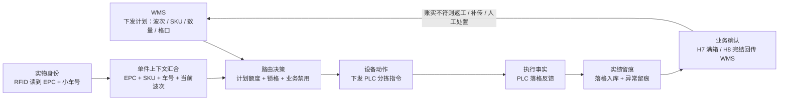

**MVP 的价值假设只有三条**（现场真正买单的东西，其余都是支撑）：

| # | 价值假设 | 不被满足时的后果 | 承载机制 |
| --- | --- | --- | --- |
| V-1 | 每件货落到**计划指定的**格口，不是"某个"格口 | 货错位、返工、要人工翻箱 | 计划分配表 + 按格口计划分流 + 锁格/禁用组合选格 |
| V-2 | WMS 的账（计划数）与现场的实（实落数）**对得上** | WMS 按格口校验整条驳回，波次作废 | 超计划改投异常口 66 + H7 按计划裁剪 + 落错格件不进 H7 |
| V-3 | 出错时**能查、能补、能人工处置** | "不知道发生了什么"，只能停线排查 | 三层原始报文留痕 + Outbox 可重传 + 切回重建 + 只读核对脚本 |

## 1.2 MVP 三层结构：核心闭环 / 生产保障 / 工程治理

MVP 思想的常见误读是"功能越少越好"。准确的说法是：**先做出一条能被端到端验证的最短闭环，再按"现场实际出问题"的顺序往外长**，并且每一层都要能被验证。

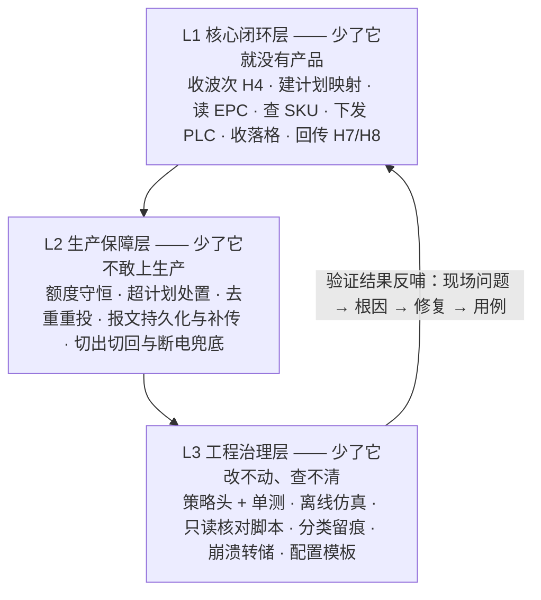

**三层各自的验收口径（这是本文与架构报告最大的区别：这里只谈"怎么证明"）**

| 层 | 必须能回答的问题 | 现有验证资产 | 缺口 |
| --- | --- | --- | --- |
| L1 | 一件货从 WMS 计划到 WMS 确认，全程能否复现？ | `mock_env/` 模拟 WMS/RFID/PLC/S7；`test/e2e_rescan_resend.py` 对真实 exe 做过重扫 E2E | 没有常态化回归；E2E 靠人工发起 |
| L2 | 计划数与实落数在任意时刻是否守恒？切出/断电后能否续做？ | `PlanAllocTable::audit` 30 秒巡检；`simulate_alloc.py` 7 场景离线仿真；切回按 `sorting_records` 重建 | 待执行队列顺序未持久化；H7→H8 无成功屏障 |
| L3 | 现场问题能否在不动生产的前提下定位？ | `docs/` 下 17 个诊断/核对脚本；`_probe/` 16 个探针；`crash_*.dmp` + `crash.log` | 无统一指标与告警；WAVE_MAP 留痕通道尚未被运行验证 |

## 1.3 MVP 判定四问：怎么判断一个已投产项目是否还"守得住 MVP"

投产不是 MVP 的终点。以下四问可以周期性自查，任何一问失守，系统就开始变成"只能加不能改"的历史沉积。

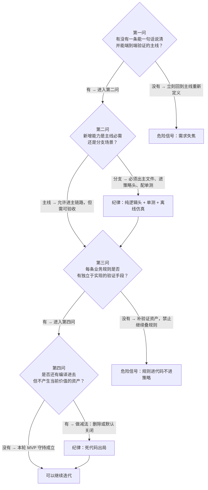

## 1.4 MVP 边界演化时间轴

项目的两个月可以清楚地分成三段：**"建主线"→"补保障"→"治理"**。前三周是教科书式的 MVP；随后进入由现场问题驱动的保障期；治理动作刚刚开始。

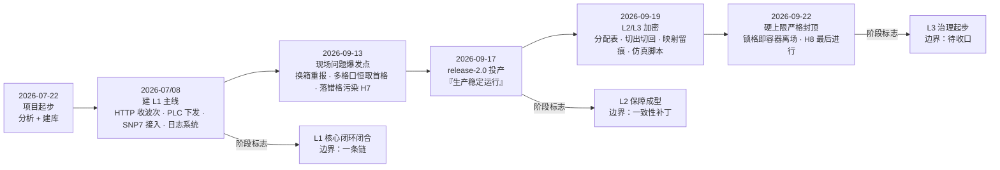

**时间轴给出的三个判断**

1. **主线从未漂移**：51 个提交全部挂在这一条链上，没有出现"顺手做个后台管理/报表/权限系统"式的扩张。这是这个 MVP 最成功的地方。
2. **增长完全由现场驱动**：09-13 → 09-22 的每条提交都能对应到一个具体现场问题（详见 4.9 节与架构报告 §10.5）。这是 MVP 正确的迭代方式。
3. **纪律在后半段松动**：新增规则被直接写进 `HttpServer.cpp` / `MainWindow.cpp`，而不是先落成策略。三个策略头（`PendingWaveQueuePolicy` / `WaveMapLogPolicy` / `EpcCode`）是示范，不是常态。

## 1.5 复杂度增长曲线

```
第一方代码规模（物理行，不含供应商代码与 src/ 旧副本）

2026-09-12 首版复核   ████████████████████████                    19,901 行 ｜ 22 模块
2026-09-19 生产复核   █████████████████████████████████████       30,310 行 ｜ 27 模块
                                    净增 +10,409 行（+52.3%） ｜ +5 模块

两个热点文件占第一方总量的一半以上

HttpServer.cpp        ████████████████████████████████████████   8,828 行
MainWindow.cpp        █████████████████████████████████          6,850 行
                      ────────────────────────────────────────
                      两者合计 15,678 行 ＝ 第一方 30,310 行的 51.7%
```

**MVP 视角的解读**：行数增长本身不是问题——问题在于**增长的地点**。MVP 的"最小"不是指代码少，而是指**每条规则都有唯一、可定位、可单测的归属**。当 52% 的第一方代码集中在两个文件里时，规则事实上失去了归属。

---

# 第 2 章 MVP 最小闭环还原

## 2.1 最小价值闭环：五步

剥掉一切保障与治理，这个系统的最小可用闭环只有五步。任何一步缺失，产品就不成立。

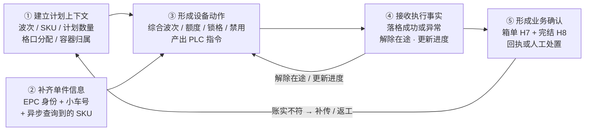

**这条链上最容易搞错的四个概念**（都是本项目真实踩过的坑）：

| 概念 | 常见误读 | 正确口径 |
| --- | --- | --- |
| 计划数量 `plan_qty` | 可当实绩用 | **不能替代实际落格数量**；H7 按计划裁剪，超计划件改投异常口 66 且不上传 |
| `BOUND` 状态 | 已全部绑定完成 | 只表示"已准备到可开始阶段"；开工前另有计划格口绑定预检（现场配置为仅告警） |
| `FINISHED` 状态 | WMS 已确认完结 | 只是**本地**完结态，部分兜底路径也能进入；WMS 确认是另一回事 |
| HTTP 200 | 波次已受理并落库 | 只表示接收路径已受理；原文落盘与明细持久化都是后续异步动作 |

## 2.2 端到端业务时序

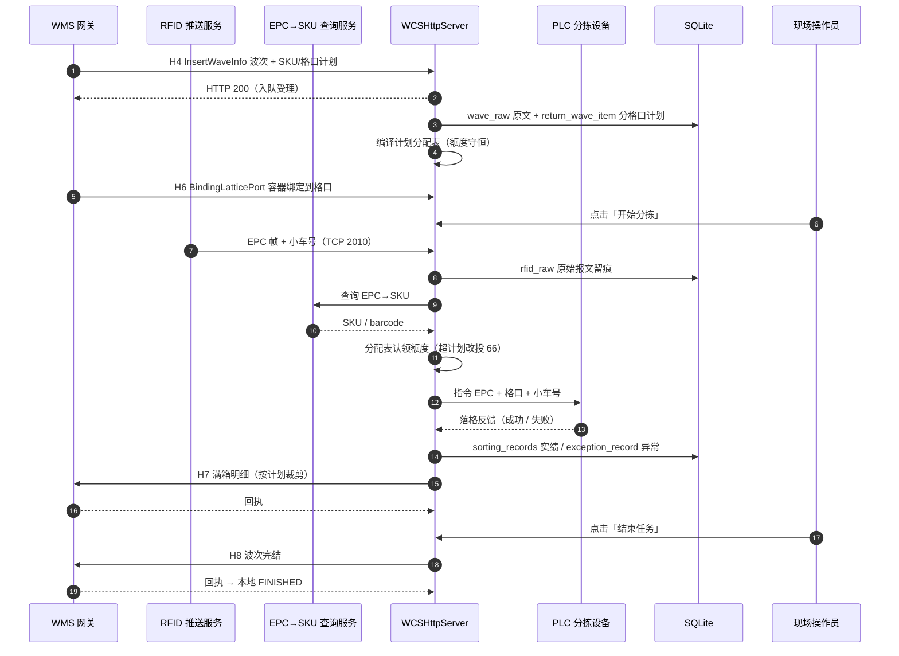

> ⚠️ 图中"落格反馈 → 实绩入库 → H7"是**业务期望顺序**。当前实现中，"请求已入发送队列""传输层已发出""落格反馈已收到""明细已入库""对端已接受"是**五个不同的提交点**，并不总是按序成立（见 2.4 节与 R5/R7）。

## 2.3 最小可用边界：四个"刻意选了最小"

MVP 的"最小"体现在边界选择上。本项目这四处的选择都是**正确的 MVP 决策**，应当在后续演进中保守守住。

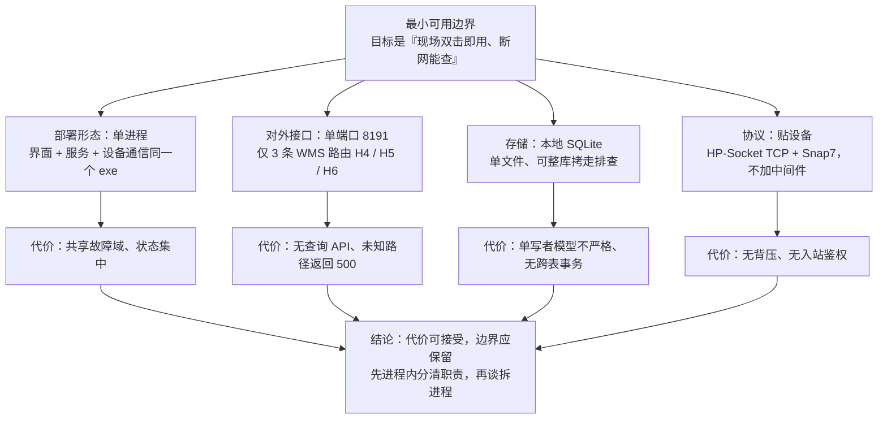

| 边界 | 具体取值 | 为什么是 MVP 的正确选择 | 何时才该突破 |
| --- | --- | --- | --- |
| 部署 | 单进程 Qt Widgets | 现场无运维、无中间件、无需装服务 | 出现"多工位/多分拣线共用一个后端"的真实需求时 |
| 接口 | 单端口 8191，三条 WMS POST 路由 | 只做 WMS 明确要求的接口，不预先造 API | WMS 提出查询/对账接口时 |
| 存储 | `exe/data/sorting_records.db` + `wave_history.db` | 无 DBA，故障时整库拷回即可分析 | 单库体积或并发成为瓶颈时（实测数据：主库约 15.7 MB） |
| 协议 | HP-Socket TCP + Snap7（S7 DB77 锁格位图） | 直接贴设备，不引入消息中间件 | 对端协议变更时 |

## 2.4 六个事实提交点：MVP 迈向生产时最容易漏的一课

一个只在实验室跑通的 MVP，与一个敢投产的 MVP，差别就在**是否把"提交点"分清**。本项目把这条经验用代码写了出来，但只写了一半——分配表这一半做到了，报文交付那一半没有。


**当前实现的实际情况（对照架构报告 R5 / R6 / R7）**

| 提交点 | 现状 | 风险 |
| --- | --- | --- |
| ① 已受理 | 🟡 `TaskQueue::push` 返回值被忽略；HTTP 200 早于 `wave_raw` 与明细持久化 | R6：竞争或崩溃窗口可"已成功应答但未保存" |
| ② 已入队 | 🟡 同①，队列上限 5，待执行波次队列无界 | R13：洪泛可耗尽资源 |
| ③ 已持久化 | 🟡 明细为单事务 DELETE+INSERT（这是好实践），但波次头与明细/实绩/Outbox 不总在同一事务 | R12 |
| ④ 已入发送队列 | 🔴 `successCount++` 仍是**入队口径**，日志称"发送成功" | R5：断连或发送失败仍被当作在途成功 |
| ⑤ 传输层已发出 | 🟡 单条真实发送结果已能回传（`m_sendResultCb`），但只用于释放分配额度 | R5 |
| ⑥ 已收到反馈 | 🔴 无跨回调拼包，半帧静默丢弃；反馈缓冲满 200 丢**最新**条目（与注释相反） | **R3 / P0**：这是账务丢失，优先级最高 |
| ⑦ 报文已入 Outbox | 🔴 主路径 H7 写库失败**仍会发送**；H8 不检查 `insertOutboxEnd` 结果 | R7 |
| ⑧ 对端已接受 | 🟡 回执按 JSON `success` 解释；HTTP 4xx/5xx 不作为失败依据 | 架构报告 §5.5 |

> **MVP 教训一句话**：把"入队"当"发送成功"，是 MVP 阶段最常见的偷懒，也是投产阶段最贵的债。分配表那一半（`claim` / `noteIssued` / `commitOnLanded` / `release` 四个写点 + `remain = plan − landed − reserv` 恒自洽）已经把这个思想写对了；报文交付应当照抄这套做法。

---

# 第 3 章 MVP 边界守持度评估

## 3.1 功能归属：哪些在主线内，哪些已经跑出去了

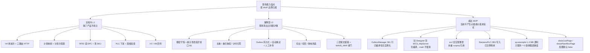

## 3.2 价值—成本定位：MVP 减法该从哪里下手

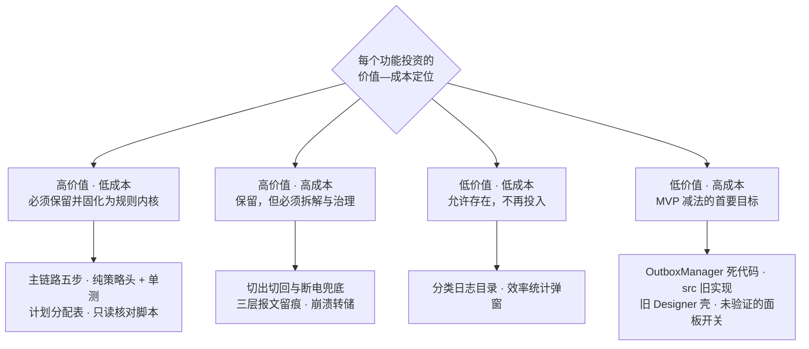

**判断依据**（不是主观印象，而是可核查的四个信号）：

| 象限 | 判定信号 | 本项目的具体条目 |
| --- | --- | --- |
| 高价值·低成本 | 有单测/仿真覆盖；有现场问题文档背书；改动局部 | 计划分配表、`EpcCode`、`PendingWaveQueuePolicy`、`WaveMapLogPolicy`、17 个只读核对脚本 |
| 高价值·高成本 | 有现场需求但改动横跨多个文件；需与 DB 口径对齐 | 切出切回 + 进度重建、三层留痕、`rfid_raw` 批量落库 |
| 低价值·低成本 | 编译进去但不被调用/默认关闭；删除有回归风险 | 分类日志、效率图表弹窗 |
| 低价值·高成本 | 无调用方却参与编译；或产品反向依赖测试目录 | `OutboxManager`、`src/`、旧 Designer 壳、`Sites` 类死路径 |

## 3.3 复杂度热点分布

```
第一方模块规模排行（物理行，含注释与空行）

HttpServer.cpp        ████████████████████████████████████████   8,828   ← 波次编排 + 报文 + 反馈 + 统计
MainWindow.cpp        █████████████████████████████████          6,850   ← 全部界面 + 查询 + 路由分发
SortingDatabase.cpp   █████████████                              2,887
PlcManager.cpp        ██████                                   1,406
define.h              ██████                                   1,255
WaveManager.cpp       █████                                    1,079
PlanAllocTable.h      ███                                        745
HttpClient.cpp        ███                                        630
其余 19 个模块         █████████████                            5,630
                                                      合计 30,310 行 / 27 模块
```

**复杂度集中在两处的直接后果**（对应架构报告 R15 / R16 / R19）：

- 业务规则与界面渲染、字符串前缀分派、SQL 调用混在同一文件，**规则无法被单独测试**；
- 产品代码 `MainWindow.h:54` 反向 `include ../tests/BindingPanelPolicy.h`，vcxproj 为此把 `..\tests` 加进 include 路径——**产品构建依赖测试目录**；
- `PlanAllocTable` / `WaveMapLogPolicy` 未登记进 vcxproj，**修改可能落错位置而不被编译**。

## 3.4 未产生当前价值的资产清单

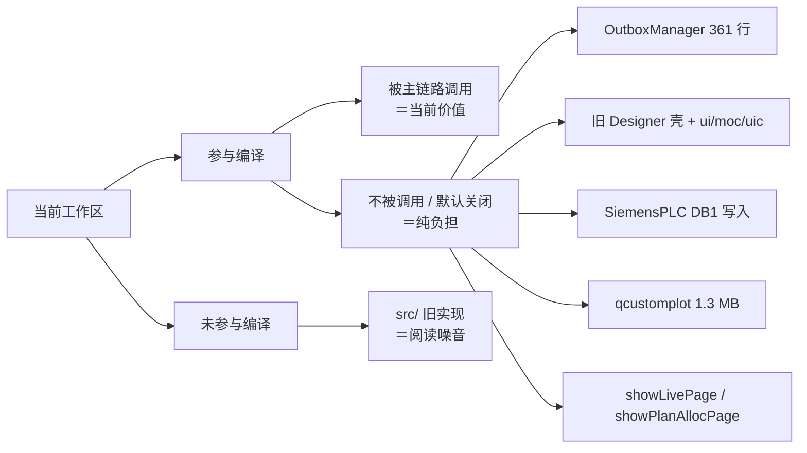

| 项 | 体量 | 当前状态 | MVP 思想的处置建议 |
| --- | --- | --- | --- |
| `OutboxManager` | 361 行 | 已编译，架构报告未发现实例化，运行逻辑仍在 HttpServer | **二选一**：接入为主路径交付状态机，或删除。保留"死实现"是最差选项 |
| 旧 Designer 壳 `WCS_httpServer` | 28 行 + ui/moc/uic | 仍编译，`main` 不使用 | 删除，减少构建与阅读成本 |
| `src/` 旧实现 | 整套目录 | 未被 `.vcxproj` 引用 | 移出仓库或归档到 `archived/` |
| `SiemensPLC` DB1 写入 | 数十行 | 已注释停用 | 删除注释代码，保留能力说明 |
| `qcustomplot` | 1.3 MB 源码 | 只服务效率图表弹窗 | 若现场不看图则移除；保留则明确为"可选模块" |
| `showLivePage` / `showPlanAllocPage` | 两个配置开关 | 发布配置为 `false` | 明确"是否要这个功能"；要则默认开并纳入验收，不要则删 |
| `sort_txn` 表 + `insertSortTxn` | 表 + 函数 | **全仓库无调用方**，`isEpcAlreadySorted` 恒为 `false`，DB 级防重失效 | 接入主路径或删除（对应 R8） |

---

# 第 4 章 需求分析

## 4.1 需求来源与利益相关者

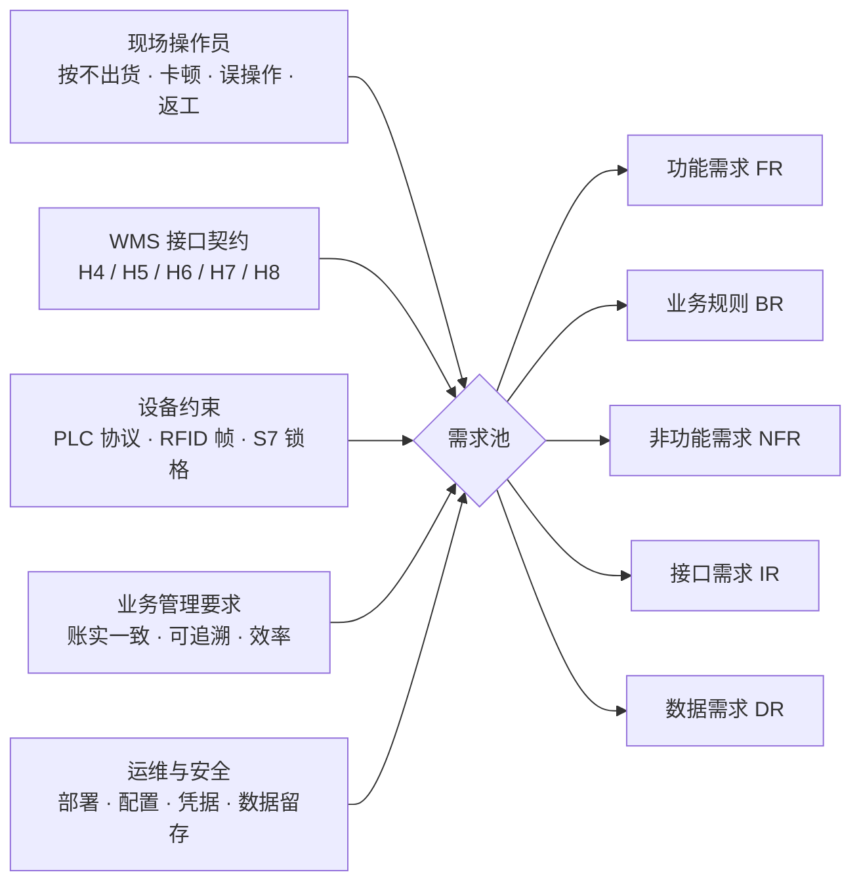

| 利益相关者 | 核心诉求 | 诉求被满足的判据 | 现有主要证据来源 |
| --- | --- | --- | --- |
| 现场操作员 | 按一下就能干活；出错能自己处理 | 无需培训即可完成"开始接收→开始分拣→满箱→结束"闭环；切回能续做 | `docs/WCS现场操作手册.md`、`docs/WCS现场作业流程图.md` |
| WMS 侧 | 数量对得上；不重复、不漏报 | H7 明细与 WMS 计划口径一致；回执可查 | 硬上限封顶提交、『回传响应结果列显示 WMS 返回 body』 |
| 设备侧（PLC/RFID） | 指令语义稳定；帧解析鲁棒 | 五字段与旧三字段反馈均可解析；EPC 头尾杂串均可定位 | `PlcManager` 反馈解析、`EpcCode` 纯函数 |
| 仓库管理 | 可追溯、可审计 | 每个 SKU 的格口映射有留痕；异常有独立记录 | `log/WAVE_MAP/wave_map.log`、`exception_record` |
| 开发/运维 | 改得动、查得清、装得上 | 构建可复现、问题可离线复现、配置可校验 | 目前**部分满足**，见 NFR-5 / NFR-10 / R16 / R17 |

**需求来源的量化分布**：51 个提交中，由现场问题直接驱动的占绝大多数。`docs/` 下 20+ 份根因/需求文档可以逐条对应到提交，这构成了本项目最扎实的需求台账。

## 4.2 范围界定

### 4.2.1 范围内（本期系统必须承担）

| 范围项 | 说明 |
| --- | --- |
| WMS 三条入站接口 | `InsertWaveInfo`（H4 波次）、`InsertWaveIn`（H5 取消）、`BindingLatticePort`（H6 绑定） |
| WMS 两条出站回传 | H7 满箱明细、H8 波次完结 |
| RFID 接入 | 主动连接推送服务，接收 EPC 帧与小车号 |
| EPC→SKU 查询 | 异步 HTTP 查询与本地缓存 |
| PLC 通信 | TCP 下发分拣指令、接收落格反馈；Snap7 读取 S7 DB77 锁格位图 |
| 本地持久化 | 波次/计划/实绩/绑定/报文/原始帧/异常/历史摘要 |
| 现场界面 | 启停、绑定、查询、预警、日志、配置编辑 |
| 本地诊断 | 分类日志、崩溃转储、只读核对脚本 |

### 4.2.2 范围外（本期明确不做）

| 范围外项 | 理由 |
| --- | --- |
| 对外查询 API | 有效 HTTP 路由仅上述三条 WMS POST 入口；旧注释中的"查询 API"与历史 RFID HTTP 推送入口已不属当前能力 |
| 入站鉴权与多租户 | 当前依赖网络隔离；属 NFR-8 待办，不在本期功能范围 |
| 分布式/多机部署 | 单进程单机形态是刻意边界（见 2.3） |
| WMS 端幂等契约 | 需对端协议配合；WCS 只提供稳定的事件身份与重放规则，不宣称端到端"恰好一次" |
| 全表生命周期统一清理 | 当前清理入口主要覆盖 `sorting_records` 旧数据；不能把"保留 90 天"理解为所有表与部署目录都被统一清理 |

## 4.3 用例总览

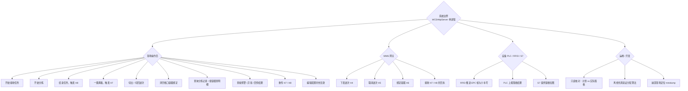

## 4.4 功能需求（FR）

> **优先级**：M = Must（主线必需）｜S = Should（投产必需）｜C = Could（可延后）｜W = Won't now（本期不做）
> **MVP 层**：L1 核心闭环｜L2 生产保障｜L3 工程治理
> **现状**：✅ 静态路径成立｜🟡 部分成立｜🔴 未满足（编号指向架构报告风险 R1–R19）

### FR-1 波次接收与解析

| 编号 | 需求 | 优先级 | 层 | 验收判据 | 现状 |
| --- | :---: | :---: | --- | --- | :---: |
| FR-1.1 | 接收 WMS 下发的 H4 波次，校验 JSON、字段与计划一致性 | M | L1 | 合法报文受理并返回 200；非法报文拒绝且有明确原因 | 🟡 R6 |
| FR-1.2 | 保存 H4 原始 JSON，支持事后重建计划 | M | L1 | `wave_raw` 可按波次号取回原文 | 🟡 接收成功与其写入无统一提交点 |
| FR-1.3 | 解析与接收异步，不阻塞 HTTP 与界面 | M | L1 | 大波次解析期间接收与界面仍可响应 | ✅ ParseWorker 独立线程 |
| FR-1.4 | 解析分格口计划：SKU×格口×类型×数量 | M | L1 | 同 SKU 多格口时各格口数量、类型均保留 | ✅ 单事务 DELETE+INSERT 替换 |
| FR-1.5 | 会话冻结（未接收/已点结束）时波次不丢弃 | S | L2 | 冻结期间到达的波次放回待执行队列，不丢 | ✅ |
| FR-1.6 | 待执行波次队列与明确出队口径 | S | L2 | 只有"接收中且本次会话未点结束任务"才放行 | ✅ `PendingWaveQueuePolicy`（纯策略头 + 单测） |

### FR-2 计划与分配

| 编号 | 需求 | 优先级 | 层 | 验收判据 | 现状 |
| --- | :---: | :---: | --- | --- | :---: |
| FR-2.1 | 每 SKU 每格口的计划数量与类型可持久化并可恢复 | M | L1 | 切回后分格口计划与类型完整重建 | ✅ |
| FR-2.2 | 波次开始时一次性编译计划为分配表 | S | L2 | 分配结果与消息到达顺序无关，可重现 | ✅ `PlanAllocTable` 745 行 |
| FR-2.3 | 额度守恒：每格口「已落 + 在途 ≤ 计划」 | S | L2 | 任一时刻 `remain = plan − landed − reserv` 自洽；30 秒巡检无违规 | ✅ 仅四个写点 + audit |
| FR-2.4 | 超计划件改投物理异常口（现场为 66） | S | L2 | 改投件不计分拣、不耗额度、留痕区分原因 | ✅ 策略可配 exception / block |
| FR-2.5 | ~~计划格口禁用或锁格时，缺口搬迁给同 SKU 其他计划格口~~ **已于 2026-09-26 删除**（现场口径：额度不因锁格等原因搬迁；单元=(SKU,格口,分拣类型)，计划多少落多少、不能多） | — | — | 搬迁调用链整体移除，巡检⑤⑥⑦⑧守红线 | ✅ |
| FR-2.6 | 异常口不参与计划分配 | S | L2 | 编译期剔除异常口与越界格口 | ✅ |
| FR-2.7 | 计划与实落可离线核对，不依赖生产进程 | C | L3 | 只读打开数据库即可导出对照 | ✅ `docs/` 只读脚本 |

### FR-3 容器绑定

| 编号 | 需求 | 优先级 | 层 | 验收判据 | 现状 |
| --- | :---: | :---: | --- | --- | :---: |
| FR-3.1 | 接收 H6，把容器号绑定到格口 | M | L1 | 优先取 query 参数，兼容 JSON body | ✅ |
| FR-3.2 | 绑定带波次归属，并按优先级判定与纠偏 | S | L2 | 归属按"报文波次 > 当前波次 > 切出窗口波次 > 空串待补齐" | ✅ `attributePendingBindsToWave` |
| FR-3.3 | 解绑与清空绑定，历史归档留存 | S | L2 | 清空后 DB 留史、界面为未绑定态 | ✅ 两步写仍非同一事务 R12 |
| FR-3.4 | 同一物理格口至多一个活跃容器 | M | L2 | 无重复活跃绑定 | 🔴 无唯一约束 R12 |

### FR-4 实物识别与信息补齐

| 编号 | 需求 | 优先级 | 层 | 验收判据 | 现状 |
| --- | :---: | :---: | --- | --- | :---: |
| FR-4.1 | 从 RFID 文本帧中识别 EPC（`A` + N−1 位数字，长度可配） | M | L1 | 头部/尾部杂串均能定位；未识别按原文处理并告警；`len < 2` 关闭识别 | ✅ `EpcCode` 共用实现 |
| FR-4.2 | RFID 原始整帧三层留痕 | S | L2 | 运行日志（十六进制+文本）、界面可查、`rfid_raw` 表批量落库 | ✅ 200 帧/1 秒单事务；上限 20000 丢最旧；保留 7 天 |
| FR-4.3 | 异步查询 EPC→SKU 并写缓存 | M | L1 | 查询回执更新缓存并重新尝试下发 | ✅ |
| FR-4.4 | 从帧中提取小车号 | M | L1 | 取第一段流水号；第二段设备编码不得误当车号 | ✅ |
| FR-4.5 | 信息未齐时挂起并超时重试，状态可区分 | S | L2 | "暂未就绪""发送失败""已执行未确认"是不同状态 | 🟡 三态语义未完全分离 R5 |
| FR-4.6 | 缓存 TTL 与容量告警 | C | L3 | 缓存条目超阈值时健康日志告警 | ✅ TTL 300 秒；阈值告警 |

### FR-5 设备执行

| 编号 | 需求 | 优先级 | 层 | 验收判据 | 现状 |
| --- | :---: | :---: | --- | --- | :---: |
| FR-5.1 | 向 PLC 下发 `EPC + 格口 + 小车号` | M | L1 | PLC 收到并与页面记录一致 | ✅ |
| FR-5.2 | 读取物理锁格状态（S7 DB77，偏移 0，25 字节位图） | S | L1 | 锁格格口不参与下发；断线可重连 | ✅ S7 归 `PlcManager` 独占 |
| FR-5.3 | 排除业务不可用格口（满箱未重绑等） | S | L2 | 掩码统一为"不可下发格口" | ✅ |
| FR-5.4 | 选格原因可解释、可追溯 | C | L3 | 日志能回答"该件为什么去该格口" | ✅ 选格原因输出 |
| FR-5.5 | 解析落格反馈，兼容新五字段与旧三字段 | M | L1 | 两种格式均形成预期业务事件 | ✅ 但**无跨回调拼包，半帧静默丢弃**（R3 / P0） |
| FR-5.6 | 同波次重扫重投，带冷却、次数上限与在途超时 | S | L2 | 合法返工可重投；短暂重复被抑制 | ✅ 策略可配；已落格 EPC 免扣额度 |

### FR-6 落格实绩

| 编号 | 需求 | 优先级 | 层 | 验收判据 | 现状 |
| --- | :---: | :---: | --- | --- | :---: |
| FR-6.1 | 落格成功写实绩（EPC/SKU/格口/小车/容器/时间/报送信息） | M | L1 | `sorting_records` 可按波次查询 | ✅ |
| FR-6.2 | 同一波次同一格口同一 EPC 只记一条 | M | L1 | 换箱后同一件不被报两次 | ✅ 内存去重；DB 级防重失效 R8 |
| FR-6.3 | 落错格的件只留痕，不写明细、不进 H7 | S | L2 | WMS 不因落错格被整条驳回 | ✅ |
| FR-6.4 | 异常口件不计已分拣、不写箱内明细、不进 H7 | S | L2 | 四层闭环同时生效 | ✅ 分配层/反馈层/报文层/明细层 |
| FR-6.5 | 落格即超时计时归零（统一入口覆盖全部分支） | S | L2 | 二次上传/重投可正常重放 | ✅ `noteEpcLanded` |

### FR-7 回传交付

| 编号 | 需求 | 优先级 | 层 | 验收判据 | 现状 |
| --- | :---: | :---: | --- | --- | :---: |
| FR-7.1 | 构建 H7 满箱报文并按计划裁剪数量 | M | L1 | 实落 > 计划的部分不出现在报文中 | ✅ |
| FR-7.2 | 构建 H8 波次完结报文 | M | L1 | 完结回传最后发送 | ✅ |
| FR-7.3 | 报文持久化入 Outbox 后才发送 | S | L2 | 未持久化不发网 | 🔴 主路径 H7 写库失败仍发送；H8 不检查入库结果 R7 |
| FR-7.4 | 自动重试扫描（H7/H8 各自定时器） | S | L2 | 失败报文按间隔重试，次数与最后错误可查 | ✅ |
| FR-7.5 | 人工补传 H7 / H8（选中行优先，否则当前波次） | S | L2 | 补发路径写库失败即阻断发送 | ✅ |
| FR-7.6 | 切回后统一补发 pending / failed / cancelled | S | L2 | 非当前波次报文不因 UI 选择而丢失交付资格 | 🟡 属补偿而非保证 R7 |
| FR-7.7 | 回传结果在界面可见（含 WMS 返回 body） | C | L3 | 回传结果列显示对端返回内容 | ✅ |

### FR-8 波次与会话生命周期

| 编号 | 需求 | 优先级 | 层 | 验收判据 | 现状 |
| --- | :---: | :---: | --- | --- | :---: |
| FR-8.1 | 开始/停止接收任务，与设备连接生命周期解耦 | M | L1 | 停止接收不影响设备连接与状态查看 | ✅ |
| FR-8.2 | 开始分拣（人工确认动作） | M | L1 | 未绑定可预检提示；开工闸门可配 | ✅ 预检默认仅告警 |
| FR-8.3 | 结束任务：先发 H8，再按回执/超时/人工决策收尾 | M | L1 | 二次点击＝取消等待立即停止；30 秒安全网 | ✅ |
| FR-8.4 | 关闭窗口 = 切出当前波次（绑定归档 + 清内存） | S | L2 | 关闭不丢进度；下次可切回 | ✅ |
| FR-8.5 | 切回历史波次并按实绩重建额度、去重集与箱内明细 | S | L2 | 切回后继续作业，进度与额度一致 | ✅ `restoreLandedProgress` |
| FR-8.6 | 终态波次禁止切回（内存 + DB 双查） | S | L2 | 终态波次被拒绝并有提示 | ✅ |
| FR-8.7 | 断电兜底：启动只提示不自动装载；绑定兜底归档 | S | L2 | 异常重启后人工可决定是否切回 | ✅ |
| FR-8.8 | 取消波次（H5），分拣开始后的取消受状态限制 | C | L2 | 早期状态可取消；运行态取消被约束 | ✅ |

### FR-9 操作界面

| 编号 | 需求 | 优先级 | 层 | 验收判据 | 现状 |
| --- | :---: | :---: | --- | --- | :---: |
| FR-9.1 | 波次面板：状态、计划、进度、待执行队列 | M | L1 | 每秒刷新不卡顿 | 🟡 部分查询仍在 UI 线程 R15 |
| FR-9.2 | 容器绑定面板（格口 × 容器号） | M | L1 | 绑定状态一目了然 | ✅ |
| FR-9.3 | 运行日志分栏、清空、批量刷新 | S | L3 | 高频日志不卡死界面 | ✅ 批量 flush |
| FR-9.4 | 分拣记录查询、按容器查明细（含计划对照） | S | L2 | 查询结果与计划可对照 | ✅ |
| FR-9.5 | 超计划预警与明细弹窗 | C | L2 | 预警数字与实际一致 | ✅ |
| FR-9.6 | 效率统计图表（QCustomPlot） | W | L3 | — | 已实现但现场面板默认关闭 |

### FR-10 可观测与诊断

| 编号 | 需求 | 优先级 | 层 | 验收判据 | 现状 |
| --- | :---: | :---: | --- | --- | :---: |
| FR-10.1 | 分类日志：WCS / HTTP / Run / PLC / DataBase / LIFECYCLE / EPC / WAVE_MAP | M | L3 | 每类日志独立文件、可定位 | ✅ |
| FR-10.2 | 崩溃时落 `crash.log` + minidump，并记录最后一条 Qt 消息 | S | L3 | 异常退出后有现场可分析 | ✅ |
| FR-10.3 | 只读核对脚本：从数据库反查计划 vs 实际落格 | S | L3 | 不启动生产进程即可核对 | ✅ `docs/` 17 个脚本 |
| FR-10.4 | 离线仿真验证分配/落格/报文算法 | C | L3 | 7 场景全部通过 | ✅ `simulate_alloc.py` |
| FR-10.5 | 统一运行指标与告警（队列水位、分段时延、Outbox 年龄） | W | L3 | — | 未落地，架构报告 §6.5 已列指标清单 |

### FR-11 配置与部署

| 编号 | 需求 | 优先级 | 层 | 验收判据 | 现状 |
| --- | :---: | :---: | --- | --- | :---: |
| FR-11.1 | XML 配置加载，缺失时按默认值生成 | M | L1 | 干净环境可启动 | ✅ |
| FR-11.2 | 可热生效配置项（回传 URL / AppKey / method / 环境 / 超时等） | S | L2 | 保存即生效并有日志 | 🟡 原地无锁热重载 R10 |
| FR-11.3 | 单实例互斥、端口占用与崩溃可诊断 | S | L2 | 重复启动有明确提示 | ✅ |
| FR-11.4 | 正式/测试配置模板、差异校验与切换生效值校验 | C | L3 | 切换后能验证实际生效值 | 🔴 R17 |
| FR-11.5 | 凭据外置与日志脱敏 | C | L3 | 日志与界面不含凭据 | 🔴 R14 |

## 4.5 业务规则（BR）

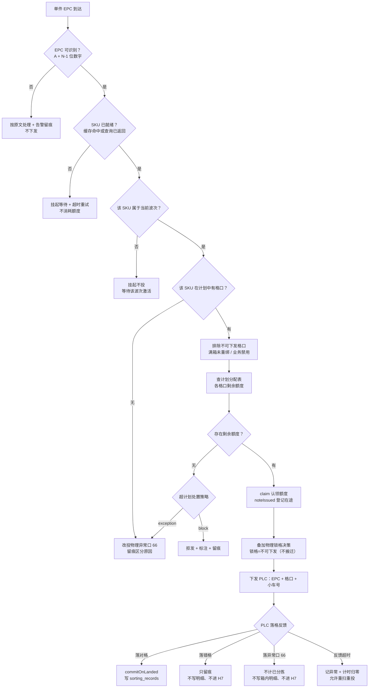

| 编号 | 业务规则 | 触发条件 | 结果 | 可配 | 现状 |
| --- | --- | --- | --- | :---: | :---: |
| BR-1 | 计划额度封顶 | 某「SKU + 格口」实落已达计划 | 超出件改投异常口 | ✅ | ✅ |
| BR-2 | 超计划四层闭环 | 实落 > 计划 | 分配层剔除 / 反馈层不计 / 报文层拦截 / 明细层不落库 | 部分 | ✅ |
| BR-3 | 落错格不上传 | 件落到该 SKU 无计划的格口 | 只留痕，不进 H7 | — | ✅ |
| BR-4 | 异常口不上传 | 件落异常口 66 | 不计已分拣、不写箱内明细、不进 H7 | — | ✅ |
| BR-5 | 同波次同格口同 EPC 去重 | 换箱后同一件再次反馈 | 只记 1 条落格明细 | ✅ | ✅ 内存去重 |
| BR-6 | 落格即计时归零 | 任意落格分支 | 二次上传/重投可重放 | — | ✅ |
| BR-7 | 出队唯一放行条件 | 待执行波次出队 | 接收中 且 本次会话未点结束 | — | ✅ |
| BR-8 | 终态禁切回 | 波次为内存或 DB 终态 | 拒绝切回并提示 | — | ✅ |
| BR-9 | 绑定波次归属优先级 | H6 到达 | 报文波次 > 当前波次 > 切出窗口波次 > 空串待补齐 | — | ✅ |
| BR-10 | 切出保留绑定归属窗口 | 关闭/切出后 120 秒内 | 到达的绑定归入被切出的波次 | ✅ | ✅ |
| BR-11 | 锁格与需求冲突 | 全部计划格口均物理锁格 | 按现场需求照发，**不得称为安全联锁** | — | 🟡 语义需明确 |
| BR-12 | 重投复用当前映射重新选格 | 同一 EPC 重投 | 已落格 EPC 免扣额度；**不保证与首次实际格口一致** | ✅ | ✅ |

## 4.6 波次状态机需求

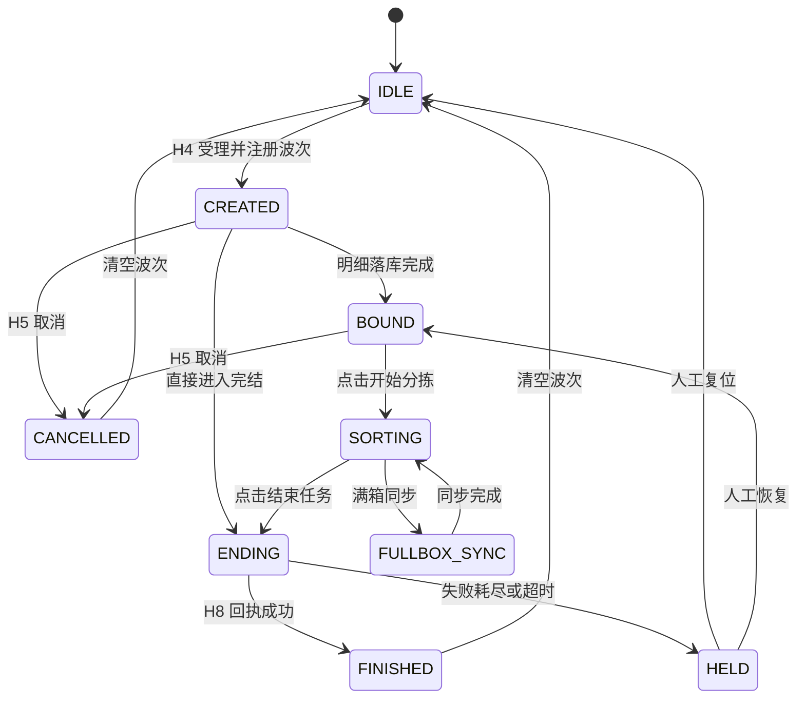

| 状态 | 含义 | 容易误读之处 |
| --- | --- | --- |
| `IDLE` | 没有当前执行波次 | — |
| `CREATED` | 波次已注册，明细可能仍在持久化 | 不代表计划已可用 |
| `BOUND` | 已准备到可开始阶段 | **不代表全部格口已绑定** |
| `SORTING` | 分拣运行态 | — |
| `FULLBOX_SYNC` | 保留的满箱同步态 | 当前 H7 已尽量与整波次状态解耦 |
| `CANCEL_PENDING` | 取消处理中 | 迁移表有出边，正常白名单未见入边 |
| `CANCELLED` | 取消终态 | — |
| `ENDING` | 完结回传中 | 无"全部 H7 成功"屏障（R7） |
| `FINISHED` | **本地**完结态 | **不能仅凭此证明 WMS 已确认**；部分兜底路径也可进入 |
| `HELD` | 异常挂起 | 需人工介入 |

**并行状态（不在上面这张图里，但同样影响行为）**：接收开关、UI 停止阶段、当前波次与待执行队列、EPC 查询/在途/重投状态、格口物理锁定、业务禁用与绑定、Outbox 的 pending/success/failed/cancelled。这些状态目前分散在 `HttpServer` / `WaveManager` / `EpcCache` / `PlanAllocTable` 中，缺少统一事件流（R10）。

## 4.7 数据需求

```mermaid
%% 图 4-5 数据模型
erDiagram
    return_wave ||--o{ return_wave_item : "分格口计划"
    return_wave ||--o{ sorting_records : "落格实绩"
    return_wave ||--o{ outbox_fullbox : "H7 报文"
    return_wave ||--|| outbox_end : "H8 报文"
    return_wave ||--o{ exception_record : "异常留痕"
    return_wave ||--o{ wave_raw : "H4 原文"
    return_wave ||--o|| wave_history : "完结摘要"
    grid_box_bind }o--|| return_wave : "绑定波次归属"
    rfid_raw }o--o| return_wave : "RFID 原始帧"
    sort_txn ||--|| sorting_records : "防重约束未接入"
    daily_peak }o--o| return_wave : "每日效率峰值"
```

| 编号 | 数据需求 | 载体 | 保留策略 | 现状与边界 |
| --- | --- | --- | --- | --- |
| DR-1 | 波次头与计划数量、状态 | `return_wave` | — | 头与明细/实绩/Outbox 不总在同一事务 |
| DR-2 | 分格口计划：一行 = SKU + 格口 + 类型 + 计划数 | `return_wave_item` | 随波次 | ✅ 单事务 DELETE+INSERT 替换；旧库经 ALTER 补列 |
| DR-3 | H4 原始 JSON | `wave_raw` | — | 为重建计划提供依据；接收成功与其写入无统一提交点 |
| DR-4 | 落格实绩（含报送信息） | `sorting_records` | 90 天（仅此表） | H7 统计、历史查询与切回重建的主要来源；异常口件不写行 |
| DR-5 | 格口容器绑定与波次归属 | `grid_box_bind` | 归档留史 | 同时存在 XML、内存、DB 三份副本；归档+插入非同一事务 |
| DR-6 | H7 报文、msgId、状态、重试时间与次数 | `outbox_fullbox` | — | 主路径写库失败仍发送 |
| DR-7 | H8 报文与投递状态 | `outbox_end` | — | 无全部 H7 成功屏障 |
| DR-8 | 异常/留痕（未匹配、未绑定、落错格、超计划、超时） | `exception_record` | — | 含不同业务语义，恢复时不能全部算作分拣失败 |
| DR-9 | 单件分拣事务与唯一性约束 | `sort_txn` | — | 🔴 `insertSortTxn` 全仓库无调用方，DB 级防重恒失效（R8） |
| DR-10 | RFID 整帧原文（原始与解析前后） | `rfid_raw` | 7 天 | 200 帧/1 秒单事务；内存上限 20000 丢最旧 |
| DR-11 | 波次完结摘要（独立历史库） | `wave_history.db` | — | 只存摘要，不是完整波次快照 |
| DR-12 | 每日效率峰值 | `daily_peak` | — | 以 RFID 推送窗口计量，**不能等同 PLC 成功落格产能** |

**存储与并发**：主库 `exe/data/sorting_records.db`；写连接尝试 WAL、`synchronous=NORMAL`、`cache_size=5000`；线程局部查询连接带线程 ID 与 `busy_timeout=3000`。注意：所谓"只读查询连接"**未强制只读**，旧记录清理会经该连接执行 DELETE/OPTIMIZE，因此当前不是严格的单写者模型（R12）。

## 4.8 接口需求

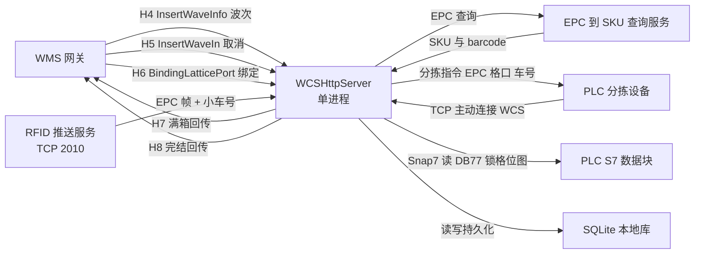

| 编号 | 接口 | 方向 | 关键约定 | 现状与风险 |
| --- | --- | --- | --- | --- |
| IR-1 | `POST /api/DispatchSortingCommand/InsertWaveInfo`（H4） | WMS → WCS | 波次 + SKU/格口计划；路径可配置；监听 8191 | 🟡 入队返回值未作为受理依据 R6 |
| IR-2 | `POST /api/DispatchSortingCommand/InsertWaveIn`（H5） | WMS → WCS | 取消波次；分拣开始后取消受状态限制 | ✅ |
| IR-3 | `POST /api/DispatchSortingCommand/BindingLatticePort`（H6） | WMS → WCS | 优先读 query 的 `latticehole` / `boxcode`，兼容 JSON body | 🟡 先回应后异步绑定（新增失败可见） |
| IR-4 | H7 满箱回传 | WCS → WMS | 网关 method 默认 `gwisSubProductClassifyOrder`；`fromLocation` 来源可配（现场 `sobi`）；`targetLocation` 无容器号时兜底 66 | 🟡 主路径写库失败仍发送 R7 |
| IR-5 | H8 完结回传 | WCS → WMS | 独立 URL/method，默认 `gwisSubProductClassifyEndOrder` | 🔴 无 H7 成功屏障、不检查入库 R7 |
| IR-6 | RFID 推送（TCP client） | WCS 主动连接 → RFID | 目标端口 2010；有重连与可配心跳；ASCII 文本帧拼包/拆包 | ✅ |
| IR-7 | EPC→SKU 查询 | WCS → 查询服务 | 异步 HTTP；Authorization 值来自配置 | 🟡 出站日志含 AppKey 未脱敏 R14 |
| IR-8 | PLC TCP 服务端 + Snap7 | 双向 | PLC 主动连接 WCS；指令为 `EPC|格口|车号`；反馈支持五字段与旧三字段；S7 读 DB77、偏移 0、25 字节位图 | 🔴 无跨回调拼包 R3 |
| IR-9 | 未知路径与查询 API | — | 有效路由仅 IR-1/2/3；未知路径返回 500 | ⚠️ 历史注释中的"查询 API"不属当前能力 |

## 4.9 非功能需求（NFR）

| 编号 | 类别 | 需求 | 优先级 | 验收判据 | 现状 |
| --- | --- | --- | :---: | --- | :---: |
| NFR-1 | 性能·时限 | 波次完结回传遵循"≤2 秒"约束 | M | 回传超时常量与现场约定一致 | ✅ `WAVE_COMPLETE_TIMEOUT_MS = 2000`；H7/H8 回传超时配置为 10000 ms |
| NFR-2 | 可靠性 | 业务反馈不因 UI 卡顿或缓冲满被静默丢弃 | M | 容量不足必须告警并限流/暂停/持久化 | 🔴 反馈缓冲满 200 丢**最新**条目 R3 |
| NFR-3 | 一致性 | 每格口「已落 + 在途 ≤ 计划」恒成立 | M | 30 秒巡检无违规；账实不符时照实记账并告警 | ✅ |
| NFR-4 | 可恢复性 | 崩溃/断电/误关后可续做且可追查 | S | 切回按实绩重建额度与明细；崩溃有 minidump | 🟡 待执行队列顺序未持久化 |
| NFR-5 | 可维护性 | 业务规则与实现分离，可单测 | S | 新增规则以纯逻辑头承载并配单测 | 🟡 仅 3 个策略头示范；52% 代码在两个文件 |
| NFR-6 | 可观测性 | 分段时延、队列水位、Outbox 年龄可观测 | S | 能回答"慢在哪一段""积压多少" | 🔴 未落地，架构报告 §6.5 已列清单 |
| NFR-7 | 容量与背压 | 请求体、队列、并发有明确上限与拒绝语义 | S | 洪泛时明确拒绝而非耗尽资源 | 🔴 HTTP body 无上限；`TaskQueue` 上限 5；业务池任务队列与待执行波次队列无界 R13 |
| NFR-8 | 安全 | 入站鉴权与凭据脱敏 | S | 日志与界面不含凭据；暴露面受控 | 🔴 入站无鉴权；HTTP/PLC 监听 `0.0.0.0`；出站日志含 AppKey R13/R14 |
| NFR-9 | 部署 | 单进程、离线可用、双击即用 | M | 干净环境解压即启动；不依赖外网 | ✅ |
| NFR-10 | 兼容与构建 | Debug/Release 参数一致、依赖路径可迁移、构建可复现 | C | 干净环境可复现构建 | 🔴 绝对路径 `D:/Qt` `D:/WCS`；Debug/Release 漂移；产品反向 include `../tests` R16/R19 |

## 4.10 需求优先级分布

```
按 MoSCoW 分布（FR 65 条 + NFR 10 条 = 75 条）

Must    ███████████████████████████             27 条   36%   ← 主线与投产底线
Should  ████████████████████████████████████    36 条   48%   ← 现场问题驱动出的保障
Could   ██████████                              10 条   13%   ← 可延后
Won't   ██                                       2 条    3%   ← 本期明确不做

按 MVP 层分布（仅 FR 65 条）

L1 核心闭环   ██████████████████████          22 条   34%
L2 生产保障   ██████████████████████████████  30 条   46%
L3 工程治理   █████████████                     13 条   20%
```

**分布读出的三个结论**

1. **M 只占 36%**：说明项目把一半以上的投入放在了"让主线在真实现场不出错"上——这是对的，投产项目的价值主要来自保障层（L2 占 46%）。
2. **L3 治理层仅占 20%，且其中多数未落地**：减法、拆分、指标、配置治理这些工作还没有真正开始（对应 R16/R17/R18/R19 与 NFR-6/NFR-10）。
3. **Won't 仅 2 条**：说明项目几乎没有主动说过"这个不做"。MVP 思想要求每个阶段都要有明确放弃项——这一条是当前最需要补的纪律。

---

# 第 5 章 需求追溯

## 5.1 追溯链路

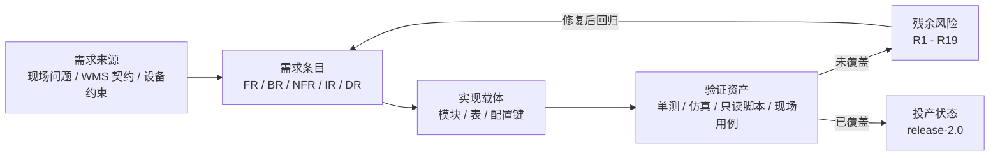

## 5.2 需求—实现—验证—风险 追溯矩阵

| 需求组 | 实现载体 | 验证资产 | 关联风险 | 覆盖度 |
| --- | --- | --- | --- | :---: |
| **FR-1** 波次接收与解析 | `HttpServer::processRequest`、`ParseWorker`、`TaskQueue`、`WaveManager` | `mock_env/` 模拟 WMS 下发；`_probe/` 大 H4 报文探针 | R1、R6、R13 | 🟡 |
| **FR-2** 计划与分配 | `PlanAllocTable`、`ParseWorker`、`return_wave_item` | `simulate_alloc.py` 7 场景；`tests/` 策略单测 | R9 | ✅ |
| **FR-3** 容器绑定 | H6 处理链、`grid_box_bind`、绑定面板 | 现场验证用例；`_probe/` 绑定时序与失败探针 | R12 | 🟡 |
| **FR-4** 实物识别 | `RfidPushClient`、`EpcCode`、`EpcCache`、`rfid_raw` | `EpcCode` 单测；`epc_lifecycle.py`、`check_epc_dup.py` | R14 | ✅ |
| **FR-5** 设备执行 | `PlcManager`、`SiemensPLC` + Snap7 | `mock_env/` 模拟 PLC 与 S7；`_probe/` HP-Socket 回调探针 | **R3**、R5 | 🟡 |
| **FR-6** 落格实绩 | 反馈池、`SortingDatabase`、`commitOnLanded` | `test/e2e_rescan_resend.py`；`check_wave_multi_grid.py`、`wave_bind_audit.py` | R8 | ✅ |
| **FR-7** 回传交付 | `HttpClient`、`outbox_*`、两个 5 秒定时器、重传入口 | 人工重传按钮 + 回传结果列 | **R7** | 🔴 |
| **FR-8** 生命周期与会话 | 切出/切回链、`WaveManager`、`PendingWaveQueuePolicy` | 现场断电/切回验证；策略头单测 | R2、R4 | ✅ |
| **FR-9** 操作界面 | `MainWindow`、`VerticalTabBar` | `docs/WCS现场操作手册.md` 操作流程 | R15 | 🟡 |
| **FR-10** 可观测与诊断 | `LogService`、`LifecycleLogger`、`WaveMapLogPolicy`、崩溃捕获 | `docs/` 17 个脚本；`crash_*.dmp`；`verify_multi_grid.ps1` | R16 | ✅ |
| **FR-11** 配置与部署 | `ConfigManager`、`WmsGridCode`、发布目录与切换脚本 | `启用Mock配置.bat` / `还原正式配置.bat` | R10、**R17** | 🟡 |
| **NFR-1** 回传时限 | `define.h` 常量、`HttpClient` 超时 | 回传结果日志 | — | ✅ |
| **NFR-2** 反馈不丢 | `PlcManager` 反馈缓冲 | **无** | **R3** | 🔴 |
| **NFR-3** 额度守恒 | `PlanAllocTable::audit` | 30 秒巡检日志 + 离线仿真 | — | ✅ |
| **NFR-4** 可恢复性 | `restoreLandedProgress`、崩溃处理 | 切回现场验证 | R2、R8 | 🟡 |
| **NFR-5** 可维护性 | 3 个纯策略头 | `tests/` 单测 | R16、R19 | 🟡 |
| **NFR-6** 可观测性 | — | `_probe/` 探针（非指标） | — | 🔴 |
| **NFR-7** 容量与背压 | `ThreadPool`、`TaskQueue`、监听配置 | — | R13 | 🔴 |
| **NFR-8** 安全 | — | — | R13、R14 | 🔴 |
| **NFR-9** 部署 | `main.cpp`、vcxproj、发布包 | 发布目录文件事实 | — | ✅ |
| **NFR-10** 兼容与构建 | vcxproj | — | R16、R19 | 🔴 |

## 5.3 覆盖缺口汇总：投产形态下最该补的六件事

按"MVP 守持度 × 现场后果"排序，而不是按技术难度排序：

| 序 | 缺口 | 对应需求 | 现场后果 | 关联风险 |
| :---: | --- | --- | --- | --- |
| 1 | PLC 反馈可能静默丢失（无拼包 + 缓冲满丢最新） | FR-5.5 / NFR-2 | **账务丢失**：落了格但系统不知道，WMS 数量对不上 | R3 |
| 2 | 报文未持久化也可能发网；H8 无 H7 成功屏障 | FR-7.3 | WMS 完结先于箱单确认；断网后补传无依据 | R7 |
| 3 | "入队"被当作"发送成功" | FR-5.1 / NFR-2 | 断连时该件被当作在途，超时点算错 | R5 |
| 4 | DB 级防重失效（`sort_txn` 无调用方） | DR-9 | 内存去重失效后可能重复计件 | R8 |
| 5 | 绑定无唯一约束、两步写非事务 | FR-3.4 / DR-5 | 同格口多活跃容器或绑定缺失 | R12 |
| 6 | 无统一指标与告警；配置靠人工备份切换 | NFR-6 / FR-11.4 | 现场只能靠日志和 17 个脚本被动排查 | R17 |

---

# 第 6 章 MVP 式改进需求

## 6.1 四类改进需求

| 编号 | 类型 | 需求 | 优先级 | 完成判据 |
| --- | --- | --- | :---: | --- |
| MR-1 | **减法** | 清理不产生当前价值的资产：`OutboxManager`（接入或删除，二选一）、`src/` 旧实现、旧 Designer 壳、`SiemensPLC` DB1 注释代码、`sort_txn` 死路径 | S | 第一方模块数与行数下降；`vcxproj` 中不再有未被引用的编译单元 |
| MR-2 | **边界纪律** | 新增业务规则一律先落成**纯逻辑头 + 单测 + 离线仿真**，禁止直接进 `HttpServer.cpp` / `MainWindow.cpp` | S | 新增规则可在不启动 exe 的情况下被单测覆盖 |
| MR-3 | **拆分** | 按主线四阶段拆分 `HttpServer.cpp`：收单 / 波次编排 / 设备适配 / 报文回传；`MainWindow` 只发命令与订阅视图 | S | 单文件行数上限可约定并可校验；业务规则有独立归属 |
| MR-4 | **提交点收敛** | 显式区分并分别记录：已入队 / 传输层已发出 / 已收到反馈 / 已入 Outbox / 对端已接受 | M | 发送状态与计数口径统一；超时从真正发送时点计算 |
| MR-5 | **减法·配置** | 明确 `showLivePage` / `showPlanAllocPage` / 效率统计图表的去留：要则默认开并纳入验收，不要则删除 | C | 配置中不再存在"功能在、默认关、无人验证"的开关 |
| MR-6 | **治理** | 正式/测试配置模板化 + 差异校验 + 切换生效值校验；发布资产（db / 日志）与源码库分离；凭据外置与日志脱敏 | S | 配置切换有清单与校验；仓库不再包含现网数据与日志 |
| MR-7 | **验证** | 把现场人工用例转成状态/DB/设备结果断言；WAVE_MAP 留痕通道在下一次接收任务后做首次运行验证 | S | 回归可自动发起；留痕行数与判据自证一致 |
| MR-8 | **观测** | 落地架构报告 §6.5 的指标清单（队列水位、分段 P50/P95/P99、Outbox 年龄、分配表统计） | C | 能回答"慢在哪一段""积压多少""哪条报文卡了多久" |

## 6.2 变更准入决策流程

这是把 MR-2 变成可执行纪律的关键：任何新需求进来，先走这张图。

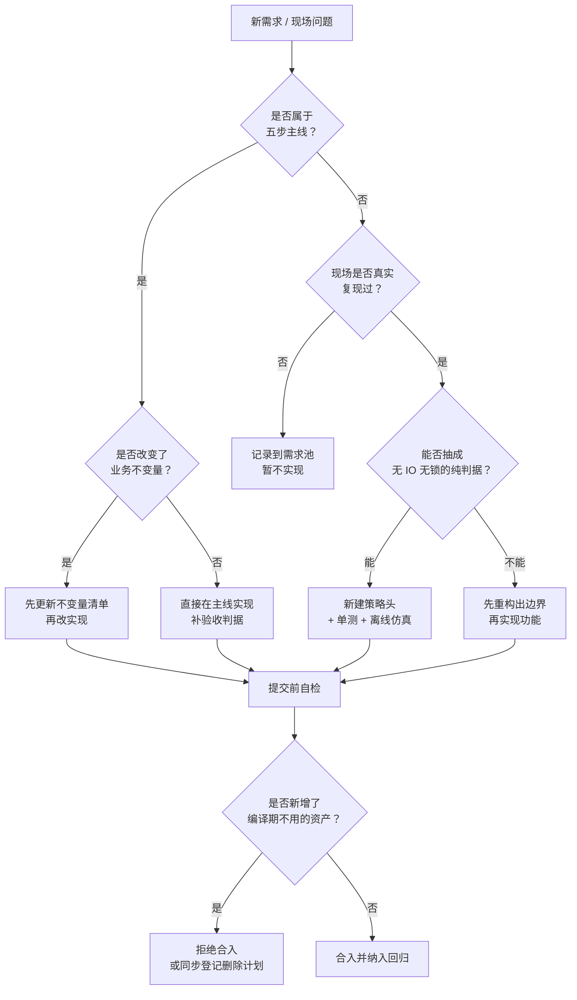

## 6.3 分阶段实施路线

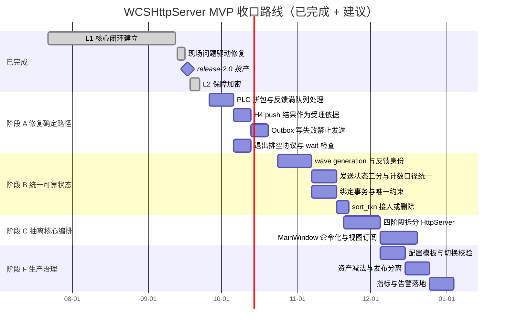

> 图中 2026-09-26 之后的排期为**建议排期**，不是已承诺计划；阶段划分参照架构报告 §6.3，本文按 MVP 守持度调整了顺序（把"提交点收敛"提前到阶段 A/B）。

**与架构报告 §6.3 的差异说明**：架构报告按"技术风险"排序；本文按"MVP 守持度"排序，把三件事提到了最前——① 反馈不丢（否则账务无意义）② 提交点收敛（否则补传无依据）③ 资产减法（否则每加一个功能都更贵）。其余阶段与架构报告一致。

## 6.4 目标结构

```mermaid
%% 图 6-3 目标结构
flowchart LR
    UI["MainWindow<br/>只发命令 + 订阅视图"]
    CO["波次协调器<br/>活动上下文 / generation / 状态所有权"]
    P1["策略头<br/>分配 / 出队 / 留痕 / EPC 识别"]
    DEV["设备适配<br/>PLC / RFID / S7"]
    STORE["存储层<br/>事务 / 提交点 / 迁移版本"]
    OUT["报文交付<br/>Outbox 状态机（复用 OutboxManager）"]
    OBS["观测<br/>分段时延 / 队列水位 / 审计"]

    UI -->|命令| CO
    CO -->|订阅| UI
    CO --> P1
    CO --> DEV
    CO --> STORE
    CO --> OUT
    CO --> OBS
```

**为什么要这张图**：它把 MVP 的三层结构（图 1-2）映射成了可以逐步替换的代码边界。改造不必一次重写——先让"策略头"这一列全部到位，再迁"存储/报文"，最后动 UI。

---

# 第 7 章 验收与持续验证

## 7.1 需求验收用例（按 MVP 层）

| 层 | 用例 | 必须断言的结果 | 关联需求 |
| :---: | --- | --- | --- |
| L1 | 一件货从 H4 波次到 H8 完结全链路 | 计划、路由、实绩、报文四处口径一致 | FR-1~FR-8 |
| L1 | 同 SKU 分配格口 12 和 2，各自数量/来源/类型不同 | 逐格口属性全部保留；路由与 H7 明细与计划相符 | FR-2.1、FR-2.2 |
| L1 | EPC 头部/尾部带杂串、含 NOREAD | 正确识别或按原文告警，不下发脏指令 | FR-4.1 |
| L2 | 超计划件场景（实落 > 计划） | 改投 66；不计分拣；不写箱内明细；不进 H7；四层同时生效 | BR-1、BR-2、BR-4 |
| L2 | 落错格场景（落到该 SKU 无计划的格口） | 只留痕，不进 H7 | BR-3 |
| L2 | 同 EPC 换箱后再次反馈 | 只记 1 条落格明细 | BR-5、FR-6.2 |
| L2 | 波次切出 → 重启 → 切回 | 额度、去重集、箱内明细按实绩重建一致；pending H7/H8 可补发 | FR-8.4、FR-8.5、NFR-4 |
| L2 | 终态波次尝试切回 | 被拒绝且提示明确 | FR-8.6 |
| L2 | 分拣中接收 B/C 波次 | A 的计划与路由不变；B/C 只有激活后才发布 | FR-1.5、FR-1.6 |
| L3 | WAVE_MAP 闸门 | SKU ≤ 5000 全量；超出首尾各 30 行；强制全量开关生效；行数与判据自证一致 | FR-10.3 |
| L3 | 崩溃注入 | 生成 minidump 与 `crash.log`，含最后一条 Qt 消息 | FR-10.2 |

## 7.2 故障注入矩阵（投产形态必测）

| 注入点 | 注入方式 | 必须成立 |
| --- | --- | --- |
| PLC 帧损坏 | 一帧逐字节分片、多帧粘包、跨连接混合、断线半帧 | 有效反馈恰好形成预期业务事件；连接间缓冲隔离；非法帧可观测（**当前不成立** R3） |
| 反馈过载 | GUI 停顿 + 瞬时反馈超缓冲容量 | 无业务静默丢弃；积压与限流可观察；UI 可丢展示但不丢账（**当前不成立** R3） |
| 发送失败 | PLC 未连接 / 中途断开 / 发送延迟 | queued、sent、failed、ack 含义一致；超时从正确时点计算（**当前不成立** R5） |
| 报文写库失败 | 模拟 Outbox 写失败 | 未持久化不发网；持久化后可补传（**主路径当前不成立** R7） |
| 进程中断 | 在 H4 受理、落格写库、H7 创建/发出、H8 确认等阶段强杀 | 重启后所有可恢复中间状态有定义；不把已发未确认误判成成功 |
| 退出时仍有任务 | 解析/发送/反馈/DB 任务未完成时退出 | 正确停止或持久化；无线程释放后访问（**当前部分不成立** R2） |
| 配置异常 | 热更新、磁盘满、坏 XML、迁移失败、绑定插入失败 | 配置快照原子生效；旧有效配置可保留；DB 失败不误报就绪 |
| 迟到与跨波次 | 重复反馈、主动重投、不同波次相同 EPC、迟到旧波次回执 | 唯一件数/动作数各自正确；旧上下文不污染新波次 |
| 队列洪泛 | 同时提交超过解析队列容量的 H4 | 每个成功响应均有可恢复任务；拒绝有明确状态；无静默失败（**当前不成立** R6/R13） |
| 干净环境 | Debug/Release 与发布包启动 | Qt 插件、DLL、配置与端口自检通过；日志不输出密钥（**当前不成立** R14/R16） |

## 7.3 完成定义（DoD）：把 MVP 纪律固化进流程

任何一个需求要算"做完"，必须同时满足：

1. **有归属**：实现在正确的模块/策略头，不是塞进 `HttpServer.cpp` 或 `MainWindow.cpp`；
2. **有验证**：纯逻辑改配有单测；业务规则改配有离线仿真或只读核对脚本；
3. **有判据**：本条需求对应的验收判据写入本文件第 4 章表格的"验收判据"列；
4. **有留痕**：新增异常分支有对应的 `exception_record` 或分类日志；
5. **无新增死资产**：不引入编译进来但无调用方的代码；临时探针用完即删或归档到 `_probe/`；
6. **有退路**：涉及配置/数据的改动有回滚方式，且回滚方式被写下来。

---

# 附录

## A. 术语表

| 术语 | 含义 | 备注 |
| --- | --- | --- |
| 波次 / Wave | WMS 下发的一批分拣任务上下文 | 由 `orderCode` 标识 |
| SKU / inco | H4 中的商品品种标识 | 解析后的主映射以 SKU 为 key |
| EPC | RFID 识别的单件编码 | 经 `EpcCode` 规则归一；原始帧三层留痕 |
| 格口 / Grid | 分拣目的地 | 内部三位 key（如 `007`），对外可编码为 `22007` |
| gridType | 格口类型：0 分类 / 1 异常 / 2 发货 | 每格口计划随类型一并保存 |
| 异常口 66 | 超计划或无法归属件的物理改投口 | 不计已分拣、不写箱内明细、不进 H7 |
| 容器 / boxcode | 格口当前绑定的箱 | 决定 H7 装箱归属 |
| H4 / H5 / H6 | WMS → WCS：下发波次 / 取消波次 / 绑定容器 | 三条有效入站路由 |
| H7 / H8 | WCS → WMS：满箱明细 / 波次完结 | 出站回传，各有独立 URL 与 method |
| Outbox | 待发报文的持久化记录 | `outbox_fullbox` / `outbox_end` |
| 切出 / 切回 | 保存并挂起当前波次 / 恢复历史波次继续作业 | 切出保留 120 秒绑定归属窗口 |
| 计划分配表 | 波次级编译的计划与额度结构 | `PlanAllocTable`，`remain = plan − landed − reserv` |
| 在途 / claim | 已下发但尚未收到落格反馈的额度占用 | 认领超时会被清扫 |
| 不变量 | 任何时刻都必须成立的业务约束 | 见架构报告 §6.2 与本文 BR 表 |

## B. 关键证据索引

| 主题 | 证据位置 |
| --- | --- |
| 系统边界与外部交互 | `WCSHttpServer_软件架构分析报告.md` §1.1–1.2 |
| 配置真值与部署差异 | 同上 §1.3；`release_WcsHttpServer/config/http_server.xml` |
| 模块清单与行数 | 同上 §2.2 |
| 业务数据流与时序 | 同上 §3.3–3.5 |
| 状态模型与迁移白名单 | 同上 §3.6；`WaveManager.cpp` |
| 持久化模型 | 同上 §3.7；`define.h` 中的 SQL 与表定义 |
| 线程与调度模型 | 同上 §3.8 |
| 风险清单 R1–R19 | 同上 §5.3–5.4 |
| 业务不变量十条 | 同上 §6.2 |
| 应新增的观测指标 | 同上 §6.5 |
| 设计理念与取舍 | 同上 §7 |
| 高技术价值点 V1–V11 | 同上 §8.2 |
| 生产运行状态与现场修复轨迹 | 同上 §10 |
| 业务常量 | `WCS_httpServer/define.h` |
| 操作流程 | `docs/WCS现场作业流程图.md`、`docs/WCS现场操作手册.md`、`docs/WCS软件标准作业程序SOP.md` |
| 现场根因文档 | `docs/` 下各 `_根因与修复_` / `_现场需求_` 文档 |
| 离线渲染工具 | `tools/mermaid_to_svg.js`（零依赖，仅支持 `flowchart LR/TD`） |

## C. 本文与既有文档的分工

| 文档 | 回答的问题 | 不回答 |
| --- | --- | --- |
| `WCSHttpServer_软件架构分析报告.md` | 系统**是什么样**、风险在哪、技术上值钱在哪 | 需求条目化、优先级、验收判据 |
| **本文** | 系统**为什么这样**（MVP 视角）、需求有哪些、满足到什么程度、还差什么 | 逐行代码走查、现场操作步骤 |
| `docs/WCS现场操作手册.md` / `SOP.md` | 现场**怎么操作** | 需求与架构 |
| `docs/` 下根因文档 | 某个具体问题**怎么发生的、怎么修的** | 全局需求视图 |

## D. 变更记录

| 日期 | 版本 | 变更 | 基线 |
| --- | --- | --- | --- |
| 2026-09-25 | v1.0 | 首版：MVP 思想图解（24 图）+ 需求分析（FR 65 / BR 12 / NFR 10 / IR 9 / DR 12）+ 追溯矩阵 + 改进需求 | 工作区 `9d0af57` |

---

> **验证边界重申**：本文的"已满足"均指静态代码路径成立。未编译、未启动应用、未连接 WMS/RFID/PLC、未做集成与压力测试。所有"现场后果"是基于代码路径与既有现场文档的推断，实际频率与影响需在隔离环境或现场验证后确认。

