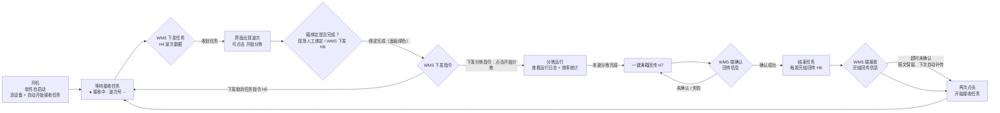
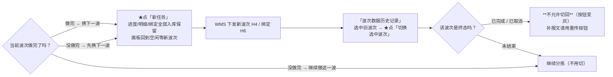
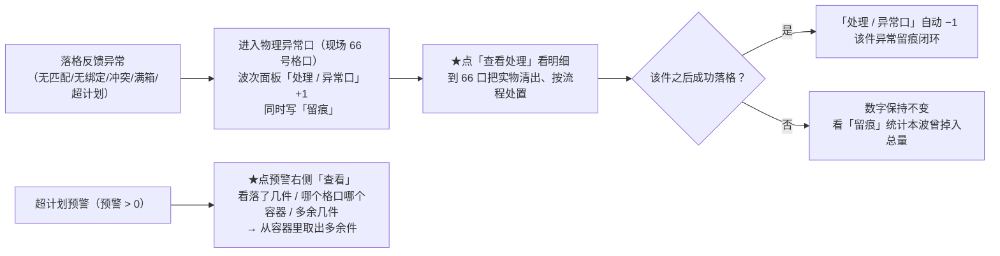

# WCS 现场作业流程图（开机 → 循环）

> 版本：2026-09-17 ｜ 软件：`WCS_httpServer.exe`
> 配套：`docs/WCS现场操作手册.md`（操作细节）、`docs/flowchart/`（可直接打印的图）
> 口径：蓝=现场人工操作（须点击）｜灰=软件自动 ｜绿=WMS/上位系统 ｜黄=判断/等待 ｜橙虚线=回环

---

## 一、主流程图（可离线渲染的版本）

**离线查看（推荐现场用）**：直接双击打开下面任意一个文件，**不依赖网络**：

| 文件 | 用途 |
| --- | --- |
| `docs/flowchart/WCS现场作业流程图_LR.html` | **横向版**（一屏看得完，适合电脑/投屏看） |
| `docs/flowchart/WCS现场作业流程图_TD.html` | **竖向版**（A4 纵向打印、张贴机台用） |
| `docs/flowchart/WCS现场作业流程图_LR.svg` | 矢量图，可插入 Word/PPT，任意放大不模糊 |
| `docs/flowchart/WCS现场作业流程图_TD.svg` | 同上（竖向） |

**在线渲染（联网环境）**：把下面代码块贴到 [mermaid.live](https://mermaid.live) 或 VS Code（`Ctrl+Shift+V` 预览）：



> 源文件（含配色指令，本仓库离线渲染器用）：`tools/现场作业流程图.mmd`
> 重新生成图：`node tools/build_flowcharts.js`（带结构自检；`--check` 只自检不写文件）

---

## 二、相对原始版本的 4 处修正

| # | 原始版本 | 修正后 | 为什么必须补 |
| --- | --- | --- | --- |
| ① | `一键满箱回传 → WMS端确认` 后**直接**到"结束任务" | 增加分支 `未确认 / 失败 → 回「一键满箱回传」` | 这是现场最常见的失败路径：H7 失败报文会留在系统里可重传，图上必须有这条回路，否则现场会以为"没传上就只能算了" |
| ② | 节点 `F{WMS下发指令}` 的标签写成"下发分拣指令：点击开始分拣" | 拆成两步：**F=WMS 下发指令**、**G 前的边=界面点「开始分拣」** | 两者是不同主体的动作（WMS 下发 vs 现场人点击），压在一个节点里责任不清 |
| ③ | `下发取消任务指令 → B` | 保留，并明确回到「等待接收任务」 | 取消（H5）后是回到等待，不是回到开工 |
| ④ | `WMS端接收完结回传信息 → 再次点击开始接收任务`（无条件） | 增加 `超时未确认 → 报文保留、下次自动补传` 的同目标分支 | 超时也走同一条路（H8 未确认不阻塞下一次循环，报文入库待补） |

另外保留了你原图的**主干闭环**（`L → B`），换波次/切回上一波属于分支，见下一节。

---

## 三、每步操作与判据（对着图看）

| 步 | 动作 | 谁做 | 界面判据 | 不满足时怎么办 |
| --- | --- | --- | --- | --- |
| ① | 双击 `WCS_httpServer.exe` | 操作员 | — | 提示"程序已在运行"= 别双开 |
| ② | 软件自启动 | 自动 | 最大化；`● 接收中`；`TCP: 监听中/已连接`、`RFID: 已连接`、`S7: 已连接`；绑定面板全无底色（新任务状态，正常） | RFID 显示"自动重连中"= 等它重连或查网络；端口标签看清 `(测试)`/`(正式)` |
| ③ | 等待接收任务 | 等 | 波次号 `-- 等待波次 --` | 确认 WMS 侧是否已推送 |
| ④ | WMS 下发任务(H4) | WMS | 波次号/状态/计划件数出数；**「开始分拣」仍灰色** | 没出数 → 查 `log/HTTP/http.log` |
| ⑤ | 箱绑定（人工 + WMS H6） | 操作员 + WMS | 「容器绑定状态」页 **绿色=已绑定**、箱号显示 | 无底色=未绑定，落件会掉异常口（66 口） |
| ⑥ | **点击「开始分拣」** | **操作员★** | 按钮**由灰变橙**才可点；点后状态=分拣中 | 灰=还没到"已绑定" |
| ⑦ | 分拣运行 + 看日志/效率 | 操作员 | 波次面板「已分拣 / 分拣件数 / RFID扫描」在涨；`TCP发送/接收` 计数增长；「运行日志」红字=错误 | 数字不动 → 查 RFID 连接与 `log/PLC/PLC.log` |
| ⑧ | **点击「一键满箱回传」** | **操作员★** | 弹窗二次确认；按钮右侧 `本波次满箱回传 N 次 ｜ 本次一键 成功 x / 失败 y` | 无绑定容器/无运行波次时会提示无可回传 |
| ⑨ | WMS 端确认回传(H7) | WMS | 成功计数上涨；失败项进入下拉 | **未确认/失败 → 用「重传满箱切换(H7)」**（下拉选失败格口，或手输格口号 `5`/`005`/`22005`） |
| ⑩ | **点击「结束任务」** | **操作员★** | 按钮变橙 `停止中…(点击立即停止)`；日志 `[完结回传] 已触发完结回传（H8）` | 不想等：**再点一下按钮**立即停止（H8 未确认的报文下次自动补传） |
| ⑪ | WMS 端接收完结回传(H8) | WMS | 回执成功 → 自动停止接收、按钮回绿；超时 → 报文保留待补传 | 补发入口：**重传任务完结(H8)**（下拉选失败波次） |
| ⑫ | **再次点击「开始接收任务」** | **操作员★** | 状态回 `● 接收中`；波次面板复位为"等待 WMS 下发"（上一波数据仍在库里，可切回） | — |
| ↗ | 回到 ③ 进入循环 | — | — | — |

`★` = 必须人工点击。

---

## 四、两条重要分支（主干之外，现场最常用）

### 分支 A：中途换波 / 要接着做上一波



### 分支 B：异常件与超计划



> 这两张分支图的离线版渲染：把代码块贴到 mermaid.live 即可；本仓库离线渲染器同样支持
> （`node tools/mermaid_to_svg.js <输入.mmd> <输出.svg>`）。

---

## 五、三条容易误解的口径

1. **「开始分拣」是唯一的分拣开关**：绑定齐了按钮才亮；不点它，WMS 下发了波次也不会落件。
2. **绑定有两条来源**：现场人工放箱 + WMS 下发 H6，最终以**绑定面板绿色**为判据；面板不显示异常口 66（右侧文字提示 `异常口：66格口`）。
3. **一个循环的结束不是"关闭软件"**：结束任务只停止"接收"；设备一直连着，再点「开始接收任务」即进入下一轮（图上的 → ③）。

---

## 六、图的生成与校验（技术员用）

```bat
:: 重新生成所有图（含结构自检：节点越界/重叠、连线数、标签压节点、文字溢出）
node tools\build_flowcharts.js

:: 只自检不写文件
node tools\build_flowcharts.js --check
```

- 渲染器：`tools/mermaid_to_svg.js`（零依赖、离线；支持 `flowchart LR|TD`、`[矩形]`、`{菱形}`、`-->|标签|`、`<br/>`，
  支持本仓库扩展指令 `%% @cls <节点> op|auto|wms|dev` 指定配色）
- 为什么自己写渲染器：本机与现场都访问不了 mermaid CDN（`cdn.jsdelivr.net` 超时），
  而流程图必须"双击就打开、断网也能看、能直接打印"。
- 图里所有几何都由脚本算出并在生成时自检通过（当前：12 节点 / 15 连线 / 8 个边标签 / 3 条回环虚线）。
