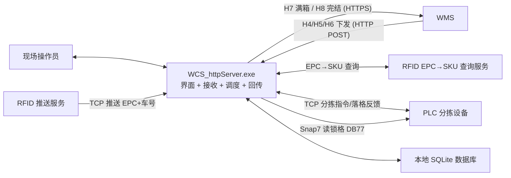
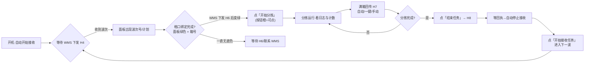

# WCS 分拣控制软件（WCS_httpServer）标准作业程序（SOP）

| 项目 | 内容 |
| --- | --- |
| 文件名称 | WCS 分拣控制软件标准作业程序 |
| 文件编号 | WCS-SOP-001 |
| 版本/版次 | V1.1 |
| 适用软件 | `WCS_httpServer.exe`（WMS 退货分拣 HTTP 服务 / 分拣控制上位机，release-2.0 生产版） |
| 编制 | （待填写） |
| 审核 | （待填写） |
| 批准 | （待填写） |
| 生效日期 | （待填写） |
| 分发范围 | 现场操作员、带班/组长、技术员、仓库管理人员 |

## 修订记录

| 版本 | 日期 | 修订内容 | 修订人 | 审核 |
| --- | --- | --- | --- | --- |
| V1.0 | 2026-09-20 | 首版发布：依据《WCSHttpServer 软件架构分析报告》《WCS 现场操作手册》《WCS 现场作业流程图》及发布目录现状编制 | （待填写） | （待填写） |
| V1.1 | 2026-09-20 | 按架构分析报告（2026-09-19 生产复审版）逐项核对对齐：新增 6.3 线程/容量参数、计划分配表术语、FAQ 三问（多格口/落错格/重扫）、附录 E 状态与内部枚举对照、附录 F 已知运行边界（R3/R5/R7/R14/R17）、归档整理要求 | （待填写） | （待填写） |
| | | | | |

---

## 1. 目的

规范 WCS 分拣控制软件的日常开机、任务接收、波次分拣、满箱回传、任务完结、换波/切回、异常处置、数据归档与软件维护等作业的操作步骤、判据与责任分工，确保：

1. 分拣作业流程统一、账实一致、操作可追溯；
2. 波次数据、绑定关系、回传报文不丢失、可恢复、可补传；
3. 配置变更、环境切换、软件升级与数据备份归档规范受控，避免误操作造成业务损失。

## 2. 适用范围

适用于使用 WCS 分拣控制软件（`WCS_httpServer.exe`）进行 WMS 退货波次分拣作业的全部相关人员：

- **现场操作员**：第 7～9 章（开机、作业、异常处置）；
- **带班/组长**：第 7～9 章 + 第 11 章（环境确认、配置查看）；
- **技术员/IT**：全文，重点是第 10～12 章（归档、配置、升级维护）。

## 3. 引用与配套文件

| 文件 | 用途 |
| --- | --- |
| `docs/WCS现场操作手册.md` | 界面控件与操作细节的详细说明（本 SOP 的配套细则） |
| `docs/WCS现场作业流程图.md`（含 `docs/flowchart/` 离线图） | 作业主流程与分支流程图（可打印张贴） |
| `docs/WCSHttpServer_软件架构分析报告.md` | 系统架构、数据流、风险与配置真值（技术员用） |
| `docs/WCS_EPC改造说明.md`、`docs/多格口分配与异常口_现场验证用例.md` | 关键业务口径的改造说明与验证用例 |
| 对接文档/接口文档（D:\WCS 根目录） | WMS H4～H8 接口协议 |

## 4. 术语与缩略语

| 术语 | 含义 |
| --- | --- |
| WCS | 仓库控制系统，即本软件 |
| WMS | 仓库管理系统（上游系统） |
| 波次（Wave） | 一次分拣任务，由波次号（orderCode）标识 |
| H4 | WMS→WCS 波次下发（InsertWaveInfo，含 SKU/格口计划） |
| H5 | WMS→WCS 波次取消（InsertWaveIn） |
| H6 | WMS→WCS 格口容器绑定（BindingLatticePort） |
| H7 | WCS→WMS 满箱回传（满箱及装箱明细） |
| H8 | WCS→WMS 波次完结回传 |
| SKU | 商品品种标识（H4 中的 inco/barcode 均指 SKU） |
| EPC | RFID 识别的单件编码（识别规则：`A + 24 位数字`，长度配置项 `rfidEpcTruncateLen`，现场=25） |
| PLC | 分拣设备控制器（TCP 分拣指令 + S7 锁格读取） |
| RFID | 射频识别推送服务（推送 EPC + 小车号） |
| 格口 | 分拣落货口，内部三位编号（如 007），对外 WMS 编码为前缀+补零（如 22007） |
| 异常口 | 物理异常格口（现场 66 号），承接无匹配/无绑定/冲突/超计划件、以及「格口未绑定容器」被拦下的件 |
| 在途 | 已下发 PLC 指令、尚未收到落格反馈的件 |
| 超计划 | 某 SKU 某格口实际落件超过计划数量（改投异常口） |
| ★ 可下发格口 | 下发分拣指令的前置条件（2026-09-26 定稿，**无条件生效**）：**未禁用 且 未锁格（含锁格状态未知） 且 已绑定容器**。锁格一律不落件、未绑定容器一律不落件；未绑容器/锁格的格口**不下发**：件改投异常口或按根因不发指令（额度保留在原单元，格口恢复后自动恢复）。★ 多格口 SKU 时，件**优先用其它"可下发且自身仍有剩余额度"的单元承接**；都没有可用额度时才进异常口 66 或不下发。**计划额度不搬迁**（搬迁能力已从代码删除）。旧配置键 `sortingRequireBoundGrid` 已废弃（写 false 只告警不生效） |
| 计划分配表 | 波次开始时把 SKU×格口计划一次性编译成内存表，按各格口剩余额度选格、在途认领；满额即改投异常口 |
| Outbox | 本地持久化的 H7/H8 待发报文（可重试、可人工补传） |
| 切出/切回 | 关闭软件=切出（进度/明细/绑定归档保留），重新打开后从历史记录切回继续 |

## 5. 职责与权限

| 角色 | 职责 | 权限边界 |
| --- | --- | --- |
| 操作员 | 开机、接收任务、开始分拣、满箱回传、结束任务、新任务、切回波次、异常件清出 | 日常作业按钮；不得修改配置、不得删除数据文件 |
| 带班/组长 | 交班核对、环境确认（测试/正式）、补传报文、查看日志、上报异常 | 可使用全部面板功能与「设置配置」查看（修改需技术员确认） |
| 技术员/IT | 配置修改、环境切换、软件升级、数据备份归档、日志分析、数据库只读核对 | 拥有全部技术权限；所有变更必须留痕（第 13 章记录表） |

## 6. 系统概述

### 6.1 系统组成与对外接口

WCS 为单机 Windows 程序，一个进程内完成界面、WMS 接口、RFID 接入、PLC 通信、波次调度与本地持久化：



### 6.2 关键端口（现场默认）

| 通道 | 方向 | 端口/地址 | 备注 |
| --- | --- | --- | --- |
| WMS 接收 | WMS→WCS | TCP **8191** | `wmsListenPort`，改后需重启 |
| PLC TCP | PLC→WCS | TCP **2000** | `plcListenPort`（发布配置），改后需重启 |
| RFID 推送 | WCS→RFID | TCP **2010** | `rfidPushServerIp/Port`，改后需重启 |
| RFID 查询 | WCS→服务 | HTTP `rfidQueryUrl` | 热生效 |
| PLC S7 | WCS→PLC | `plcS7Ip`（DB77 锁格位图） | 改后需重启 |
| H7/H8 回传 | WCS→WMS | `feedbackUrl`/`feedbackEndUrl`（HTTPS） | 热生效 |

### 6.3 线程池与容量参数（技术员参考，发布配置）

| 项 | 值 | 说明 |
| --- | --- | --- |
| HTTP I/O worker / 业务池 | 16 / 90 | 接收 HTTP 与业务处理；业务池任务队列无界 |
| PLC 发送池 / 反馈池 | 8 / 4 | 分拣指令发送与落格反馈批量处理 |
| 解析线程 / DB 写线程 | 1 / 1 | H4 解析专用线程；数据库单写线程 |
| 计划分配表在途上限 | 2000 | 超出强制清扫+异常留痕；审计与认领超时均 30 s |
| PLC 反馈批量缓冲 | 200 条/批 | 缓冲满丢最新条目（注意事项见附录 F） |

### 6.4 目录与关键文件（位于 exe 所在目录）

| 路径 | 内容 | 管理要求 |
| --- | --- | --- |
| `config/http_server.xml` | **运行配置真值**（exe 目录下这份才是实际生效配置） | 只通过「设置配置」编辑；变更自动备份 |
| `data/sorting_records.db` | 分拣主库（波次/计划/实绩/绑定/报文/异常） | **禁止删除/改名**；定期备份 |
| `data/wave_history.db` | 波次完结摘要（历史归档库） | 同上 |
| `log/`（Run/WCS/HTTP/PLC/LIFECYCLE/WAVE_MAP/DataBase 分类） | 分类日志 | 保留 `logRetainDays` 天（默认 30） |
| `crash_*.dmp`、`crash.log` | 崩溃转储与崩溃日志 | 保留并交技术员 |
| exe 同目录 DLL/platforms/sqldrivers | Qt 运行库与插件 | 升级时随包替换，勿单独增删 |

### 6.5 界面速览（详见《现场操作手册》第 1 节）

- **第一行**：任务接收控制（开始接收/结束任务、一键满箱、重传 H7/H8、设置配置、新任务等）｜设备状态（PLC/S7/RFID）｜波次信息（波次号、状态、计划、已分拣、处理、异常口、预警、「开始分拣」按钮）。
- **第二行左侧竖排标签页**：① 容器绑定状态（66 格口）② 运行日志 ③ 波次数据历史记录 ④ 分拣记录查询 ⑤ 计划分配表（默认隐藏）⑥ 实时面板（默认隐藏）。

---

## 7. 每日开机与作业前检查

### 7.1 开机步骤

1. 双击 `WCS_httpServer.exe`（桌面快捷方式）。**同一台电脑只允许开一个实例**；若提示"程序已在运行"，到任务管理器结束多余进程或用已打开窗口，切勿双开。
2. 程序自动完成：最大化打开 → 连接 PLC/S7/RFID → **自动执行一次「开始接收任务」**。

### 7.2 开机三处确认（缺一不可）

| # | 确认点 | 正常判据 | 异常时 |
| --- | --- | --- | --- |
| 1 | 任务接收控制区 | `● 接收中`；端口标签看清 **`(测试)`橙色 还是 `(正式)`红色** | 标签与环境不符 → 立即报告带班，**不得开工** |
| 2 | 设备状态 | `TCP: 监听中或已连接`、`RFID: 已连接`、`S7: 已连接` | RFID"自动重连中"→ 等待重连或查网络/服务；持续异常报技术员 |
| 3 | 容器绑定状态页 | 全部格口**无底色、箱号 `--`**（开机=新任务状态，正常） | 若显示历史箱号 → 版本过旧，升级后重启 |

3. 开机**不会自动装载**历史容器绑定与历史波次（设计行为）；日志出现"检测到未结束波次 X"提示时，按 8.8 切回继续。

---

## 8. 标准作业流程

### 8.1 波次作业全流程（主循环）



### 8.2 各步骤操作与判据

| 步骤 | 操作（谁） | 界面判据（正常） | 异常处置 |
| --- | --- | --- | --- |
| ① 接收任务 | 自动（开机）/ 点「开始接收任务」 | `● 接收中`，波次号 `-- 等待波次 --` | 端口被占用 → 查日志、报技术员 |
| ② 波次下发 | WMS（H4） | 波次号/状态/计划件数出现；「开始分拣」仍灰 | 未出数 → 查 `log/HTTP/http.log` 确认是否收到 H4 |
| ③ 容器绑定 | WMS（H6） | 对应格口**变绿**并显示箱号 | 无底色=未绑定；★ 未绑定容器的格口**不再收件**（判定期拦下 → 件改投异常口 66，不消耗计划额度），H6 绑定后自动恢复 |
| ④ 开始分拣 | **操作员点「开始分拣」** | 按钮由灰变橙才可点；点后状态=分拣中 | 灰=未到"已绑定"；开工预检会列出"有计划未绑箱"格口（仅告警） |
| ⑤ 分拣运行 | 自动 | 「已分拣/分拣件数/RFID扫描」上涨；TCP 发送/接收计数增长 | 数字不动 → 查 RFID 连接与 `log/PLC/PLC.log` |
| ⑥ 满箱回传 | 自动/操作员（H7） | 成功计数上涨；失败进下拉可重传 | 失败**不影响分拣**，用「重传满箱切换(H7)」补发 |
| ⑦ 结束任务 | **操作员点「结束任务」** | 按钮变橙"停止中…(点击立即停止)"，日志 `[完结回传]` | 再点一下=立即停止；H8 未确认报文保留、下次自动补传 |
| ⑧ 下一波 | 操作员点「开始接收任务」（或「新任务」） | 按钮回绿；面板复位为等待下发 | 上一波数据仍在库里，可切回 |

### 8.3 满箱回传（H7）三种方式

| 方式 | 触发 | 用途 |
| --- | --- | --- |
| 自动满箱 | **只在 PLC 锁格（=满箱）时**由系统自动生成上传 | 正常作业 |
| 一键满箱回传 | 按钮（弹窗确认） | 收尾/交班前对**有分拣记录的已绑定格口**逐个上报；空格口自动跳过 |
| 手动满箱 | 「重传满箱切换(H7)」下拉选失败格口，或**手输格口号**（`5`/`005`/`22005` 都认） | 单格口补报 |

> ★ **2026-09-25 起（现场口径更正）：解锁不发送满箱回传（H7）——只有锁格才发送。**
> PLC 的"解锁"（锁格位下降沿）**不产生任何回传报文**，系统只刷新格口状态并按需留痕提示。
> 因此：**满箱回传 = 锁格动作的产物**；若某格口解锁时仍有未上传的落格记录（例如锁格当时波次不在执行态），
> 系统只提示"解锁不发送满箱回传（只有锁格才发）"，记录**保留在内存不丢**，请用
> 「一键满箱回传」/「重传满箱切换(H7)」手输格口号补传，或让该格再次锁格、点「结束任务」时统一补发。
>
> ★ **2026-09-26 起（现场口径）：「H6 到场」≠「马上能收件」——恢复收件的时点=PLC 解锁边沿。**
> H6 到达时若 PLC 仍为满箱锁格（S7 锁格位=1，换箱动作未结束），系统**暂不解除该格禁用**：
> 该格在此期间不进候选（件优先用同 SKU 其它格口额度；都没有则"不发指令"+异常留痕，**额度保留**），
> 面板保持橙「满箱锁格」；解锁边沿到达且该格已绑定容器时才 `enableGrid` 恢复收件（面板转绿）。
> 未换箱的格口解锁后保持红「已解锁·待重绑」（等 WMS 重发 H6）。
> 兜底：10 秒周期的兜底对账会把"已绑容器+锁格位=0+仍被禁用"的格口自动恢复（掉线期间丢失的解锁边沿不会卡死格口）。
> 详见 `docs/H6到场不等于可收件_换箱时序口径_20260926.md`。

> 满箱后格口物理锁格（面板橙色），需换箱时由 **WMS 重新下发 H6**；换绑前该格口不再收件。
> ★ 解锁但**尚未绑定新容器**的格口同样不收件（2026-09-20 起：下发前置条件=已解锁且已绑定容器）——
> 判定期即拦下并改投异常口 66，**不消耗计划额度**；H6 一到自动恢复分配。
> ★ 满箱未重绑(禁用)期间同理：该格**不再收件、额度留在原格口**（2026-09-21 起取消跨格口搬额度），
> 件改用同 SKU 其它格口自身额度、都没有则进异常口 66；换箱并重绑后自动恢复 —— 分格口计划数字不再漂移。
> ★★ **2026-09-22 起：锁格（=满箱）瞬间即"容器离场"** —— 系统先把箱号快照留痕，**立即清掉该格口绑定**
>   （内存 + 数据库 active=0，历史行保留），**不再等 H7 回传结果**。效果：
>   · 该格口在下发判定期立刻等价于"未绑定容器" ⇒ 计划件改投异常口 66，**不会再落进没有箱子的格口**
>     （这就是现场"格口已打开、没有容器，衣服照样进去"的整改）；
>   · 落格写库不再把件记到已被取走的旧箱号上（消除串箱/账实不符）；
>   · H7 报文与箱号**即使发送失败也保留在系统**：失败自动重试（间隔 30 秒，上限 2 次），
>     重试耗尽后落"失败"并进入「重传满箱切换(H7)」下拉等人工补传 —— 报文和箱号都不会丢；
>   · 满箱上报后请**尽快把箱子取走**并让 WMS 下发 H6 绑定新箱（H6 到达即自动恢复收件）。

### 8.3.1 H7 失败与人工补传（2026-09-22 口径）

1. H7 发出后 WMS 未成功（网络失败 / WMS 业务拒绝，例如"库存不足"）→ 系统**自动重试**（默认重试 2 次，间隔 30 秒）；
2. 重试仍不成功 → 该条报文标记"失败"并**留痕**（异常表 + 界面失败下拉），**等待人工补传**；
3. 人工补传入口：**「重传满箱切换(H7)」** 下拉选失败格口 → 重传（或手输格口号补报）；补传成功后状态转"成功"；
4. 报文与箱号在"待发/失败/成功"全过程都保留在数据库（供追溯与重传），**不会因波次结束而删除**。

★ **重试次数口径（2026-09-22 起）**：`回传次数/已重试次数` 严格等于"**已发生的重发尝试次数**"——
首发不计；**每一次自动重试、每一次人工重传失败各消耗一次**；成功与"判定失败"本身不再额外计数。
因此界面/库里看到的次数就是真实试过的次数；到上限（H7=2 次、H8=3 次）仍未成功即转"失败"并等人工补传，
**不会无限重发**（过载保护：WMS 完全无响应时也在此收口）。

★ **换箱时不用担心"旧回执把新箱清掉"（2026-09-22 起，结果与容器彻底解耦）**：容器号**只在锁格
（=满箱）/完结补发那一刻清理**（那才是"箱子离场"的物理时点）；满箱回传的成功 / 失败 / 自动重试 /
人工重传**一律不改容器绑定**：

- 系统不会因为 H7"回传成功"去解绑，也不会因迟到回执清掉你刚换上的新容器（代码中已不存在任何
  "由回传结果改动容器绑定"的路径）；
- 回执只做三件事：① 更新这条报文自己的状态（成功/失败/重试次数）② 落响应留痕（界面「响应结果」列可见）
  ③ 刷新失败重传下拉（**不再复检任何"完结屏障"——该机制已取消**）；
- 旧的绑定早在**锁格那一刻**就已归档留痕（`grid_box_bind.active=0 + unbind_time`，行保留可追溯）。

所以正常节奏是：**满箱上报 → 取箱 → WMS 下发 H6 绑新箱 → 该格口自动恢复收件**。

### 8.4 结束任务（H8）要点

★ **2026-09-22 起（现场口径定稿）：点「结束任务」= ① 把所有已有数据的格口统一做一遍满箱回传（H7）
→ ② 固定 2 秒后，不论 H7 是否成功，都发送完结回传（H8）** —— H8 始终是本波次最后一条报文，
且**满箱回传的结果与完结回传完全分开**：

| 结束时的满箱回传状态 | 系统行为（固定延迟 `endReportDelayMs=2000`） |
| --- | --- |
| H7 全部成功 | 2 秒后发送 H8（操作员无感） |
| 仍有 H7 在自动重试中 | 2 秒后**照发 H8**（不等重试；重试继续在后台跑，成功与否只影响它自己那条报文） |
| 有 H7 重试耗尽 / 报文未生成 | 2 秒后**照发 H8**；系统把**未成功清单**（格口号、箱号、状态、已重试次数）写入异常表并在界面提示，现场后续用「重传满箱切换(H7)」逐条补传即可 |

> ★ 现场口径要点：
> · **顺序**：H7 先全部发出（报文与箱号入库，可自动重试），隔 2 秒再发 H8 ⇒ H8 一定是最后一条报文；
> · **结果分开**：H7 的成功/失败/自动重试/人工重传**只影响它自己那条报文**，不阻塞、不改写、不取消 H8；
>   H8 自己按 `outbox_end` 重试（5 秒一次，上限 3 次）；两条链路互不串台。
> · **单个格口一直回传失败（例如 WMS 对该箱一直返回"实际可用库存不足"）也不会影响完结回传**：
>   H8 照发、波次照常"已完成"；该格口报文最多自动重试 2 次（每次独立计数）→ 落 `failed` 后**不再自动重发**
>   （不会无限刷 WMS），报文与箱号留在 `outbox_fullbox` 等人工补传。
> · **不再有"完结屏障/人工决策"**：原 `ask`/`block` 策略、完结弹窗、人工接管、120 秒等待上限
>   **已整体取消**（旧 XML 里残留的 `endFullboxBarrier` / `endFullboxBarrierPolicy` 只会在启动日志里
>   提示"已废弃"，不影响行为）。
> · 想调整"补发后等多久再发完结回传"：改 `endReportDelayMs`（毫秒，`0`=补发完立即发；默认 2000）。

操作步骤：

1. 点「结束任务」→ 系统对**当前所有已绑定容器**做一次一键满箱回传（H7），2 秒后自动发送完结回传（H8）；若界面提示
   "仍有未成功的满箱回传"，**记下格口号**，稍后在「重传满箱切换(H7)」里补传（或从「未完成波次」面板重传）；
2. 按钮变橙"停止中…"，等待回执（最长约 30 秒，**再点一下可立即停止**）；
3. 收到回执或超时后自动停止接收，按钮回绿；**设备（PLC/RFID）不断开**（正常）；
4. H8 未确认的报文保留在系统：下次开始接收时自动补传，或「重传任务完结(H8)」手工补发。

### 8.5 新任务（换下一波）

点「新任务」→ 弹窗确认 → 程序：① 当前波次进度/明细/计划/落格/异常**全部保留数据库**；② 清空格口绑定（归档保留，可切回恢复）；③ 回到空闲等新波次。若当前波次仍在作业，需先「结束任务」。

### 8.6 切回波次（继续上一波 / 断电恢复）

1. 左侧「波次数据历史记录」页 → 点**刷新**；
2. 选中目标波次 → 点**切换选中波次**（或双击该行）；
3. 弹窗确认（注意看「格口绑定: 本波次记录 N 格」一行）→ 点「切换到该波次」；
4. 切回后：绑定/状态/SKU→格口映射/已落格进度**一并恢复**，未成功的 H7/H8 **自动补发**；
5. 状态"已绑定"→ 直接点「开始分拣」；状态"已下发"→ 等 WMS 下发 H6。

**红线**：

- **已完成 / 已取消的波次不允许切回**（列表标"（不可切回）"，按钮灰）；补报文用重传按钮；
- 弹窗提示**「无绑定记录」**时：切回后绑定恢复不出，需等 WMS 重新下发 H6。

### 8.7 关机与交班

1. **结束任务**后（或确认无进行中作业）直接关闭窗口即可——关闭窗口=「切出」：绑定归档 + 清内存，进度/明细/未成功 H7/H8 **保留数据库**，下次可切回继续；
2. 交班核对：当前波次状态、处理/异常口是否清空、H7/H8 是否全部成功（按钮计数）；
3. 需关闭电脑时，先关 WCS 再关机（**不要直接断电**，避免数据库写入中断）。

---

## 9. 异常处理程序

### 9.1 异常口件（「处理 / 异常口」数字 > 0）

1. 含义：件未能落到计划格口（无匹配/无绑定/满箱/冲突/超计划/**格口未绑定容器**），已进**物理异常口（66 号）**或仅留痕；
   - ★ **格口未绑定容器**（本次新增口径）：该格口**判定期即被拦下**（不会再把件发过去），件改投 66；日志/异常表可区分
     原因（`改投异常口(格口未绑定容器)` 对比超计划的 `超计划入异常口`、PLC 改投的 `异常口件(PLC改投/偏投)`）；
   - ★ **多格口 SKU**：只要该 SKU 还有**其它可下发且有剩余额度**的计划格口，件就发到那里（优先用别人的额度承接）；
     其它格口都没有可用额度时，件才进 66 —— 两种情况下"不可下发格口"的额度都**原样保留**；
   - ★ **硬上限（2026-09-21）**：每个格口**计划多少件就只分多少件**（严格不大于），分类与发货各自独立；
     计划件数用尽后该格口不再收件（即使箱子还空着），多出的件进 66 —— **计划数字不会再漂移**；
   - ★ 该格口的**计划额度一点没消耗**：WMS 重发 H6 绑定容器后，同 SKU 后续件（含把 66 里那件拿出来重投）会**自动恢复**落到原格口；
2. 处置：点**查看处理**看明细 → 到 66 口把实物清出 → 按流程处置（返工/另行上料）；
   - ★ **异常类型一律中文显示**（2026-09-22 起，界面不再出现 `plc_no_grid`/`no_bind` 等内部代号；
     代号只在鼠标悬停提示与数据库里保留）：`PLC反馈无格口`（status=2，PLC 判定无格口）、
     **`PLC反馈信息不全`（status=3，原因列会写明缺哪个字段：EPC/条码、格口号、小车号、尾车号；
     字段看似齐全时提示对照 `log/PLC/PLC.log` 的 `PLC反馈(5字段) raw={...}` 行核对）**、
     `落格时格口未绑定容器`、`无匹配计划格口`、`落错格口（不在该SKU计划内）`；
   - 「是否计入处理数」只有 **PLC反馈无格口 / PLC反馈信息不全** 计"计入"（同一 EPC 只算 1 件），其余为"仅留痕"；
3. 该件之后成功落格，数字自动 −1；想看本波累计掉过多少件 → 看「留痕」数。
4. ★ **从 66 取回重投**：按新件判定，只要格口状态正常（已绑定/未禁用）且额度还有就能落格；重投需与上次下发**间隔 ≥1 秒**
   （配置 `rescanResendCooldownMs=1000`）；若 66 的落格反馈一直没回来，该件最多 30 秒内会被判"在途"而跳过（等一会儿再投）。

> 66 号异常口**不显示在绑定面板**、不计已分拣、不进 H7、**不上传 WMS**，需人工清出。

### 9.2 超计划预警（预警 > 0）

点预警右侧「查看」→ 明细显示"落了几件/哪个格口哪个容器/计划几件/多余几件" → 常见成因：同 SKU 两件同时在线上或人工多放 → **把多余件从容器中取出**。

### 9.3 格口未绑定 / 开始分拣灰色

- 原因：WMS 尚未下发 H6（或刚开机/刚切波次）；
- ★ 影响（2026-09-20 起）：**未绑定容器的格口不再收件** —— 判定期即拦下，件改投异常口 66
  （不计已分拣、不消耗计划额度）；计划额度保留在原格口，H6 绑定后自动恢复；
- 处置：**等待 H6**；不要手工改配置里的 `<binding>`（程序不读）；长时间不来联系 WMS/技术员。
  应急（必须出货但一时无法绑定）：把 `<sortingRequireBoundGrid>` 改为 `false` 并**重启服务** → 逐字回退改造前行为（此期间落进无容器格口的件不会进任何 H7，需人工对账）。

### 9.4 报文回传失败（H7/H8）

- 计数处显示"失败"或下拉出现失败项；
- 处置：**重传满箱切换(H7)**（下拉选失败格口）/ **重传任务完结(H8)**（下拉选失败波次）；
- 失败报文自动重试、保留，**不影响继续分拣**。

### 9.5 程序卡顿 / 界面不刷新

1. 先看「运行日志」页红字；
2. 确认 WMS 端口未被其他程序占用；
3. 部分计数按秒/按事件刷新，短暂不变属正常；持续卡顿报技术员（附日志）。

### 9.6 崩溃 / 断电重启

1. 保留 exe 目录 `crash_YYYYMMDD_HHMMSS.dmp` 与 `crash.log`，交技术员；
2. 重启后一律进入**新任务状态**（格口全未绑定，正常）；
3. 昨晚波次数据**未丢失**：按 8.6 切回继续。

### 9.7 提示"程序已在运行"

- 已有实例在跑（可能最小化或在其他显示器）；用任务管理器结束 `WCS_httpServer.exe` 或使用已打开窗口；**不要双开**（会抢占端口/数据库）。

### 9.8 ⚠ 绑定未落库（红字警告）

- 说明绑定写数据库失败 → **立即上报技术员**，否则切回该波次恢复不出绑定。

---

## 10. 数据、配置与日志的归档管理（归档注意事项）

### 10.1 归档对象、频次与责任

| 归档对象 | 内容 | 频次 | 责任人 |
| --- | --- | --- | --- |
| 数据库全量备份 | `data/sorting_records.db`、`data/wave_history.db` | **每周一次**；重大变更/升级前必做 | 技术员 |
| 配置备份 | `config/http_server.xml` | 每次修改自动生成 `.bak_日期时间`；切换环境前人工备份 | 软件自动 + 技术员 |
| 日志 | `log/` 各分类 | 程序按 `logRetainDays`（默认 30 天）自动清理；重大事件日志人工归档 | 软件自动 |
| 崩溃转储 | `crash_*.dmp`、`crash.log` | 每次崩溃保留，随问题报告交技术员归档 | 操作员/技术员 |
| WAVE_MAP 留痕 | `log/WAVE_MAP/wave_map.log` | 随日志保留；长期审计需要时用只读脚本导出 | 技术员 |

### 10.2 数据库备份（标准方法）

**方法一（推荐）：停机备份**

1. 确认无进行中波次（已「结束任务」或切出）→ 正常关闭 WCS 程序；
2. 复制 `data\sorting_records.db` 与 `data\wave_history.db` 到备份目录；
3. 若目录中存在 `-wal`/`-shm` 后缀文件（程序异常退出残留），**一并复制**。

**方法二：运行中只读导出/核对**

- 不停止程序时，用只读脚本核对与导出（不写库、不影响运行）：
  ```bat
  python docs\dump_wave_mapping.py --list        :: 列出全部波次号
  python docs\dump_wave_mapping.py <波次号>       :: 导出某波次"计划 vs 实际落格"CSV/TXT
  ```
- 运行中需要**全量**备份时，必须联系技术员使用 SQLite 在线备份（`.backup`）方式，**禁止直接复制正在写入的 db 主文件**。

### 10.3 配置备份与版本管理

1. 「设置配置」→「保存并生效」时程序**自动备份**旧文件（同目录 `.bak_日期时间`）；
2. 切换正式/测试环境、升级版本前，技术员须**人工再备份一次**并在《配置变更记录表》登记；
3. 历史 `.bak` 文件按周期整理归档（建议保留最近 3 个月），不得与现行配置混放导致误读。

### 10.4 日志归档与清理

- 日志保留天数由 `logRetainDays` 控制（默认 30），自动清理**仅限日志**，不涉及数据库；
- 发生重大异常/争议时，技术员应在清理前把相关 `run.log`、`http.log`、`PLC.log`、`wave_map.log` 复制归档；
- 界面「清空日志」按钮只清**界面显示**，不删磁盘日志。

### 10.5 归档注意事项（红线）

1. **不得删除/改名** `data\*.db`、`log\`、`config\http_server.xml`；
2. **不得在程序运行时用外部工具直接修改数据库**；
3. 不得手工往配置文件预置 `<binding>`（程序不读，改了无效还误导）；
4. 不得把历史波次数据当当前波次继续用（要接着做走「切回波次」）；
5. 备份文件命名规范：`<对象>_<日期>_<时间>`（如 `data_bak_20260920_0830`），避免覆盖旧备份；
6. 生产数据库与日志**不得提交进代码仓库**（版本库只放源码与文档）；
7. 定期整理运行目录：历史 `crash_*.dmp`、`.bak`、`log_bak` 归档后移出运行目录（或压缩留存），避免误读旧备份、保持发布目录整洁。

---

## 11. 配置管理与环境切换

### 11.1 配置编辑与热生效

- 入口：任务接收控制区 → **设置配置**（直接编辑 `config\http_server.xml`）；
- 「保存并生效」自动校验格式 + 备份 + 重载；**立即生效项**：回传 URL/AppKey/method、`useTestEnv`、HTTP 超时、RFID 查询地址与鉴权、RFID 心跳、波次超时/重试、重扫重投参数、分配表参数等；
- **必须重启程序才生效**：WMS 监听端口、PLC 地址/端口、RFID 服务端 IP/端口、线程池大小、`showLivePage`/`showPlanAllocPage`/`logEffPanelOn`（页面与面板开关仅启动时读取；`logEffPanelOn` 控制「运行日志」页右侧效率统计面板显隐，默认 `true`）。

### 11.2 正式 ↔ 测试环境切换（重要）

> ⚠ **当前发布目录配置为「测试/联调形态」**（`useTestEnv=1`，回传/查询/RFID/S7 指向本机 127.0.0.1）。**切换到正式环境前必须逐项核对以下配置**，否则会把测试报文打进正式 WMS 或反之。

| 配置项 | 正式环境应指向 | 核对方法 |
| --- | --- | --- |
| `useTestEnv` | **0**（端口标签显示红色"(正式)"） | 界面端口标签 |
| `feedbackUrl` / `feedbackEndUrl` | 正式 WMS 网关 HTTPS 地址 | 与 WMS 方确认 |
| `appkey`（正式） | 正式 AppKey | 与 WMS 方确认 |
| `rfidQueryUrl` / `rfidAppkey` | 现场 RFID 查询服务地址 | 与 RFID 方确认 |
| `rfidPushServerIp/Port` | 现场 RFID 推送服务地址 | 与 RFID 方确认 |
| `plcS7Ip` | 现场 PLC 的 S7 IP | 与设备方确认 |
| `plcListenPort` | 现场约定（当前 2000） | 与设备方确认 |

切换流程：

1. 技术员先备份当前配置（另存一份带说明的副本）；
2. 修改/替换配置 → 重启程序；
3. 核对界面端口标签为红色`(正式)`、设备全部连接、启动日志配置摘要正确；
4. 在《配置变更记录表》登记（谁、何时、改了什么、生效值）。

联调用 Mock 配置切换工具：`mock_env\启用Mock配置.bat`（备份+切换，之后手动重启 WCS）、`mock_env\还原正式配置.bat`（从最新备份还原）。**切换后同样必须重启程序并核对生效值。**

### 11.3 现场常用配置项速查

| 配置项 | 现场值 | 含义 |
| --- | --- | --- |
| `useTestEnv` | 0=正式 / 1=测试 | 环境开关（热生效） |
| `exceptionGrid` | 66 | 物理异常格口 |
| `sortingOverplanPolicy` | exception | 超计划件改投异常口 |
| `rfidEpcTruncateLen` | 25 | EPC 识别长度（A+24 位数字） |
| `allocEnabled` | true | 计划分配表总开关（按各格口计划分配） |
| ★ `sortingRequireBoundGrid` | true | 下发前置条件：格口必须**已解锁且已绑定容器**；未绑定容器的格口不下发（件改投异常口，不计已分拣、不消耗计划额度）。置 false = 回退改造前行为（**需重启**） |
| ★ `allocGapMoveOnDisabled` / `allocGapMoveOnLocked` | false | ★ **已停用**（2026-09-21 起）：格口上限恒为 H4 计划件数，计划额度**不再跨格口/跨属性搬动**。置 true 也不生效（启动会打 WARN） |
| ★ 硬上限（代码级，无开关） | 恒定 | 每 (SKU,格口,分拣属性)：实落 ≤ H4 计划件数（严格不大于）；分类与发货各自独立封顶、互不借用。超出的件一律进异常口 66，**不进 H7 报文**；核对：`python docs\check_plan_ceiling.py <波次号>` |
| `rescanResendEnabled` | true | 重扫重投开关（冷却 1000ms/最多 3 次/在途超时 30s） |
| `sortingEpcDedup` | true | 落格去重 |
| `logRetainDays` | 30 | 日志保留天数 |

---

## 12. 软件维护与版本升级

### 12.1 升级前准备

1. 确认无进行中波次（结束任务/切出），**关闭 WCS 程序**；
2. 备份：`config\`（当前配置 + 另存说明副本）、`data\`（两个 db）、旧版 `WCS_httpServer.exe`（改名为 `WCS_httpServer.exe.bak_日期_时间`）；
3. 核对新版发布包清单（exe + DLL + platforms/sqldrivers 插件 + 依赖库），确认来源可靠。

### 12.2 升级步骤

1. 替换 exe 与随包更新的 DLL/插件（**按发布包整体替换，勿单独删减**）；
2. 替换 `config\http_server.xml`（仅当发布包明确要求更新配置键时；否则沿用现场现行配置）；
3. 启动程序 → 按 7.2 三处确认 + 检查启动日志配置摘要；
4. 现场验收：在 Mock 形态先跑一遍完整流程（接收→分拣→H7/H8→`wave_map.log` 留痕），再切正式。

### 12.3 升级后验证（必做）

- [ ] 端口标签环境正确；WMS/PLC/S7/RFID 全部连接；
- [ ] 界面标题/版本号与发布说明一致；健康检查日志正常（accept/requests/bizPool 计数行）；
- [ ] 试跑一个波次：H4 接收 → 绑定 → 分拣 → H7 → H8 全链路无报错；
- [ ] `log/WAVE_MAP/wave_map.log` 有留痕落行（新版本含留痕功能时）。

### 12.4 回滚

升级异常时：关闭程序 → 还原旧 exe 与配置备份 → 重启 → 按 7.2 核对 → 在《软件升级记录表》登记回滚原因。

---

## 13. 检查表汇总

### 13.1 每日开机检查表（操作员）

- [ ] 单实例启动成功（无"程序已在运行"提示）
- [ ] `● 接收中`；端口标签环境正确（测试橙/正式红）
- [ ] TCP/S7/RFID 均"已连接"
- [ ] 绑定面板全无底色（新任务状态）
- [ ] 无红字错误日志

### 13.2 交班检查表（操作员/带班）

- [ ] 当前波次已「结束任务」或切出保留
- [ ] 「处理/异常口」为 0 或已清出实物
- [ ] H7/H8 计数无失败项（有失败已补传）
- [ ] 无「⚠ 绑定未落库」警告
- [ ] 交接事项登记《每日作业与交接记录表》

### 13.3 切环境/升级检查表（技术员）

- [ ] 变更前备份配置与数据库（带说明）
- [ ] 变更项逐条核对（见 11.2 表）
- [ ] 重启后端口标签/设备连接/配置摘要正确
- [ ] Mock 或现场试跑全流程通过
- [ ] 《配置变更记录表》/《软件升级记录表》登记

---

## 14. 记录与表格（模板）

### 14.1 WCS 每日作业与交接记录表

| 日期 | 班次 | 操作员 | 开机检查结果 | 波次号 | 计划/已分拣 | 异常口处理 | H7/H8 状态 | 交接事项 |
| --- | --- | --- | --- | --- | --- | --- | --- | --- |
| | | | ☐正常 ☐异常 | | / | | | |

### 14.2 WCS 异常处理记录表

| 时间 | 波次号 | 现象描述 | 处置动作 | 结果 | 是否上报 | 操作员 |
| --- | --- | --- | --- | --- | --- | --- |
| | | | | | | |

### 14.3 配置变更记录表

| 时间 | 变更项 | 变更前 | 变更后 | 是否重启 | 生效核对 | 操作人 | 审批 |
| --- | --- | --- | --- | --- | --- | --- | --- |
| | | | | | | | |

### 14.4 软件升级/回滚记录表

| 时间 | 版本 | 升级人 | 备份位置 | 验证结果 | 回滚记录 | 备注 |
| --- | --- | --- | --- | --- | --- | --- |
| | | | | | | |

### 14.5 数据备份记录表

| 时间 | 备份内容（db/config） | 方式（停机/在线） | 存放位置 | 校验 | 操作人 |
| --- | --- | --- | --- | --- | --- |
| | | | | | |

---

## 15. 附录

### 附录 A：一分钟速览卡

| 我要做什么 | 点哪里 |
| --- | --- |
| 让 WMS 能把任务发过来 | 任务接收控制区 → **开始接收任务**（开机一般已自动开始） |
| 开始分拣落格 | 波次信息面板 → **开始分拣**（按钮由灰变橙才可点） |
| 结束本波、通知 WMS | 任务接收控制区 → **结束任务** |
| 换下一波 | 任务接收控制区 → **新任务** |
| 继续昨天/上一波 | 左侧「波次数据历史记录」→ 选中波次 → **切换选中波次** |
| 有满箱没传上去 | **重传满箱切换(H7)** / **一键满箱回传** |
| 有完结没传上去 | **重传任务完结(H8)** |
| 查一件货落哪去了 | 「分拣记录查询」→ 按EPC → 查询 |
| 看环境对不对 | 端口标签 `(测试)`橙 / `(正式)`红 |

三条铁律：① 设备自动连接，按钮只管"收不收任务"；② **不要双开程序**；③ 有异常先看「运行日志」页（红字=错误）。

### 附录 B：日志文件与排障关键词

日志目录 `<程序目录>\log\`：

| 文件 | 内容 |
| --- | --- |
| `Run/run.log` | 主日志：启动、波次、切回、绑定、异常清理、性能 |
| `WCS/WCS.log` | 业务日志 |
| `HTTP/http.log` | WMS 报文（H4/H5/H6 收，H7/H8 发） |
| `PLC/PLC.log` | PLC 指令下发与落格反馈 |
| `LIFECYCLE/lifecycle.log` | 单件 EPC 生命周期 + RFID 心跳 |
| `WAVE_MAP/wave_map.log` | 每次 H4 解析后的 SKU→格口映射留痕 |
| `DataBase/data.log` | 数据库读写 |

关键词：`[切出]`=切出保留 ｜ `[切换]`=切回结果 ｜ `[完结回传]`=H8 过程 ｜ `[一键满箱]`=H7 批量 ｜ `[重传]/[手动满箱]`=人工补发 ｜ `⚠ 绑定未落库`=**需上报**。

### 附录 C：常见问题（FAQ）

| 现象 | 原因 / 怎么做 |
| --- | --- |
| 「开始分拣」是灰的 | 波次还没到"已绑定"：等 WMS 下发 H6、格口变绿后再点 |
| 格口一直不绑箱 | H6 没到；等它，或联系 WMS/技术员 |
| 有件进了异常口 | 正常兜底策略；点「查看处理」，到 66 口清件 |
| 面板找不到 66 号格口 | 异常口不显示在绑定面板（右侧有"异常口：66格口"提示），设计如此 |
| 结束任务后程序没停 | 正在等完结回传（最长约 30 秒）；想马上停就**再点一下按钮** |
| 重启后绑定全没了 | 设计如此：开机=新任务状态，绑定等 WMS 重发 H6；要接着做就切回波次 |
| 切回按钮是灰的 | 该波次已完成/已取消（不可切回）；补报文用重传按钮 |
| 关了软件又打开，昨晚的活还在吗 | 在。数据都在数据库，用「波次数据历史记录」切回即可 |
| 断电报错了 | 把 `crash_*.dmp` + `crash.log` 交技术员；重启后切回波次继续 |
| 环境连错了（测试/正式） | 看端口标签；报带班/技术员用「设置配置」改 `useTestEnv`（热生效） |
| 同一 SKU 计划多个格口，怎么分？ | 按各格口计划件数分流（计划分配表）；某格口满额后改投异常口 66 |
| 件落到计划外的格口（落错格） | 该件不进 H7、不上传 WMS，日志/界面提示人工取出放回计划格口 |
| 同一件再次上料（重扫） | 冷却 1 秒内忽略；之后经分配表再次选格重投（通常仍落原格口），每波次最多 3 次；同格口去重不重复计件 |

### 附录 D：SKU→格口映射留痕与只读导出

- 每次 H4 解析后，`log/WAVE_MAP/wave_map.log` 逐 SKU 记录计划格口/类型/件数/来源库位；
- **闸门**：SKU≤5000 全量；超出只落首尾各 30 行摘要（防日志爆炸）；需强制全量时启动前设环境变量 `WCS_WAVE_MAP_FULL=1`；
- **导出完整对照表**（只读，不影响运行）：
  ```bat
  python docs\dump_wave_mapping.py --list
  python docs\dump_wave_mapping.py <波次号>
  ```

### 附录 E：波次状态速查

| 界面状态 | 内部状态 | 现场含义 |
| --- | --- | --- |
| 等待/已下发 | CREATED(1) | H4 已收，明细处理中，等 H6 绑定 |
| 已绑定 | BOUND(2) | 绑定齐备，「开始分拣」可点 |
| 分拣中 | SORTING(3)/FULLBOX_SYNC(4) | 正在落格分拣（满箱同步为瞬时态） |
| 完结中 | ENDING(7) | 已点「结束任务」，H8 回传中 |
| 已完成 | FINISHED(8) | 终态；**不可切回**，补报文用重传按钮 |
| 已取消 | CANCELLED(6) | 终态（WMS H5 取消）；不可切回 |

> 无当前波次为 IDLE(0)；CANCEL_PENDING(5)=取消处理中（瞬时态）；HELD(9) 仅兼容历史数据、不再新产生（依据架构报告 3.6 节）。

### 附录 F：已知运行边界与注意事项（技术员须知）

依据《WCSHttpServer 软件架构分析报告》（2026-09-19 生产复审版）第 5 节风险清单，当前版本存在以下已知边界，运维排障时按对应注意事项执行：

| 边界（报告编号） | 现场表现 / 触发条件 | 注意事项 |
| --- | --- | --- |
| R3 PLC 反馈缓冲 | 反馈批量缓冲（200 条/批）满时**丢最新条目**，业务反馈可能静默丢失 | 出现"发送计数涨、落格计数停滞"时优先核对 `PLC.log`；勿仅凭 UI 计数下结论 |
| R5 发送成功口径 | 发送计数为"入队"口径，断连/发送失败时件仍显示在途 | 对账以 PLC 实际落格反馈为准；发送计数 ≠ 成功落格数 |
| R7 报文交付 | 主路径 H7 写库失败仍会发送；H8 无"全部 H7 成功"屏障 | 对账用重传面板与 outbox 状态核对；失败报文按 9.4 补传 |
| R14 日志凭据 | 出站日志含 AppKey，界面配置摘要全量打印 | 对外提供日志/截图前先脱敏，凭据不外传 |
| R17 配置漂移 | 发布配置当前为测试形态，正式↔mock 靠人工备份切换 | 严格按 11.2 流程切换并登记；切换前后各留备份 |

---

> 本 SOP 依据 2026-09-19 生产复审的架构报告与发布目录现状编制；配置真值以 **exe 目录下 `config/http_server.xml`** 为准。修订需同步更新修订记录并经审核。
